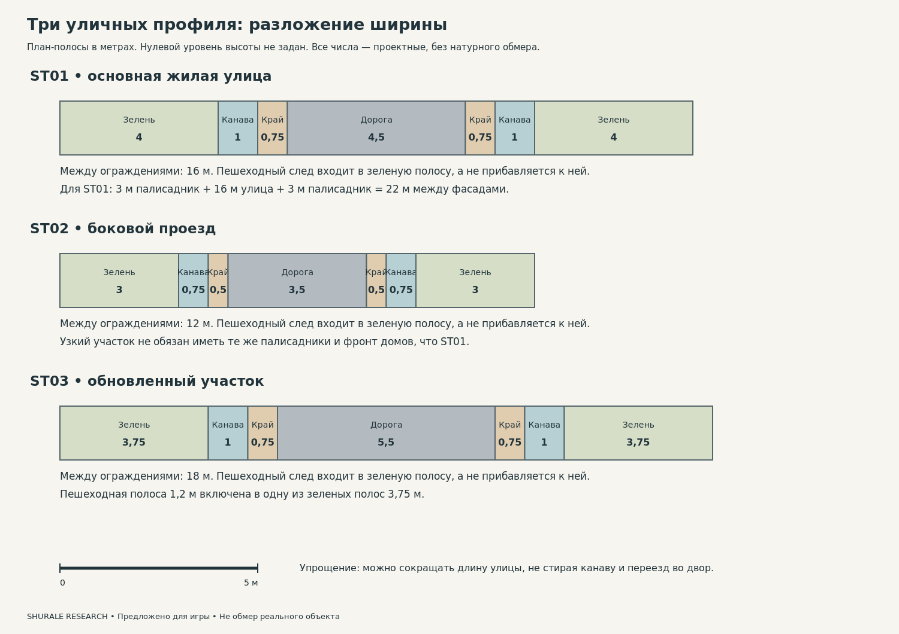
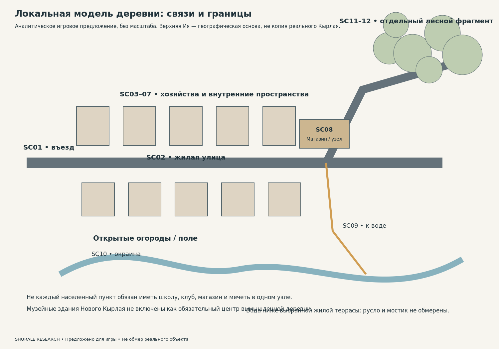
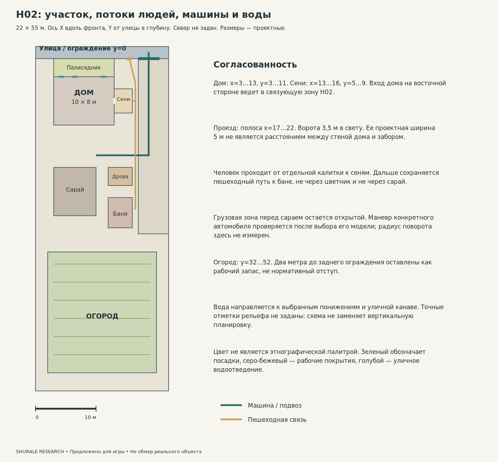
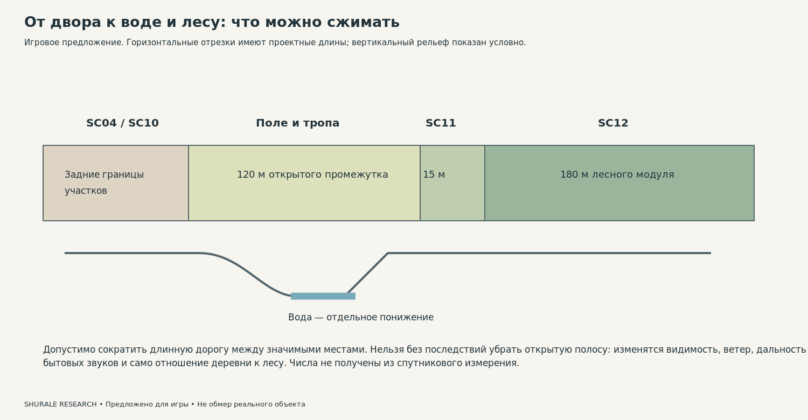

# 3. Пространственная система и размеры

Версия: 14 сентября 2026. Основная модель: верховья Ии; 2015 ±1 как предложение. Статусы доказательности обязательны.

## Что известно, а что назначено

**Не установлено.** Не получен надежный обмер современной улицы Кырлая, достоверная подоснова участка или спутниковый снимок с проверенным масштабом. Поэтому ни одна цифра проектного уличного профиля не называется фактической шириной татарской деревенской улицы. Дверь на фотографии не использована как «стандартная линейка». По общему виду не рассчитана высота ограждения. [C031; S101]

В dimensions.csv поля observed_value и proposed_game_value разделены. Прямые значения источников относятся, например, к длине Ии и площади ее бассейна, а не к ширине игрового мостика. Все размеры комнат, ворот и участков ниже относятся к **предложению для игры**.

## Определение ширины улицы

Улица состоит не только из места, где едет автомобиль. Нужно отдельно моделировать: проезжую часть; обочину; понижение канавы; зеленую полосу, где может быть пешеходный след и опора; линию ограждения; палисадник; фасад. Фасадная линия может меняться по участкам. Въезд пересекает канаву так, чтобы оставалась функция водоотведения.

Для ST01 назначено: 4,5 м проезжей части + две обочины по 0,75 м + две канавы по 1 м в плане + две полосы до ограждений по 4 м = **16 м между ограждениями**. При двух палисадниках по 3 м получится **22 м между фасадами**. Пешеходная колея находится внутри зеленой полосы: второй раз ее ширина не прибавляется. Это точная арифметика выбранной схемы, а не точность натурного измерения. [C036; D001–D006]

ST02 — боковой проезд 12 м между ограждениями; ST03 — обновленный участок 18 м. Различие не означает «старое всегда узкое, новое всегда широкое». Это набор геометрических вариантов, который позволяет не повторять один профиль. В ST03 пешеходная полоса 1,2 м уже включена в одну из зеленых полос.

## Структура поселения

**Документировано.** Энциклопедии описывают разные наборы учреждений. Школа может закрыться, а мечеть продолжать действовать; в Старом Менгере даты именно так различаются. Новый Кырлай имеет собственный музейно-общественный комплекс, который нельзя автоматически считать обязательным для маленького вымышленного села. [C006; S015; S022]

**Предложено для игры.** Общественный узел включает магазин и остановку у подъезда. Мечеть, клуб и памятный объект могут быть отдельными пространствами; не нужно ставить их вокруг искусственной площади лишь для полноты списка. Школа допустима как видимый отдельный объект только при выбранном масштабе; ее отсутствие в игровой зоне не означает отсутствие обучения у детей. Кладбище — самостоятельная территория с подходом и правилами ухода, не обязательная декорация каждого вида на лес.

## Участок H02: геометрия, которую можно проверить

Начало координат — левый передний угол участка. X идет вдоль улицы, Y — от улицы в глубину. Участок 22×55 м. Основной дом x=3…13, y=3…11; сени x=13…16, y=5…9. Проездная полоса x=17…22. Ворота 3,5 м стоят в ее створе. Пешеходный вход отделен от автомобильного. Перед фасадом остается палисадник 10×3 м. Сарай x=3…10, y=18…26; дровник x=12…16, y=18…21; баня x=12…16, y=23…28. Огород занимает заднюю зону y=32…52. [C037; D009–D023]

Эти размеры намеренно не называются минимальными строительными отступами или нормативами. Схема не является проектом строительства и не подтверждает соблюдения противопожарных, санитарных или земельных требований. Ее назначение — связать игровую геометрию. Для машины после выбора модели нужно дополнительно проверить траекторию поворота; одной ширины ворот недостаточно.

## Сжатие пространства

Можно сократить длину пустого участка дороги и число повторяющихся дворов. Нельзя незаметно уменьшить ширину сеней настолько, чтобы исчезло место снять обувь, или удалить канаву, сохранив лужи без причины. Уменьшение расстояния до леса меняет слышимость улицы и видимость открытого поля. Уменьшение глубины участка требует уменьшить число хозяйственных построек, а не накладывать их друг на друга.

В проектном переходе сохранены открытая полоса 120 м, опушка 15 м и лесной модуль 180 м. Это не коэффициент сжатия реальной местности: исходные расстояния не измерены. Отношение «до/после» можно вычислять только после выбора измеренного прототипа.

## Источники этого раздела

**[S015]** Институт татарской энциклопедии и регионоведения АН РТ. Новый Кырлай. TATARICA. дата публикации не установлена. Энциклопедия населенных пунктов. Доступ: **Полный текст**. Реально изучено: Полный текст; разделы хозяйства, инфраструктуры, музеев, населения и подписи фотографий. [Страница источника](https://tatarica.org/ru/razdely/municipalnye-obrazovaniya/municipalnye-rajony/arskij-rajon/novyj-kyrlaj).

**[S022]** Институт татарской энциклопедии и регионоведения АН РТ. Старый Менгер. TATARICA. дата публикации не установлена. Энциклопедия населенных пунктов. Доступ: **Полный текст**. Реально изучено: Полный текст; школа, мечеть, население. [Страница источника](https://tatarica.org/ru/razdely/municipalnye-obrazovaniya/municipalnye-rajony/atninskij/staryj-menger).

**[S101]** Engelberthumperdink. Улица: смешанные ограждения и весенняя обочина. дата публикации не установлена. Карточка фотографии. Доступ: **Изображение и карточка**. Реально изучено: Просмотрено изображение; метаданные использованы только в заполненных полях. [Страница источника](https://commons.wikimedia.org/wiki/File:New_Kyrlai_(2021-04-26)_01.jpg).
