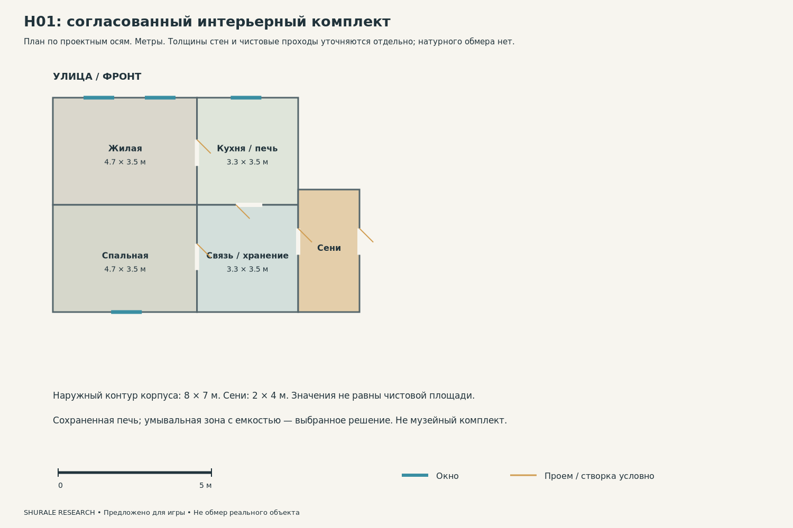
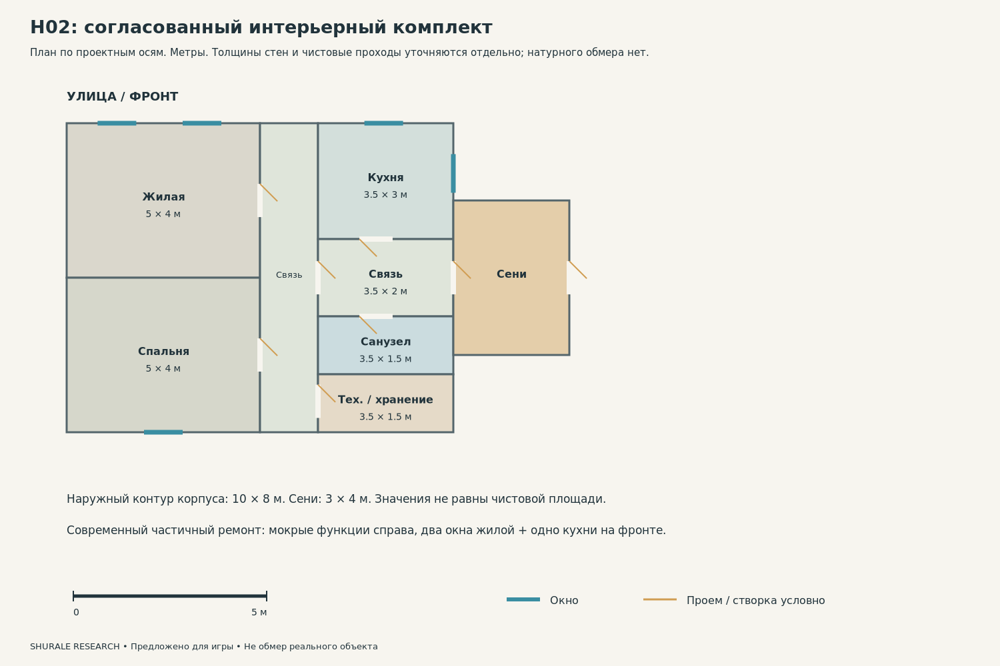
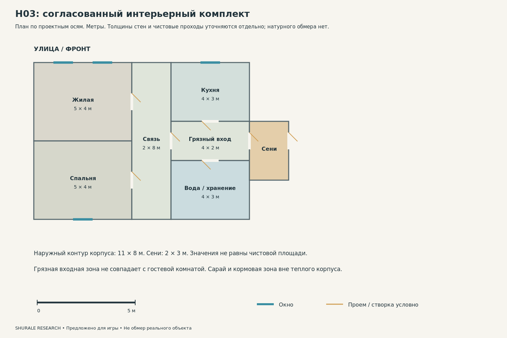
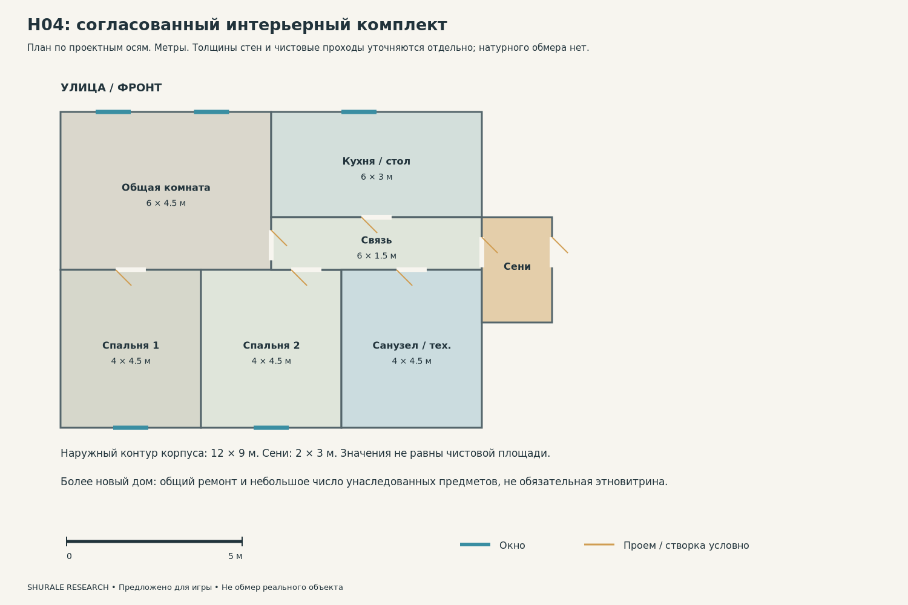
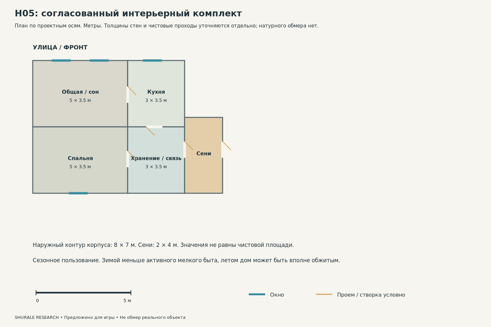

# 5. Интерьеры и целостные предметные комплекты

Версия: 14 сентября 2026. Основная модель: верховья Ии; 2015 ±1 как предложение. Статусы доказательности обязательны.

## Основное ограничение

**Не установлено.** В ядре нет непосредственно обследованного действующего жилого интерьера Нового или Старого Кырлая 2010-х. Поэтому следующие планы — не документальные реконструкции домов жителей. Они являются согласованными предложениями, проверяемыми по ежедневным действиям и историческим слоям. Важнейший следующий источник — не еще один музейный ракурс, а разрешенная съемка обычного дома с интервью о ремонтах. [C032; G002; G006]

**Наблюдается.** V003–V004 показывают музейное убранство: стопку подушек, печь, текстильную перегородку и предметы исторического быта. Современный экспозиционный свет и манекен помогают не спутать его с действующей комнатой. Переносится отдельный принцип или предмет с биографией, но не весь состав экспозиции. [C018–C019; S103; S104]

## H02: вход, кухня и связь помещений

Внешняя дверь открывается в сени. Сумку можно поставить, обувь снять на отдельном коврике, верхнюю одежду оставить у входа. Вторая дверь ведет в Т-образную связующую зону. Из нее можно попасть в жилую комнату, спальню, кухню, санузел и техническое хранение, не проходя через чужое спальное место. Схема не задает достоверную местную норму площади: размеры по осям лишь согласуют корпус 10×8 м.

Кухня расположена справа спереди. У нее одно фронтальное и одно боковое окно; боковое не перекрыто сенями. В рабочей зоне помещаются мойка, плита и холодильник с открываемой дверью. Гостевой стол находится в жилой комнате, поэтому не требуется втиснуть большой праздничный стол в маленькую кухню. Возле мойки стоят используемые чашки, полотенце и сушка; возле плиты — посуда и прихватка. Не весь дом должен быть заполнен одинаково плотным мелким реквизитом.

Источник отопления выбран в задней технической зоне; радиаторы относятся к одной системе. Санитарная зона включает стиральную машину только при выбранных водоснабжении и отводе. Это не инструкция по монтажу газового оборудования: безопасное размещение котла, дымохода, вентиляции и электрических узлов требует профильной проверки. Условные коммуникации нельзя объявлять исторически существовавшими в Кырлае. [A020–A036; C037]

## Жилая комната как действующее место

Диван ориентирован на телевизор; человек проходит к окну и в спальню, не протискиваясь между шкафами. При разложенном диване проверяется запас места. Сервант хранит и используемую, и берегущуюся посуду; семейный альбом может лежать в закрытой секции. Ковер имеет отдельную функцию: напольный меняет шаг и изнашивается по пути, настенный не получает такую же дорожку истирания.

**Документировано.** Исследование семейных архивов S013 дает примеры различия достатка, медиаприборов, посуды и сохраненных сувениров. Это особенно полезно для принципа «возраст вещи не равен дате сцены». Но перечисленные семьи нельзя превратить в статистический портрет всех жителей Арского района. [C021; S013, с. 189, 191, 194–195]

## Текстиль: не один орнамент на всех поверхностях

Для каждого предмета отдельно задаются материал, способ крепления и функция. Тюль пропускает свет, плотная штора обеспечивает приватность; скатерть и клеенка не одинаково драпируются; покрывало повторяет объем постели, а не геометрию пола. У стопки подушек верхняя и нижняя вещи по-разному деформированы. По V003 нельзя установить состав волокна или точный размер: эти поля оставлены неизвестными. Монография 2022 г. S009 пока известна по каталогу и не использована как источник таких свойств.

Исторические сәке, чаршау и локальный түрләмә относятся к описанным контекстам S012. В H01 можно предложить сохраненное место хранения постельного текстиля, не возвращая весь дом к исторической перегородке. В H04 современная мебель может сосуществовать с одной вышитой вещью от родственников, но ее наличие не обязательно для «доказательства татарскости». [C012–C013; S008; S012]

## Религиозные и личные предметы

Шамаиль не заменяется бессмысленной псевдоарабской полосой. Пока не выбран проверенный текст, предмет A033 имеет статус условного и низкую производственную готовность. Его размещение должно относиться к конкретной семье; устройство православного красного угла автоматически не переносится. Степень религиозности нельзя вычислить по одному ковру, внешности человека или наличию старой рамки. [C040; A033; G009]

Семейные фотографии создаются с вымышленными людьми или получаются с ясными правами и согласиями; реальные частные владельцы не привязываются к опасным событиям игры. Документы не должны содержать случайно скопированные номера, адреса и персональные данные. Старый календарь допустим как объясненная сохранившаяся вещь, но большой календарь на стене становится сильным датирующим маркером.

## Ракурсы для сборки и проверки

Для каждого комплекта нужны четыре функциональных ракурса: от наружной двери в сени; от внутреннего входа к основному помещению; от окна обратно к двери; вид на инженерный/рабочий узел. В H02 дополнительно сравнивают уличный фасад с положением трех передних окон. Ракурс не должен скрывать, что дверной проем не ведет никуда.

Эти ракурсы — задания художнику на основе приложенных планов, не выданные за реальные фотографии. Новые референсы нужно добавлять к конкретному комплекту, а не свободно смешивать все найденные кухни.

## H01 — интерьерный комплект

**Предложено для игры.** Сохраненная печь как действующий источник тепла; серийная мебель позднего XX в.; отдельное место сложенного текстиля; электрический чайник. Умывальная зона с емкостью; вода не возникает в кране без выбранного подключения.

**Основной набор.** Печь, обычная поздняя мебель, простая кухонная поверхность, умывальная емкость, чайник, сложенное белье, семейный альбом. Мелкие предметы: используемая чашка, полотенце, крючки для одежды и записная книжка.

## H02 — интерьерный комплект

**Предложено для игры.** Жилая комната, спальня, кухня, Т-образная связующая зона, санитарная и техническая комнаты; радиаторное отопление. Мойка, санузел и стиральная машина объединены выбранной схемой воды и отвода; источник тепла в задней технической зоне.

**Основной набор.** Мойка, плита, холодильник, диван, стол, сервант/шкаф, телевизор, стиральная машина. Мелкие предметы: пульт, зарядка, чашки, тетрадь, полотенца и обувь по числу жильцов.

## H03 — интерьерный комплект

**Предложено для игры.** Отдельная грязная входная зона; обычная кухня и чистая жилая комната; дополнительное хранение. Разделены питьевая вода, хозяйственная емкость и вода для животных; не общая декоративная бочка.

**Основной набор.** Обычная кухня и чистая комната плюс вместительное хранение у грязного входа. Внутри не хранить навоз, корм и весь садовый инструмент. Чистые и хозяйственные полотенца разделены.

## H04 — интерьерный комплект

**Предложено для игры.** Современная кухня; компактные спальни; рабочее место; несколько семейных старых предметов. Полная бытовая инженерия как выбранное свойство конкретного дома, не средний уровень села.

**Основной набор.** Цельная кухня, рабочее место, отдельные спальни и инженерная зона. Один-два унаследованных предмета допустимы, но музейный самовар, колыбель и резная мебель не обязательны.

## H05 — интерьерный комплект

**Предложено для игры.** Сохраненная мебель, простая кухонная зона, складное дополнительное спальное место; меньше повседневного мелкого беспорядка зимой. Зимнее отключение воды предусмотрено только как выбранная история, не универсальное правило.

**Основной набор.** Сохраненная кровать/диван, простая кухня, закрытые емкости хранения, дорожная сумка в день приезда. Зимняя сцена без свежевымытой посуды и мокрого белья при длительном отсутствии.

## Источники этого раздела

**[S008]** Сулейманова Диляра Наилевна. Интерьер жилища волго-уральских татар: развитие и этнокультурная специфика. Автореферат кандидатской диссертации. Чебоксары. 2007. Автореферат, исторические науки, 07.00.07. Доступ: **Автореферат в воспроизведении агрегатора**. Реально изучено: Прочитаны введение, структура, положения и заключение воспроизведенного автореферата; не полная диссертация. [Страница источника](https://cheloveknauka.com/interier-zhilischa-volgo-uralskih-tatar-razvitie-i-etnokulturnaya-spetsifika).

**[S009]** Султанова Р. Р.; Шкляева Л. М.. Художественный текстиль в интерьере татарского дома. ИЯЛИ. 2022. Монография, каталожная запись. Доступ: **Каталог**. Реально изучено: Сверено название, авторы, год, ISBN; полный текст и приложения не получены. Идентификатор: ISBN 9785930914610. [Страница источника](https://books.google.com/books?id=r6wB0QEACAAJ).

**[S012]** Автор отдельно не установлен. Интерьер. Альметьевская энциклопедия. дата публикации не установлена. Локальная энциклопедическая статья. Доступ: **Полный текст**. Реально изучено: Прочитана статья целиком. [Страница источника](https://almet-history.tatneft.ru/istoriya/traditsionnaya-kultura/remesla-i-narodnoe-iskusstvo/d-k/interer?lang=ru).

**[S013]** Ханипова И. И.. Визуальные источники о новой советской обрядности в татарской деревне 1970-х годов. 2024. Историческая этнология, 9(2), 184–200. Доступ: **Релевантные разделы полного текста**. Реально изучено: HTML; PDF с. 188–196 и описание семейных архивов; непосредственно просмотрена с. 189, страница файла 6. Идентификатор: 10.22378/he.2024-9-2.184-200. [Страница источника](https://historicalethnology.org/news/2024-t9-n2-4/).

**[S103]** Engelberthumperdink. Постельный текстиль в музейном интерьере. дата публикации не установлена. Карточка фотографии. Доступ: **Изображение и карточка**. Реально изучено: Просмотрено изображение; метаданные использованы только в заполненных полях. [Страница источника](https://commons.wikimedia.org/wiki/File:Sagdi-aby_house_interior_(2021-04-26)_05.jpg).

**[S104]** Engelberthumperdink. Музейная комната: печь, стол и занавеси. дата публикации не установлена. Карточка фотографии. Доступ: **Изображение и карточка**. Реально изучено: Просмотрено изображение; метаданные использованы только в заполненных полях. [Страница источника](https://commons.wikimedia.org/wiki/File:Sagdi-aby_house_interior_(2021-04-26)_21.jpg).
