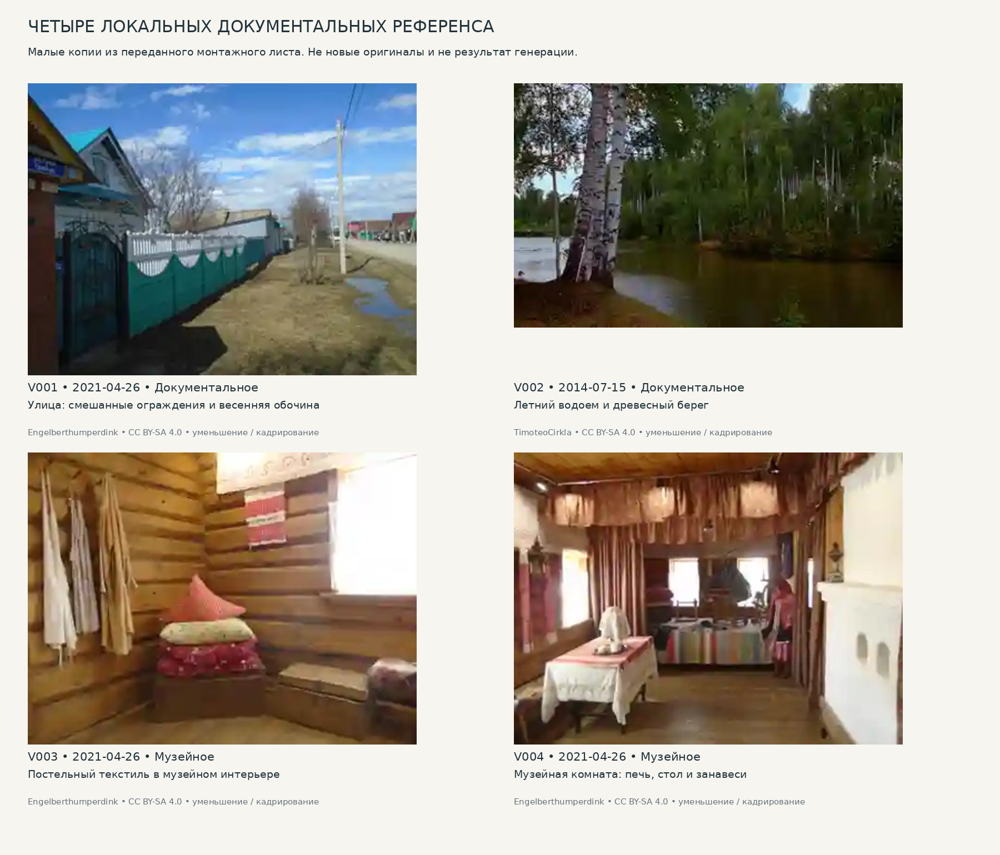

# 10. Визуальный корпус: локальные изображения и внешние паспорта

Версия: 14 сентября 2026. Основная модель: верховья Ии; 2015 ±1 как предложение. Статусы доказательности обязательны.

## Что действительно включено

Локально включены четыре малые фотографические копии V001–V004, восстановленные кадрированием из переданного в разговоре монтажного листа. Они сопоставлены с оригинальными карточками авторов на Wikimedia Commons. Это **не заново скачанные оригиналы высокого разрешения**. У каждого кадра указаны дата, автор, лицензия и изменение. Еще 14 записей относятся к внешним фотографиям и страницам научных публикаций; они не занимают место несуществующих локальных файлов.

Две оставшиеся картинки исходного монтажного листа не были надежно атрибутированы и исключены из доказательного корпуса. Сгенерированных изображений в корпусе нет. Проектные SVG/PNG находятся отдельно в diagrams и никогда не помечены как натурная съемка.

Самостоятельный **VISUAL_ATLAS.pdf** показывает локальные изображения с аннотациями и каталог внешних опор. **VISUAL_ATLAS.html** показывает локальные копии без сети и пытается загружать внешние фотографии по проверенным страницам/пути файла при наличии интернета. Ошибка внешней загрузки не скрыта и не означает отсутствия записи в реестре.

## Как смотреть четыре ключевых кадра

**V001 — улица, 26 апреля 2021.** Смотреть не только на яркую кровлю, но и на соединение секций ограды, материал стойки, устройство калитки, положение опоры и влажную придорожную полосу. Кадр хорошо разрушает ложный образ полностью деревянной резной улицы. Он не дает ширину канавы, высоту ограды или год ремонта дома. [S101; C015–C016]

**V002 — вода, 15 июля 2014.** Смотреть на толщину древесной массы у берега, белоствольные деревья и отсутствие обязательной прозрачности воды. Снимок датирует наблюдаемое состояние, а не название и размеры водоема. Он не является повторным летним видом V001. [S102; C017]

**V003 — подушки в музее, 26 апреля 2021.** Смотреть на вертикальную укладку, различие тканей и деформацию стопки. Нельзя по маленькой копии определить хлопок/лен/синтетику или размеры. Музейное размещение не доказывает частоту такого приема в современных семьях. [S103; C018]

**V004 — музейная комната, 26 апреля 2021.** Смотреть на соотношение белой печи, стола, текстильного разделения и свободного объема. Одновременно замечать манекен и экспозиционный свет. Это источник отдельных форм исторического слоя, а не готовая кухня 2015 г. [S104; C019]

## Как не раздувать корпус

Десять кадров одного музейного дома дают детали, но не десять типов хозяйств. Внешние V005–V014 так и обозначены. Для расширения важнее получить два независимых обычных двора, чем двадцать дополнительных ракурсов той же печи. Осенний музейный парк V015 и весеннее мощение V016 полезны для сезонных наблюдений, но не покрывают зимний грунтовый проезд и естественный лес.

Из научных иллюстраций V017–V018 известно историческое поле исследований. Они не включены локально, поскольку права на конкретные архивные изображения отдельно не установлены, а полные исходные материалы не получены. Ссылка на статью с лицензией не автоматически решает права на все вложенные изображения третьих лиц.

## Правовой режим

Карточки V001–V004 указывают CC BY-SA 4.0. Для включенных уменьшенных и кадрированных копий сохранены авторство, ссылка на оригинал, ссылка на лицензию и указание изменений. Эти производные копии распространяются на тех же условиях. Из этого не следует автоматическое требование перелицензировать всю будущую игру; способ использования конкретной фотографии, текстуры или производного изображения нужно оценивать отдельно. Неизвестные права никогда не помечены как свободные. [S039; S101–S104]

## Паспорта внешних и локальных референсов

### V001 — Улица: смешанные ограждения и весенняя обочина

**Объект и место:** Улица: смешанные ограждения и весенняя обочина; Новый Кырлай, Арский район. **Тип:** Документальное. **Съемка:** 2021-04-26. **Публикация:** 2021-04-27.

**Автор:** Engelberthumperdink. **Наблюдается:** Рельефные секции зеленовато-белого ограждения; металлическая калитка; кирпичная стойка; столб; влажная полоса у улицы; голые ветви; голубовато-зеленая кровля.

**Нельзя установить:** Нет масштаба, возраста ремонта, вида кустарника, данных о дворе за ограждением.

**Файл:** visual_references/photographs/V001_reference_preview.png. **Происхождение локальной версии:** Кадрирование малой копии из переданного в разговоре монтажного листа; оригинал заново не скачан. **Права:** CC BY-SA 4.0. [Карточка / источник](https://commons.wikimedia.org/wiki/File:New_Kyrlai_(2021-04-26)_01.jpg).

### V002 — Летний водоем и древесный берег

**Объект и место:** Летний водоем и древесный берег; Новый Кырлай, Арский район. **Тип:** Документальное. **Съемка:** 2014-07-15. **Публикация:** 2021-06-02.

**Автор:** TimoteoCirkla. **Наблюдается:** Белоствольные деревья, определимые до рода береза; сомкнутая летняя листва у берега; спокойная поверхность воды.

**Нельзя установить:** Точное название водоема, глубина, ширина и качество воды не установлены.

**Файл:** visual_references/photographs/V002_reference_preview.png. **Происхождение локальной версии:** Кадрирование малой копии из переданного в разговоре монтажного листа; оригинал заново не скачан. **Права:** CC BY-SA 4.0. [Карточка / источник](https://commons.wikimedia.org/wiki/File:2014-07-15_14-02-02_Тукай-Кырлай.jpg).

### V003 — Постельный текстиль в музейном интерьере

**Объект и место:** Постельный текстиль в музейном интерьере; Новый Кырлай, Арский район. **Тип:** Музейное. **Съемка:** 2021-04-26. **Публикация:** 2021-04-27.

**Автор:** Engelberthumperdink. **Наблюдается:** Три подушки, уложенные вертикальной стопкой; различные ткани; покрытая тканью опора; бревенчатая стена; текстиль рядом с окном.

**Нельзя установить:** Не современный жилой дом; волокно ткани, набивка, точные размеры и повседневная частота такой укладки не установлены.

**Файл:** visual_references/interiors/V003_reference_preview.png. **Происхождение локальной версии:** Кадрирование малой копии из переданного в разговоре монтажного листа; оригинал заново не скачан. **Права:** CC BY-SA 4.0. [Карточка / источник](https://commons.wikimedia.org/wiki/File:Sagdi-aby_house_interior_(2021-04-26)_05.jpg).

### V004 — Музейная комната: печь, стол и занавеси

**Объект и место:** Музейная комната: печь, стол и занавеси; Новый Кырлай, Арский район. **Тип:** Музейное. **Съемка:** 2021-04-26. **Публикация:** 2021-04-27.

**Автор:** Engelberthumperdink. **Наблюдается:** Белая печь справа, стол слева, текстильная перегородка, приподнятая часть, подвесная колыбель; экспозиционный манекен и современное музейное освещение.

**Нельзя установить:** Не действующий интерьер 2015 г.; нельзя восстановить полный план, инженерные коммуникации или типичность вещей.

**Файл:** visual_references/interiors/V004_reference_preview.png. **Происхождение локальной версии:** Кадрирование малой копии из переданного в разговоре монтажного листа; оригинал заново не скачан. **Права:** CC BY-SA 4.0. [Карточка / источник](https://commons.wikimedia.org/wiki/File:Sagdi-aby_house_interior_(2021-04-26)_21.jpg).

### V005 — Фасад музейного дома Сагди-абыя

**Объект и место:** Фасад музейного дома Сагди-абыя; Новый Кырлай, Арский район. **Тип:** Музейное. **Съемка:** 2021-04-26. **Публикация:** не установлена.

**Автор:** Engelberthumperdink. **Наблюдается:** Три окна в срубном фасаде; фронтон с дощатой зашивкой; декоративные завершения окон; наружная желтая труба.

**Нельзя установить:** Назначение трубы и размеры без обмера не установлены; восстановленный музей, не неремонтированный исторический дом.

**Файл:** локальной копии нет. **Происхождение локальной версии:** Только внешний референс; локальной копии нет. **Права:** CC BY-SA 4.0. [Карточка / источник](https://commons.wikimedia.org/wiki/File:Sagdi-aby_house_(2021-04-26)_04.jpg).

### V006 — Печь: объем и поверхности

**Объект и место:** Печь: объем и поверхности; Новый Кырлай, Арский район. **Тип:** Музейное. **Съемка:** 2021-04-26. **Публикация:** не установлена.

**Автор:** Engelberthumperdink. **Наблюдается:** Белая массивная печь, отверстия и примыкание к стене.

**Нельзя установить:** Нет разреза дымохода, данных о работоспособности или размеров.

**Файл:** локальной копии нет. **Происхождение локальной версии:** Только внешний референс; локальной копии нет. **Права:** CC BY-SA 4.0. [Карточка / источник](https://commons.wikimedia.org/wiki/File:Sagdi-aby_house_interior_(2021-04-26)_07.jpg).

### V007 — Подвесная колыбель и текстиль

**Объект и место:** Подвесная колыбель и текстиль; Новый Кырлай, Арский район. **Тип:** Музейное. **Съемка:** 2021-04-26. **Публикация:** не установлена.

**Автор:** Engelberthumperdink. **Наблюдается:** Подвесной предмет и полосатый текстиль в музейном устройстве.

**Нельзя установить:** Не доказательство применения колыбели в местной семье XXI в..

**Файл:** локальной копии нет. **Происхождение локальной версии:** Только внешний референс; локальной копии нет. **Права:** CC BY-SA 4.0. [Карточка / источник](https://commons.wikimedia.org/wiki/File:Sagdi-aby_house_interior_(2021-04-26)_10.jpg).

### V008 — Припечный металлический инвентарь

**Объект и место:** Припечный металлический инвентарь; Новый Кырлай, Арский район. **Тип:** Музейное. **Съемка:** 2021-04-26. **Публикация:** не установлена.

**Автор:** Engelberthumperdink. **Наблюдается:** Металлические инструменты, сосуды и опоры около печи.

**Нельзя установить:** Назначение каждого предмета требует инвентарной карточки.

**Файл:** локальной копии нет. **Происхождение локальной версии:** Только внешний референс; локальной копии нет. **Права:** CC BY-SA 4.0. [Карточка / источник](https://commons.wikimedia.org/wiki/File:Sagdi-aby_house_interior_(2021-04-26)_15.jpg).

### V009 — Горшки у печи

**Объект и место:** Горшки у печи; Новый Кырлай, Арский район. **Тип:** Музейное. **Съемка:** 2021-04-26. **Публикация:** не установлена.

**Автор:** Engelberthumperdink. **Наблюдается:** Разные по форме сосуды; локальные темные следы на поверхностях.

**Нельзя установить:** Техника изготовления, датировка и использование в обычном доме не установлены.

**Файл:** локальной копии нет. **Происхождение локальной версии:** Только внешний референс; локальной копии нет. **Права:** CC BY-SA 4.0. [Карточка / источник](https://commons.wikimedia.org/wiki/File:Sagdi-aby_house_interior_(2021-04-26)_16.jpg).

### V010 — Стол и утварь у печи

**Объект и место:** Стол и утварь у печи; Новый Кырлай, Арский район. **Тип:** Музейное. **Съемка:** 2021-04-26. **Публикация:** не установлена.

**Автор:** Engelberthumperdink. **Наблюдается:** Круглый металлический предмет у белой поверхности, стол, сосуды и ткань.

**Нельзя установить:** Материал сплава и бытовая схема использования не установлены.

**Файл:** локальной копии нет. **Происхождение локальной версии:** Только внешний референс; локальной копии нет. **Права:** CC BY-SA 4.0. [Карточка / источник](https://commons.wikimedia.org/wiki/File:Sagdi-aby_house_interior_(2021-04-26)_18.jpg).

### V011 — Музейный набор деревянной и металлической утвари

**Объект и место:** Музейный набор деревянной и металлической утвари; Новый Кырлай, Арский район. **Тип:** Музейное. **Съемка:** 2021-04-26. **Публикация:** не установлена.

**Автор:** Engelberthumperdink. **Наблюдается:** Клепаные сосуды, корзина, металлические предметы, ткань; музейная инвентарная маркировка.

**Нельзя установить:** Это экспозиционная подборка, а не расположение работающей кухни.

**Файл:** локальной копии нет. **Происхождение локальной версии:** Только внешний референс; локальной копии нет. **Права:** CC BY-SA 4.0. [Карточка / источник](https://commons.wikimedia.org/wiki/File:Sagdi-aby_house_interior_(2021-04-26)_11.jpg).

### V012 — Низкое дворовое сооружение

**Объект и место:** Низкое дворовое сооружение; Новый Кырлай, Арский район. **Тип:** Музейное. **Съемка:** 2021-04-26. **Публикация:** не установлена.

**Автор:** Engelberthumperdink. **Наблюдается:** Низкая двускатная кровля, дощатая дверь, земля вокруг.

**Нельзя установить:** Функция предположительно погребная; без музейного паспорта не установлена.

**Файл:** локальной копии нет. **Происхождение локальной версии:** Только внешний референс; локальной копии нет. **Права:** CC BY-SA 4.0. [Карточка / источник](https://commons.wikimedia.org/wiki/File:Sagdi-aby_house_(2021-04-26)_20.jpg).

### V013 — Музейный двор и фон современной застройки

**Объект и место:** Музейный двор и фон современной застройки; Новый Кырлай, Арский район. **Тип:** Музейное. **Съемка:** 2021-04-26. **Публикация:** не установлена.

**Автор:** Engelberthumperdink. **Наблюдается:** Экспонаты сельхозинвентаря; соломенная музейная кровля; современные кровли на дальнем плане.

**Нельзя установить:** Соседние частные дворы почти не видны; не переносить солому в обычный дом 2015 г..

**Файл:** локальной копии нет. **Происхождение локальной версии:** Только внешний референс; локальной копии нет. **Права:** CC BY-SA 4.0. [Карточка / источник](https://commons.wikimedia.org/wiki/File:Sagdi-aby_house_(2021-04-26)_25.jpg).

### V014 — Дверь и соломенная музейная кровля

**Объект и место:** Дверь и соломенная музейная кровля; Новый Кырлай, Арский район. **Тип:** Музейное. **Съемка:** 2021-04-26. **Публикация:** не установлена.

**Автор:** Engelberthumperdink. **Наблюдается:** Прижимные элементы по скату; дощатая дверь и диагональная связь.

**Нельзя установить:** Возраст и историческая точность реконструкции отдельно не установлены.

**Файл:** локальной копии нет. **Происхождение локальной версии:** Только внешний референс; локальной копии нет. **Права:** CC BY-SA 4.0. [Карточка / источник](https://commons.wikimedia.org/wiki/File:Sagdi-aby_house_(2021-04-26)_30.jpg).

### V015 — Осенняя аллея и здание музея

**Объект и место:** Осенняя аллея и здание музея; Новый Кырлай, Арский район. **Тип:** Документальное. **Съемка:** 2016-10-08. **Публикация:** 2017-05-30.

**Автор:** Арсений Павлов. **Наблюдается:** Опавшая листва на дорожке; хвойные деревья; музейное здание в конце аллеи.

**Нельзя установить:** Парковая посадка не представляет естественный лес; дата съемки не дата постройки.

**Файл:** локальной копии нет. **Происхождение локальной версии:** Только внешний референс; локальной копии нет. **Права:** CC BY-SA 4.0. [Карточка / источник](https://commons.wikimedia.org/wiki/File:Мемориальный_музей_Габдуллы_Тукая.jpg).

### V016 — Снеготаяние у музея

**Объект и место:** Снеготаяние у музея; Новый Кырлай, Арский район. **Тип:** Документальное. **Съемка:** 2024-03-28. **Публикация:** не установлена.

**Автор:** Engelberthumperdink. **Наблюдается:** Пятна снега, мокрое мощение, открытые ступени, длинные тени.

**Нельзя установить:** Мощеная музейная площадь не аналог грунтового двора; это не повторный ракурс летнего водоема.

**Файл:** локальной копии нет. **Происхождение локальной версии:** Только внешний референс; локальной копии нет. **Права:** CC BY-SA 4.0. [Карточка / источник](https://commons.wikimedia.org/wiki/File:Gabdulla_Tukay_Museum,_New_Kyrlai_(2024-03-28)_01.jpg).

### V017 — Исторические фотографии экспедиции: с. 338–339 S001

**Объект и место:** Исторические фотографии экспедиции: с. 338–339 S001; Большие Кайбицы и касимовский материал: разные регионы; см. подписи S001. **Тип:** Научная публикация. **Съемка:** не установлена. **Публикация:** не установлена.

**Автор:** Авторы и архивы указаны в подписях исходной статьи. **Наблюдается:** Историческая полевая фиксация разных мест, в том числе Большие Кайбицы (1975) и касимовский материал (1985).

**Нельзя установить:** Снимки относятся к разным регионам и десятилетиям; не референс современного двора Кырлая.

**Файл:** локальной копии нет. **Происхождение локальной версии:** Только внешний референс; локальной копии нет. **Права:** Статья размещена с CC BY 4.0; права на включенные архивные снимки отдельно не установлены. [Карточка / источник](https://historicalethnology.org/wp-content/uploads/2021/12/Суслова.pdf#page=4).

### V018 — Историческая экспедиционная иллюстрация: с. 745 S002

**Объект и место:** Историческая экспедиционная иллюстрация: с. 745 S002; Историческая экспедиционная география S002; не современный Кырлай. **Тип:** Научная публикация. **Съемка:** 1946 (описываемая экспедиция). **Публикация:** не установлена.

**Автор:** По подписи в статье; отдельно не установлено. **Наблюдается:** Страница с визуальным материалом к истории обследований жилища.

**Нельзя установить:** Не обмер современного объекта; индивидуальные архивные права не проверены.

**Файл:** локальной копии нет. **Происхождение локальной версии:** Только внешний референс; локальной копии нет. **Права:** Статья CC BY 4.0; права на архивную иллюстрацию отдельно не установлены. [Карточка / источник](https://historicalethnology.org/wp-content/uploads/2024/10/ИЭ_5_2024_741-758.pdf#page=5).

## Источники этого раздела

**[S001]** Суслова С. В.. Традиционная хозяйственная культура татар в трудах Н. А. Халикова (памяти ученого и коллеги). 2021. Историческая этнология, 6(2), 335–354. Доступ: **Релевантные разделы полного текста**. Реально изучено: HTML статьи; релевантные разделы PDF и библиография; просмотр изображений на печатных с. 338–339, страницы файла 4–5. Идентификатор: 10.22378/he.2021-6-2.335-354. [Страница источника](https://historicalethnology.org/news/2021-t6-n2-13/).

**[S002]** Суслова С. В.. Н. И. Воробьев и его роль в формировании академического татароведения в отечественной этнологии. 2024. Историческая этнология, 9(5), 741–758. Доступ: **Релевантные разделы полного текста**. Реально изучено: HTML, библиография; просмотр печатной с. 745, страница файла 5. Идентификатор: 10.22378/he.2024-9-5.741-758. [Страница источника](https://historicalethnology.org/news/2024-t9-n5-4/).

**[S039]** Creative Commons. Attribution-ShareAlike 4.0 International: deed. дата публикации не установлена. Официальное описание лицензии. Доступ: **Релевантные разделы полного текста**. Реально изучено: Условия атрибуции, обозначения изменений и ShareAlike. [Страница источника](https://creativecommons.org/licenses/by-sa/4.0/).

**[S101]** Engelberthumperdink. Улица: смешанные ограждения и весенняя обочина. дата публикации не установлена. Карточка фотографии. Доступ: **Изображение и карточка**. Реально изучено: Просмотрено изображение; метаданные использованы только в заполненных полях. [Страница источника](https://commons.wikimedia.org/wiki/File:New_Kyrlai_(2021-04-26)_01.jpg).

**[S102]** TimoteoCirkla. Летний водоем и древесный берег. дата публикации не установлена. Карточка фотографии. Доступ: **Изображение и карточка**. Реально изучено: Просмотрено изображение; метаданные использованы только в заполненных полях. [Страница источника](https://commons.wikimedia.org/wiki/File:2014-07-15_14-02-02_Тукай-Кырлай.jpg).

**[S103]** Engelberthumperdink. Постельный текстиль в музейном интерьере. дата публикации не установлена. Карточка фотографии. Доступ: **Изображение и карточка**. Реально изучено: Просмотрено изображение; метаданные использованы только в заполненных полях. [Страница источника](https://commons.wikimedia.org/wiki/File:Sagdi-aby_house_interior_(2021-04-26)_05.jpg).

**[S104]** Engelberthumperdink. Музейная комната: печь, стол и занавеси. дата публикации не установлена. Карточка фотографии. Доступ: **Изображение и карточка**. Реально изучено: Просмотрено изображение; метаданные использованы только в заполненных полях. [Страница источника](https://commons.wikimedia.org/wiki/File:Sagdi-aby_house_interior_(2021-04-26)_21.jpg).
