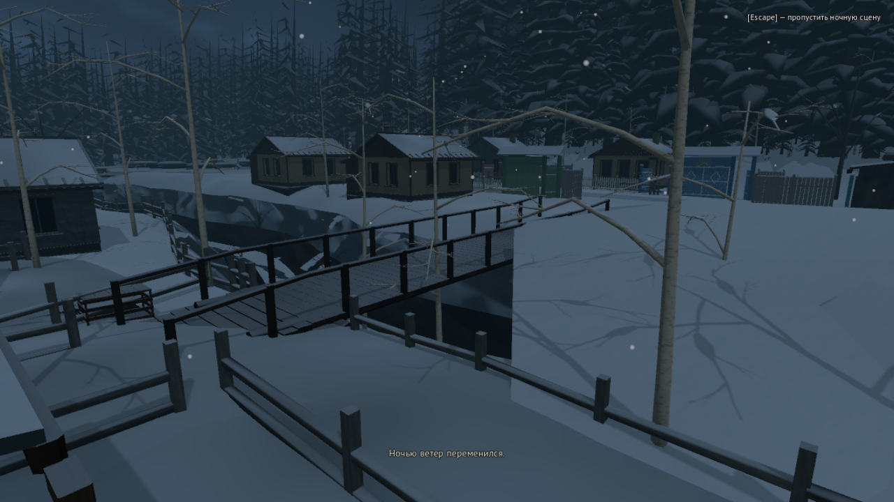
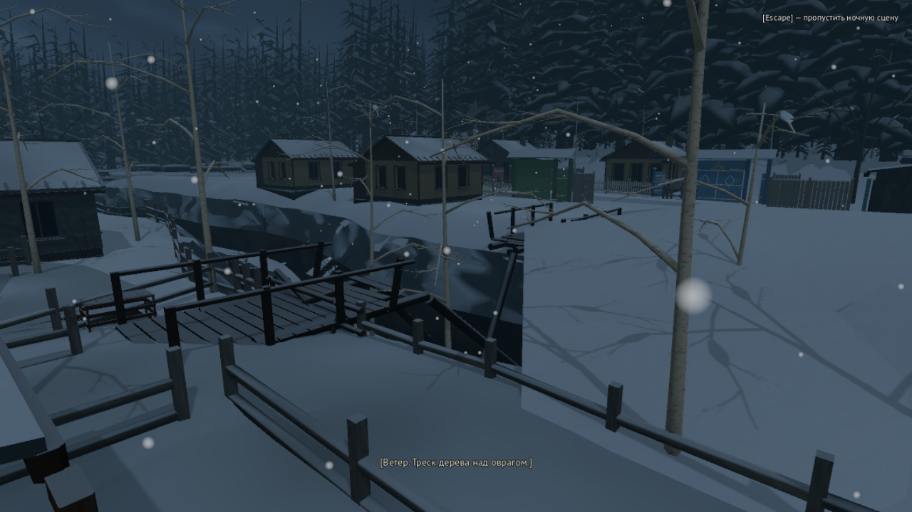
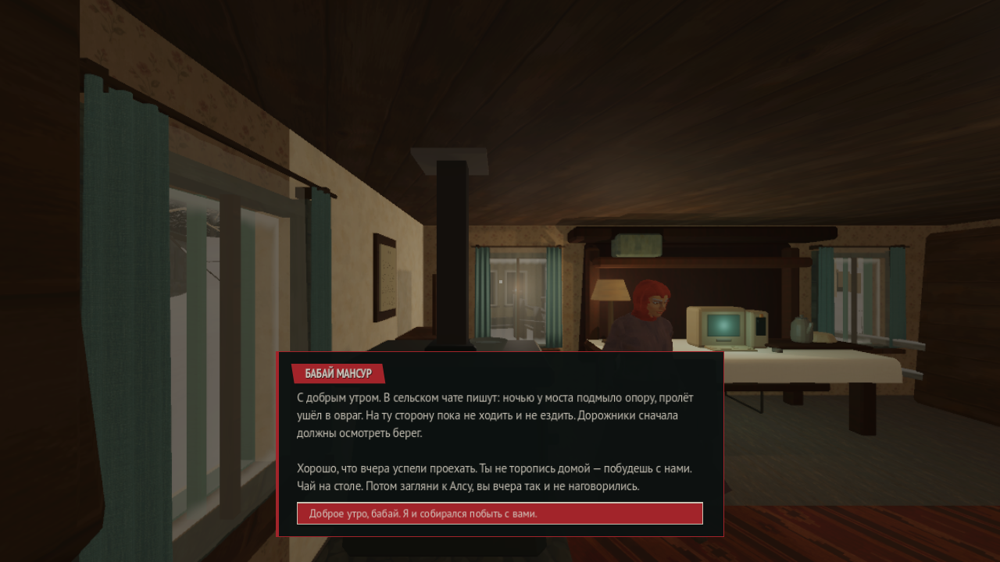

# A02: приезд и первая ночь — срез 28.09.2026

Рабочий diff над HEAD `304b8d92ed0599af1f00d8cca5b64b6923dfc301`; не отдельный релиз и не приёмка Акта I.

Реализовано: маршрут Нивы по целому мосту, домашний сон после чая/первой встречи с Алсу,
ночной вид с падением пролёта, утренняя новость. Обычный просмотр и Esc приводят к одному
состоянию мира. Новая игра начинает первый день; старый save без новой записи остаётся
в прежнем постметельном состоянии. Сохранение использует существующий world.props.
Чай больше не требует обеих улик Марата для выхода; незаконченный чай допускает выход/возврат.

## Проверено

- Актуальная C#-сборка: 0 ошибок / 0 предупреждений; оба content JSON скомпилированы.
- Существующий `act1_len01_family_flow_smoke_test`, режим `--urman-smoke-family-home-only`:
  exit 0 в нативном окне; actual bed target, обычный просмотр/skip, блокировка save/load внутри
  сцены, загрузка до/после ночи, отсутствие выданных улик, возврат управления утром.
  Также отказ/прерывание чая, возвращение снаружи и загрузка незаконченного разговора.
- Guard: исходные пользовательские файлы и permissions восстановлены и проверены.
- Отдельный обычный запуск: новая игра через меню/поездку/ответ/улицу; Continue из сохранения
  перед сном, дом, подсказка сна и пауза. Ручное наведение на диван с E ещё не подтверждено.
- Три PNG ниже — кадры последнего нативного целевого прогона; снег теперь круглый,
  ночное освещение берётся из действующего atmosphere-профиля.

Команда последнего прогона (из корня репозитория; временный output затем удалён):

```sh
source eng/dotnet-env.sh
URMAN_IMAGE_UI_OUTPUT=/tmp/urman_first_night_frames_20260928 python3 eng/protected_run.py --clean --timeout 240 .tools/godot/Godot_mono.app/Contents/MacOS/Godot --path game --resolution 1280x720 --windowed res://tests/act1_len01_family_flow_smoke_test.tscn --urman-smoke-family-home-only
```

## Открыто

Старые обязательные действия на остановке ещё нужно перенести домой; реальный языковой
профиль пока не связан с ответом в Ниве. Не приняты хват руля/актёрская анимация,
полный экскурсионный маршрут, физический обход обоих берегов и всех входов, художественная
сила метели, звук на слух и человеческий интерес. В утреннем кадре говорит Мансур вне кадра,
видна Гөлсинә — отдельная постановочная правка. Нынешний спокойный снег не подтверждает
требование сильной метели. Эти ограничения не закрыты техническим PASS.





## Хеши проверенного среза

- `game/scripts/RuntimeBridge.Opening.cs` — `b866f7049c6188091eaa26e180b7b45eae1eae2b067ca244d7cd6b0904dd12f5`
- `game/scripts/Act1DemoRoot.FirstNight.cs` — `09c8e7fb9d8c165523265d713cfdc63ea7908e66f96a2b89a5ab2ba0ccbdd80a`
- `game/scripts/Act1ConnectedWorld.OpeningBridge.cs` — `50e80e08c73b7f671943d279d50dec7edb2aa376196ba71255e4aa3d4a6462a0`
- `game/scripts/Act1DemoRoot.PrologueNivaRide.cs` — `023be68fb481d31c1ee4957f696273f7d70657d515d17ceda081fe5b1fdf7dff`
- `game/scripts/experiments/agent_b_act1/AgentBAct1ExteriorLayer.cs` — `26da58a27b324f545c2965432b3103cf12a6842a99ef8d1a7c243b48dd3eb4a2`
- `game/content/world/atmosphere.v1.json` — `d109fefa0e9634745a2e1ede2ab5a4ae2d6a48a9168ff258b6cf36bb55357a55`
- `game/tests/Act1Len01FamilyFlowSmokeTest.cs` — `a046bf22c49cecde9daacd03c7ae85dd425ef8c1f7602c4e42187f8a95549310`
- `game/content/urman.chapter1.compiled.v1.json` — `82f5c1499d8905a4d327172ce5132f42178049b22be6a35b5f1230c63e3c1f0c`

## Следующий срез: домашние источники вместо задания на остановке

`arrival-enter-house` доступен сразу после поездки/skip и завершает бит прибытия.
Чтение телефона, фотографии и личный ответ больше не закрывают семейную дверь.
Существующая фотография и телефон стоят на правом краю настоящего домашнего стола;
ответ маме необязателен для входа/чая/выхода. Фото остаётся доступным для повторного
осмотра, а память/вопрос о Марате по-прежнему выдаются только читателем документа.
Стабильные ID и прежние знания/save не переименованы. Тексты телефона/книжки/подсказки
согласованы с тем, что бабай уже довёз Айдара домой.

Проверка: content compile и C# build без ошибок; тот же нативный семейный режим —
exit 0. Его обычный вход в дом теперь выполняется до чтения источников; подтверждены
отсутствие выданной памяти при входе, оба порядка чтения, незавершённый ответ/load,
чай/выход/возврат и первая ночь. Общий helper других source-проверок временно выбирает
домашнюю презентацию, сохраняя их прежнюю сюжетную сцену; он не доказывает полный маршрут.

Отдельно осмотрено нативное окно от входа и вблизи через существующий защищённый
отладочный запуск `--urman-studio-play=house_old_pc@entry`: фото и телефон лежат
на скатерти у свободного переднего края, отдельно от ПК/чайника. Это использование
существующего debug-входа, без разработки Studio. Крупный кадр показан в чате.
Ручной подход/наведение с E не подтверждён: CUA принимает клики меню, но попытки
ходьбы/обзора и F5 не дали надёжного изменения в игре. Не объявлять это PASS либо
доказанным игровым дефектом. Все три guard-сеанса завершены, пользовательские данные
восстановлены. Временные логи удалены.

Следующая единица A02 — реальный языковой профиль. Read-only Sol установил:
`SettingsUi.Apply` сохраняет профиль через `FirstPersonController.ApplySettings`,
события смены нет. `RuntimeBridge.Opening` уже сеет session `languageLevel`, но выбор
в Ниве меняет только guessed-словарь. `DialogueUi` читает обычный `ResolveText` без
адаптации. Интеграция остаётся у Astra: сохранить уровень через существующий world.props,
учесть явную ручную смену, использовать авторские варианты реплик без изменения фабулы
и confirmed-знаний. Прежний save не должен переписывать пользовательские настройки.

Хеши домашнего среза (ночные PNG выше сняты до переноса вещей):
- `game/scripts/ArrivalPersonalProps.cs` — `f433462a30c813b81993f7077002f81d37672a6d9077c63f28f751ab3a4a3487`
- `game/scripts/StyleBenchmarkZone.cs` — `ea3a4eb8e157b63591360030aee259b9d67985facf404d39c69baa7b86f41b32`
- `game/scripts/Act1DemoRoot.cs` — `5e73369aee7eb3f339c80551b10eb7c70abc80228f18ddf7c3ce0099ecae12ed`
- `game/scripts/JournalUi.cs` — `85507223ce69d9cf507e778b3d76809e9975687edcc94d0dc685c86fdd747e94`
- `content/modules/urman-chapter1/arrival-personal-sources.json` — `a385d44270680ab11e2b22b9442f92b1003120f1729ca91b260826937b64b3c7`
- `content/modules/urman-chapter1/definitions.json` — `9bef17d8196b4ebaaea9f1dbfe20508bcbc186462d08dc6f62eb6e50346442c2`
- `game/content/urman.chapter1.compiled.v1.json` — `0050f740ec09fc007f9685457e6196115ff6d261c7842ffa1f2e561a271756be`
- `game/tests/Act1Len01FamilyFlowSmokeTest.cs` — `b570979e39da421d5081e862ac88637f45998bd0072d13a4e9de260e3184c790`
