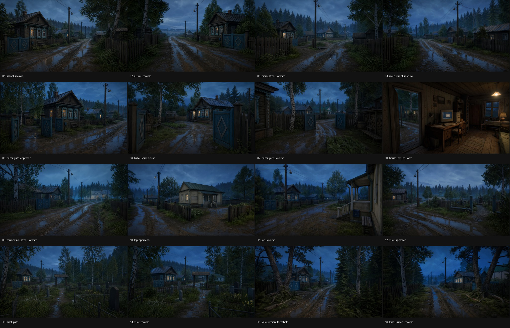

# УРМАН — концепты связного мира для Blender

Серия из 16 сгенерированных 2K-концептов показывает один визуально связный маршрут Акта I: въезд, главную и связующую улицы, двор бабая и әби, комнату старого ПК, ФАП, зират и порог Кара-Урмана. Все изображения используют общий мастер-кадр, палитру, погоду и повторяющиеся ориентиры.

## Как использовать

- Брать из серии художественный язык, пропорции, крупные цветовые массы, семьи материалов, плотность застройки, устройство границ участка и композицию first-person пространства.
- Сопоставлять прямые и обратные кадры, чтобы моделировать полноценные объёмы, а не фасады для одной камеры.
- Сверять фактические координаты, проходы, владельцев ассетов и культурные детали с действующими арт-документами, исходниками и игровыми кадрами.
- Не копировать концепты буквально как точный master layout. Image generation не гарантирует геометрической проекционной точности между ракурсами.
- Не считать концепты доказательством качества текущей сборки или art lock.

## Кадры

1. [Въезд — мастер](images/01_arrival_master.png)
2. [Въезд — обратный вид](images/02_arrival_reverse.png)
3. [Главная улица — вперёд](images/03_main_street_forward.png)
4. [Главная улица — назад](images/04_main_street_reverse.png)
5. [Подход к калитке](images/05_babai_gate_approach.png)
6. [Двор и дом](images/06_babai_yard_house.png)
7. [Двор — вид к улице](images/07_babai_yard_reverse.png)
8. [Комната старого ПК](images/08_house_old_pc_room.png)
9. [Связующая улица](images/09_connective_street_forward.png)
10. [Подход к ФАПу](images/10_fap_approach.png)
11. [ФАП — вид к улице](images/11_fap_reverse.png)
12. [Подход к зирату](images/12_zirat_approach.png)
13. [Зират — внутренний путь](images/13_zirat_path.png)
14. [Зират — вид к деревне](images/14_zirat_reverse.png)
15. [Порог Кара-Урмана](images/15_kara_urman_threshold.png)
16. [Кара-Урман — вид к деревне](images/16_kara_urman_reverse.png)

## Происхождение

- Модель: `openai/gpt-5.4-image-2` через Polza Media API.
- Дата: 2026-09-07.
- Локальная стоимость успешных генераций по API: 112 ₽.
- Стилевые входы: `painterly_low_poly_geometry_target.png`, `painterly_low_poly_atmosphere_target.png`, `visual_style_pitch_board.png`.
- Тексты и параметры запросов: [generation_manifest.json](api/generation_manifest.json) и JSON-ответы в `api/`.
- Производственный бриф серии: [IMAGEGEN_SERIES_BRIEF_RU.md](IMAGEGEN_SERIES_BRIEF_RU.md).

В качестве вторичного ориентира в промптах использованы общие принципы окружения BOTW/TOTK: ясные силуэты, крупные цветовые массы, живописные материалы, воздушная перспектива и ландшафтный wayfinding. Серия не копирует персонажей, существ, архитектуру, символы, UI или отдельные ассеты Zelda.
