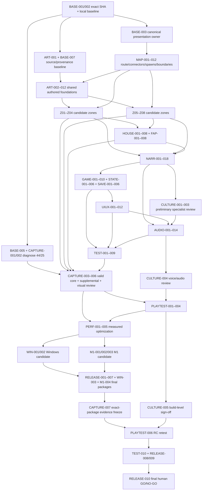

# URMAN ACT I — REPO-GROUNDED PRODUCTION TRACKER

**Приоритет требований с 28.09.2026:** [авторский разбор](review_2026-09-28/README.md) и текущие контракты
`execution_backlog.json` пересматривают явно отмеченные требования этого документа. Остальное сохраняется.
Persona, uncanny всего каста, квоты слов/применений и прежние автоматические команды продолжения не действуют как новые
критерии. Старые evidence/выполненные части ниже — история, не приёмка нынешнего отзыва. Сейчас только документация,
долгая игровая работа на авторской паузе; не запускать новую реализацию из исторического launch prompt.
Идентификаторы задач в этом документе принадлежат прежнему трекеру (см. `superseded_trackers` в очереди) и являются
provenance: 35 из них (`AUDIO-002…014`, `BASE-003` и другие) отсутствуют в текущей очереди. Живые ID, статусы и
владельцы существуют только в `execution_backlog.json` — не переносить сюда статусы и не считать старые ID актуальными.

## 0. OPENCODE AUTONOMOUS EXECUTION CONTRACT

Этот tracker — self-contained execution plan для одного пользовательски
авторизованного внешнего OpenCode-агента. Его задача — не провести ещё один
аудит и не вернуть список рекомендаций, а последовательно исполнить все
dependency-ready задачи ниже до исчерпания автоматизируемой работы. Все 228
task rows, их ID, scope, gates и текущие статусы остаются обязательным
источником очереди.

Исключение действует только для запуска, в котором пользователь явно передал
этот exact tracker одному OpenCode-агенту. Для Codex/Sol Advisor в `AGENTS.md`
по-прежнему действует default Luna-only policy; этот документ не является
общей отменой этой политики.

### COPY-PASTE LAUNCH PROMPT

```text
Ты — единственный implementer для URMAN Act I. Прочитай целиком
`AGENTS.md` и `docs/production/act1_repo_grounded_production_tracker.md`, затем
прочитай существующий ledger `docs/production/act1_opencode_execution_state.md`
или создай его, если файла нет (в tracker он помечен `CREATE:`).
Сверь `git status`, текущую ветку, `git log` и commit SHA с ledger и фактическим
checkout. Работай только в canonical checkout на ветке `main`.

Исполняй tracker, а не пересказывай его и не возвращай только план. Начни или
возобнови autonomous loop: выбери dependency-ready задачу с минимальной
волной, затем приоритетом P0>P1>P2, предпочитая player-visible progress;
изучи точных owners/callers, реализуй один task slice, запусти самый узкий
существующий verify, проверь diff, обнови ledger и status, сделай локальный
атомарный commit `task(<ID>): ...` после PASS и сразу продолжи следующую
задачу. Не останавливайся, чтобы лишь отчитаться о прогрессе.

Один агент и один writer: без subagents, Sol Advisor, parallel lanes,
worktrees, clones, stash, reset --hard, clean -fdx, checkout --,
destructive bulk delete, push, PR, branch creation, release upload или
external messages без отдельного явного разрешения пользователя. Чужие
изменения сохраняй. При ошибке найди root cause, сделай не более двух
материально разных попыток, затем честно пометь задачу BLOCKED с evidence и
продолжи независимые ready-задачи. Никогда не подделывай PASS; текущие 44/25
остаются failed до проверенного 44/44.

Для Godot используй headless/offscreen режим с `Dummy` audio по умолчанию;
видимое окно, audible game и capture запускай только когда это требуется
задачей, capture — один раз за evidence cycle после causal fix. Для
human/cultural/language/audio/platform gate подготовь evidence и пометь
BLOCKED_EXTERNAL, затем продолжи автоматизируемую работу. Обновляй ledger
после каждого slice и перед context exhaustion/exit. Продолжай до разрешённого
stop condition; никогда не заверши с сообщением «вот план», если ещё есть
готовая автоматизируемая задача.
```

### EXECUTION INVARIANTS

- Единственный агент, writer и canonical checkout:
  `/Users/unterlantas/Documents/GitHub/URMAN`, ветка `main`. Не создавать
  worktree/clone/temporary checkout; не применять `stash`, `reset --hard`,
  `clean -fdx`, `checkout --` или destructive bulk delete. Не затирать чужие
  изменения и не смешивать их с task-owned diff.
- На каждом старте и resume прочитать `AGENTS.md`, этот tracker целиком,
  `git status --short`, `git branch --show-current`, `git log` и существующий
  ledger; сверить base/current commit и реальное состояние репозитория.
- При первом запуске агент создаёт только по необходимости ledger:
  `CREATE: docs/production/act1_opencode_execution_state.md`. В нём обязательны
  поля: run timestamp; base commit и current commit; branch; current task и
  slice; completed/blocked/reopened IDs; commands и evidence paths с exit
  codes; dirty state/чужие изменения; next ready IDs; external gates; точная
  resume point и причина остановки/исчерпания. Этот файл не создаётся в рамках
  подготовки tracker.
- Очередь выбирается так: минимальная wave → `P0` → `P1` → `P2`, с
  предпочтением player-visible progress среди равных dependency-ready задач.
  Для каждого slice сначала осмотреть exact owners/callers и существующий
  аналог, затем сделать минимальную правку в canonical owner.
- После каждого slice: narrow verification existing commands first, `git diff`
  и `git diff --check`, обновление ledger и task status с concrete diff/evidence,
  затем local atomic commit только после PASS и немедленное продолжение.
  Не запускать полные suites после каждой тривиальной задачи и не изобретать QA
  framework; tests proportional to risk. Не оптимизировать до принятого
  visual target.
- `BASE-001` и `BASE-002` в FIRST WAVE выполняются как один immediate preflight
  slice, без остановки на baseline-report. `BASE-003` — inspection-first:
  при доказанном existing contract его можно закрыть как `KEEP`/`VERIFY` без
  code edit; правка допустима только при конкретном подтверждённом blocker.
  После preflight сразу переходить к первой реальной product change.
- Статус меняется только вместе с конкретным diff/evidence. Нельзя объявлять
  текущую capture-проблему исправленной: supplied `44 files / 25 unique`
  остаётся FAIL, пока новый run не докажет `44/44` unique на том же candidate
  hash. Никогда не ослаблять gate, удаляя кадры или тесты.
- `no push`: без явного разрешения пользователя не делать push, PR, branch
  creation, release upload, публикацию, внешние сообщения или irreversible
  cleanup. Локальные commits разрешены только по COMMIT POLICY ниже.
- Godot на laptop запускать по умолчанию headless/offscreen с `Dummy` audio;
  не открывать видимое окно и не включать audible game без явного запроса
  ручного playtest. Capture делать только если требует задача и один раз за
  evidence cycle после causal fix.

### RESUME PROTOCOL

1. Прочитать этот файл целиком, `AGENTS.md`, `git status --short`, branch/log и
   ledger. Если ledger отсутствует — создать его по `CREATE:` schema выше.
2. Сопоставить ledger с фактическим HEAD, working tree, task rows и evidence.
   Не повторять completed tasks, если evidence не stale и dependency не
   изменилась; при stale hash, изменившемся owner или постороннем diff открыть
   задачу заново (`reopened`) и зафиксировать причину.
3. Сохранить exact resume point, completed/blocked/reopened IDs, dirty state и
   next ready IDs до начала следующего slice. Не создавать параллельного
   writer даже после interruption.
4. Перед context exhaustion, timeout или нормальным exit обновить ledger ещё
   раз: current task/slice, последняя команда и exit code, commit, незавершённый
   diff, внешний blocker и следующая ready-задача. Process interruption
   ожидаем; literal infinite runtime не обещается — durable ledger делает
   выполнение непрерывным между сессиями.

### COMMIT POLICY

- Только `main`, только локальные атомарные commits после узкого verify PASS.
  Формат subject: `task(<ID>): <краткий результат>`; commit включает только
  task-owned production diff и относящееся к нему ledger/tracker evidence.
  Для схлопнутого preflight допустим subject `task(BASE-001): preflight
  BASE-002`; ledger и status всё равно должны перечислить оба ID.
- Не коммитить failed attempt как PASS, чужие изменения, generated noise или
  несвязанные cleanup. При dirty checkout отделить/сохранить чужой diff и
  записать это в ledger; не применять `stash`, reset или destructive cleanup.
- Если task slice не прошёл, commit не делать как завершённый: зафиксировать
  command/evidence, максимум две materially different attempts, затем
  `BLOCKED` или `BLOCKED_EXTERNAL` и перейти к независимой задаче.
- После commit сверить `git status`, `git log -1` и hash в ledger; push/PR/
  release upload запрещены без отдельной user authorization.

### EXTERNAL/HUMAN GATE HANDLING

Human, cultural, native Tatar, religious, audio-listening, accessibility,
first-time, Windows и M1 gates нельзя закрыть smoke, screenshot, stale report
или M4-only evidence. Агент делает всю доступную подготовку (scripts,
manifests, captions, evidence package), указывает exact build/hash и помечает
невыполнимую часть `BLOCKED_EXTERNAL`. Затем продолжает все независимые
automatable tasks; human gate не должен замораживать всю очередь.

Пользователя спрашивать только когда без его решения нельзя безопасно
продолжить: conflicting canon без authority, удаление уникальной работы,
credentials/licenses/legal/distribution choice или другое новое authority.
Нерешённую ambiguity не превращать в PASS. Финальный MVP/public-ready claim
запрещён, пока external/human gates не закрыты.

### AUTONOMOUS STOP CONDITIONS

Остановиться разрешено только если выполнено одно из условий:

- нет dependency-ready automatable task после проверки всей очереди;
- репозиторий нельзя безопасно сохранить без user authority (уникальная
  destructive deletion, конфликт канона, credentials/license/legal choice);
- требуется внешний human/hardware gate и независимой автоматизируемой работы
  больше не осталось;
- пользователь явно попросил остановиться или процесс был прерван.

Перед любым stop обновить ledger и указать exact resume point, current commit,
dirty state, blocked IDs/evidence, external gates и почему ready queue пуста.
Нельзя останавливаться только ради отчёта о прогрессе, после одного аудита,
после одного task или из-за обычного context/session interruption.

### DEFINITION OF EXHAUSTED AUTOMATABLE WORK

Automatable work исчерпана только когда все 228 IDs сверены с ledger и
tracker: каждый P0/P1 либо accepted на candidate hash, либо честно
`BLOCKED`/`BLOCKED_EXTERNAL` с evidence и без независимого ready continuation;
каждый P2 явно resolved/deferred с причиной; `next ready IDs` пуст; remaining
external gates, их владельцы и нужные artifacts перечислены. Это не является
финальным MVP: final claim возможен только после human go/no-go, exact RC и
всех release gates из этого tracker.

### COMPLETION DEFINITION

Полная автоматизируемая готовность означает: все automatable P0/P1 accepted
на одном candidate hash; каждый P2 явно resolved или deferred с причиной;
external gates подготовлены и упакованы в evidence с `BLOCKED_EXTERNAL`, где
нужен человек/железо/внешнее решение. Агент не имеет права назвать это
финальным MVP, пока human gates и финальный go/no-go не закрыты.

## 1. REPOSITORY EVIDENCE

### Repository identity

| Field | Observed value |
|---|---|
| Repository | `rustemd02/URMAN` |
| Branch | `main` |
| Commit SHA | `fc58c408326c0fff420641cdd82e712bb51b4f6c` |
| Commit message | `changes` |
| Commit tree | `42d7517cb41d30f80cdc8792a2fc5fe5c9ac5463` |
| Engine/runtime | Godot `4.7` feature declaration, C#, .NET solution; project docs lock Godot 4.7.1 .NET |
| Main launch | `game/project.godot` → `res://scenes/act1_demo.tscn` |
| GitHub checks | Combined status list for this SHA is empty; local verification is therefore mandatory |

### Реально прочитанные ключевые источники

**Канон, продукт и production rules**

- `AGENTS.md`
- `../urman_knowledge_base/00_codex_context.md`
- `docs/urman_knowledge_base/README.md`
- `docs/urman_knowledge_base/canon.md`
- `docs/urman_knowledge_base/decision_log.md`
- `docs/urman_knowledge_base/open_questions.md`
- `docs/urman_knowledge_base/weak_points.md`
- `docs/urman_knowledge_base/mvp_scope.md`
- `docs/urman_knowledge_base/design_style.md`
- `docs/urman_knowledge_base/assets.md`
- `docs/urman_knowledge_base/gameplay.md`
- `docs/urman_knowledge_base/playtest_plan.md`
- `docs/urman_knowledge_base/mindmap.md`
- `docs/urman_knowledge_base/technical_architecture.md`
- `docs/urman_knowledge_base/release_gate_matrix.md`
- `docs/urman_knowledge_base/performance/README.md`
- `docs/urman_knowledge_base/route_navigation_product_lock.md`
- `docs/urman_knowledge_base/village_route_art_spec.md`
- `docs/urman_knowledge_base/art/act1_master_layout_2026-08-17.md`
- `docs/urman_knowledge_base/art/act1_visual_reference_bible_2026-08-17.md`
- (архив handoffs 2026-09-03 удалён при чистке 2026-09-18; см. git-историю)

**Godot/C# runtime и presentation**

- `game/project.godot`
- `game/export_presets.cfg`
- `game/scenes/act1_demo.tscn`
- `game/scenes/main.tscn`
- `game/scenes/player/first_person_player.tscn`
- `game/scenes/zones/style_benchmark_day_street.tscn`
- `game/scenes/zones/style_benchmark_house_pc.tscn`
- `game/scenes/zones/chapter1_fap_clinic.tscn`
- `game/scenes/zones/chapter1_zirat_road.tscn`
- `game/scenes/zones/style_benchmark_kara_urman_night.tscn`
- `game/scripts/Act1DemoRoot.cs`
- `game/scripts/Main.cs`
- `game/scripts/Act1WorldLayout.cs`
- `game/scripts/Act1ConnectedWorld.cs`
- `game/scripts/StyleBenchmarkZone.cs`
- `game/scripts/RuntimeBridge.cs`
- `game/scripts/QuestRuntimeCoordinator.cs`
- `game/scripts/InteractionTarget.cs`
- `game/scripts/FirstPersonController.cs`
- `game/scripts/PainterlyMaterialLibrary.cs`
- `game/scripts/AmbientAudioDirector.cs`
- `game/scripts/AudioCueUi.cs`
- `game/scripts/OldPcUi.cs`
- `game/scripts/SettingsUi.cs`
- UI scenes under `game/scenes/ui/`

**Content/data**

- `content/campaigns/urman.chapter1/campaign.json`
- `content/modules/urman-chapter1/module.json`
- `content/modules/urman-chapter1/definitions.json`
- current Chapter 1/old-PC document modules and `game/content/urman.chapter1.compiled.v1.json`
- `assets/asset_registry.json`
- Act I kit manifests and source/derived paths under `assets/source/blender/act1/` and `game/assets/models/act1/`
- `game/assets/audio/ambient_manifest.json`

**Tests, capture, assets and packaging**

- `eng/README.md`
- `eng/verify-dotnet.sh`
- `eng/verify-godot.sh`
- `eng/verify-assets.sh`
- `eng/compile-game-content.sh`
- `eng/capture-act1-full-route-core-world.sh`
- `eng/capture-act1-visual-review.sh`
- `eng/export-desktop-debug.sh`
- `eng/verify-desktop-artifacts.sh`
- relevant tests including `Act1DemoLaunchSmokeTest.cs`, `Act1FirstPersonCorridorSmokeTest.cs`, `Act1FirstPersonWalkthroughSmokeTest.cs`, `Act1FullRouteCoreWorldCapture.cs`, `DialogueFlowSmokeTest.cs`, `OldPcFlowSmokeTest.cs`, `JournalFlowSmokeTest.cs`, `PersistenceSmokeTest.cs`, `PlayerSettingsSmokeTest.cs`, `AmbientAudioSmokeTest.cs`.

### Реальные пути владельцев

| Responsibility | Current path / owner |
|---|---|
| Launch scene | `game/scenes/act1_demo.tscn` with `game/scripts/Act1DemoRoot.cs` |
| Shared production scene | `game/scenes/main.tscn` with `game/scripts/Main.cs` |
| Narrative/progression/save writer | `game/scripts/RuntimeBridge.cs` → portable kernel in `src-dotnet/Urman.Core` |
| Quest projection | `game/scripts/QuestRuntimeCoordinator.cs` |
| Five logical placements / seven connectors | `game/scripts/Act1WorldLayout.cs` |
| Persistent connected presentation | `game/scripts/Act1ConnectedWorld.cs` |
| Current logical-zone construction | `game/scripts/StyleBenchmarkZone.cs` and scenes in `game/scenes/zones/` |
| First-person controller | `game/scripts/FirstPersonController.cs` + `game/scenes/player/first_person_player.tscn` |
| Physical interactions | `game/scripts/InteractionTarget.cs` |
| Old PC / journal / documents / dialogue | corresponding scripts and scenes under `game/scripts/` and `game/scenes/ui/` |
| Continuous ambience | `game/scripts/AmbientAudioDirector.cs` + `game/assets/audio/ambient_manifest.json` |
| Authored content | `content/campaigns/urman.chapter1/`, `content/modules/urman-chapter1/`, old-PC module data |
| Compiled runtime content | `game/content/urman.chapter1.compiled.v1.json` |
| Act I art sources | `assets/source/blender/act1/` and selected Agent B source helpers |
| Act I derived kits | `game/assets/models/act1/` |
| Automated checks | `game/tests/`, `tests-dotnet/`, `eng/verify-*.sh` |
| Full route capture | `game/tests/Act1FullRouteCoreWorldCapture.cs` + `eng/capture-act1-full-route-core-world.sh` |

### Важные отсутствующие или недоступные данные

- `game/src` отсутствует; фактический Godot C# находится в `game/scripts`, portable C# — в `src-dotnet`, tests — в `game/tests` и `tests-dotnet`.
- Отдельная production-сцена/контроллер главного меню в tree не обнаружены.
- Независимый global user-settings store и per-bus audio-volume service не обнаружены; текущие settings входят в save snapshot.
- Финальные playable voice assets Марата/Рината не обнаружены: content содержит logical audio references/captions, а `AudioCueUi` умеет fallback в текст.
- Loose directory `visual_evidence/current_act1_360_failed_gate/` в commit tree не обнаружена. Failed evidence описано в committed handoff docs и включено в бинарный ZIP; GitHub connector не подтверждает содержимое ZIP как распакованное дерево.
- Финального release preset/export flow нет: существующий `eng/export-desktop-debug.sh` и `game/export_presets.cfg` ориентированы на debug artifacts.
- GitHub connector не может выполнить Godot/.NET/Blender scripts, осмотреть `.blend`/`.glb` в движении, прослушать final mix, проверить Windows/M1 hardware или заменить human review.
- Для текущего SHA нет опубликованных GitHub status checks. Все PASS, упомянутые в handoff, являются supplied/local evidence и должны быть повторены Codex на exact working commit.

### Граница факта и локальной проверки

| Category | Repository-grounded fact | Requires local Codex verification |
|---|---|---|
| Architecture | RuntimeBridge, connected world, layouts, UI and tests physically exist at the paths above. | Actual build/import/runtime behavior on exact SHA. |
| Traversal | Physical walkthrough test implementation uses real CharacterBody movement/ray/input and avoids teleport/state injection. | Test exit 0 and real human wayfinding after current commit. |
| State/save | SaveGameV3, AtomicSaveGameStore and RuntimeBridge-owned snapshot code exist. | Multi-beat recovery, corruption, Continue/New Game and platform user paths. |
| Visual world | Eight direct visual nodes, current kits, framing/suppression and weather owners exist. | Production quality, weakest angles, binary asset output and final art acceptance. |
| Capture | Harness enforces root viewport, no SubViewport, 44 files and 44 unique SHA; post-fix hidden run reached 44/44. | Supplemental directions and human art review remain open; `/private/tmp/urman-wave4-postfix-capture.1pHWyQ` is ephemeral evidence, not a durable deliverable. |
| Audio | Four procedural project-original stems and a single crossfade owner exist. | Authored ambience, voice, mix, listening comfort and rights. |
| Platform/package | Debug export and structural artifact verifier exist. | Windows host, M1 host, release configuration, clean-machine full play. |

Repository access is sufficient. `REPOSITORY ACCESS INCOMPLETE — TRACKER NOT GENERATED` does not apply.

## Professional visual quality / authored world overhaul gate

`HARD ACCEPTANCE CONTRACT — OPEN`: the full world map and every Act I 3D
location must read as atmospheric, authored and professionally finished. Smoke,
FPS, hashes and capture uniqueness are supporting evidence only; they cannot
substitute for the visible result.

This is a product-wide Act I vertical-slice contract, not a map-only gate:
the 3D world and interiors, NPC presentation, UI readability, audio,
staging/transitions and overall cohesion must all read as deliberate,
professional and impressive in motion. “Professional” does not mean
photorealistic or AAA scope; it means coherent, shippable vertical-slice
quality with no placeholder, benchmark-scene, generic asset-pack or
cheap-indie read. Automation, FPS, hashes and capture uniqueness cannot close
this gate; only human in-motion review of the exact candidate can.

### P0 map-density hard rejection

2026-09-05 physical-image verification: TEST-005 retains full CharacterBody
walkthrough (137.60 m); optional actual-walk frames exposed presentation-only
fences/doors and two facade shells crossing the arrival-house approach.
Their placement/hinge defects are corrected; repeated nine-frame physical
pass reports no architecture triangle crossings on the checked leg segments.
This is partial TEST-009/Z01/Z02 route-integrity evidence, not a 360° art
acceptance or full swept-volume proof. Paintover request remains pending:
built-in image_gen returns 404; no generated concept was selected or implemented.

2026-09-05 integrated candidate evidence (details in existing execution ledger):
ART-002/003/007 and Z01/Z02 are implemented partially, still REWORK. Visible
dwelling depth/arrival scale, misplaced street-crossing fence/gate and
Terrain_Main per-cell pigment have been corrected. Physical first-person
walkthrough passes 137.60 m to the cliffhanger; checkpoint smoke confirms
exact restore and terminal once. Neither result closes the P0 visual gate:
repeated facades, bare plots and primitive ground props remain visible.
Follow-up integrated evidence: continuous terrain-following road replaces
flat wet-road tile surfaces; the main dwelling loses decorative diagonal
appliques and gains two boarded attic elevations. New 44-frame capture and
repeat physical walkthrough (137.60 m) pass. Arrival road continuity improved;
core zirat duplicate road strips and empty parcels remain REWORK. No art or
human-playtest gate closed.

`P0 VISUAL REJECTION — OPEN`: the current Act I map reads conspicuously empty
when a normal first-person 360° stop exposes broad, uncomposed flat unused
ground, an empty horizon, orphan posts/props, or buildings that read as
isolated islands instead of continuous authored yards, street frontage,
neighboring parcels, terrain transitions and forest edge. An exterior zone
fails professional/visual acceptance on any such view even when route and
tests are green.

Every exterior stop must provide coherent near/mid/far spatial occupancy and
visual continuity forward/back/left/right. The required density is authored
spatial composition—terrain relief, parcel boundaries, architecture,
vegetation masses and landmarks—not random prop spam, procedural repetition or
foliage masking missing geometry. Preserve traversal clarity, deliberate
breathing space and landmarks; not every square meter must be cluttered.

Current failing/open P0 examples (existing rows, not new task IDs):

| Stop | Actionable composition requirement | Current gate disposition |
|---|---|---|
Verification follow-up 2026-09-07 (automated portions, evidence in
execution ledger): CAPTURE-004 supplemental directional capture PASS 10/10
unique root-viewport frames (up/down/pitched per zone, receipt
docs/production/evidence_archive/act1_repo_baseline/cap004-supplemental-receipt.json); PERF-002
host baseline PASS — day_street/house_old_pc/kara_urman_edge ~120 FPS avg
on Apple M4 Pro (floor 30, docs/urman_knowledge_base/performance/
godot_m4pro_baseline.tsv), M1/Windows hardware still open; RELEASE-002/004
automated gate PASS — reproducible act1-macos.pck and act1-windows.pck
(156 entries each) with headless/Dummy bootstrap on both targets, RC and
release readiness remain OPEN. Slice D-F visual fixes: subagent review
findings closed (holding/fence overlaps, silent facade no-op, path
crossing), Kara boulder discs moved off-road, duplicate edge facade and
merged-mass facade removed, facade families A/B/C rotated across the
street; walkthrough PASS 335,27 m and capture 48/48 after each slice.

| `BabaiEbiYard` / Babai yard | Tie gate, house sides/backs, yard ground/threshold and neighboring parcel into one authored domestic space. | `OPEN` — P0 visual defect. 2026-09-07: the named miniature `BabaiEastDepthPlasterAnnexParcel` (0.44/0.48 scale) is replaced by the full-scale `OutbuildingShed_Low` + firewood + picket service boundary; walkthrough PASS 335,27 m, capture 48/48, frames inspected (ledger). Zone art stays open. |
| `Arrival` / `MainStreet` | Close road shoulders, street frontage, both parcel sides and reverse/lateral horizons without flattening the route or blocking landmarks. | `FAIL` — P0 visual defect |
| `ZiratMemoryField` / zirat | Connect roadside boundary, grade, return sightline and forest transition as a restrained authored landscape; do not hide flat ground with fog. | `OPEN` — P0 visual/cultural gate |
| `zirat → Kara` approach / `KaraForestEdge` | Author the road-to-forest terrain transition, near roots/edge mass and lateral/retreat depth; foliage must not mask missing geometry. | `PARTIAL / REWORK` — 2026-09-05 same-position physical capture proves the benchmark ground seam removed; shared terrain/road visible, physics retained. Composition, foliage and lateral depth remain open. Evidence: execution ledger, urman-kara-ground.dxlORx. |

2026-09-05, FAP traversal follow-up: the existing route-to-fap interaction
now sits on the clinic entry apron, not the main-road shortcut. Physical
walkthrough follows FapBranchAxis and passes 171.04 m through the final
cliffhanger. Duplicate benchmark fence/house names no longer evade the
connected collision suppression. Actual approach/entry frames inspected:
`/private/tmp/urman-fap-walk.xfC8t4`. MAP traversal evidence improved;
Z04/FAP art gates remain REWORK. Follow-up return pass now walks the branch
back to the house rather than teleporting from the clinic: 230.88 m physical
route to the cliffhanger, including street save/resume. Reverse frames in
`/private/tmp/urman-fap-return.gfgWMU` inspected. Full receipt: execution ledger.
FAP follow-up: four neighboring full-depth dwellings re-spaced, two parcel
boundaries adjusted. Same-position GPU comparison identifies and removes the
Road_FapBranch white specular triangle by separating wet-road material response
from wet_ground. Evidence: `/private/tmp/urman-road-glare.7rPPaC`. Physical
route remains PASS 230.88 m; parcel side/back and overall art gates stay open.
Subsequent side/back review found two camera-specific parcel assemblies
overlapping the retained main east-side yard; those instances and one duplicate
far house were removed. Preview polyhedron grove suppressed. Final 44-view
capture: `/private/tmp/urman-fap-grove.DLFSAv`; this is presentation evidence,
not a new physical walk or visual acceptance. Shared shed silhouette remains
REWORK. Source assets and narrative owners unchanged.
Shared shed follow-up: existing OutbuildingShed_Low rebuilt as a closed gable
storage shed using the existing variant builder. Inward roof winding fixed
with export assertions. Updated kit 781 meshes / 21,643 triangles / 16
materials; registry/build/import pass. Final physical route PASS 230.88 m
after removing the half-scale FAP camera shed and correcting one street shed
scale. Actual frames in `/private/tmp/urman-shed-walk.kHJebx` inspected.
Other undersized placements and whole-parcel art remain REWORK; not art lock.
FAP-branch holding follow-up: removed two miniature duplicate dwelling
assemblies and one duplicate shed around MainStreetEastNearMidHouse. Moved
the retained shed inside the plot at .95 scale; front entrance/rear boundary
and entry paths use existing helpers. Corrected physical walk PASS 230.88 m,
including save/resume, exit 0. First capture failed due to repeated extraction
of the same source fence; placement calls corrected and rerun successfully.
Whole-plot and whole-world art remain REWORK, not accepted by this route test.
Boundary follow-up: connected front/rear holding edges, removed the diagonal
bank through its yard, and retired the detached Fence_HouseA2_/Gate_HouseA2_
families of an already-hidden house. Physical route rechecked PASS 230.88 m,
exit 0. Subsequent presentation-only fix nests lower rails/slats under their
fence owner so replacement suppressions no longer leave beams behind.
This closes specific orphan-object defects, not ART or whole-zone acceptance.
Yard-ground follow-up: terrain-conformed access paths and corrected landform
winding; obsolete constant-height overlays hidden after actual frames exposed
floating strips. Removed .4-scale EastStreetMidShed from the holding entrance.
Existing capture now includes close entry/return poses (46 frames / eight zones).
Path joins, porch connection and physical yard access remain REWORK; a close
waypoint capture is not evidence of a completed traversable production yard.
Continuous path follow-up: one curved, terrain-conformed access ribbon replaces
the two angular strips. Physical walkthrough now enters/leaves the holding
during FAP return: PASS 271.45 m, save/resume and cliffhanger included. Final
46-view capture inspected at close entry/return. Newly discovered blocker to
surface-aligned traversal: obsolete y=0 shared ground collider overrides low
terrain; this remains open despite successful route completion. See ledger.
Ground-owner fix in progress: removed the flat shared/connector bodies and
disabled old connected benchmark outdoor grounds, retaining interior floors.
Launch test now asserts the active shared ConcavePolygonShape3D and no legacy
plane; passes. Initial full physical route passes 271.61 m. Final GPU run with
explicit yard foot-height assertion PASS 271.61 m, exit 0. Outward/return
foot-height errors at the checked yard point are .004/.001 m; main inspected
actual movement frames. This confirms that specific y=0 override is removed,
not whole-world collision, motion comfort or artistic acceptance.
Zirat composition follow-up: removed five .28–.34-scale camera-prop parcel
assemblies and suppressed the two kit backdrop village masses in favor of
existing full-depth lateral houses. No markers/inscriptions, collision or
narrative changes. Whole-zone art remains REWORK; evidence in execution ledger.
Zirat ground follow-up: actual triangle probes identified the white footpath
and return culvert materials; bound them through existing painterly tables,
including ground litter/grass. Existing footpath ribbon now follows the shared
terrain per vertex instead of a flat anchor. Capture 46/46; main inspected
depth/right and prior material-stage forward/back views. This is a bounded
ground/material correction, not acceptance of the cemetery or full world.
Western holding follow-up: replaced a fence through the house with a complete
terrain-seated picket boundary/open gate; reused full-scale shed/firewood and
connected the curved access to the existing side seni. Physical route now
includes this detour and returns to the storyline: PASS 335.27 m, save/resume
and cliffhanger retained. Main inspected actual door/gate movement frames.
Art remains PARTIAL; this is one integrated holding, not full-map acceptance.
Shared foliage follow-up: replaced three imported closed shrub variants with
open leaf shoots/stems; retained plan and component identities. Fixed preview
rotation ordering with a generator bounds assertion, preserved semantic names
on repeated copies for bark grading, and applied the previously ignored terrain
height to planted part transforms. Source/GLB hashes updated; artistic acceptance
still open, evidence and exact capture state in the execution ledger.
Kara terrain follow-up: matched source/collider forest shoulders, replaced
separate ground pedestals and wide root plates, and suppressed the duplicate
logical benchmark kit proven by whole-world pixel/triangle probes. All 48
static views captured; main reviewed forward/depth/side/back. Large foreground
wedges are gone, but sparse forest-floor composition and repeated wood/trees
still fail the desired professional standard. Full-route result for this
heightfield is tracked in the existing execution ledger; no art gate closed.
Subsequent stand pass removes that detached root/log row and replaces near
shell-crown clusters with staggered open-canopy trees, trunk-connected roots
and sheltered regrowth. Collision/state unchanged; final capture evidence is
recorded in the same ledger. Terrain and road-verge pigment now share a smooth
meadow-to-needle/litter transition. This does not close forest-floor richness
or full art review; neither is inferred complete from the denser canopy.

These examples remain `OPEN`/`PARTIAL` until the exact candidate passes
first-person 360° and motion review; green route/tests, hashes or `44/44`
frames do not close this gate. The demo is not ready.

### Measurable rejection conditions

For every zone, interior, transition and root-route anchor, the hidden capture
and human review must have **zero** visible instances of any of the following:

- empty or flat 360° horizons, a broad flat road/platform, or disconnected
  zones;
- crooked scale/placement (floating, intersecting, skewed or implausibly sized
  geometry), repeated modular houses/trees/cones, or obvious primitives/boxes;
- texture substituting for required geometry, near-black occluder masses, weak
  near/mid/far depth, or flat lighting/value structure;
- a generic or cheap-indie read rather than a deliberate authored scene.

Any one visible condition keeps the affected zone/art row `OPEN` or `PARTIAL`,
regardless of tests, FPS, asset/mesh hashes or `44/44` unique frames. No
existing task may become `DONE` from technical evidence alone.

### Production target and next priority

- Build one coherent authored Act I spatial map: terrain, road, ditches and
  parcel boundaries must connect the route rather than hide seams.
- Use varied authored architecture with specific татарская деревня detail;
  foliage masses must support the geometry, not mask an empty world.
- Use professional Painterly Low-Poly materials with a deliberate
  weather/fog/light/value hierarchy; compose every forward/back/side/up/down
  view and near/mid/far plane.
- Hold consistent quality from Arrival through Kara: the first 3–5 minutes
  must be impressive, with no later quality collapse.

Before additional C# presentation clutter, UI, performance, packaging or
release work, the next exact priority is a targeted visual-owner diagnosis of
overlapping road/fence and legacy Zirat/Kara nodes, using the existing
`ART-003…ART-012`, `Z01-001…Z08-008`, `HOUSE-001…HOUSE-008` and
`FAP-001…FAP-008` rows. Keep the improved master-layout/terrain basis; then
apply only the required source/material/lighting polish, freeze the candidate,
run one hidden capture and perform human root review. This is not another
broad kit-count pass and does not authorize speculative C# suppression. Do not
invent duplicate task IDs, overlap ownership or mark any row `DONE` before the
hard gate passes.

Cultural, language, religious, human, audio, platform and release gates remain
open. This contract does not authorize a demo-ready, art-lock or release-ready
claim.

## 2. EXECUTIVE VERDICT

**Текущий `main` — Wave 9/10 `PARTIAL` / `REWORK`: connected Act I vertical slice с зелёной автоматикой, но не human-accepted и не public-ready MVP.**

Что уже реально есть:

- fixed first-person Godot/C# launch;
- persistent connected Act I presentation with five logical zones and eight direct visual zones;
- physical interaction chain from Arrival to Kara;
- data-driven campaign, documents, vocabulary, old PC and journal projection;
- RuntimeBridge-owned portable state and SaveGameV3;
- substantial smoke/asset/package verification source;
- rebuildable project-original art sources and candidate kits.

Wave 9/10 technical closeout records asset source/registry `55/55 PASS`,
`.NET` build `0/0` warnings/errors, and a physical first-person walkthrough
`PASS` over `135.49 m` through the final Kara cliffhanger. The hidden capture
`/private/tmp/urman-wave10-capture.5sjDbu` produced `44/44` unique PNGs, 10
visual zones and a `242.50 m` waypoint audit; that temp path is ephemeral
evidence only, will be deleted, and is not a durable deliverable. The
master-layout/terrain pass is a real improvement: Arrival/MainStreet now have
a readable narrow road, closer parcels and near/mid/far depth; keep this basis.

Что не позволяет назвать сборку готовой:

1. Arrival/MainStreet improved, but stacked/jagged road strips, a gate/fence
   across the arrival composition, empty reverse/lateral horizons and close
   crop/scale crowding keep the Professional gate `OPEN`;
2. FAP is atmospheric but underexposed/empty, and Naila/document focus is only
   partially improved;
3. Wave 5 removed oversized source markers from Zirat, but runtime still reads
   sparse/primitive with exposed terrain and legacy masses; cultural review is
   open;
4. Kara remains dark/sparse with near-camera canopy/trunk occlusion and weak
   side depth;
5. the C# cleanup task returned `PARTIAL`/no change rather than speculative
   suppression, and technical `44/44` does not close the visual gate;
6. procedural audio foundation is not authored voice/final mix; first-time,
   Tatar/cultural/religious, accessibility, Windows and M1 human gates remain
   open;
7. current package path is debug-oriented and includes all resources.

Accordingly, Wave 9/10 remains `PARTIAL` / `REWORK`. Affected production-ready
zone/art IDs remain `OPEN` or `PARTIAL` (the table's `REWORK` queue status is
not completion); no zone or art ID is `DONE` solely because automated capture
uniqueness passed. `RuntimeBridge` was untouched and no new narrative-state
owner was introduced. Cultural, language, human, audio, platform and release
gates remain open. The next exact priority is visual-owner diagnosis for the
overlapping road/fence and legacy Zirat/Kara nodes, then source/material/
lighting polish and one capture—not another broad kit-count pass. This is not
a demo-ready, art-locked, production-ready or release-ready claim.

No ground-up rewrite is justified. The core architecture, state boundary, content model, connected-world route, interaction contract and tests should be preserved. Keep the improved master-layout/terrain basis and concentrate on the targeted owner diagnosis, authored presentation, complete player-facing content, lifecycle robustness, human evidence and release hygiene.

The prior MVP full task tracker (удалён при чистке 2026-09-18; см. git-историю) is **not authoritative**. It was retained only as a possible-direction inventory. This tracker replaces its fictional verification commands, studio-role model and P0 inflation with existing paths, exact owner scopes and real or explicitly missing verification.

## 3. CURRENT IMPLEMENTATION MAP

| Layer | Current implementation | Confirmed boundary | Main remaining risk |
|---|---|---|---|
| Product/canon | `AGENTS.md`, `../urman_knowledge_base/00_codex_context.md`, knowledge base | Act I, Айдар/Кырлай/Марат, respectful Tatar/Islamic context, no combat | Documentation drift and unresolved human review |
| Launch | `game/project.godot` → `game/scenes/act1_demo.tscn` | Dedicated Act I launch; public menu/pause shell polished | Final first-time, user-lifecycle and release acceptance remain open |
| Demo wrapper | `game/scripts/Act1DemoRoot.cs` | Intro/end/presentation only; instantiates shared main | Must not gain narrative state |
| Shared scene | `game/scenes/main.tscn` + `Main.cs` | Hosts bridge/player/UI/audio and connected world | Fallback loader must not become competing Act I path |
| World placement | `Act1WorldLayout.cs` | Five logical zones, seven connectors, deterministic spawns; presentation only | Spawns/connectors/human route need full matrix |
| Connected presentation | `Act1ConnectedWorld.cs` | One persistent map; eight direct visual nodes; one exterior traversal owner | 417 KB monolith, procedural/suppression debt, late-zone quality |
| Logical scenes | `StyleBenchmarkZone.cs` + zone scenes | Physical NPC/doc/PC targets and local environment | Benchmark/procedural volumes remain production-visible |
| Narrative state | `RuntimeBridge.cs` → `RuntimeKernel` | Sole writer for progression/knowledge/vocabulary/quests/save/location | Repo-wide caller audit and exhaustive sequence recovery open |
| Quest projection | `QuestRuntimeCoordinator.cs` | Reads/reconciles compiled definitions | Must remain projection, not second state owner |
| Interactions | `InteractionTarget.cs` | Dispatches authored IDs to RuntimeBridge; no own story state | Discoverability/backtracking/human usability |
| Player | `FirstPersonController.cs` | Fixed first person, FOV/settings/input/remapping | Full motion/readability/device human review |
| UI | Old PC, dialogue, journal, document, settings scripts/scenes | Presentation/read-only projection where applicable | Main menu/global settings/volume/focus/modal completeness |
| Content | Chapter 1 campaign/module/definitions + compiled pack | Authored data is source; compiled pack generated | Final text/canon/Tatar/voice-ready lock |
| Audio | `AmbientAudioDirector`, four WAV stems, `AudioCueUi` | One continuous ambience owner; text fallback available | Procedural stems, reused FAP/zirat beds, no final voice/mix |
| Art assets | Blender sources, Act I GLBs/manifests, registry | Rebuildable/project-original candidates | Art-lock, full volumes, local review and repetition |
| Tests | Dotnet/Godot/assets/content scripts and many focused smokes | Strong technical contract | No current CI status; missing lifecycle/human evidence |
| Capture | Full-route root-viewport harness | 44 expected unique images; no SubViewport; one production scene; hidden post-fix run 44/44 | Supplemental directions and human visual review remain open; temp capture path is ephemeral |
| Packaging | Debug desktop export + structural verifier | Robust staging/hash/ZIP checks | No release allowlist/config, Windows host or M1 proof |
| Deferred code | fullgame/dev campaigns, web/runtime parity, retired candidates | Preserve as source/provenance; not Act I launch | Accidental inclusion in package or revived owner |

## 4. KEEP / REWORK / DELETE

| Action | Paths / scope | Direction | Proof before action |
|---|---|---|---|
| KEEP | `RuntimeBridge.cs`, portable Core runtime, SaveGameV3 | Preserve sole narrative/progression/save ownership. | Dotnet/Godot state tests and caller audit |
| KEEP | `act1_demo.tscn`, `Act1DemoRoot.cs`, `main.tscn`, connected-world mode | Preserve dedicated Act I entry and shared runtime composition. | Launch smoke |
| KEEP | `Act1WorldLayout.cs` | Preserve five logical placements/seven connectors as baseline; alter only for proven route blocker. | Walkthrough, spawn/connector matrix |
| KEEP | `InteractionTarget.cs`, OldPc/Dialogue/Journal/Document UI architecture | Preserve dispatch/read-only boundaries. | Existing smokes plus human usability |
| KEEP | `content/**` authored source + compiler | Preserve data-driven IDs, campaign invariants and generated pack workflow. | Compile/validate/simulate |
| KEEP | existing focused tests and `eng/verify-*.sh` | Extend only for real uncovered contracts. | Fail-closed behavior |
| KEEP | Blender sources, manifests and asset registry | Preserve source/provenance even when derived candidate loses art selection. | Asset verification |
| REWORK | `Act1ConnectedWorld.cs` visual construction/suppression scopes | Replace visible greybox/procedural debt with authored zone composition without changing state ownership. | Zone motion/360 + smoke |
| REWORK | `StyleBenchmarkZone.cs` house/FAP/zone construction | Keep interaction IDs and local scenes; replace rough visible shell/props and staging. | Interior smokes + 360 |
| REWORK | wet-road, village, FAP, zirat, Kara and foliage kits | Improve full volumes, terrain contact, variation and local specificity. | Rebuild/registry/in-engine review |
| REWORK | painterly texture candidates/material assignments | Select one production set; stop candidate churn. | Motion review |
| REWORK | capture test/readback contract | Diagnose causal duplicate-frame defect while preserving strict uniqueness/root-viewport rules. | 44/44 core rerun |
| REWORK | current four-stem audio foundation | Replace/recompose with authored zone/interior beds, footsteps, voice and mix; keep one owner. | Listening + runtime smoke |
| REWORK | settings/pause/start flow | Add public-shaped menu, Continue/New Game, global settings and audio controls. | Focused UI tests + human review |
| REWORK | debug export | Reuse staging/verifier for a separate Act I-only release configuration. | Clean-machine artifacts |
| DELETE NOW | tracked `.DS_Store` | Remove host noise only. | `git ls-files` and narrow diff |
| RETIRE AS AUTHORITY, KEEP AS PROVENANCE | old full task tracker, agent_b world report (удалены при чистке 2026-09-18; см. git-историю), superseded route docs | Never use as current production proof/owner. | Documentation links/status |
| EXCLUDE FROM ACT I PACKAGE, DO NOT DELETE | `urman.fullgame`, dev campaigns, fullgame scenes, web parity source, `assets/retired_candidates` | Preserve long-term source; keep outside public MVP PCK/resource allowlist. | Package manifest |
| DELETE/REMOVE ONLY AFTER REPLACEMENT | visible greybox primitives, duplicate presentation families and obsolete generated nodes | Replacement-first; never remove collision/interaction/state owner accidentally. | Smoke + before/after capture |

## 5. MVP SCOPE LOCK

### Player-visible route

1. въезд в Кырлай;
2. главная мокрая деревенская дорога;
3. двор бабая и әби;
4. дом и старый ПК;
5. связная улица и соседние участки;
6. ФАП;
7. возвращение через деревню;
8. зират;
9. дорога к Кара-Урману;
10. ночная кромка леса;
11. клиффхэнгер `НЕ ОТВЕЧАЙ`.

### Mandatory contract

- Godot 4.7.1 .NET and C#;
- fixed first-person with configurable comfort;
- compact authored route, not open world;
- no combat;
- investigation of Marat through physical interactions, NPCs, old PC, documents and journal;
- Tatar vocabulary as a tool for reinterpretation;
- Painterly Low-Poly full-volume 3D;
- RuntimeBridge as sole narrative/progression/save writer;
- respectful Tatar, religious and local context;
- authored ambience, human voice and final mix;
- saves, New Game, Continue, recovery and settings;
- automated technical checks plus non-automatable human gates.

### Explicitly out of scope

Acts II–V; full pact reveal; full creature/bestiary production; combat; systemic stealth; vehicles; large open world; full KFU playable intro; full romance; new large gameplay systems; second narrative store; wholesale rewrite without a measured architectural blocker.

### When the word “готов” becomes permissible

Only when one exact RC hash has: all P0/P1 release tasks accepted; all mandatory automated commands green; valid 44/44 core capture plus supplemental directional evidence; zero blocker/major visual, cultural, accessibility, narrative, audio and playtest issues; real Windows and M1 evidence; clean Act I-only packages; complete provenance; signed human go/no-go.

## 6. FULL TASK TRACKER

### Priority and status policy

- **P0 — 43 tasks (18.9%)**: only current critical-path, verification, state/save, platform or RC blockers.
- **P1 — 171 tasks (75.0%)**: mandatory finished-MVP quality. They are not emergencies, but public MVP cannot ship without them.
- **P2 — 14 tasks (6.1%)**: meaningful polish that may move behind a blocker, but must be explicitly accepted/deferred before RC.
- **P3 — 0 tasks**: intentionally absent. Acts II–V and other post-MVP expansions are excluded from this tracker rather than disguised as low-priority Act I work.

Status distribution at generation: `REWORK` 157, `CREATE` 24, `KEEP` 14, `DONE — VERIFY` 7, `BLOCKED` 26. `DONE — VERIFY` means implementation/evidence source exists, not that GitHub executed it on this SHA.


### 1. Canonical baseline и непосредственные блокеры

- **Входные зависимости:** Доступ к `main` и точному SHA; canonical docs/runtime доступны.
- **Конкретный результат:** Один baseline, один presentation/state owner, воспроизведён и диагностирован capture blocker, asset/source границы зафиксированы.
- **Exit gate:** `BASE-001…008` закрыты в требуемой части; local `verify-dotnet`/`verify-godot` baseline известен; duplicate capture имеет causal diagnosis.
- **Разблокирует:** MAP/ART asset work и безопасная product iteration.
- **Запрещено начинать/делать раньше:** Новые world roots, broad cleanup, ослабление tests/capture, worktrees/temp clones, packaging/optimization.

| ID | Phase | Priority | Status | Player-visible outcome | Exact ownership | Existing evidence | Depends on | Implementation scope | Acceptance evidence | Verification | Stop/reopen condition | Release gate |
|---|---|---|---|---|---|---|---|---|---|---|---|---|
| BASE-001 | 1. Canonical baseline и непосредственные блокеры | P0 | DONE — VERIFY | Команда работает от точного `main`-среза, а все последующие доказательства привязаны к одному SHA. | `rustemd02/URMAN@fc58c408326c0fff420641cdd82e712bb51b4f6c`; `CREATE: docs/production/act1_repo_baseline.md` | GitHub показывает head `fc58c4…`; дерево commit-а доступно, но CI statuses отсутствуют. | — | Записать SHA, toolchain declarations, launch scene, canonical owners и список локально требуемых проверок; не превращать это в повторный аудит всей истории. | Baseline-файл с точным SHA, без утверждений о локальном PASS; `git status --short` и локальный command log приложены Codex. | `git rev-parse HEAD && git branch --show-current && git status --short` | Остановить волну, если локальный HEAD не равен зафиксированному SHA или working tree содержит чужие незавершённые изменения в ownership текущей задачи. | SOURCE / RC |
| BASE-002 | 1. Canonical baseline и непосредственные блокеры | P0 | CREATE | Текущий commit воспроизводимо собирается и проходит существующие Core/Content/Godot smoke-контракты до art-изменений. | `CREATE: docs/production/evidence_archive/act1_repo_baseline/`; без правок production-кода | `eng/verify-dotnet.sh` и `eng/verify-godot.sh` существуют; GitHub connector их не запускал. | BASE-001 | Запустить существующие проверки в основном checkout; сохранить stdout/stderr, tool versions и итоговый exit code. | Логи `verify-dotnet` и `verify-godot` с exit 0 либо конкретный blocker, заведённый на точный test/file. | `./eng/verify-dotnet.sh && ./eng/verify-godot.sh` | Не чинить попутно unrelated failures; при fail остановить зависимые изменения, записать первопричину в ledger и продолжить независимые ready-задачи. | SOURCE / TECHNICAL |
| BASE-003 | 1. Canonical baseline и непосредственные блокеры | P0 | REWORK | Act I имеет один canonical presentation root и один exterior traversal owner; fallback/full-game пути не конкурируют с demo launch. | `docs/urman_knowledge_base/technical_architecture.md`; `docs/urman_knowledge_base/decision_log.md`; `game/scripts/Main.cs` — connected-world/fallback boundary | `Act1DemoRoot` включает `EnableAct1ConnectedWorld`; `Act1ConnectedWorld/Act1CoreWorldGreybox/AgentBExteriorWorld` помечен production-canonical; fallback loader остаётся. | BASE-001 | Inspection-first: проверить `act1_demo.tscn` → `Act1DemoRoot` → `main.tscn` → persistent `Act1ConnectedWorld` и fallback boundary. Если focused evidence уже доказывает single-owner contract, закрыть как `KEEP`/`VERIFY` без code edit; править только при concrete blocker. | Inspection receipt или минимальный ADR/diff с точными owners; `Act1DemoLaunchSmokeTest` по-прежнему подтверждает один exterior/FAP/environment owner. | `./eng/verify-godot.sh` и owner/caller inspection | Reopen при появлении второго world root, второго FAP exterior, второго continuous ambience owner или scene-local narrative store. | ARCHITECTURE / WORLD |
| BASE-004 | 1. Canonical baseline и непосредственные блокеры | P1 | REWORK | Acts II–V, web parity, dev campaigns и retired candidates не попадают в Act I launch/package, но сохраняются как provenance. | `game/export_presets.cfg`; `content/campaigns/{dev-legacy-mainmap,dev-oldpc,urman.fullgame}/`; `game/scenes/full_game.tscn`; `game/scenes/zones/fullgame*/`; `assets/retired_candidates/` | Эти пути существуют; `game/project.godot` запускает только `act1_demo.tscn`; debug export сейчас использует `export_filter="all_resources"`. | BASE-003 | Составить Act I include/exclude manifest; не удалять canonical long-term content, а исключить его из public MVP package. | Package manifest содержит только Act I runtime dependencies; deferred sources остаются в repo и не загружаются launch path. | NEW VERIFICATION REQUIRED — после release preset сравнить PCK/resource manifest с утверждённым Act I allowlist. | Остановить cleanup, если удаление ломает portable content validation, provenance или долгосрочный канон. | SCOPE / PACKAGE |
| BASE-005 | 1. Canonical baseline и непосредственные блокеры | P0 | REWORK | Capture harness снова выдаёт разные изображения при разных camera specs и перестаёт блокировать честную визуальную итерацию. | `game/tests/Act1FullRouteCoreWorldCapture.cs`; `eng/capture-act1-full-route-core-world.sh` | Текущий handoff фиксирует 44 files / 25 unique; код уже требует 44 unique SHA, root viewport и no SubViewport. | BASE-002 | Локально воспроизвести duplicate groups; логировать actual camera transform, active logical zone, rendered frame index и image hash; исправить первопричину settle/readback/camera application, не ослабляя uniqueness gate. | Минимальный diagnostic run демонстрирует две ранее дублировавшиеся specs с разными transforms и разными PNG SHA; затем полный harness проходит. | `./eng/capture-act1-full-route-core-world.sh <empty-dir-outside-repo>` | Не принимать увеличение задержек без доказанной causal fix; не удалять кадры, не снижать 44/44 и не возвращать старый six-frame harness как replacement. | CAPTURE / VISUAL |
| BASE-006 | 1. Canonical baseline и непосредственные блокеры | P1 | REWORK | Текущая исполняемая очередь указывает на repo-grounded tracker и не продолжает старую ошибочную P0/fictional-script модель. | `docs/urman_knowledge_base/execution_backlog.json`; `docs/urman_knowledge_base/backlog.md`; `CREATE: docs/production/docs/production/act1_repo_grounded_production_tracker.md` | README называет `execution_backlog.json` активной очередью; старый tracker присутствует в корне, но не является доказательством. | BASE-001, BASE-003 | Пометить старый tracker superseded; перенести только утверждённые IDs/гейты нового документа в execution backlog по мере запуска волн, не импортировать все строки автоматически. | Backlog с одной активной очередью, ссылкой на SHA/новый tracker и без несуществующих verify-команд. | NEW VERIFICATION REQUIRED — JSON schema/parse существующего `execution_backlog.json` плюс ручная сверка первых active IDs. | Stop при дублировании task owner между backlog, old tracker и новой очередью. | PRODUCTION |
| BASE-007 | 1. Canonical baseline и непосредственные блокеры | P1 | REWORK | Каждый Act I source/derived asset имеет правдивый ownership, hash, generator/license status и release disposition. | `assets/asset_registry.json`; `game/assets/models/act1/*_manifest.md`; `assets/source/blender/act1/`; `game/assets/models/act1/` | `asset_registry.json` содержит project-original/generated entries, но многие статусы `greybox-verified` или `art-lock-pending`; manifests не равны final acceptance. | BASE-002 | Сверить пять Act I kits, wet road, character/NPC assets, textures и audio; добавить отсутствующие release disposition и не путать source hash с visual approval. | Registry/manifests проходят существующий verifier; каждый packaged Act I asset имеет source, rights и status. | `./eng/verify-assets.sh` | Quarantine asset при unknown source/license, hash drift без обновлённого derived build или расхождении manifest с binary. | ASSET / PROVENANCE |
| BASE-008 | 1. Canonical baseline и непосредственные блокеры | P2 | REWORK | Репозиторий не несёт host-мусор и не маскирует реальные production diffs. | `.DS_Store`; `.gitignore` | `.DS_Store` находится в текущем tree; `.gitignore` уже содержит правило для него. | BASE-001 | Удалить tracked `.DS_Store`; проверить, что build/cache/toolchain outputs остаются ignored и не удаляются из рабочего host без причины. | `git status --short` показывает только ожидаемый delete и task-owned changes; повторное появление `.DS_Store` не staged. | `git ls-files '.DS_Store' '**/.DS_Store'` | Не проводить массовую repository hygiene-чистку, затрагивающую source assets или чужие изменения. | SOURCE |


### 2. Полная карта и critical-path traversal

- **Входные зависимости:** Baseline и canonical owner lock.
- **Конкретный результат:** Полный двунаправленный route/spawn/collision/boundary contract от Arrival до final point.
- **Exit gate:** Все 7 connectors, spawns, zirat–Kara road и final trigger contract имеют технический и ручной traversal evidence.
- **Разблокирует:** Authored geometry и zone-by-zone production.
- **Запрещено начинать/делать раньше:** Teleport как acceptance, invis-wall masking, изменение narrative order, debug-camera composition.

| ID | Phase | Priority | Status | Player-visible outcome | Exact ownership | Existing evidence | Depends on | Implementation scope | Acceptance evidence | Verification | Stop/reopen condition | Release gate |
|---|---|---|---|---|---|---|---|---|---|---|---|---|
| MAP-001 | 2. Полная карта и critical-path traversal | P0 | DONE — VERIFY | Игрок проходит единый маршрут через пять logical zones и восемь visual zones без смены world root. | `game/scripts/Act1WorldLayout.cs`; `game/scripts/Act1ConnectedWorld.cs`; `game/scripts/Main.cs` | `Act1WorldLayout` задаёт 5 placements и 7 connectors; `Act1FirstPersonWalkthroughSmokeTest` физически доходит до Kara. | BASE-002, BASE-003 | Сохранить current origins/spawns как canonical baseline; изменения координат делать только под конкретный visual/traversal blocker. | Walkthrough smoke проходит; direct children core содержат ровно 8 canonical visual zones. | `./eng/verify-godot.sh` | Reopen при teleport-only completion, втором world root, изменении числа direct zones или смещении route без обновления smoke/capture. | WORLD / TECHNICAL |
| MAP-002 | 2. Полная карта и critical-path traversal | P1 | REWORK | Различие между 135,49 м физического gameplay walk и 242,50 м presentation waypoint audit объяснено и не выдаётся за противоречивый PASS. | `game/tests/Act1FirstPersonWalkthroughSmokeTest.cs`; `game/tests/Act1FullRouteCoreWorldCapture.cs`; `docs/urman_knowledge_base/playtest_plan.md` | Один smoke суммирует фактическое движение, capture receipt — прямые расстояния между audit waypoints. | MAP-001, BASE-005 | Документировать метрики, оставить обе, но маркировать назначение; не использовать waypoint audit как gameplay completion. | В receipts/reports рядом с числом явно указан mode и source test. | `./eng/verify-godot.sh`; `./eng/capture-act1-full-route-core-world.sh <empty-dir-outside-repo>` | Reopen, если release note или gate сравнивает эти числа как одно измерение либо подменяет human route. | EVIDENCE |
| MAP-003 | 2. Полная карта и critical-path traversal | P1 | REWORK | Общий exterior ground и road envelope непрерывно поддерживает путь Arrival → дом → FAP → return → зират → Kara. | `game/scripts/Act1ConnectedWorld.cs` — `Act1Connectors`/shared ground construction; `game/scripts/Act1WorldLayout.cs` — connector placements | `Act1DemoLaunchSmokeTest` проверяет ground envelope; walkway smoke проходит, но seams/visual contact не приняты. | MAP-001 | Проверить каждый из 7 connectors на ширину, slope, shoulder, seam и покрытие collision; править минимально в canonical files. | Видео непрерывного прохода и collision overlay: нет падений, ступеней-ловушек, невидимых дыр и визуально оторванных полос. | `./eng/verify-godot.sh` плюс NEW VERIFICATION REQUIRED — ручной edge-walk всех семи connectors. | Откатить connector change при shortcut, блокировке interaction approach или расхождении с authored road. | WORLD / PLAYABILITY |
| MAP-004 | 2. Полная карта и critical-path traversal | P1 | REWORK | Маршрут от въезда к дому читается как деревенская дорога и двор, а не как диагональная тестовая траектория. | `game/scripts/Act1WorldLayout.cs` — `arrival-to-house-yard`; `game/scripts/Act1ConnectedWorld.cs` — Arrival/BabaiEbiYard/HouseExteriorApproach scopes | Walkthrough следует `AgentBAct1Layout.WalkChain` и `HousePathAxis`; значит route существует, но human wayfinding не доказан. | MAP-003 | Свести вход, калитку, дорожку и door approach в одну читаемую цепочку; сохранить ray distance и collision clearance. | Первый игрок без подсказки доходит до двери; backward view показывает путь обратно к въезду. | NEW VERIFICATION REQUIRED — first-person route recording и наблюдаемый wayfinding playtest. | Reopen при необходимости маркера, телепорта или невидимой направляющей. | WORLD / PLAYTEST |
| MAP-005 | 2. Полная карта и critical-path traversal | P1 | REWORK | Ответвление главной улицы к ФАП читается до взаимодействия и остаётся узнаваемым на обратном пути. | `game/scripts/Act1WorldLayout.cs` — FAP connectors; `game/scripts/Act1ConnectedWorld.cs` — MainStreet/FapExterior scopes; `game/scripts/StyleBenchmarkZone.cs` — `RoadToFap` target | Физический target и label `ФАП` существуют; human comprehension не проверена. | MAP-003 | Настроить sightline, signboard, porch/fence anchor, branch surface и return view без quest-marker UI. | Forward/back route clips и first-time trace без ошибочного ухода за границы. | `./eng/verify-godot.sh` плюс NEW VERIFICATION REQUIRED — human FAP branch test. | Откатить изменение, если ФАП виден как дублирующий facade либо landmark теряется при rain/fog. | WORLD / PLAYTEST |
| MAP-006 | 2. Полная карта и critical-path traversal | P1 | REWORK | После ФАП игрок физически возвращается через связную деревню, а не воспринимает переход как смену несвязанных декораций. | `game/scripts/Act1WorldLayout.cs` — return connectors; `game/scripts/Act1ConnectedWorld.cs` — ConnectiveStreetReturn scope | Waypoint достижим; три текущих capture вида были одинаковы и переход не принят. | MAP-003, BASE-005 | Согласовать egress FAP, return street, дальние дома, road axis и выход к зирату; сохранить persistent world. | Distinct forward/back/depth кадры и полный ход без пустого горизонта или резкой смены визуального языка. | `./eng/capture-act1-full-route-core-world.sh <empty-dir-outside-repo>` плюс ручной walkthrough. | Reopen при duplicate frame, flat corridor, shortcut или потере направления на зират. | WORLD / CAPTURE |
| MAP-007 | 2. Полная карта и critical-path traversal | P1 | REWORK | Переход деревня → зират имеет уважительную spatial pause и ясный путь назад. | `game/scripts/Act1WorldLayout.cs` — zirat placement/connectors; `game/scripts/Act1ConnectedWorld.cs` — ZiratMemoryField scope | `zirat_road` размещён и smoke достижим; current 360 недействителен. | MAP-006 | Настроить narrowing road, boundary, village-return sightline, grade и collision без invented inscriptions или аттракционного cemetery horror. | Игрок видит, откуда пришёл и куда ведёт forest road; cultural review не имеет blockers. | `./eng/verify-godot.sh`; `./eng/capture-act1-full-route-core-world.sh <empty-dir-outside-repo>`; human cultural review. | Stop при религиозно/локально сомнительном решении или скрытии route туманом. | WORLD / CULTURAL |
| MAP-008 | 2. Полная карта и critical-path traversal | P1 | REWORK | Дорога между зиратом и Кара-Урманом ощущается отдельной эскалационной дистанцией, а не пустым прыжком. | `game/scripts/Act1WorldLayout.cs` — `zirat_road`→`kara_urman_night` connector; `game/scripts/Act1ConnectedWorld.cs` — corridor between ZiratMemoryField and KaraForestEdge | Логические origins разделены примерно на 45 м; walkthrough доходит, но corridor art/readability не принят. | MAP-007 | Авторски оформить road crown, shoulders, retreating village mass, rising forest edge, fog/light/audio progression и collision. | Непрерывное видео без пустого поля; player может развернуться и вернуться до final trigger. | NEW VERIFICATION REQUIRED — двунаправленный manual traversal с capture forward/back/side/up/down. | Reopen, если эскалация зависит только от black fog, audio cut или forced movement. | WORLD / NARRATIVE / ART |
| MAP-009 | 2. Полная карта и critical-path traversal | P0 | REWORK | Final cliffhanger trigger расположен после последней безопасной точки и не срабатывает раньше, повторно или при обходе. | `game/scripts/StyleBenchmarkZone.cs` — Kara interaction/ending target scope; `content/campaigns/urman.chapter1/campaign.json` — final invariant; `game/scripts/RuntimeBridge.cs` | Campaign запрещает reveal до Rinat; walkthrough подтверждает completed hard cut при входе в forest. | MAP-008, BASE-003 | Проверить trigger volume/interaction approach, backtracking до commit, idempotency после commit и spawn после load. | Sequence-break matrix: до trigger нет final knowledge; после Rinat/hard cut terminal state единственный и повтор не дублирует. | `./eng/verify-godot.sh` плюс NEW VERIFICATION REQUIRED — save/load и backtrack вокруг final trigger. | Block release при early reveal, повторном cliffhanger, trapped player или альтернативном scene-local state. | NARRATIVE / STATE / PLAYABILITY |
| MAP-010 | 2. Полная карта и critical-path traversal | P0 | REWORK | Все return spawns смотрят в осмысленную сторону, не помещают игрока в geometry и сохраняют активный logical zone/state. | `game/scripts/Act1WorldLayout.cs` — SpawnPoints; `game/scripts/Main.cs::SwitchZone`; `game/scripts/FirstPersonController.cs::ApplyZoneSpawn` | Спавны существуют; persistence smoke проверяет только один restore case. | MAP-001, MAP-003 | Проверить entry/from_house/from_forest/waiting_room/village_side/village_path и Continue-resume; корректировать только owner data. | Spawn matrix с position/yaw, bidirectional videos и state hashes. | `./eng/verify-godot.sh` плюс NEW VERIFICATION REQUIRED — table-driven smoke для всех declared spawns. | Reopen при клиппинге, неверном facing, пропуске beat или рассинхроне RuntimeBridge zone. | WORLD / STATE |
| MAP-011 | 2. Полная карта и critical-path traversal | P1 | REWORK | Границы мира во всех направлениях выглядят как продолжение Кырлая/ландшафта и не открывают void, skybox edge или тестовую геометрию. | `game/scripts/Act1ConnectedWorld.cs` — `Act1CoreWorldGreybox` outer framing/suppression scopes; five Act I Blender kits | Core содержит framing/suppression, но handoff прямо фиксирует naked horizons/side sparsity. | MAP-003 | Закрыть reachable perimeter authored terrain, parcel backs, tree masses и distant silhouettes без сплошной стены тумана. | 360° review каждого route anchor: unfinished edge/void/proxy = 0. | NEW VERIFICATION REQUIRED — manual perimeter walk + supplemental pitched capture. | Reopen при видимой границе, escape out-of-bounds или occluder, убивающем landmark. | WORLD / ART / CAPTURE |
| MAP-012 | 2. Полная карта и critical-path traversal | P1 | REWORK | Маршрут остаётся понятным с canonical eye height/FOV 65–90 и reduced motion, а композиция не рассчитана на debug camera. | `game/scenes/player/first_person_player.tscn`; `game/scripts/FirstPersonController.cs`; route composition scopes in `Act1ConnectedWorld.cs` | Camera rig/FOV controls существуют; capture test переставляет camera, human motion review открыт. | MAP-004–MAP-011 | Проверить near occluders, lateral visibility, sign scale, door/interaction reach и horizon at 65/75/90 FOV. | Route contact sheets и human walk на трёх FOV без severe disorientation/pixel hunting. | NEW VERIFICATION REQUIRED — existing demo run at 65/75/90 plus manual checklist. | Reopen при composition, работающей только на 75° или статичном capture anchor. | WORLD / ACCESSIBILITY / ART |


### 3. Authored world geometry

- **Входные зависимости:** Стабильный route/scale/collision.
- **Конкретный результат:** Rebuildable authored road, village, FAP, zirat, Kara, terrain, foliage и painterly material foundations.
- **Exit gate:** Source/derived/provenance verification проходит; final candidates не состоят из открытых фасадов, slabs и повторных cones.
- **Разблокирует:** Zone integration и interiors.
- **Запрещено начинать/делать раньше:** Новые texture variants без доказанного blocker, binary-only edits, удаление collision вместе с proxy.

| ID | Phase | Priority | Status | Player-visible outcome | Exact ownership | Existing evidence | Depends on | Implementation scope | Acceptance evidence | Verification | Stop/reopen condition | Release gate |
|---|---|---|---|---|---|---|---|---|---|---|---|---|
| ART-001 | 3. Authored world geometry | P1 | KEEP | Все art-решения сверяются с единым Painterly Low-Poly target и правилом «обычность сначала, неправильность потом». | `docs/urman_knowledge_base/design_style.md`; `docs/urman_knowledge_base/art/act1_master_layout_2026-08-17.md`; `docs/urman_knowledge_base/art/act1_visual_reference_bible_2026-08-17.md` | Три authoritative art-документа уже фиксируют full-volume, near/mid/far, 360° и cultural constraints. | BASE-003 | Сделать эти документы acceptance reference; исправлять только фактические противоречия с current runtime, не создавать новый style bible. | Каждая zone task ссылается на конкретный target/gap; target PNG не выдаётся за runtime screenshot. | Ручная сверка diff и final contact sheets с указанными документами. | Reopen, если art task опирается только на target image, меняет стиль или вводит generic horror. | ART |
| ART-002 | 3. Authored world geometry | P1 | REWORK | Мокрая дорога имеет authored crown, колеи, лужи, обочины и drainage без повторяющейся процедурной полосы. | `assets/source/blender/act1/urman_wet_village_road_kit.blend`; `assets/source/blender/act1/urman_wet_village_road_kit.py`; `game/assets/models/act1/urman_wet_village_road_kit.glb`; manifest | Kit/source/generator существуют; current road relief технически интегрирован, но flat/repetition/contact gaps открыты. | ART-001, BASE-007 | Доработать модульные segments для входа, main street, FAP branch, return и zirat approach; сохранить axis/scale/collision contract. | Blender source и rebuilt GLB; motion views 3/12/25 м показывают разные irregularities без seam/floating puddles. | `./eng/rebuild-assets.sh && ./eng/verify-assets.sh` плюс ручной in-engine motion review. | Откатить, если rebuilt kit ломает hashes без registry update, traversal clearance или создаёт заметный tile rhythm. | ART / WORLD |
| ART-003 | 3. Authored world geometry | P1 | REWORK | Деревенские дома, заборы и хозяйственные объёмы читаются как полные здания, а не фасады/коробки. | `assets/source/blender/act1/urman_village_exterior_kit.blend`; `assets/source/blender/act1/urman_village_exterior_kit.py`; `game/assets/models/act1/urman_village_exterior_kit.glb`; manifest | Project-original kit есть; current map смешивает authored kit и procedural/candidate masses. | ART-001, BASE-007 | Добавить/исправить backs, side walls, roofs, foundations, thresholds, sheds, gates и parcel modules, нужные восьми зонам. | Rebuilt kit и 360° turntables/route captures без one-sided facade и floating foundation. | `./eng/rebuild-assets.sh && ./eng/verify-assets.sh` плюс ручной GLB/in-engine review. | Stop при локально неправдоподобной архитектуре, scale drift или росте scope до всей деревни. | ART / CULTURAL |
| ART-004 | 3. Authored world geometry | P1 | REWORK | ФАП имеет один полный authored exterior/interior family с porch, board, fence и медицински правдоподобными деталями. | `assets/source/blender/act1/urman_fap_clinic_kit.blend`; `assets/source/blender/act1/urman_fap_clinic_kit.py`; `game/assets/models/act1/urman_fap_clinic_kit.glb`; manifest | Single exterior owner уже защищён smoke; visual/cultural/medical acceptance открыты. | ART-001, BASE-007 | Доработать полный объём, porch/steps, entry threshold, board, waiting-room shell и functional prop anchors. | Rebuilt GLB, no duplicate FAP family, cultural/local reviewer approval. | `./eng/rebuild-assets.sh && ./eng/verify-assets.sh`; `./eng/verify-godot.sh`; human review. | Reopen при возвращении `Fap_*` из AgentB building kit, fake medical signage или collision mismatch. | ART / CULTURAL / WORLD |
| ART-005 | 3. Authored world geometry | P1 | REWORK | Зиратский roadside kit задаёт уважительную границу, ворота/ограду, restrained markers и переход дороги. | `assets/source/blender/act1/urman_zirat_roadside_kit.blend`; `game/assets/models/act1/urman_zirat_roadside_kit.glb`; manifest | Blend/GLB/manifest существуют; отдельного Python generator в `assets/source/blender/act1` не обнаружено; religious review открыт. | ART-001, BASE-007 | Редактировать source `.blend` напрямую либо сначала документировать reproducible export; не добавлять выдуманные надписи/символы. | Source/derived hashes обновлены; 360° in-engine review и specialist sign-off без blockers. | `./eng/verify-assets.sh` плюс NEW VERIFICATION REQUIRED — документированный Blender export и human religious/local review. | Stop при непроверенной эпитафии, аттракционном horror-декоре или нерепродуцируемом GLB. | ART / CULTURAL |
| ART-006 | 3. Authored world geometry | P1 | REWORK | Кромка Кара-Урмана имеет authored roots, trunks, branches, ground debris и layered forest mass без literal monster reveal. | `assets/source/blender/act1/urman_kara_forest_edge_kit.blend`; `game/assets/models/act1/urman_kara_forest_edge_kit.glb`; manifest | Blend/GLB/manifest существуют; current lateral views sparse/primitive; отдельного generator script не найдено. | ART-001, BASE-007 | Доработать threshold modules и silhouettes; сохранить restrained boundary motif и безопасный sightline на Rinat/ending cue. | Distinct forward/back/left/right/up/down, no repeated crown wall, no creature-as-prop. | `./eng/verify-assets.sh` плюс NEW VERIFICATION REQUIRED — reproducible export note и human 360 review. | Откатить literal face/monster silhouette, path blockage или нерепродуцируемую binary-only правку. | ART / NARRATIVE |
| ART-007 | 3. Authored world geometry | P1 | REWORK | Terrain envelope имеет естественный grade, канавы, berms и contact surfaces вместо плоских slabs. | `assets/source/blender/agent_b_act1/agent_b_terrain.py`; `game/assets/models/agent_b_act1/agentb_terrain_road_kit.glb`; `game/scripts/Act1ConnectedWorld.cs` traversal integration | AgentB terrain/road kit является current traversal owner; handoff всё ещё фиксирует flat zirat/road sections. | ART-001, MAP-003 | Править только exterior terrain source/integration; сохранить declared collision owners и interaction clearances. | Route overlay и low-angle captures без terrain seams, floating buildings и horizon cut. | `./eng/verify-assets.sh`; `./eng/verify-godot.sh`; manual low-angle route review. | Reopen при изменении collision ownership, shortcut или visual-only patch поверх прежней плоскости. | ART / WORLD |
| ART-008 | 3. Authored world geometry | P1 | REWORK | Foliage использует несколько authored tree/understory families с контролируемой плотностью и без template-board contamination. | `assets/source/blender/agent_b_act1/agent_b_foliage.py`; `game/assets/models/agent_b_act1/agentb_foliage_kit.glb`; `game/scripts/Act1ConnectedWorld.cs` planted foliage plan | Source root скрыт, planted layer/clearance smoke существуют; repetition и motion readability не приняты. | ART-001, ART-007 | Расширить/перебалансировать pine/birch/shrub/sedge/fern/grass/moss/branch/stump variants; route clearance ≥ current contract. | Foliage family contact sheet и full-route motion capture без точных повторов/crown tunnels. | `./eng/verify-assets.sh`; `./eng/verify-godot.sh`; manual repetition heatmap. | Откатить, если source kit становится видимым, foliage пересекает road/props или убивает landmarks. | ART / PERFORMANCE |
| ART-009 | 3. Authored world geometry | P1 | REWORK | Painterly materials имеют один выбранный production набор масштаба, roughness/wetness и цвета вместо бесконечного candidate churn. | `game/scripts/PainterlyMaterialLibrary.cs`; `game/assets/textures/painterly/README.md`; selected texture files; `assets/asset_registry.json` | Несколько v2–v6 candidates существуют; registry помечает их `art-lock-pending`; material library уже централизует presets. | ART-001, ART-002, ART-003, ART-007 | Выбрать final wood/earth/plaster/foliage families по motion review; удалить только runtime references к проигравшим candidates, source/provenance сохранить. | Approved material matrix и route capture на 65/75/90 FOV; нет 20–30 м tiling и muddy value collapse. | `./eng/verify-assets.sh`; существующие texture/motion capture wrappers из `eng/`; human art review. | Stop генерацию новых texture variants, пока не доказан конкретный материал/scale blocker. | ART / PERFORMANCE |
| ART-010 | 3. Authored world geometry | P1 | REWORK | Exterior имеет единого владельца daylight/night, rain и fog; interiors защищены от weather leak. | `game/scripts/Act1ConnectedWorld.cs::SetActiveLogicalZone`; AgentB environment nodes; logical scene `WorldEnvironment` nodes | `Act1DemoLaunchSmokeTest` проверяет ровно один active `WorldEnvironment`, rain off inside и Kara accent lights. | BASE-003, ART-001 | Сохранить routing contract; настроить exposure/fog density/rain readability по зонам без второго environment owner. | Technical smoke + human day/return/zirat/Kara/interior transition review. | `./eng/verify-godot.sh` плюс manual exposure/weather review. | Reopen при двух active environments, rain indoors, flicker, washed clues или fog-as-boundary-mask. | ART / ACCESSIBILITY |
| ART-011 | 3. Authored world geometry | P1 | REWORK | Legacy primitives, repeated cones, generic boxes и suppression debt исчезают из final first-person views после безопасной replacement. | `game/scripts/Act1ConnectedWorld.cs` — suppression metadata and greybox builders; `game/scripts/StyleBenchmarkZone.cs` procedural geometry scopes | Current core suppresses 20 blockout volumes and 11 generic masses; многие procedural shapes остаются presentation foundation. | ART-002–ART-010 | Для каждого visible primitive назначить keep/replace/remove; сначала добавить authored replacement, затем удалить/suppress старое с smoke/capture proof. | Release-facing route contains no obvious cones/slabs/floating boxes; suppression list documented and minimal. | `./eng/verify-godot.sh`; `./eng/capture-act1-full-route-core-world.sh <empty-dir-outside-repo>`; human visual audit. | Не удалять collision/interaction owner вместе с presentation proxy; rollback при route/state regression. | ART / WORLD |
| ART-012 | 3. Authored world geometry | P2 | REWORK | Обязательные NPC читаются как люди конкретного места, а не generic mannequin placeholders. | `assets/source/blender/urman_character_kit.blend`; `game/assets/generated/urman_character_kit.glb`; `assets/asset_registry.json`; NPC attachment scopes in `StyleBenchmarkZone.cs` | Character kit project-original, animation smoke-tested; facial expression/audio/cultural review открыты. | ART-003, BASE-007 | Ограничить pass присутствующими Act I NPC; улучшить silhouette, clothing/material variation, idle/tension poses без сложной новой animation system. | First-person conversational distances и cultural review; no uncanny-by-default faces. | `./eng/verify-assets.sh`; `./eng/verify-godot.sh`; human character review. | Defer advanced facial rig; rollback stereotype, animation clipping или performance regression. | ART / CULTURAL |


### 4. Zone-by-zone art production

- **Входные зависимости:** Shared art kits и route готовы.
- **Конкретный результат:** Восемь direct visual zones доведены до internal capture-ready state.
- **Exit gate:** Для каждой зоны закрыты route, contact, full volumes, boundaries, props, foliage, materials, light/weather and transitions.
- **Разблокирует:** Interiors, final narrative staging, core capture.
- **Запрещено начинать/делать раньше:** Параллельные edits одного `Act1ConnectedWorld.cs`; polished forward shot вместо 360; fog as concealment.

| ID | Phase | Priority | Status | Player-visible outcome | Exact ownership | Existing evidence | Depends on | Implementation scope | Acceptance evidence | Verification | Stop/reopen condition | Release gate |
|---|---|---|---|---|---|---|---|---|---|---|---|---|
| Z01-001 | 4. Zone-by-zone art production | P1 | REWORK | Arrival: spatial layout, walk line и collision дают уверенный first-person проход без marker dependency. | `game/scripts/Act1ConnectedWorld.cs` — direct node `Arrival`; village/wet-road kit placements; `game/scripts/Act1WorldLayout.cs` relevant connector/spawn | village_day@arrival и direct node `Arrival` существуют. Пять hash уникальны, но human reverse/near-mid-far acceptance отсутствует. | MAP-004, ART-002, ART-003 | Уточнить route width, approach points, side exploration limits и collision; сохранить canonical logical placement. | Normal-speed forward/back проход, edge-walk и interaction approach без snag/shortcut; переход: переход к MainStreet и поворот к двору. | `./eng/verify-godot.sh` плюс NEW VERIFICATION REQUIRED — ручной zone traversal. | Reopen при softlock, out-of-bounds, невидимой стене как единственном решении или изменении narrative order. | WORLD / PLAYABILITY |
| Z01-002 | 4. Zone-by-zone art production | P1 | REWORK | Arrival: Въездная дорога, shoulder/ditch и ground contact имеют authored relief и физический контакт. | `game/scripts/Act1ConnectedWorld.cs` — direct node `Arrival`; village/wet-road kit placements; relevant terrain/road GLB placement | Shared terrain/road технически существует; production visual contact/grade не принят. | Z01-001, ART-002, ART-007 | Настроить relief, crown/shoulder/ditch, foundation seating и seams только в зоне; collision owner не менять. | Low-angle near/mid captures и walk video без flat slab, crack, floating puddle или ankle snag. | `./eng/verify-godot.sh`; NEW VERIFICATION REQUIRED — low-angle contact review. | Rollback при collision drift, visible tiling или terrain patch, не совпадающем с соседней зоной. | ART / WORLD |
| Z01-003 | 4. Zone-by-zone art production | P1 | REWORK | Arrival: первые parcels, ворота, полные дома и reverse-arrival backdrop представлены authored full-volume geometry. | `game/scripts/Act1ConnectedWorld.cs` — direct node `Arrival`; village/wet-road kit placements; relevant Act I kit GLB and source `.blend` from ART tasks | Kit candidates/placements есть; full-volume and weakest-angle acceptance открыты. | Z01-002, ART-003 | Заменить видимые procedural boxes/facades на approved kit components; backs/sides/roof/foundation обязательны. | 360° object/zone views без one-sided facade, repeated box family или floating geometry. | `./eng/verify-assets.sh`; `./eng/verify-godot.sh`; manual 360 review. | Не удалять gameplay collision/InteractionTarget вместе с presentation proxy; rollback при scale/canon mismatch. | ART / WORLD / CULTURAL |
| Z01-004 | 4. Zone-by-zone art production | P1 | REWORK | Arrival: границы мира и reverse-arrival, gate/house midground и far village continuation создают near/mid/far depth во всех направлениях. | `game/scripts/Act1ConnectedWorld.cs` — `Arrival` framing, suppression and horizon scope | Пять hash уникальны, но human reverse/near-mid-far acceptance отсутствует. | Z01-003, MAP-011 | Закрыть naked horizons, side voids и repeated silhouettes authored parcels/terrain/forest masses; не использовать туман как единственную маску. | Distinct forward/back/left/right/up/down и depth кадры; reverse-arrival, gate/house midground и far village continuation. | NEW VERIFICATION REQUIRED — supplemental pitched root-viewport capture + human visual review. | Reopen при weakest angle, пустом поле, skybox edge, mirror symmetry или закрытом landmark. | ART / CAPTURE |
| Z01-005 | 4. Zone-by-zone art production | P2 | REWORK | Arrival: landmarks и props дают место, быт и wayfinding без quest-marker эстетики. | `game/scripts/Act1ConnectedWorld.cs` — `Arrival` landmark/prop scope; approved kit components | Некоторые anchors уже есть; final lived-in/storytelling density не принята. Safety: Не превращать въезд в этнографическую арку или декоративный «татарский парк». | Z01-003, ART-001 | Доработать въездной threshold, первый дом/забор и дальнее продолжение Кырлая; добавить только функциональные почтовые/хозяйственные мелочи, колеи, лужи и lived-in entry cues. | Игрок называет landmark и направление; prop clusters не выглядят декоративным шумом и не создают ложные clues. | NEW VERIFICATION REQUIRED — first-person landmark test и art/cultural checklist. | Удалить prop при stereotype, false clue, provenance gap, collision/interact obstruction или composition clutter. | ART / WAYFINDING / CULTURAL |
| Z01-006 | 4. Zone-by-zone art production | P1 | REWORK | Arrival: vegetation имеет authored species/scale/density и не повторяет точные crowns. | `game/scripts/Act1ConnectedWorld.cs` — `Arrival` foliage placements; `AgentB_PlantedFoliage` plan | Planted foliage foundation есть; human repetition/motion acceptance открыта. | Z01-002, ART-008 | Настроить низкая обочина, кусты и деревья, не закрывающие первый read; сохранить road/interaction clearances и silhouettes landmarks. | Motion contact sheet 3/12/25 м: exact repeated crowns/rows, floating roots и foliage-in-road = 0. | `./eng/verify-godot.sh`; NEW VERIFICATION REQUIRED — foliage repetition review. | Rollback при template-source visibility, alpha/mesh wall, route blockage или идентичном cross-zone silhouette. | ART / PERFORMANCE |
| Z01-007 | 4. Zone-by-zone art production | P1 | REWORK | Arrival: материалы, light и weather поддерживают route, mood и object readability. | `game/scripts/Act1ConnectedWorld.cs` — `Arrival` material/light/weather assignments; `game/scripts/PainterlyMaterialLibrary.cs` | Shared materials/environment существуют; zone-level art lock открыт. | Z01-004, Z01-006, ART-009, ART-010 | Применить мокрая земля, выцветшее дерево и приглушённый plaster; настроить холодный влажный день; дождь читается на дороге, но не прячет village depth; дождь/туман не должны скрывать path, signage или clues. | Day/night/weather captures на low/medium/high: no clipping, exposure pumping, rain leak or unreadable interaction. | `./eng/verify-godot.sh`; NEW VERIFICATION REQUIRED — visual weather/exposure checklist. | Reopen при second environment owner, fog-as-cover, overbright window, flat materials или route value collapse. | ART / ACCESSIBILITY |
| Z01-008 | 4. Zone-by-zone art production | P1 | REWORK | Arrival: зона готова к финальному capture/human gate без известных внутренних art/traversal blockers. | `game/scripts/Act1ConnectedWorld.cs` — direct node `Arrival`; village/wet-road kit placements; `CREATE: evidence/zone_readiness/Arrival.md` | Текущий evidence недостаточен. Пять hash уникальны, но human reverse/near-mid-far acceptance отсутствует. | Z01-001–Z01-007 | Провести внутренний first-person motion/weakest-angle review, устранить найденные blockers в owning tasks и зафиксировать candidate build. | Readiness checklist: route, terrain/contact, full volumes, boundaries, props, foliage, materials, light/weather and transitions; final human acceptance остаётся OPEN. | `./eng/verify-godot.sh` плюс локальный manual walkthrough; final capture выполняется в CAPTURE-003/004. | Reopen при любом известном blocker/major, traversal regression или невозможности снять требуемые направления. | ART-CANDIDATE / WORLD |
| Z02-001 | 4. Zone-by-zone art production | P1 | REWORK | MainStreet: spatial layout, walk line и collision дают уверенный first-person проход без marker dependency. | `game/scripts/Act1ConnectedWorld.cs` — direct node `MainStreet`; `StyleBenchmarkZone.cs::BuildDayStreet` presentation; `game/scripts/Act1WorldLayout.cs` relevant connector/spawn | village_day@from_house и direct node `MainStreet` существуют. Hashes различны, но repetition, parcel backs и hierarchy не приняты. | MAP-005, ART-002, ART-003 | Уточнить route width, approach points, side exploration limits и collision; сохранить canonical logical placement. | Normal-speed forward/back проход, edge-walk и interaction approach без snag/shortcut; переход: Arrival ↔ yard/house ↔ FAP branch ↔ return street. | `./eng/verify-godot.sh` плюс NEW VERIFICATION REQUIRED — ручной zone traversal. | Reopen при softlock, out-of-bounds, невидимой стене как единственном решении или изменении narrative order. | WORLD / PLAYABILITY |
| Z02-002 | 4. Zone-by-zone art production | P1 | REWORK | MainStreet: главная road crown, side paths, wet shoulders и FAP branch имеют authored relief и физический контакт. | `game/scripts/Act1ConnectedWorld.cs` — direct node `MainStreet`; `StyleBenchmarkZone.cs::BuildDayStreet` presentation; relevant terrain/road GLB placement | Shared terrain/road технически существует; production visual contact/grade не принят. | Z02-001, ART-002, ART-007 | Настроить relief, crown/shoulder/ditch, foundation seating и seams только в зоне; collision owner не менять. | Low-angle near/mid captures и walk video без flat slab, crack, floating puddle или ankle snag. | `./eng/verify-godot.sh`; NEW VERIFICATION REQUIRED — low-angle contact review. | Rollback при collision drift, visible tiling или terrain patch, не совпадающем с соседней зоной. | ART / WORLD |
| Z02-003 | 4. Zone-by-zone art production | P1 | REWORK | MainStreet: двусторонние parcels, полные backs/sides, fences и utility rhythm представлены authored full-volume geometry. | `game/scripts/Act1ConnectedWorld.cs` — direct node `MainStreet`; `StyleBenchmarkZone.cs::BuildDayStreet` presentation; relevant Act I kit GLB and source `.blend` from ART tasks | Kit candidates/placements есть; full-volume and weakest-angle acceptance открыты. | Z02-002, ART-003 | Заменить видимые procedural boxes/facades на approved kit components; backs/sides/roof/foundation обязательны. | 360° object/zone views без one-sided facade, repeated box family или floating geometry. | `./eng/verify-assets.sh`; `./eng/verify-godot.sh`; manual 360 review. | Не удалять gameplay collision/InteractionTarget вместе с presentation proxy; rollback при scale/canon mismatch. | ART / WORLD / CULTURAL |
| Z02-004 | 4. Zone-by-zone art production | P1 | REWORK | MainStreet: границы мира и обе стороны улицы, FAP branch, forward/back/lateral hierarchy создают near/mid/far depth во всех направлениях. | `game/scripts/Act1ConnectedWorld.cs` — `MainStreet` framing, suppression and horizon scope | Hashes различны, но repetition, parcel backs и hierarchy не приняты. | Z02-003, MAP-011 | Закрыть naked horizons, side voids и repeated silhouettes authored parcels/terrain/forest masses; не использовать туман как единственную маску. | Distinct forward/back/left/right/up/down и depth кадры; обе стороны улицы, FAP branch, forward/back/lateral hierarchy. | NEW VERIFICATION REQUIRED — supplemental pitched root-viewport capture + human visual review. | Reopen при weakest angle, пустом поле, skybox edge, mirror symmetry или закрытом landmark. | ART / CAPTURE |
| Z02-005 | 4. Zone-by-zone art production | P2 | REWORK | MainStreet: landmarks и props дают место, быт и wayfinding без quest-marker эстетики. | `game/scripts/Act1ConnectedWorld.cs` — `MainStreet` landmark/prop scope; approved kit components | Некоторые anchors уже есть; final lived-in/storytelling density не принята. Safety: Signage и бытовые детали должны быть локальными, не карикатурными. | Z02-003, ART-001 | Доработать ФАП signpost, utility poles, warm window и узнаваемые parcel silhouettes; добавить только функциональные bench, woodpile, laundry, crates, announcements и бытовые следы. | Игрок называет landmark и направление; prop clusters не выглядят декоративным шумом и не создают ложные clues. | NEW VERIFICATION REQUIRED — first-person landmark test и art/cultural checklist. | Удалить prop при stereotype, false clue, provenance gap, collision/interact obstruction или composition clutter. | ART / WAYFINDING / CULTURAL |
| Z02-006 | 4. Zone-by-zone art production | P1 | REWORK | MainStreet: vegetation имеет authored species/scale/density и не повторяет точные crowns. | `game/scripts/Act1ConnectedWorld.cs` — `MainStreet` foliage placements; `AgentB_PlantedFoliage` plan | Planted foliage foundation есть; human repetition/motion acceptance открыта. | Z02-002, ART-008 | Настроить разнообразная roadside planting без mirror rows и crown tunnel; сохранить road/interaction clearances и silhouettes landmarks. | Motion contact sheet 3/12/25 м: exact repeated crowns/rows, floating roots и foliage-in-road = 0. | `./eng/verify-godot.sh`; NEW VERIFICATION REQUIRED — foliage repetition review. | Rollback при template-source visibility, alpha/mesh wall, route blockage или идентичном cross-zone silhouette. | ART / PERFORMANCE |
| Z02-007 | 4. Zone-by-zone art production | P1 | REWORK | MainStreet: материалы, light и weather поддерживают route, mood и object readability. | `game/scripts/Act1ConnectedWorld.cs` — `MainStreet` material/light/weather assignments; `game/scripts/PainterlyMaterialLibrary.cs` | Shared materials/environment существуют; zone-level art lock открыт. | Z02-004, Z02-006, ART-009, ART-010 | Применить разные wood/plaster ages и читаемый road-vs-yard wetness; настроить единый cold exterior light с локальными тёплыми окнами; дождь/туман не должны скрывать path, signage или clues. | Day/night/weather captures на low/medium/high: no clipping, exposure pumping, rain leak or unreadable interaction. | `./eng/verify-godot.sh`; NEW VERIFICATION REQUIRED — visual weather/exposure checklist. | Reopen при second environment owner, fog-as-cover, overbright window, flat materials или route value collapse. | ART / ACCESSIBILITY |
| Z02-008 | 4. Zone-by-zone art production | P1 | REWORK | MainStreet: зона готова к финальному capture/human gate без известных внутренних art/traversal blockers. | `game/scripts/Act1ConnectedWorld.cs` — direct node `MainStreet`; `StyleBenchmarkZone.cs::BuildDayStreet` presentation; `CREATE: evidence/zone_readiness/MainStreet.md` | Текущий evidence недостаточен. Hashes различны, но repetition, parcel backs и hierarchy не приняты. | Z02-001–Z02-007 | Провести внутренний first-person motion/weakest-angle review, устранить найденные blockers в owning tasks и зафиксировать candidate build. | Readiness checklist: route, terrain/contact, full volumes, boundaries, props, foliage, materials, light/weather and transitions; final human acceptance остаётся OPEN. | `./eng/verify-godot.sh` плюс локальный manual walkthrough; final capture выполняется в CAPTURE-003/004. | Reopen при любом известном blocker/major, traversal regression или невозможности снять требуемые направления. | ART-CANDIDATE / WORLD |
| Z03-001 | 4. Zone-by-zone art production | P1 | REWORK | BabaiEbiYard: spatial layout, walk line и collision дают уверенный first-person проход без marker dependency. | `game/scripts/Act1ConnectedWorld.cs` — direct node `BabaiEbiYard`; village kit yard components; `game/scripts/Act1WorldLayout.cs` relevant connector/spawn | village_day/house-yard и direct node `BabaiEbiYard` существуют. Yard anchor существует; уют, props, grade и full-volume acceptance открыты. | MAP-004, ART-003 | Уточнить route width, approach points, side exploration limits и collision; сохранить canonical logical placement. | Normal-speed forward/back проход, edge-walk и interaction approach без snag/shortcut; переход: MainStreet → yard gate → HouseExteriorApproach → house interior. | `./eng/verify-godot.sh` плюс NEW VERIFICATION REQUIRED — ручной zone traversal. | Reopen при softlock, out-of-bounds, невидимой стене как единственном решении или изменении narrative order. | WORLD / PLAYABILITY |
| Z03-002 | 4. Zone-by-zone art production | P1 | REWORK | BabaiEbiYard: yard grade, gate path, mud/grass contact и threshold имеют authored relief и физический контакт. | `game/scripts/Act1ConnectedWorld.cs` — direct node `BabaiEbiYard`; village kit yard components; relevant terrain/road GLB placement | Shared terrain/road технически существует; production visual contact/grade не принят. | Z03-001, ART-002, ART-007 | Настроить relief, crown/shoulder/ditch, foundation seating и seams только в зоне; collision owner не менять. | Low-angle near/mid captures и walk video без flat slab, crack, floating puddle или ankle snag. | `./eng/verify-godot.sh`; NEW VERIFICATION REQUIRED — low-angle contact review. | Rollback при collision drift, visible tiling или terrain patch, не совпадающем с соседней зоной. | ART / WORLD |
| Z03-003 | 4. Zone-by-zone art production | P1 | REWORK | BabaiEbiYard: дом, сарай/хозяйственные объёмы, gate/fence и side/back house volume представлены authored full-volume geometry. | `game/scripts/Act1ConnectedWorld.cs` — direct node `BabaiEbiYard`; village kit yard components; relevant Act I kit GLB and source `.blend` from ART tasks | Kit candidates/placements есть; full-volume and weakest-angle acceptance открыты. | Z03-002, ART-003 | Заменить видимые procedural boxes/facades на approved kit components; backs/sides/roof/foundation обязательны. | 360° object/zone views без one-sided facade, repeated box family или floating geometry. | `./eng/verify-assets.sh`; `./eng/verify-godot.sh`; manual 360 review. | Не удалять gameplay collision/InteractionTarget вместе с presentation proxy; rollback при scale/canon mismatch. | ART / WORLD / CULTURAL |
| Z03-004 | 4. Zone-by-zone art production | P1 | REWORK | BabaiEbiYard: границы мира и порог near, дом/двор mid, street/roofs far и ясный обратный путь создают near/mid/far depth во всех направлениях. | `game/scripts/Act1ConnectedWorld.cs` — `BabaiEbiYard` framing, suppression and horizon scope | Yard anchor существует; уют, props, grade и full-volume acceptance открыты. | Z03-003, MAP-011 | Закрыть naked horizons, side voids и repeated silhouettes authored parcels/terrain/forest masses; не использовать туман как единственную маску. | Distinct forward/back/left/right/up/down и depth кадры; порог near, дом/двор mid, street/roofs far и ясный обратный путь. | NEW VERIFICATION REQUIRED — supplemental pitched root-viewport capture + human visual review. | Reopen при weakest angle, пустом поле, skybox edge, mirror symmetry или закрытом landmark. | ART / CAPTURE |
| Z03-005 | 4. Zone-by-zone art production | P2 | REWORK | BabaiEbiYard: landmarks и props дают место, быт и wayfinding без quest-marker эстетики. | `game/scripts/Act1ConnectedWorld.cs` — `BabaiEbiYard` landmark/prop scope; approved kit components | Некоторые anchors уже есть; final lived-in/storytelling density не принята. Safety: Домашняя конкретика должна исходить из local review, не набора клише. | Z03-003, ART-001 | Доработать дом бабая и әби, калитка, старая Нива/household anchor при наличии canonical asset; добавить только функциональные woodpile, well, tools, laundry, containers и следы повседневной заботы. | Игрок называет landmark и направление; prop clusters не выглядят декоративным шумом и не создают ложные clues. | NEW VERIFICATION REQUIRED — first-person landmark test и art/cultural checklist. | Удалить prop при stereotype, false clue, provenance gap, collision/interact obstruction или composition clutter. | ART / WAYFINDING / CULTURAL |
| Z03-006 | 4. Zone-by-zone art production | P1 | REWORK | BabaiEbiYard: vegetation имеет authored species/scale/density и не повторяет точные crowns. | `game/scripts/Act1ConnectedWorld.cs` — `BabaiEbiYard` foliage placements; `AgentB_PlantedFoliage` plan | Planted foliage foundation есть; human repetition/motion acceptance открыта. | Z03-002, ART-008 | Настроить садовые/дворовые посадки, moss/grass edges и clear walking axis; сохранить road/interaction clearances и silhouettes landmarks. | Motion contact sheet 3/12/25 м: exact repeated crowns/rows, floating roots и foliage-in-road = 0. | `./eng/verify-godot.sh`; NEW VERIFICATION REQUIRED — foliage repetition review. | Rollback при template-source visibility, alpha/mesh wall, route blockage или идентичном cross-zone silhouette. | ART / PERFORMANCE |
| Z03-007 | 4. Zone-by-zone art production | P1 | REWORK | BabaiEbiYard: материалы, light и weather поддерживают route, mood и object readability. | `game/scripts/Act1ConnectedWorld.cs` — `BabaiEbiYard` material/light/weather assignments; `game/scripts/PainterlyMaterialLibrary.cs` | Shared materials/environment существуют; zone-level art lock открыт. | Z03-004, Z03-006, ART-009, ART-010 | Применить тёплое выцветшее дерево, влажный грунт и domestic wear; настроить слегка теплее улицы без magical safe-zone glow; дождь/туман не должны скрывать path, signage или clues. | Day/night/weather captures на low/medium/high: no clipping, exposure pumping, rain leak or unreadable interaction. | `./eng/verify-godot.sh`; NEW VERIFICATION REQUIRED — visual weather/exposure checklist. | Reopen при second environment owner, fog-as-cover, overbright window, flat materials или route value collapse. | ART / ACCESSIBILITY |
| Z03-008 | 4. Zone-by-zone art production | P1 | REWORK | BabaiEbiYard: зона готова к финальному capture/human gate без известных внутренних art/traversal blockers. | `game/scripts/Act1ConnectedWorld.cs` — direct node `BabaiEbiYard`; village kit yard components; `CREATE: evidence/zone_readiness/BabaiEbiYard.md` | Текущий evidence недостаточен. Yard anchor существует; уют, props, grade и full-volume acceptance открыты. | Z03-001–Z03-007 | Провести внутренний first-person motion/weakest-angle review, устранить найденные blockers в owning tasks и зафиксировать candidate build. | Readiness checklist: route, terrain/contact, full volumes, boundaries, props, foliage, materials, light/weather and transitions; final human acceptance остаётся OPEN. | `./eng/verify-godot.sh` плюс локальный manual walkthrough; final capture выполняется в CAPTURE-003/004. | Reopen при любом известном blocker/major, traversal regression или невозможности снять требуемые направления. | ART-CANDIDATE / WORLD |
| Z04-001 | 4. Zone-by-zone art production | P1 | REWORK | HouseExteriorApproach: spatial layout, walk line и collision дают уверенный first-person проход без marker dependency. | `game/scripts/Act1ConnectedWorld.cs` — direct node `HouseExteriorApproach`; house exterior kit placement; `game/scripts/Act1WorldLayout.cs` relevant connector/spawn | village_day/house-door и direct node `HouseExteriorApproach` существуют. Три кадра уникальны; side/back/full-volume и ground contact не приняты. | MAP-004, ART-003 | Уточнить route width, approach points, side exploration limits и collision; сохранить canonical logical placement. | Normal-speed forward/back проход, edge-walk и interaction approach без snag/shortcut; переход: yard → door interaction → house interior и обратный spawn. | `./eng/verify-godot.sh` плюс NEW VERIFICATION REQUIRED — ручной zone traversal. | Reopen при softlock, out-of-bounds, невидимой стене как единственном решении или изменении narrative order. | WORLD / PLAYABILITY |
| Z04-002 | 4. Zone-by-zone art production | P1 | REWORK | HouseExteriorApproach: ступени/порог, foundation seating, drainage и door approach имеют authored relief и физический контакт. | `game/scripts/Act1ConnectedWorld.cs` — direct node `HouseExteriorApproach`; house exterior kit placement; relevant terrain/road GLB placement | Shared terrain/road технически существует; production visual contact/grade не принят. | Z04-001, ART-002, ART-007 | Настроить relief, crown/shoulder/ditch, foundation seating и seams только в зоне; collision owner не менять. | Low-angle near/mid captures и walk video без flat slab, crack, floating puddle или ankle snag. | `./eng/verify-godot.sh`; NEW VERIFICATION REQUIRED — low-angle contact review. | Rollback при collision drift, visible tiling или terrain patch, не совпадающем с соседней зоной. | ART / WORLD |
| Z04-003 | 4. Zone-by-zone art production | P1 | REWORK | HouseExteriorApproach: полный дом с фасадом, боками, задником, крышей, окнами и крыльцом представлены authored full-volume geometry. | `game/scripts/Act1ConnectedWorld.cs` — direct node `HouseExteriorApproach`; house exterior kit placement; relevant Act I kit GLB and source `.blend` from ART tasks | Kit candidates/placements есть; full-volume and weakest-angle acceptance открыты. | Z04-002, ART-003 | Заменить видимые procedural boxes/facades на approved kit components; backs/sides/roof/foundation обязательны. | 360° object/zone views без one-sided facade, repeated box family или floating geometry. | `./eng/verify-assets.sh`; `./eng/verify-godot.sh`; manual 360 review. | Не удалять gameplay collision/InteractionTarget вместе с presentation proxy; rollback при scale/canon mismatch. | ART / WORLD / CULTURAL |
| Z04-004 | 4. Zone-by-zone art production | P1 | REWORK | HouseExteriorApproach: границы мира и near steps/contact, full house mid, readable street return far создают near/mid/far depth во всех направлениях. | `game/scripts/Act1ConnectedWorld.cs` — `HouseExteriorApproach` framing, suppression and horizon scope | Три кадра уникальны; side/back/full-volume и ground contact не приняты. | Z04-003, MAP-011 | Закрыть naked horizons, side voids и repeated silhouettes authored parcels/terrain/forest masses; не использовать туман как единственную маску. | Distinct forward/back/left/right/up/down и depth кадры; near steps/contact, full house mid, readable street return far. | NEW VERIFICATION REQUIRED — supplemental pitched root-viewport capture + human visual review. | Reopen при weakest angle, пустом поле, skybox edge, mirror symmetry или закрытом landmark. | ART / CAPTURE |
| Z04-005 | 4. Zone-by-zone art production | P2 | REWORK | HouseExteriorApproach: landmarks и props дают место, быт и wayfinding без quest-marker эстетики. | `game/scripts/Act1ConnectedWorld.cs` — `HouseExteriorApproach` landmark/prop scope; approved kit components | Некоторые anchors уже есть; final lived-in/storytelling density не принята. Safety: Не делать дом «сказочной избой»; нужен современно-стареющий сельский быт. | Z04-003, ART-001 | Доработать входная дверь, тёплое окно и house-specific silhouette; добавить только функциональные door hardware, boot/mat, bucket, porch wear и small household cues. | Игрок называет landmark и направление; prop clusters не выглядят декоративным шумом и не создают ложные clues. | NEW VERIFICATION REQUIRED — first-person landmark test и art/cultural checklist. | Удалить prop при stereotype, false clue, provenance gap, collision/interact obstruction или composition clutter. | ART / WAYFINDING / CULTURAL |
| Z04-006 | 4. Zone-by-zone art production | P1 | REWORK | HouseExteriorApproach: vegetation имеет authored species/scale/density и не повторяет точные crowns. | `game/scripts/Act1ConnectedWorld.cs` — `HouseExteriorApproach` foliage placements; `AgentB_PlantedFoliage` plan | Planted foliage foundation есть; human repetition/motion acceptance открыта. | Z04-002, ART-008 | Настроить foundation plants и yard edges без ray/collision blockage; сохранить road/interaction clearances и silhouettes landmarks. | Motion contact sheet 3/12/25 м: exact repeated crowns/rows, floating roots и foliage-in-road = 0. | `./eng/verify-godot.sh`; NEW VERIFICATION REQUIRED — foliage repetition review. | Rollback при template-source visibility, alpha/mesh wall, route blockage или идентичном cross-zone silhouette. | ART / PERFORMANCE |
| Z04-007 | 4. Zone-by-zone art production | P1 | REWORK | HouseExteriorApproach: материалы, light и weather поддерживают route, mood и object readability. | `game/scripts/Act1ConnectedWorld.cs` — `HouseExteriorApproach` material/light/weather assignments; `game/scripts/PainterlyMaterialLibrary.cs` | Shared materials/environment существуют; zone-level art lock открыт. | Z04-004, Z04-006, ART-009, ART-010 | Применить weathered facade, wet foundation, roof и glass response; настроить наружный холодный свет против сдержанного внутреннего тепла; дождь/туман не должны скрывать path, signage или clues. | Day/night/weather captures на low/medium/high: no clipping, exposure pumping, rain leak or unreadable interaction. | `./eng/verify-godot.sh`; NEW VERIFICATION REQUIRED — visual weather/exposure checklist. | Reopen при second environment owner, fog-as-cover, overbright window, flat materials или route value collapse. | ART / ACCESSIBILITY |
| Z04-008 | 4. Zone-by-zone art production | P1 | REWORK | HouseExteriorApproach: зона готова к финальному capture/human gate без известных внутренних art/traversal blockers. | `game/scripts/Act1ConnectedWorld.cs` — direct node `HouseExteriorApproach`; house exterior kit placement; `CREATE: evidence/zone_readiness/HouseExteriorApproach.md` | Текущий evidence недостаточен. Три кадра уникальны; side/back/full-volume и ground contact не приняты. | Z04-001–Z04-007 | Провести внутренний first-person motion/weakest-angle review, устранить найденные blockers в owning tasks и зафиксировать candidate build. | Readiness checklist: route, terrain/contact, full volumes, boundaries, props, foliage, materials, light/weather and transitions; final human acceptance остаётся OPEN. | `./eng/verify-godot.sh` плюс локальный manual walkthrough; final capture выполняется в CAPTURE-003/004. | Reopen при любом известном blocker/major, traversal regression или невозможности снять требуемые направления. | ART-CANDIDATE / WORLD |
| Z05-001 | 4. Zone-by-zone art production | P1 | REWORK | ConnectiveStreetReturn: spatial layout, walk line и collision дают уверенный first-person проход без marker dependency. | `game/scripts/Act1ConnectedWorld.cs` — direct node `ConnectiveStreetReturn`; return connector/parcels; `game/scripts/Act1WorldLayout.cs` relevant connector/spawn | village_day@from_forest и direct node `ConnectiveStreetReturn` существуют. Все три current views одинаковы; композиция читается flat/procedural. | MAP-006, ART-002, ART-003, BASE-005 | Уточнить route width, approach points, side exploration limits и collision; сохранить canonical logical placement. | Normal-speed forward/back проход, edge-walk и interaction approach без snag/shortcut; переход: FAP egress → return street → ZiratMemoryField. | `./eng/verify-godot.sh` плюс NEW VERIFICATION REQUIRED — ручной zone traversal. | Reopen при softlock, out-of-bounds, невидимой стене как единственном решении или изменении narrative order. | WORLD / PLAYABILITY |
| Z05-002 | 4. Zone-by-zone art production | P1 | REWORK | ConnectiveStreetReturn: return road, bends, shoulders и seam к zirat approach имеют authored relief и физический контакт. | `game/scripts/Act1ConnectedWorld.cs` — direct node `ConnectiveStreetReturn`; return connector/parcels; relevant terrain/road GLB placement | Shared terrain/road технически существует; production visual contact/grade не принят. | Z05-001, ART-002, ART-007 | Настроить relief, crown/shoulder/ditch, foundation seating и seams только в зоне; collision owner не менять. | Low-angle near/mid captures и walk video без flat slab, crack, floating puddle или ankle snag. | `./eng/verify-godot.sh`; NEW VERIFICATION REQUIRED — low-angle contact review. | Rollback при collision drift, visible tiling или terrain patch, не совпадающем с соседней зоной. | ART / WORLD |
| Z05-003 | 4. Zone-by-zone art production | P1 | REWORK | ConnectiveStreetReturn: дальние/боковые parcels, fences, backs и believable continuation представлены authored full-volume geometry. | `game/scripts/Act1ConnectedWorld.cs` — direct node `ConnectiveStreetReturn`; return connector/parcels; relevant Act I kit GLB and source `.blend` from ART tasks | Kit candidates/placements есть; full-volume and weakest-angle acceptance открыты. | Z05-002, ART-003 | Заменить видимые procedural boxes/facades на approved kit components; backs/sides/roof/foundation обязательны. | 360° object/zone views без one-sided facade, repeated box family или floating geometry. | `./eng/verify-assets.sh`; `./eng/verify-godot.sh`; manual 360 review. | Не удалять gameplay collision/InteractionTarget вместе с presentation proxy; rollback при scale/canon mismatch. | ART / WORLD / CULTURAL |
| Z05-004 | 4. Zone-by-zone art production | P1 | REWORK | ConnectiveStreetReturn: границы мира и distinct forward/back/depth, lateral framing и village-to-zirat depth создают near/mid/far depth во всех направлениях. | `game/scripts/Act1ConnectedWorld.cs` — `ConnectiveStreetReturn` framing, suppression and horizon scope | Все три current views одинаковы; композиция читается flat/procedural. | Z05-003, MAP-011 | Закрыть naked horizons, side voids и repeated silhouettes authored parcels/terrain/forest masses; не использовать туман как единственную маску. | Distinct forward/back/left/right/up/down и depth кадры; distinct forward/back/depth, lateral framing и village-to-zirat depth. | NEW VERIFICATION REQUIRED — supplemental pitched root-viewport capture + human visual review. | Reopen при weakest angle, пустом поле, skybox edge, mirror symmetry или закрытом landmark. | ART / CAPTURE |
| Z05-005 | 4. Zone-by-zone art production | P2 | REWORK | ConnectiveStreetReturn: landmarks и props дают место, быт и wayfinding без quest-marker эстетики. | `game/scripts/Act1ConnectedWorld.cs` — `ConnectiveStreetReturn` landmark/prop scope; approved kit components | Некоторые anchors уже есть; final lived-in/storytelling density не принята. Safety: Окраина должна оставаться жилой деревней, не мгновенным horror set. | Z05-003, ART-001 | Доработать return bend, village roofline и ориентир на зират/лесную сторону; добавить только функциональные roadside storage, drainage, poles и sparse lived-in cues. | Игрок называет landmark и направление; prop clusters не выглядят декоративным шумом и не создают ложные clues. | NEW VERIFICATION REQUIRED — first-person landmark test и art/cultural checklist. | Удалить prop при stereotype, false clue, provenance gap, collision/interact obstruction или composition clutter. | ART / WAYFINDING / CULTURAL |
| Z05-006 | 4. Zone-by-zone art production | P1 | REWORK | ConnectiveStreetReturn: vegetation имеет authored species/scale/density и не повторяет точные crowns. | `game/scripts/Act1ConnectedWorld.cs` — `ConnectiveStreetReturn` foliage placements; `AgentB_PlantedFoliage` plan | Planted foliage foundation есть; human repetition/motion acceptance открыта. | Z05-002, ART-008 | Настроить lateral framing без одинаковых conifers и без закрытия return view; сохранить road/interaction clearances и silhouettes landmarks. | Motion contact sheet 3/12/25 м: exact repeated crowns/rows, floating roots и foliage-in-road = 0. | `./eng/verify-godot.sh`; NEW VERIFICATION REQUIRED — foliage repetition review. | Rollback при template-source visibility, alpha/mesh wall, route blockage или идентичном cross-zone silhouette. | ART / PERFORMANCE |
| Z05-007 | 4. Zone-by-zone art production | P1 | REWORK | ConnectiveStreetReturn: материалы, light и weather поддерживают route, mood и object readability. | `game/scripts/Act1ConnectedWorld.cs` — `ConnectiveStreetReturn` material/light/weather assignments; `game/scripts/PainterlyMaterialLibrary.cs` | Shared materials/environment существуют; zone-level art lock открыт. | Z05-004, Z05-006, ART-009, ART-010 | Применить переход village wet road к более холодной/грязной окраине; настроить постепенное снижение тёплых cues, но сохранение walkable value; дождь/туман не должны скрывать path, signage или clues. | Day/night/weather captures на low/medium/high: no clipping, exposure pumping, rain leak or unreadable interaction. | `./eng/verify-godot.sh`; NEW VERIFICATION REQUIRED — visual weather/exposure checklist. | Reopen при second environment owner, fog-as-cover, overbright window, flat materials или route value collapse. | ART / ACCESSIBILITY |
| Z05-008 | 4. Zone-by-zone art production | P1 | REWORK | ConnectiveStreetReturn: зона готова к финальному capture/human gate без известных внутренних art/traversal blockers. | `game/scripts/Act1ConnectedWorld.cs` — direct node `ConnectiveStreetReturn`; return connector/parcels; `CREATE: evidence/zone_readiness/ConnectiveStreetReturn.md` | Текущий evidence недостаточен. Все три current views одинаковы; композиция читается flat/procedural. | Z05-001–Z05-007 | Провести внутренний first-person motion/weakest-angle review, устранить найденные blockers в owning tasks и зафиксировать candidate build. | Readiness checklist: route, terrain/contact, full volumes, boundaries, props, foliage, materials, light/weather and transitions; final human acceptance остаётся OPEN. | `./eng/verify-godot.sh` плюс локальный manual walkthrough; final capture выполняется в CAPTURE-003/004. | Reopen при любом известном blocker/major, traversal regression или невозможности снять требуемые направления. | ART-CANDIDATE / WORLD |
| Z06-001 | 4. Zone-by-zone art production | P1 | REWORK | FapExterior: spatial layout, walk line и collision дают уверенный first-person проход без marker dependency. | `game/scripts/Act1ConnectedWorld.cs` — direct node `FapExterior`; `FapClinicAuthoredKitPresentation`; `game/scripts/Act1WorldLayout.cs` relevant connector/spawn | village_day/fap-yard и direct node `FapExterior` существуют. Authored kit/integration добавлены; camera obstruction исправлен, route читается, но art acceptance открыта. | MAP-005, ART-004, BASE-005 | Уточнить route width, approach points, side exploration limits и collision; сохранить canonical logical placement. | Normal-speed forward/back проход, edge-walk и interaction approach без snag/shortcut; переход: MainStreet branch → FAP exterior → FAP interior → return street. | `./eng/verify-godot.sh` плюс NEW VERIFICATION REQUIRED — ручной zone traversal. | Reopen при softlock, out-of-bounds, невидимой стене как единственном решении или изменении narrative order. | WORLD / PLAYABILITY |
| Z06-002 | 4. Zone-by-zone art production | P1 | REWORK | FapExterior: branch road, yard, porch steps и fence/gate contact имеют authored relief и физический контакт. | `game/scripts/Act1ConnectedWorld.cs` — direct node `FapExterior`; `FapClinicAuthoredKitPresentation`; relevant terrain/road GLB placement | Shared terrain/road технически существует; production visual contact/grade не принят. | Z06-001, ART-002, ART-007 | Настроить relief, crown/shoulder/ditch, foundation seating и seams только в зоне; collision owner не менять. | Low-angle near/mid captures и walk video без flat slab, crack, floating puddle или ankle snag. | `./eng/verify-godot.sh`; NEW VERIFICATION REQUIRED — low-angle contact review. | Rollback при collision drift, visible tiling или terrain patch, не совпадающем с соседней зоной. | ART / WORLD |
| Z06-003 | 4. Zone-by-zone art production | P1 | REWORK | FapExterior: единственный полный ФАП volume, porch, roof, board, fence и service backs представлены authored full-volume geometry. | `game/scripts/Act1ConnectedWorld.cs` — direct node `FapExterior`; `FapClinicAuthoredKitPresentation`; relevant Act I kit GLB and source `.blend` from ART tasks | Kit candidates/placements есть; full-volume and weakest-angle acceptance открыты. | Z06-002, ART-003, ART-004 | Заменить видимые procedural boxes/facades на approved kit components; backs/sides/roof/foundation обязательны. | 360° object/zone views без one-sided facade, repeated box family или floating geometry. | `./eng/verify-assets.sh`; `./eng/verify-godot.sh`; manual 360 review. | Не удалять gameplay collision/InteractionTarget вместе с presentation proxy; rollback при scale/canon mismatch. | ART / WORLD / CULTURAL |
| Z06-004 | 4. Zone-by-zone art production | P1 | REWORK | FapExterior: границы мира и facade/porch near-mid, branch/yard lateral, readable village return создают near/mid/far depth во всех направлениях. | `game/scripts/Act1ConnectedWorld.cs` — `FapExterior` framing, suppression and horizon scope | Single owner, camera obstruction fix and readable route are verified; early authored-greybox composition and empty-floor review remain open. | Z06-003, MAP-011 | Закрыть naked horizons, side voids и repeated silhouettes authored parcels/terrain/forest masses; не использовать туман как единственную маску. | Distinct forward/back/left/right/up/down и depth кадры; facade/porch near-mid, branch/yard lateral, readable village return. | NEW VERIFICATION REQUIRED — supplemental pitched root-viewport capture + human visual review. | Reopen при weakest angle, пустом поле, skybox edge, mirror symmetry или закрытом landmark. | ART / CAPTURE |
| Z06-005 | 4. Zone-by-zone art production | P2 | REWORK | FapExterior: landmarks и props дают место, быт и wayfinding без quest-marker эстетики. | `game/scripts/Act1ConnectedWorld.cs` — `FapExterior` landmark/prop scope; approved kit components | Некоторые anchors уже есть; final lived-in/storytelling density не принята. Safety: Медицинские и signage детали требуют local/medical review. | Z06-003, ART-001 | Доработать diegetic `ФАП` board, porch и clinic silhouette; добавить только функциональные notice board, bench, bins/medical delivery cues без false medical drama. | Игрок называет landmark и направление; prop clusters не выглядят декоративным шумом и не создают ложные clues. | NEW VERIFICATION REQUIRED — first-person landmark test и art/cultural checklist. | Удалить prop при stereotype, false clue, provenance gap, collision/interact obstruction или composition clutter. | ART / WAYFINDING / CULTURAL |
| Z06-006 | 4. Zone-by-zone art production | P1 | REWORK | FapExterior: vegetation имеет authored species/scale/density и не повторяет точные crowns. | `game/scripts/Act1ConnectedWorld.cs` — `FapExterior` foliage placements; `AgentB_PlantedFoliage` plan | Planted foliage foundation есть; human repetition/motion acceptance открыта. | Z06-002, ART-008 | Настроить yard edge/field planting без duplicate owners и doorway blockage; сохранить road/interaction clearances и silhouettes landmarks. | Motion contact sheet 3/12/25 м: exact repeated crowns/rows, floating roots и foliage-in-road = 0. | `./eng/verify-godot.sh`; NEW VERIFICATION REQUIRED — foliage repetition review. | Rollback при template-source visibility, alpha/mesh wall, route blockage или идентичном cross-zone silhouette. | ART / PERFORMANCE |
| Z06-007 | 4. Zone-by-zone art production | P1 | REWORK | FapExterior: материалы, light и weather поддерживают route, mood и object readability. | `game/scripts/Act1ConnectedWorld.cs` — `FapExterior` material/light/weather assignments; `game/scripts/PainterlyMaterialLibrary.cs` | Shared materials/environment существуют; zone-level art lock открыт. | Z06-004, Z06-006, ART-009, ART-010 | Применить institutional paint, damp wood/metal, worn concrete/soil; настроить чуть более нейтральный institutional read в общем cold exterior; дождь/туман не должны скрывать path, signage или clues. | Day/night/weather captures на low/medium/high: no clipping, exposure pumping, rain leak or unreadable interaction. | `./eng/verify-godot.sh`; NEW VERIFICATION REQUIRED — visual weather/exposure checklist. | Reopen при second environment owner, fog-as-cover, overbright window, flat materials или route value collapse. | ART / ACCESSIBILITY |
| Z06-008 | 4. Zone-by-zone art production | P1 | REWORK | FapExterior: зона готова к финальному capture/human gate без известных внутренних art/traversal blockers. | `game/scripts/Act1ConnectedWorld.cs` — direct node `FapExterior`; `FapClinicAuthoredKitPresentation`; `CREATE: evidence/zone_readiness/FapExterior.md` | Camera obstruction исправлен и route читается, но зона остаётся early authored-greybox; excessive empty floor, weak composition, flat light and little environmental story keep the evidence open. | Z06-001–Z06-007 | Провести внутренний first-person motion/weakest-angle review, устранить найденные blockers в owning tasks и зафиксировать candidate build. | Readiness checklist: route, terrain/contact, full volumes, boundaries, props, foliage, materials, light/weather and transitions; final human acceptance остаётся OPEN. | `./eng/verify-godot.sh` плюс локальный manual walkthrough; final capture выполняется в CAPTURE-003/004. | Reopen при любом известном blocker/major, traversal regression или невозможности снять требуемые направления. | ART-CANDIDATE / WORLD |
| Z07-001 | 4. Zone-by-zone art production | P1 | REWORK | ZiratMemoryField: spatial layout, walk line и collision дают уверенный first-person проход без marker dependency. | `game/scripts/Act1ConnectedWorld.cs` — direct node `ZiratMemoryField`; zirat roadside kit; `game/scripts/Act1WorldLayout.cs` relevant connector/spawn | zirat_road и direct node `ZiratMemoryField` существуют. Четыре направления duplicated, depth один уникален; flat horizon/religious safety открыты. | MAP-007, ART-005, BASE-005 | Уточнить route width, approach points, side exploration limits и collision; сохранить canonical logical placement. | Normal-speed forward/back проход, edge-walk и interaction approach без snag/shortcut; переход: return street → zirat pause → road to Kara. | `./eng/verify-godot.sh` плюс NEW VERIFICATION REQUIRED — ручной zone traversal. | Reopen при softlock, out-of-bounds, невидимой стене как единственном решении или изменении narrative order. | WORLD / PLAYABILITY |
| Z07-002 | 4. Zone-by-zone art production | P1 | REWORK | ZiratMemoryField: narrow road, boundary grade, ditch/field и переход к forest road имеют authored relief и физический контакт. | `game/scripts/Act1ConnectedWorld.cs` — direct node `ZiratMemoryField`; zirat roadside kit; relevant terrain/road GLB placement | Shared terrain/road технически существует; production visual contact/grade не принят. | Z07-001, ART-002, ART-007 | Настроить relief, crown/shoulder/ditch, foundation seating и seams только в зоне; collision owner не менять. | Low-angle near/mid captures и walk video без flat slab, crack, floating puddle или ankle snag. | `./eng/verify-godot.sh`; NEW VERIFICATION REQUIRED — low-angle contact review. | Rollback при collision drift, visible tiling или terrain patch, не совпадающем с соседней зоной. | ART / WORLD |
| Z07-003 | 4. Zone-by-zone art production | P1 | REWORK | ZiratMemoryField: restrained fence/gate/boundary; markers только после specialist approval представлены authored full-volume geometry. | `game/scripts/Act1ConnectedWorld.cs` — direct node `ZiratMemoryField`; zirat roadside kit; relevant Act I kit GLB and source `.blend` from ART tasks | Kit candidates/placements есть; full-volume and weakest-angle acceptance открыты. | Z07-002, ART-003, ART-005 | Заменить видимые procedural boxes/facades на approved kit components; backs/sides/roof/foundation обязательны. | 360° object/zone views без one-sided facade, repeated box family или floating geometry. | `./eng/verify-assets.sh`; `./eng/verify-godot.sh`; manual 360 review. | Не удалять gameplay collision/InteractionTarget вместе с presentation proxy; rollback при scale/canon mismatch. | ART / WORLD / CULTURAL |
| Z07-004 | 4. Zone-by-zone art production | P1 | REWORK | ZiratMemoryField: границы мира и boundary near, field/markers mid, village return и forest direction far создают near/mid/far depth во всех направлениях. | `game/scripts/Act1ConnectedWorld.cs` — `ZiratMemoryField` framing, suppression and horizon scope | Четыре направления duplicated, depth один уникален; flat horizon/religious safety открыты. | Z07-003, MAP-011 | Закрыть naked horizons, side voids и repeated silhouettes authored parcels/terrain/forest masses; не использовать туман как единственную маску. | Distinct forward/back/left/right/up/down и depth кадры; boundary near, field/markers mid, village return и forest direction far. | NEW VERIFICATION REQUIRED — supplemental pitched root-viewport capture + human visual review. | Reopen при weakest angle, пустом поле, skybox edge, mirror symmetry или закрытом landmark. | ART / CAPTURE |
| Z07-005 | 4. Zone-by-zone art production | P2 | REWORK | ZiratMemoryField: landmarks и props дают место, быт и wayfinding без quest-marker эстетики. | `game/scripts/Act1ConnectedWorld.cs` — `ZiratMemoryField` landmark/prop scope; approved kit components | Некоторые anchors уже есть; final lived-in/storytelling density не принята. Safety: Никаких выдуманных эпитафий, «языческих» символов или horror-аттракциона. | Z07-003, ART-001 | Доработать boundary gate, roadside clue и village/forest directional split; добавить только функциональные минимальные respectful maintenance traces и Марат route clue. | Игрок называет landmark и направление; prop clusters не выглядят декоративным шумом и не создают ложные clues. | NEW VERIFICATION REQUIRED — first-person landmark test и art/cultural checklist. | Удалить prop при stereotype, false clue, provenance gap, collision/interact obstruction или composition clutter. | ART / WAYFINDING / CULTURAL |
| Z07-006 | 4. Zone-by-zone art production | P1 | REWORK | ZiratMemoryField: vegetation имеет authored species/scale/density и не повторяет точные crowns. | `game/scripts/Act1ConnectedWorld.cs` — `ZiratMemoryField` foliage placements; `AgentB_PlantedFoliage` plan | Planted foliage foundation есть; human repetition/motion acceptance открыта. | Z07-002, ART-008 | Настроить grass/sedge/moss/low shrubs с ясной границей и без ornamental cemetery garden; сохранить road/interaction clearances и silhouettes landmarks. | Motion contact sheet 3/12/25 м: exact repeated crowns/rows, floating roots и foliage-in-road = 0. | `./eng/verify-godot.sh`; NEW VERIFICATION REQUIRED — foliage repetition review. | Rollback при template-source visibility, alpha/mesh wall, route blockage или идентичном cross-zone silhouette. | ART / PERFORMANCE |
| Z07-007 | 4. Zone-by-zone art production | P1 | REWORK | ZiratMemoryField: материалы, light и weather поддерживают route, mood и object readability. | `game/scripts/Act1ConnectedWorld.cs` — `ZiratMemoryField` material/light/weather assignments; `game/scripts/PainterlyMaterialLibrary.cs` | Shared materials/environment существуют; zone-level art lock открыт. | Z07-004, Z07-006, ART-009, ART-010 | Применить влажный грунт, старое дерево/металл и muted stone; настроить снижение дневного контраста, атмосферная перспектива без black wall; дождь/туман не должны скрывать path, signage или clues. | Day/night/weather captures на low/medium/high: no clipping, exposure pumping, rain leak or unreadable interaction. | `./eng/verify-godot.sh`; NEW VERIFICATION REQUIRED — visual weather/exposure checklist. | Reopen при second environment owner, fog-as-cover, overbright window, flat materials или route value collapse. | ART / ACCESSIBILITY |
| Z07-008 | 4. Zone-by-zone art production | P1 | REWORK | ZiratMemoryField: зона готова к финальному capture/human gate без известных внутренних art/traversal blockers. | `game/scripts/Act1ConnectedWorld.cs` — direct node `ZiratMemoryField`; zirat roadside kit; `CREATE: evidence/zone_readiness/ZiratMemoryField.md` | Текущий evidence недостаточен. Четыре направления duplicated, depth один уникален; flat horizon/religious safety открыты. | Z07-001–Z07-007 | Провести внутренний first-person motion/weakest-angle review, устранить найденные blockers в owning tasks и зафиксировать candidate build. | Readiness checklist: route, terrain/contact, full volumes, boundaries, props, foliage, materials, light/weather and transitions; final human acceptance остаётся OPEN. | `./eng/verify-godot.sh` плюс локальный manual walkthrough; final capture выполняется в CAPTURE-003/004. | Reopen при любом известном blocker/major, traversal regression или невозможности снять требуемые направления. | ART-CANDIDATE / WORLD |
| Z08-001 | 4. Zone-by-zone art production | P1 | REWORK | KaraForestEdge: spatial layout, walk line и collision дают уверенный first-person проход без marker dependency. | `game/scripts/Act1ConnectedWorld.cs` — direct node `KaraForestEdge`; Kara kit and accent-light scope; `game/scripts/Act1WorldLayout.cs` relevant connector/spawn | kara_urman_night и direct node `KaraForestEdge` существуют. Все пять current capture views одинаковы; sides sparse/primitive. | MAP-008, ART-006, BASE-005 | Уточнить route width, approach points, side exploration limits и collision; сохранить canonical logical placement. | Normal-speed forward/back проход, edge-walk и interaction approach без snag/shortcut; переход: zirat road → escalating approach → final `НЕ ОТВЕЧАЙ` hard cut. | `./eng/verify-godot.sh` плюс NEW VERIFICATION REQUIRED — ручной zone traversal. | Reopen при softlock, out-of-bounds, невидимой стене как единственном решении или изменении narrative order. | WORLD / PLAYABILITY |
| Z08-002 | 4. Zone-by-zone art production | P1 | REWORK | KaraForestEdge: rooted path, threshold ground, wet patches и retreat route имеют authored relief и физический контакт. | `game/scripts/Act1ConnectedWorld.cs` — direct node `KaraForestEdge`; Kara kit and accent-light scope; relevant terrain/road GLB placement | Shared terrain/road технически существует; production visual contact/grade не принят. | Z08-001, ART-002, ART-007 | Настроить relief, crown/shoulder/ditch, foundation seating и seams только в зоне; collision owner не менять. | Low-angle near/mid captures и walk video без flat slab, crack, floating puddle или ankle snag. | `./eng/verify-godot.sh`; NEW VERIFICATION REQUIRED — low-angle contact review. | Rollback при collision drift, visible tiling или terrain patch, не совпадающем с соседней зоной. | ART / WORLD |
| Z08-003 | 4. Zone-by-zone art production | P1 | REWORK | KaraForestEdge: не здания, а authored boundary objects/posts/forest edge volumes без monster prop представлены authored full-volume geometry. | `game/scripts/Act1ConnectedWorld.cs` — direct node `KaraForestEdge`; Kara kit and accent-light scope; relevant Act I kit GLB and source `.blend` from ART tasks | Kit candidates/placements есть; full-volume and weakest-angle acceptance открыты. | Z08-002, ART-003, ART-006 | Заменить видимые procedural boxes/facades на approved kit components; backs/sides/roof/foundation обязательны. | 360° object/zone views без one-sided facade, repeated box family или floating geometry. | `./eng/verify-assets.sh`; `./eng/verify-godot.sh`; manual 360 review. | Не удалять gameplay collision/InteractionTarget вместе с presentation proxy; rollback при scale/canon mismatch. | ART / WORLD / CULTURAL |
| Z08-004 | 4. Zone-by-zone art production | P1 | REWORK | KaraForestEdge: границы мира и near roots, mid forest mass, far darkness, safe lateral sightline и retreat view создают near/mid/far depth во всех направлениях. | `game/scripts/Act1ConnectedWorld.cs` — `KaraForestEdge` framing, suppression and horizon scope | Все пять current capture views одинаковы; sides sparse/primitive. | Z08-003, MAP-011 | Закрыть naked horizons, side voids и repeated silhouettes authored parcels/terrain/forest masses; не использовать туман как единственную маску. | Distinct forward/back/left/right/up/down и depth кадры; near roots, mid forest mass, far darkness, safe lateral sightline и retreat view. | NEW VERIFICATION REQUIRED — supplemental pitched root-viewport capture + human visual review. | Reopen при weakest angle, пустом поле, skybox edge, mirror symmetry или закрытом landmark. | ART / CAPTURE |
| Z08-005 | 4. Zone-by-zone art production | P2 | REWORK | KaraForestEdge: landmarks и props дают место, быт и wayfinding без quest-marker эстетики. | `game/scripts/Act1ConnectedWorld.cs` — `KaraForestEdge` landmark/prop scope; approved kit components | Некоторые anchors уже есть; final lived-in/storytelling density не принята. Safety: Лес — территория старого порядка, не bestiary arena; не показывать полноценного монстра. | Z08-003, ART-001 | Доработать boundary threshold, root/branch gesture и staging point Рината; добавить только функциональные fallen logs, stumps, restrained threads/markers только после cultural approval. | Игрок называет landmark и направление; prop clusters не выглядят декоративным шумом и не создают ложные clues. | NEW VERIFICATION REQUIRED — first-person landmark test и art/cultural checklist. | Удалить prop при stereotype, false clue, provenance gap, collision/interact obstruction или composition clutter. | ART / WAYFINDING / CULTURAL |
| Z08-006 | 4. Zone-by-zone art production | P1 | REWORK | KaraForestEdge: vegetation имеет authored species/scale/density и не повторяет точные crowns. | `game/scripts/Act1ConnectedWorld.cs` — `KaraForestEdge` foliage placements; `AgentB_PlantedFoliage` plan | Planted foliage foundation есть; human repetition/motion acceptance открыта. | Z08-002, ART-008 | Настроить dense layered mid/far forest с readable lateral gaps и non-repeating crowns; сохранить road/interaction clearances и silhouettes landmarks. | Motion contact sheet 3/12/25 м: exact repeated crowns/rows, floating roots и foliage-in-road = 0. | `./eng/verify-godot.sh`; NEW VERIFICATION REQUIRED — foliage repetition review. | Rollback при template-source visibility, alpha/mesh wall, route blockage или идентичном cross-zone silhouette. | ART / PERFORMANCE |
| Z08-007 | 4. Zone-by-zone art production | P1 | REWORK | KaraForestEdge: материалы, light и weather поддерживают route, mood и object readability. | `game/scripts/Act1ConnectedWorld.cs` — `KaraForestEdge` material/light/weather assignments; `game/scripts/PainterlyMaterialLibrary.cs` | Shared materials/environment существуют; zone-level art lock открыт. | Z08-004, Z08-006, ART-009, ART-010 | Применить cold wet bark, ground debris, restrained reflective moisture; настроить night value separation, fog depth и three accent cues без театрального spotlight; дождь/туман не должны скрывать path, signage или clues. | Day/night/weather captures на low/medium/high: no clipping, exposure pumping, rain leak or unreadable interaction. | `./eng/verify-godot.sh`; NEW VERIFICATION REQUIRED — visual weather/exposure checklist. | Reopen при second environment owner, fog-as-cover, overbright window, flat materials или route value collapse. | ART / ACCESSIBILITY |
| Z08-008 | 4. Zone-by-zone art production | P1 | REWORK | KaraForestEdge: зона готова к финальному capture/human gate без известных внутренних art/traversal blockers. | `game/scripts/Act1ConnectedWorld.cs` — direct node `KaraForestEdge`; Kara kit and accent-light scope; `CREATE: evidence/zone_readiness/KaraForestEdge.md` | Текущий evidence недостаточен. Все пять current capture views одинаковы; sides sparse/primitive. | Z08-001–Z08-007 | Провести внутренний first-person motion/weakest-angle review, устранить найденные blockers в owning tasks и зафиксировать candidate build. | Readiness checklist: route, terrain/contact, full volumes, boundaries, props, foliage, materials, light/weather and transitions; final human acceptance остаётся OPEN. | `./eng/verify-godot.sh` плюс локальный manual walkthrough; final capture выполняется в CAPTURE-003/004. | Reopen при любом известном blocker/major, traversal regression или невозможности снять требуемые направления. | ART-CANDIDATE / WORLD |


### 5. Interiors

- **Входные зависимости:** House/FAP exteriors and route thresholds stable.
- **Конкретный результат:** House and FAP interiors internally capture-ready with interactions preserved.
- **Exit gate:** Full shells, props, light/weather isolation, interaction approaches and save rehearsal have no known blockers.
- **Разблокирует:** Narrative/content final integration and later human review.
- **Запрещено начинать/делать раньше:** New room/system scope, generic horror clinic, 3D OS rewrite, UI-owned state.

| ID | Phase | Priority | Status | Player-visible outcome | Exact ownership | Existing evidence | Depends on | Implementation scope | Acceptance evidence | Verification | Stop/reopen condition | Release gate |
|---|---|---|---|---|---|---|---|---|---|---|---|---|
| HOUSE-001 | 5. Interiors | P1 | REWORK | Дом бабая и әби имеет правдоподобный compact floor plan, удобный first-person scale и ясную связь с наружным порогом. | `game/scenes/zones/style_benchmark_house_pc.tscn`; `game/scripts/StyleBenchmarkZone.cs::BuildHouseOldPc`; `game/scripts/Act1WorldLayout.cs` house placement | Интерьер существует и четыре current hashes различны; это не human acceptance. | Z04-001, MAP-010, ART-001 | Уточнить walkable footprint, furniture clearances, door axis, PC/NPC approaches и view обратно к выходу без расширения числа комнат. | Full walk/turn at FOV 65/75/90; нет stuck corners, oversized room или inaccessible NPC/PC. | `./eng/verify-godot.sh` плюс NEW VERIFICATION REQUIRED — manual interior traversal. | Reopen при изменении canonical house beat order, scale mismatch с exterior или необходимости camera clip hacks. | INTERIOR / WORLD |
| HOUSE-002 | 5. Interiors | P1 | REWORK | Дом имеет authored full shell: стены, потолок, пол, окна, двери, trim и убедительный exterior/interior seam. | `game/scripts/StyleBenchmarkZone.cs::BuildHouseOldPc` shell scope; `assets/source/blender/urman_modular_kit.blend` house modules; generated GLB | Current interior строится процедурно и использует imported candidates; shell art lock открыт. | HOUSE-001, ART-003 | Заменить видимые большие boxes authored shell/modules, сохранив collision и named interaction targets. | Room-by-room 360° без missing ceiling/back faces, z-fighting, floating trim и exterior leak. | `./eng/verify-assets.sh`; `./eng/verify-godot.sh`; manual 360 review. | Rollback при door/spawn mismatch, broken ray targets или необходимости переписать RuntimeBridge. | INTERIOR / ART |
| HOUSE-003 | 5. Interiors | P1 | REWORK | Быт дома ощущается прожитым: мебель, текстиль, календарь, радио, травы, посуда и семейные следы образуют иерархию. | `game/scripts/StyleBenchmarkZone.cs::BuildHouseOldPc` / `MakeShelfStillLife` / `MakeWallCalendar` / `MakeRadioAndHerbs`; approved asset sources | Procedural still-life cues существуют; cultural/local/authored review открыт. | HOUSE-002, ART-012 | Сохранить полезные cues, заменить грубые primitives, убрать декоративную перегрузку и обеспечить provenance каждого final prop. | First-person prop review: бытовая функция понятна, нет stereotype/theme-park read, clues не теряются. | NEW VERIFICATION REQUIRED — room prop inventory + human cultural/art review. | Удалить или заменить prop при культурной сомнительности, false clue, unreadability или collision clutter. | INTERIOR / CULTURAL / ART |
| HOUSE-004 | 5. Interiors | P1 | REWORK | Старый ПК — узнаваемый hero object, к которому естественно ведёт композиция, но он не выглядит фантастическим терминалом. | `assets/source/blender/urman_modular_kit.blend` old-PC components; `game/assets/generated/urman_modular_kit.glb`; `game/scripts/StyleBenchmarkZone.cs::MakeCrtHeroDetail` | CRT/table candidate и hero-detail pass существуют; art-lock и human usability открыты. | HOUSE-002, HOUSE-003 | Доработать monitor/tower/keyboard/cables/table/chair, screen glow и interaction standoff; сохранить existing `OldPcUi` trigger. | Approach/inspect capture, ray interaction с обычного расстояния, no clipping/floating cables, local-era plausibility review. | `./eng/verify-assets.sh`; `./eng/verify-godot.sh`; `OldPcFlowSmokeTest` через aggregator. | Reopen при sci-fi read, unreadable focus, collision trap или замене gameplay UI декоративным 3D OS. | INTERIOR / NARRATIVE / INTERACTION |
| HOUSE-005 | 5. Interiors | P1 | REWORK | Дом отделён от холодной улицы тёплым, сдержанным светом и сухой акустикой; rain/fog не проникают внутрь. | `game/scripts/StyleBenchmarkZone.cs::BuildEnvironment/BuildHouseOldPc` light scopes; `game/scripts/Act1ConnectedWorld.cs::SetActiveLogicalZone` | Warm lamp/window/CRT fills и single environment routing существуют; human exposure/audio acceptance открыта. | HOUSE-002, ART-009, ART-010 | Настроить value hierarchy, window contrast, CRT glow, shadow softness, room tone и exterior rain bleed. | Interior/exterior transition video без exposure pump, black corners, rain particles или abrupt audio cut. | `./eng/verify-godot.sh` плюс NEW VERIFICATION REQUIRED — exposure/weather/audio transition review. | Rollback при over-orange safe-zone cliché, hidden clues или second environment/ambience owner. | INTERIOR / ART / AUDIO |
| HOUSE-006 | 5. Interiors | P1 | REWORK | Мансур, Гөлсинә, ПК, документы и выход образуют понятную physical sequence без debug подсказок. | `game/scripts/StyleBenchmarkZone.cs::BuildHouseOldPc` named InteractionTargets; `game/scripts/InteractionTarget.cs`; UI scripts | Walkthrough smoke проверяет Mansur → PC → official notice → Gulsina → exit. | HOUSE-004, HOUSE-005 | Отстроить placements, facing, prompt text, modal close и availability feedback, не меняя authored gate order. | First-time player выполняет sequence; unavailable exit/PC дают понятный feedback, а не молчаливый collider. | `./eng/verify-godot.sh`; human first-time house test. | Reopen при direct narrative write, pixel hunting, NPC/prop overlap или выходе до Gulsina gate. | INTERACTION / NARRATIVE / PLAYTEST |
| HOUSE-007 | 5. Interiors | P2 | REWORK | Дом комфортен для чтения/движения и укладывается в final geometry, lighting, UI и audio budgets. | `game/scenes/zones/style_benchmark_house_pc.tscn`; house scope in `StyleBenchmarkZone.cs`; relevant assets | Technical settings and smoke exist; final room performance/motion/readability review отсутствует. | HOUSE-004–HOUSE-006 | Исправить near clipping, text contrast, collision snag, unnecessary lights/meshes и audio masking после visual target. | Profiler + reduced-motion/FOV matrix; no major frame spike, nausea report or unreadable document/PC. | `./eng/benchmark-godot.sh`; `./eng/verify-godot.sh`; human comfort review. | Не оптимизировать удалением hero detail/clues до measured bottleneck; reopen при visual regression. | INTERIOR / ACCESSIBILITY / PERFORMANCE |
| HOUSE-008 | 5. Interiors | P1 | REWORK | House interior готов к финальному capture/human gate как цельная safe zone и investigation hub. | `CREATE: evidence/act1_visual_review/house_interior/`; review-only | Current 4 hashes distinct, but no final human art/narrative/cultural/audio sign-off. | HOUSE-001–HOUSE-007 | Провести internal 360/motion, full house interaction and save/reload rehearsal; устранить known blockers before external review. | Candidate checklist complete; final art/cultural/audio/playtest sign-offs remain OPEN and mapped to phase 11. | `./eng/verify-godot.sh`; manual interior walkthrough; capture later in CAPTURE-003/004. | Reopen при known hidden angle, state regression, placeholder-critical presentation or unreadable PC/documents. | INTERIOR-CANDIDATE |
| FAP-001 | 5. Interiors | P1 | REWORK | Интерьер ФАП имеет компактный, функционально правдоподобный waiting-room/desk layout и удобный first-person route. | `game/scenes/zones/chapter1_fap_clinic.tscn`; `game/scripts/StyleBenchmarkZone.cs::BuildFapClinic`; `game/scripts/Act1WorldLayout.cs` FAP placement | Logical interior существует; camera obstruction fixed and route readable, while early authored-greybox composition and visual acceptance remain open. | Z06-001, MAP-010, ART-004 | Уточнить entrance, waiting bench, Наиля, desk, document access и exit clearances без расширения медицинской симуляции. | Walk/turn/interaction matrix at 65/75/90 FOV, no snag or blocked sightline. | `./eng/verify-godot.sh` плюс NEW VERIFICATION REQUIRED — manual FAP traversal. | Reopen при medically implausible layout, scale mismatch или capture view, не соответствующем actual interior. | INTERIOR / WORLD / CULTURAL |
| FAP-002 | 5. Interiors | P1 | REWORK | ФАП имеет authored shell, porch-to-room threshold, окна/двери, потолок, отделку и service backs. | `assets/source/blender/act1/urman_fap_clinic_kit.blend`; `game/assets/models/act1/urman_fap_clinic_kit.glb`; `StyleBenchmarkZone.cs::BuildFapClinic` | Candidate full kit существует, но final interior visual acceptance нет. | FAP-001, ART-004 | Заменить видимые interior boxes final kit modules; сохранить named targets и collision separation. | Interior/exterior 360° без missing faces, duplicate facade, threshold seam или weather leak. | `./eng/rebuild-assets.sh && ./eng/verify-assets.sh && ./eng/verify-godot.sh` | Rollback при FAP owner duplication, changed interaction IDs или broken transition. | INTERIOR / ART |
| FAP-003 | 5. Interiors | P1 | REWORK | Медицинская мебель, документы и хозяйственные детали выглядят местно и функционально, не как generic horror clinic. | `assets/source/blender/act1/urman_fap_clinic_kit.blend` interior set; `game/scripts/StyleBenchmarkZone.cs::BuildFapClinic` prop placements | FAP kit содержит interior intent; local/medical/provenance review открыт. | FAP-002, ART-004 | Доработать bench, desk, cabinets, forms/notice areas, coat/storage and wear; исключить gore/abandoned-hospital clichés. | Prop inventory и reviewer sign-off; document interaction читается среди non-clue props. | NEW VERIFICATION REQUIRED — human local/medical/art review. | Quarantine anachronistic, misleading, unlicensed or melodramatic medical prop. | INTERIOR / CULTURAL / NARRATIVE |
| FAP-004 | 5. Interiors | P1 | REWORK | ФАП имеет отдельный от дома institutional material/light/acoustic read и сохраняет читаемость Наили/desk. | `game/scripts/StyleBenchmarkZone.cs::BuildEnvironment/BuildFapClinic`; `PainterlyMaterialLibrary.cs`; audio routing | Сейчас ФАП использует shared house-room ambience; human distinction/mix открыты. | FAP-002, ART-009, ART-010 | Настроить worn paint/linoleum-or-approved floor, neutral/cold fills, practical fixtures, room tone and exterior rain bleed. | A/B house-vs-FAP captures/listening: пространства различимы без хоррор-клише; text/faces readable. | `./eng/verify-godot.sh` плюс NEW VERIFICATION REQUIRED — interior A/B review. | Rollback при second environment owner, overexposure, black face, rain leak или house ambience reuse в final. | INTERIOR / ART / AUDIO |
| FAP-005 | 5. Interiors | P1 | REWORK | Наиля и medical desk образуют ясную, каноническую цепочку официальной версии смерти Марата. | `game/scripts/StyleBenchmarkZone.cs::BuildFapClinic` targets; `content/modules/urman-chapter1/definitions.json` Naila/FAP blocks; `InteractionTarget.cs` | Walkthrough проверяет talk-Naila → desk unlock → official record. | FAP-003, FAP-004 | Отстроить physical placement, dialogue focus, desk affordance, document opening/closing and unavailable feedback. | First-time player находит Наилю и документ без facilitator; state/order совпадают campaign. | `./eng/verify-godot.sh`; human FAP interaction test. | Reopen при обходе Naila gate, confusing duplicate document, wrong medical implication или direct state write. | INTERACTION / NARRATIVE / CULTURAL |
| FAP-006 | 5. Interiors | P1 | REWORK | Вход/выход и return spawn ФАП сохраняют ориентацию, state и связь с деревней. | `game/scripts/Main.cs::SwitchZone`; `Act1WorldLayout.cs` FAP spawn; `StyleBenchmarkZone.cs` FAP transition targets | Switch and smoke exist; full save/return/backtracking matrix отсутствует. | FAP-005, MAP-005, MAP-006 | Проверить FAP entry from street, exit after evidence, reload inside, return street and repeated visit states. | Transition recordings/state hashes без wrong spawn, repeated dialogue or locked exit. | `./eng/verify-godot.sh` плюс NEW VERIFICATION REQUIRED — FAP transition/save matrix. | Block при softlock, lost evidence, wrong active scene/zone или disorienting facing. | INTERIOR / STATE / WORLD |
| FAP-007 | 5. Interiors | P2 | REWORK | ФАП комфортен на supported settings и укладывается в final art/audio performance budget. | `chapter1_fap_clinic.tscn`; FAP scopes/assets; settings/accessibility targets | Settings hooks существуют; final FAP clipping/readability/performance review отсутствует. | FAP-003–FAP-006 | Исправить near clip, bench/cabinet snags, text scale, unnecessary lights/meshes and audio masking after art lock. | Profiler + reduced-motion/FOV/text-scale matrix; no critical unreadability or frame spike. | `./eng/benchmark-godot.sh`; `./eng/verify-godot.sh`; human comfort review. | Не урезать medical/clue hierarchy ради average FPS; optimize measured hotspot only. | INTERIOR / ACCESSIBILITY / PERFORMANCE |
| FAP-008 | 5. Interiors | P1 | REWORK | FAP interior готов к финальному capture/human/local-context gate. | `CREATE: evidence/act1_visual_review/fap_interior/`; review-only | Camera obstruction fixed and route readable; early authored-greybox, composition, light, environmental-story and specialist sign-off remain open. | FAP-001–FAP-007 | Провести internal 360/motion, Naila/document sequence and save/reload rehearsal; close known blockers. | Candidate checklist complete; final specialist/human sign-offs remain OPEN. | `./eng/verify-godot.sh`; manual FAP walkthrough; capture later in CAPTURE-003/004. | Reopen при known visual/medical/state/accessibility blocker or duplicate owner. | INTERIOR-CANDIDATE |


### 6. Narrative/content integration

- **Входные зависимости:** Spatial/interaction surfaces exist.
- **Конкретный результат:** All 16 ordered Act I content entries, clues, documents, vocabulary and ending form a coherent candidate narrative.
- **Exit gate:** Content compiles/simulates; internal canon/ID/text lock; no early reveal, orphan beat or manual compiled edits.
- **Разблокирует:** Gameplay state hardening, voice script and human language review.
- **Запрещено начинать/делать раньше:** Acts II–V, full pact reveal, new myth facts, exposition monologues, decorative Tatar.

| ID | Phase | Priority | Status | Player-visible outcome | Exact ownership | Existing evidence | Depends on | Implementation scope | Acceptance evidence | Verification | Stop/reopen condition | Release gate |
|---|---|---|---|---|---|---|---|---|---|---|---|---|
| NARR-001 | 6. Narrative/content integration | P0 | KEEP | Act I проходит один data-driven narrative order от приезда до знания `Не отвечай`, без второго сценарного графа. | `content/campaigns/urman.chapter1/campaign.json`; `content/modules/urman-chapter1/{module.json,definitions.json}`; compiled pack | `campaign.json` содержит 16 ordered entries и два invariants: forest reachable, final rule only after Rinat. | BASE-003, BASE-004 | Сохранить current campaign IDs/order как canonical spine; любые изменения делать в authored content и перекомпилировать pack. | Content simulation и Chapter One/Godot flow tests проходят; no orphan/duplicate mandatory beat. | `./eng/verify-dotnet.sh && ./eng/compile-game-content.sh && ./eng/verify-godot.sh` | Reopen при scene-local progression, изменении reveal order или зависимости Act I от `urman.fullgame`. | NARRATIVE / STATE |
| NARR-002 | 6. Narrative/content integration | P1 | REWORK | Приезд Айдара сразу объясняет возвращение в Кырлай, связь с Маратом и ощущение знакомого-чужого места без playable КФУ-intro. | `content/modules/urman-chapter1/definitions.json` — `scene/arrival_vehicle_dusk` and arrival texts; `Act1DemoRoot.cs` intro card | Arrival entrypoint и opening card существуют; human emotional/comprehension proof отсутствует. | NARR-001, Z01-004 | Уточнить opening text/dialogue/visual cue так, чтобы motivation и первая цель были ясны, но pact/creatures не экспонировались. | First-time player после первых минут может сказать, кто Айдар, зачем он вернулся и почему Марат важен. | `./eng/verify-dotnet.sh`; `./eng/verify-godot.sh`; human first-time interview. | Reopen при exposition dump, separate KFU scope, generic horror tease или противоречии канону. | NARRATIVE / PLAYTEST |
| NARR-003 | 6. Narrative/content integration | P1 | REWORK | Мансур встречает Айдара как любящий, тревожный бабай и осмысленно открывает доступ к старому ПК. | `definitions.json` — Mansur character/dialogue/scene effects; `StyleBenchmarkZone.cs` Mansur target | Dialogue `mansur_pc_request` и physical gate существуют; performance/pacing/voice не приняты. | NARR-002, HOUSE-004 | Отредактировать line intent, pause, PC request and post-dialogue state; не превращать Мансура в tutorial dispenser или villain. | Dialogue line/guard/effect совпадают с physical flow; player понимает, почему ПК доступен. | `./eng/verify-dotnet.sh`; `./eng/verify-godot.sh`; human narrative review. | Reopen при premature pact exposition, caricature, wrong familial register или PC access без dialogue. | NARRATIVE / CULTURAL |
| NARR-004 | 6. Narrative/content integration | P1 | REWORK | Гөлсинә даёт домашнее тепло и предупреждение `ярамый`, которое одновременно работает как татарский clue и route gate. | `definitions.json` — `dialogue/gulsina_yaramyy`, vocabulary `tt_yaramyy`; `StyleBenchmarkZone.cs` Gulsina target | Dialogue effect guesses vocabulary and unlocks exit; DialogueFlow/Walkthrough smoke проверяют state. | NARR-003, NARR-015 | Уточнить mixed-speech, контекст значения, реакцию Айдара и timing после official notice. | Игрок понимает бытовой смысл слова из контекста и замечает, что предупреждение относится к урману. | `./eng/verify-dotnet.sh`; `./eng/verify-godot.sh`; native Tatar/human comprehension review. | Reopen при glossary-style explanation, wrong register, decorative Tatar или exit unlock before warning. | NARRATIVE / LANGUAGE |
| NARR-005 | 6. Narrative/content integration | P1 | REWORK | Алсу подтверждает, что версии Марата расходятся, и естественно направляет к ФАП, оставаясь человеком с недоговорённостью, а не quest marker. | `definitions.json` — `dialogue/alsu_route_context`, Alsu state/effects; `StyleBenchmarkZone.cs` Alsu target | Physical dialogue confirms `clue_marat_versions_conflict` and unlocks FAP route. | NARR-004, Z02-004 | Настроить line, positioning, follow-up silence and route cue; сохранить optional ambiguity без романтической ветки. | Player может пересказать contradiction и направление к ФАП; dialogue не выглядит exposition UI. | `./eng/verify-dotnet.sh`; `./eng/verify-godot.sh`; first-time review. | Reopen при quest-marker phrasing, romance scope creep, premature folklore reveal или unclear route. | NARRATIVE / PLAYTEST |
| NARR-006 | 6. Narrative/content integration | P1 | REWORK | Наиля и ФАП дают сдержанную официальную медицинскую версию, которую игрок воспринимает как доказательство, а не злодейскую исповедь. | `definitions.json` — FAP scenes, Naila dialogues/effects; `StyleBenchmarkZone.cs::BuildFapClinic` targets | Naila gate and official record chain работают в walkthrough; medical/cultural wording не подписано. | NARR-005, FAP-003 | Отредактировать medical phrasing, hesitation, document context и refusal boundary; не выдумывать clinical details без review. | Player отличает документ от интерпретации и понимает официальную формулировку. | `./eng/verify-dotnet.sh`; `./eng/verify-godot.sh`; local/medical human review. | Stop при medically false claim, melodrama, villain coding или обходе Naila gate. | NARRATIVE / CULTURAL |
| NARR-007 | 6. Narrative/content integration | P1 | KEEP | Официальная справка и внутренний реестр создают первую проверяемую противоречивость дела Марата. | `content/modules/urman-oldpc/` document definitions; chapter1 knowledge/quest effects in `definitions.json`; `OldPcFlowSmokeTest.cs` | Old PC smoke подтверждает official → internal → contradiction quest completed → saved message unlocked. | NARR-006 | Сохранить causal chain; провести final text/date/name consistency and visual document production. | Оба документа читаемы, различимы по источнику и не противоречат canonical dates; state event один раз. | `./eng/verify-dotnet.sh`; `./eng/verify-godot.sh`; human document review. | Reopen при legal order softlock, duplicated progress, inconsistent date/name или слишком явном supernatural proof. | NARRATIVE / STATE |
| NARR-008 | 6. Narrative/content integration | P1 | REWORK | Ринат реагирует на внутренний реестр как человек, знающий больше, и становится необходимой частью финального правила. | `definitions.json` — `dialogue/rinat_internal_register`, `dialogue/rinat_no_key`, Rinat effects; house target | DialogueFlow smoke проверяет authored choice/NPC state; walkthrough использует Rinat before saved message. | NARR-007, HOUSE-006 | Уточнить dialogue variants, silence, fear/authority balance and continuity to forest intervention. | Rinat не выдаёт монолог, но player понимает смену его позиции; state/choices idempotent. | `./eng/verify-dotnet.sh`; `./eng/verify-godot.sh`; human narrative review. | Reopen при lore dump, caricatured authority, choice history duplication или финале без payoff. | NARRATIVE / STATE |
| NARR-009 | 6. Narrative/content integration | P1 | REWORK | Сохранённое сообщение Марата делает расследование личным и даёт эмоциональную причину продолжать. | `content/modules/urman-oldpc/` saved-message document; `definitions.json` scene/effects; `OldPcUi.cs` | Saved message доступен после internal register; current personal phrase/voice context не финализированы. | NARR-008, HOUSE-004 | Отредактировать текст, timestamp/context, relationship cue and search terms; сохранить недоговорённость и не раскрывать pact. | Игрок помнит личный detail о Марате и отличает его от официальных документов. | `./eng/verify-dotnet.sh`; `./eng/verify-godot.sh`; human emotional recall test. | Reopen при generic creepy message, inconsistent timeline, exposition or privacy/real-person resemblance issue. | NARRATIVE / PLAYTEST |
| NARR-010 | 6. Narrative/content integration | P1 | REWORK | Локальная Татарвики сначала читается как фольклорный источник, затем как практическое правило после понимания `тавыш` и `җавап`. | `content/modules/urman-oldpc/` boundary article; `definitions.json` reread/vocabulary/effects; `OldPcUi.cs` | Boundary source/reread physical chain и quest существуют; native-language/comprehension acceptance открыта. | NARR-009, NARR-015 | Отстроить first read, locked/guessed meanings, reread delta and UI presentation; не превращать статью в прямую инструкцию до нужного state. | Игрок объясняет, что новое понимание слов изменило смысл старого текста. | `./eng/verify-dotnet.sh`; `./eng/verify-godot.sh`; native Tatar + first-time comprehension review. | Reopen при decorative vocabulary, automatic translation spoiler, inaccessible reread или wrong word meaning. | NARRATIVE / LANGUAGE / UX |
| NARR-011 | 6. Narrative/content integration | P1 | REWORK | Рисунок кромки и след у зирата правдоподобно переводят desktop investigation обратно в физический маршрут. | `definitions.json` — edge-sketch/zirat scenes and clues; old-PC document; `StyleBenchmarkZone.cs` zirat target | Walkthrough сопоставляет article → sketch → zirat clue → forest. | NARR-010, Z07-005, MAP-008 | Уточнить visual document brief, route correspondence, clue placement and objective wording; не делать схему GPS-картой. | Player узнаёт physical place по sketch/landmarks и находит roadside clue без marker. | `./eng/verify-dotnet.sh`; `./eng/verify-godot.sh`; human route/clue test. | Reopen при pixel hunt, exact GPS overlay, unclear correspondence или disrespectful cemetery placement. | NARRATIVE / WORLD / CULTURAL |
| NARR-012 | 6. Narrative/content integration | P0 | REWORK | Клиффхэнгер работает через голос Марата, паузу и вмешательство Рината: `Не отвечай` подтверждается только в финале. | `campaign.json` invariants; `definitions.json` final beat/audio captions; `StyleBenchmarkZone.cs` Kara final scope; `RuntimeBridge.cs` | Technical hard-cut completion и reveal-not-before invariant существуют; authored voice/mix/human impact отсутствуют. | NARR-011, MAP-009, Z08-007 | Синхронизировать approach, familiar phrase, player response window, Rinat interruption, text/audio cue and hard cut без creature reveal. | Exact build full play: no early rule; final scene понятна как старая система/правило, не просто monster lure. | `./eng/verify-dotnet.sh`; `./eng/verify-godot.sh`; human cliffhanger playtest. | Block MVP при early trigger, missing authored voice, exposition monologue, literal monster or ambiguous terminal state. | NARRATIVE / AUDIO / RC |
| NARR-013 | 6. Narrative/content integration | P1 | REWORK | Текущие цели ведут расследование, не превращая игру в список маркеров и не оставляя игрока без следующего осмысленного шага. | `definitions.json` objective text; `game/scripts/QuestRuntimeCoordinator.cs`; `game/scripts/JournalUi.cs`; opening card | Journal выводит active objective как read-only projection; first-time wording/discoverability не доказаны. | NARR-002–NARR-012 | Отредактировать objective copy per route phase; каждое изменение исходит из RuntimeBridge quest projection. | Human test: игрок формулирует next intent без facilitator; objective не спойлерит clue location/answer. | `./eng/verify-dotnet.sh`; `./eng/verify-godot.sh`; first-time observation. | Reopen при scene-local objective, developer ID, GPS phrasing или repeated stuck points. | NARRATIVE / UX |
| NARR-014 | 6. Narrative/content integration | P1 | REWORK | Темп чередует дом, улицу, ФАП, возвращение, зират и лес с достаточным временем на чтение и тревогу. | `content/campaigns/urman.chapter1/campaign.json`; `definitions.json`; `Act1DemoRoot.cs`; route distances | Order задан; human pacing and emotional response не проверены. | NARR-013, MAP-006, MAP-008 | Настроить line lengths, interaction density, silence windows, return route and final escalation; без новых systems/beats. | Observed full play без длинных пустых участков, перегруза чтением или forced sprint. | NEW VERIFICATION REQUIRED — annotated human pacing session with timestamps. | Reopen при компенсации темпа teleport/cut, combat threat или урезанием обязательных clues. | NARRATIVE / PLAYTEST |
| NARR-015 | 6. Narrative/content integration | P1 | REWORK | Шесть текущих татарских vocabulary tokens работают как понятные из контекста игровые ключи и корректно сохраняются. | `content/modules/urman-chapter1/module.json`; `definitions.json` vocabulary blocks: tt_javap, tt_shurale, tt_tavysh, tt_urman, tt_yaramyy, tt_zirat | IDs и state progression существуют; consultant review открыт. | NARR-001 | Проверить орфографию, meaning, guessed/confirmed timing, display form, pronunciation and reread use; оставить 5–7 words. | Native reviewer approves all forms; first-time players use/recognize at least one word to reinterpret content. | `./eng/verify-dotnet.sh`; `./eng/verify-godot.sh`; signed language review. | Reopen при wrong form, glossary dump, decorative token or save/load loss. | LANGUAGE / CULTURAL / STATE |
| NARR-016 | 6. Narrative/content integration | P2 | CREATE | Environmental storytelling поддерживает обязательные beats, но не создаёт ложный второй clue graph. | `CREATE: docs/urman_knowledge_base/art/act1_environmental_storytelling_matrix.md`; implementation in zone/prop scopes | Разрозненные cues уже есть; единой source-to-inference matrix нет. | NARR-002–NARR-012, ART-011 | Для каждой zone/room описать intended inference, prop owner, false-positive risk and whether it is clue or atmosphere. | Все final prop clusters имеют purpose; mandatory progress не зависит от необозначенного decorative prop. | NEW VERIFICATION REQUIRED — matrix review against `definitions.json` and route capture. | Удалить cue при canon conflict, stereotype, false clue or unreadable clutter. | NARRATIVE / ART |
| NARR-017 | 6. Narrative/content integration | P1 | REWORK | Все Act I dialogue, documents, UI texts and captions образуют внутренне согласованный candidate text lock для specialist review. | `definitions.json`; `content/modules/urman-chapter1/documents/`; `content/modules/urman-oldpc/`; UI text paths | Texts существуют; formal specialist sign-off отсутствует. | NARR-002–NARR-016 | Провести internal canon/date/name/ID consistency pass; specialist Tatar/local/religious approval остаётся отдельными CULTURE tasks. | Zero internal contradictions/orphan strings; line/document inventory ready for human review. | `./eng/verify-dotnet.sh`; manual source-to-compiled review. | Reopen при changed line, unresolved canon contradiction or mismatch between text/caption/content ID. | NARRATIVE-CANDIDATE |
| NARR-018 | 6. Narrative/content integration | P0 | REWORK | Compiled Chapter 1 pack точно соответствует authored sources и проходит simulation после каждого narrative change. | `content/campaigns/urman.chapter1/campaign.json`; `content/modules/urman-chapter1/`; `content/modules/urman-oldpc/`; `game/content/urman.chapter1.compiled.v1.json` | Compiler/CLI/compiled pack существуют; compile script также компилирует fullgame. | NARR-001–NARR-017 | Компилировать Chapter 1 from source; проверить diff и не редактировать compiled pack вручную; fullgame output не считать частью Act I acceptance. | CLI validate/report/simulate pass; compiled diff объясним authored source changes. | `./eng/compile-game-content.sh && ./eng/verify-dotnet.sh && ./eng/verify-godot.sh` | Block merge при manual compiled edit, unresolved content error, orphan ID or reveal invariant failure. | NARRATIVE / CONTENT / RC |


### 7. Gameplay / RuntimeBridge / save

- **Входные зависимости:** Narrative source stable enough for integration.
- **Конкретный результат:** Critical gameplay, sole state ownership, saves, Continue/New Game lifecycle and recovery contracts are robust.
- **Exit gate:** Physical chain, backtracking, idempotency, no-combat, multi-beat save/recovery and final state pass.
- **Разблокирует:** Public-shaped UX and audio integration.
- **Запрещено начинать/делать раньше:** Scene-local story flags, second save owner, debug recovery as player path, combat-shaped mechanics.

| ID | Phase | Priority | Status | Player-visible outcome | Exact ownership | Existing evidence | Depends on | Implementation scope | Acceptance evidence | Verification | Stop/reopen condition | Release gate |
|---|---|---|---|---|---|---|---|---|---|---|---|---|
| GAME-001 | 7. Gameplay / RuntimeBridge / save | P1 | KEEP | Все физические interactables используют единый `InteractionTarget` contract и отправляют authored interaction ID в RuntimeBridge. | `game/scripts/InteractionTarget.cs`; named targets in `StyleBenchmarkZone.cs`; `game/scripts/RuntimeBridge.cs::DispatchInteractionAsync` | `InteractionTarget` не хранит narrative state; availability обновляется от `RuntimeStateChanged`. | BASE-003, NARR-001 | Сохранить contract; новые/перемещённые targets задавать stable ID, zone, prompt, optional destination and UI hint. | Interaction inventory соответствует module IDs; target не доступен вне active zone или после one-shot completion. | `./eng/verify-dotnet.sh && ./eng/verify-godot.sh` | Reopen при bespoke scene script, локальном progress bool или interaction ID вне content source. | GAMEPLAY / STATE |
| GAME-002 | 7. Gameplay / RuntimeBridge / save | P1 | REWORK | Каждый обязательный beat имеет физически достижимый, читаемый interaction target на маршруте. | `game/scripts/StyleBenchmarkZone.cs` target creation scopes; `game/scripts/Act1ConnectedWorld.cs` world placement; `content/modules/urman-chapter1/module.json` interactions | Walkthrough покрывает core chain, но human discoverability и final placements не приняты. | GAME-001, NARR-002–NARR-012, HOUSE-006, FAP-005 | Сверить target ID → scene → position → prompt → event → next gate; переставить presentation/target только с collision/visual evidence. | Inventory zero missing/orphan; normal player ray достигает каждого target без debug pose. | `./eng/verify-godot.sh` плюс NEW VERIFICATION REQUIRED — interaction inventory walkthrough. | Reopen при target за geometry, через стену, вне active zone или не совпадающем с authored beat. | GAMEPLAY / PLAYABILITY |
| GAME-003 | 7. Gameplay / RuntimeBridge / save | P1 | REWORK | Interaction prompt ясно показывает доступность/недоступность и устройство ввода, не раскрывая internal IDs или следующий spoiler. | `game/scripts/FirstPersonController.cs`; `game/scenes/player/first_person_player.tscn`; `InteractionTarget.PromptText`; content prompt texts | Dynamic `[E]/[A]` hint и label существуют; blocked-state human feedback не доказан. | GAME-002 | Настроить focus threshold, prompt copy, unavailable feedback and high-contrast/text-scale behavior. | Keyboard/gamepad/rebind captures; prompt стабилен при overlapping targets and disappears off focus. | `./eng/verify-godot.sh` плюс manual prompt matrix. | Reopen при pixel hunting, prompt flicker, wrong binding glyph or spoiler wording. | GAMEPLAY / UX |
| GAME-004 | 7. Gameplay / RuntimeBridge / save | P1 | KEEP | Dialogue modal блокирует world input, применяет effects через RuntimeBridge и корректно закрывается keyboard/gamepad/cancel. | `game/scripts/DialogueUi.cs`; `game/scenes/ui/dialogue_ui.tscn`; `RuntimeBridge` dialogue methods | `DialogueFlowSmokeTest` проверяет vocabulary effect, atomic choice, keyboard/gamepad continue и cancel. | GAME-001, NARR-003–NARR-008 | Сохранить single modal owner; финализировать layout/line pacing, speaker naming, subtitle/voice hooks and re-entry behavior. | Все mandatory dialogues проходят, world movement не leak-ит, state effect единственный. | `./eng/verify-godot.sh` | Reopen при dialogue state в UI, double commit, trapped modal, skipped required effect or input leakage. | GAMEPLAY / NARRATIVE / STATE |
| GAME-005 | 7. Gameplay / RuntimeBridge / save | P1 | REWORK | Old PC можно найти, открыть, искать, читать, сохранять в журнал и покинуть без потери управления. | `game/scripts/OldPcUi.cs`; `game/scenes/ui/old_pc_ui.tscn`; `RuntimeBridge.HandleOldPcInputAsync`; old-PC content modules | `OldPcFlowSmokeTest`, `JournalFlowSmokeTest` и walkthrough подтверждают technical flow. | HOUSE-004, NARR-007–NARR-010 | Отполировать search terms/results/locked states/reader/status, focus, device navigation and recovery; state только через capability/kernel. | First-time user находит official/internal/saved/boundary sequence и понимает save-to-journal action. | `./eng/verify-godot.sh`; human old-PC usability test. | Reopen при keyboard-only path, trapped focus, generic exposition dump, direct state write or unclear locked result. | GAMEPLAY / NARRATIVE / UX |
| GAME-006 | 7. Gameplay / RuntimeBridge / save | P1 | REWORK | Document UI показывает source/title/body/translation в читаемом виде и возвращает игрока в правильный modal/world state. | `game/scripts/DocumentUi.cs`; `game/scenes/ui/document_ui.tscn`; resolved document assets/content | Physical evidence targets открывают shared `DocumentUi`; final typography/translation/human review открыты. | GAME-002, NARR-014 | Финализировать document layout, long-text scrolling, translation/transcription affordance, close/back and gamepad focus. | Все mandatory documents читаемы при text scale max; close/reopen/save/load не дублирует progress. | `./eng/verify-godot.sh` плюс NEW VERIFICATION REQUIRED — all-document UI matrix. | Reopen при clipped text, lost modal state, missing translation or document opening wrong ID. | GAMEPLAY / UX / CULTURAL |
| GAME-007 | 7. Gameplay / RuntimeBridge / save | P1 | KEEP | Journal остаётся read-only projection RuntimeBridge и показывает clues, active objective и vocabulary без владения progression. | `game/scripts/JournalUi.cs`; `game/scenes/ui/journal_ui.tscn`; `RuntimeBridge.JournalEntries/CurrentObjective/Vocabulary` | `JournalFlowSmokeTest` подтверждает idempotent save, objective and vocabulary projection. | GAME-005, NARR-013, NARR-015 | Сохранить read-only boundary; улучшить information hierarchy, empty states, device navigation and source links. | Journal never changes kernel; player находит current objective и возвращается к нужной улике. | `./eng/verify-godot.sh`; human journal usability test. | Reopen при journal-owned flags, duplicate entries, stale objective or inaccessible text. | GAMEPLAY / STATE / UX |
| GAME-008 | 7. Gameplay / RuntimeBridge / save | P1 | REWORK | Backtracking и повторные визиты дают корректные available/consumed targets, dialogue variants и exits. | `InteractionTarget.cs`; `StyleBenchmarkZone.cs` targets; `RuntimeBridge.IsInteractionAvailable`; `Main.SwitchZone` | One-shot zirat target disables collision; full route mostly linear; повторные visit paths не покрыты полностью. | GAME-002–GAME-007, STATE-003 | Проверить house revisit, FAP revisit, village return, zirat retreat and pre-final return; добавить только authored post-state feedback. | Bidirectional route matrix без revived one-shot clue, missing exit, duplicate dialogue or stale prompt. | NEW VERIFICATION REQUIRED — table-driven backtracking smoke or focused manual matrix. | Block при sequence break, duplicate clue, inaccessible required route or silent dead interaction. | GAMEPLAY / STATE |
| GAME-009 | 7. Gameplay / RuntimeBridge / save | P0 | REWORK | Ни один legal action order, quick load, modal interrupt или boundary approach не создаёт softlock/sequence break. | `game/tests/Act1FirstPersonCorridorSmokeTest.cs`; `Act1FirstPersonWalkthroughSmokeTest.cs`; relevant runtime/UI scripts | Critical happy path проходит; exhaustive interruption/backtracking matrix отсутствует. | GAME-008, STATE-005, SAVE-005 | Проверить interruption во время dialogue/document/PC, repeated interact, unavailable targets, save/load around every gate and final trigger. | Zero unrecoverable states; recovery не требует console, teleport or editing save. | NEW VERIFICATION REQUIRED — расширить существующие focused smoke tests, затем `./eng/verify-godot.sh`. | Любой reproducible softlock/sequence break — P0 reopen и release block. | GAMEPLAY / STATE / RC |
| GAME-010 | 7. Gameplay / RuntimeBridge / save | P0 | KEEP | Act I не содержит боевой механики, health/damage/weapon loop или combat-shaped UI/input. | `AGENTS.md`; `canon.md`; `game/project.godot` input map; `game/scripts/`; `content/campaigns/urman.chapter1` | Current input map не содержит attack/weapon; gameplay/canon explicitly no combat. | BASE-003 | Сохранить invariant во всех новых interactions/audio/animation; threat создаётся route/sound/rules, не боем. | Code/content/input review zero reachable combat verbs/states/assets. | `rg -n -i 'attack\|weapon\|damage\|health\|combat' game content src-dotnet --glob '!**/fullgame*'` + manual classification. | Reopen при любом player-facing combat verb, даже как placeholder. | SCOPE / RC |
| STATE-001 | 7. Gameplay / RuntimeBridge / save | P0 | REWORK | Все narrative/progression/save writes проходят через RuntimeBridge → portable kernel; обходов нет. | `game/scripts/RuntimeBridge.cs`; callers in `game/scripts/`; `src-dotnet/Urman.Core` runtime | Архитектура и comments фиксируют sole writer; полного repo-wide caller audit на текущем SHA нет. | BASE-002, GAME-001 | Просмотреть все `RuntimeBridge` callers, `RuntimeKernel.DispatchAsync`, save store and direct JSON/state mutations; документировать authorized writes. | Audit ledger с zero unauthorized write paths; UI/world/capture остаются readers/presenters. | NEW VERIFICATION REQUIRED — `rg -n 'DispatchAsync\|ApplySnapshot\|RuntimeKernel\|SaveGameV3\|SetWorldLocation' game src-dotnet` + code review. | P0 reopen при shadow state, direct kernel access from UI/world или capture mutation. | STATE / ARCHITECTURE |
| STATE-002 | 7. Gameplay / RuntimeBridge / save | P1 | KEEP | World, UI, journal, old PC, dialogue и audio получают state/events от RuntimeBridge, не создавая собственных narrative owners. | `Main.cs`; `Act1ConnectedWorld.cs`; `InteractionTarget.cs`; `OldPcUi.cs`; `JournalUi.cs`; `DialogueUi.cs`; `AudioCueUi.cs` | Current code routes interaction dispatch, UI opens and projections through RuntimeBridge; ambience explicitly presentation-only. | STATE-001 | Сохранить consumer boundaries while polishing; local caches only presentation state and invalidate on `RuntimeStateChanged`. | Code review and smoke show one state source after scene transitions and reload. | `./eng/verify-godot.sh` + focused diff review. | Reopen при duplicated availability/progress cache or UI restoring story independently. | STATE |
| STATE-003 | 7. Gameplay / RuntimeBridge / save | P1 | REWORK | Interaction events, quest reconciliation, scene changes и audio cues имеют детерминированный, idempotent порядок. | `game/scripts/RuntimeBridge.cs`; `QuestRuntimeCoordinator.cs`; `InteractionTarget.cs` | Logical clock/RNG/scheduler snapshots and interaction sequence exist; repeated route edge cases не полностью covered. | STATE-001, STATE-002 | Зафиксировать event ordering for dispatch→effects→quest→UI/audio→zone switch; guard duplicate commits. | Repeated same input from same state yields same state hash/event sequence and no duplicate progress. | `./eng/verify-dotnet.sh`; `./eng/verify-godot.sh`; NEW VERIFICATION REQUIRED — focused repeat/idempotency test. | Reopen при race-dependent result, double audio/state event or scene switch before committed snapshot. | STATE / GAMEPLAY |
| STATE-004 | 7. Gameplay / RuntimeBridge / save | P1 | KEEP | QuestRuntimeCoordinator остаётся projection/reconciliation layer и не заменяет kernel state. | `game/scripts/QuestRuntimeCoordinator.cs`; `RuntimeBridge.cs` quest calls; compiled quest definitions | Current architecture and journal tests use read-only quest projection. | STATE-001, NARR-018 | Сохранить owner boundary; исправлять objective mapping in content/coordinator without scene flags. | Quest states/objective match kernel after each mandatory interaction and load. | `./eng/verify-dotnet.sh && ./eng/verify-godot.sh` | Reopen при coordinator-owned authoritative progress or objective divergence after load. | STATE / NARRATIVE |
| STATE-005 | 7. Gameplay / RuntimeBridge / save | P0 | REWORK | Terminal Act I state единственный, достижимый и не подтверждает `Не отвечай` до Рината. | `campaign.json` invariants; `definitions.json` final effects; `RuntimeBridge.cs`; ChapterOne/Walkthrough tests | Required-reachable and reveal-not-before invariants exist; technical happy path completes hard cut. | STATE-003, NARR-012 | Проверить all legal clue/dialogue orders, repeated final target, load before/after Rinat and final scene. | State snapshots prove no early final knowledge and one completed terminal beat. | `./eng/verify-dotnet.sh && ./eng/verify-godot.sh` plus focused final-state fixtures. | Any early reveal, unreachable ending or alternate scene-local terminal state blocks MVP. | STATE / NARRATIVE / RC |
| STATE-006 | 7. Gameplay / RuntimeBridge / save | P1 | REWORK | State diagnostics позволяют понять route/save defect без debug mutation controls в public build. | `game/scripts/RuntimeBridge.cs` existing metadata/events; `CREATE: docs/production/runtime_state_diagnostics.md` | Bridge exposes projections and groups; release-safe trace format не зафиксирован. | STATE-001, STATE-002 | Добавить/сохранить minimal opt-in logs: build SHA, interaction ID, active scene/zone, event result, save/load outcome; no personal data or state editor. | Support log reproduces sequence around failure; public UI has no mutation/teleport panel. | NEW VERIFICATION REQUIRED — manual log inspection + release package search for debug controls. | Remove logging if it changes timing, leaks document content unnecessarily or exposes write commands. | STATE / SUPPORT |
| SAVE-001 | 7. Gameplay / RuntimeBridge / save | P0 | KEEP | SaveGameV3 сохраняет runtime, clocks/RNG/scheduler, capabilities, zone/spawn, player transform, settings и play time. | `game/scripts/RuntimeBridge.cs::CaptureSaveGame`; `src-dotnet/Urman.Core/Persistence`; `game/tests/PersistenceSmokeTest.cs` | AtomicSaveGameStore and SaveGameV3 roundtrip smoke exist. | STATE-001 | Сохранить schema and atomic store; не вводить отдельный scene save format. | Existing persistence smoke and Core tests pass on current commit. | `./eng/verify-dotnet.sh && ./eng/verify-godot.sh` | Reopen при schema bypass, lost field or direct UI/world save file writing. | SAVE / STATE |
| SAVE-002 | 7. Gameplay / RuntimeBridge / save | P1 | REWORK | Сохранение/загрузка в каждом major Act I gate возвращает игрока в правильную сцену, spawn, transform и investigation state. | `game/tests/PersistenceSmokeTest.cs`; `RuntimeBridge.cs`; `Main.cs`; `Act1WorldLayout.cs` | Current smoke covers one `village_day` transform only. | SAVE-001, MAP-010, GAME-008 | Добавить fixtures/cases: arrival, house before/after PC, FAP before/after record, return, zirat, pre-final and completed ending. | Per-beat save/load matrix with state hashes and physical spawn assertions. | NEW VERIFICATION REQUIRED — расширить `PersistenceSmokeTest.cs`, затем `./eng/verify-godot.sh`. | P0 reopen при progress loss, wrong zone/spawn, duplicate event or load beyond earned gate. | SAVE / STATE / RC |
| SAVE-003 | 7. Gameplay / RuntimeBridge / save | P0 | CREATE | RuntimeBridge предоставляет однозначные New Game и Continue/slot lifecycle semantics, которые затем использует меню. | `game/scripts/RuntimeBridge.cs`; `src-dotnet/Urman.Core/Persistence`; focused save tests | Quick save/load and slot availability exist; explicit public New Game/Continue lifecycle is not implemented. | SAVE-001 | Добавить/зафиксировать safe new-session reset, valid-slot query and load-before-play flow; никаких menu widgets в этой задаче. | Fresh session reset preserves user settings policy; valid slot loads exact state; invalid slot fails safely. | NEW VERIFICATION REQUIRED — focused Core/Godot lifecycle test; then `./eng/verify-dotnet.sh && ./eng/verify-godot.sh`. | Block if API deletes settings, bypasses RuntimeBridge, silently overwrites valid slot or creates second save owner. | SAVE / UX / RC |
| SAVE-004 | 7. Gameplay / RuntimeBridge / save | P1 | CREATE | Act I имеет редкие предсказуемые checkpoints/autosaves после устойчивых beats, не во время опасного modal/transition state. | `game/scripts/RuntimeBridge.cs`; `CREATE: content/modules/urman-chapter1` checkpoint policy data or documented fixed mapping | Только manual quick slot явно виден; checkpoint policy не зафиксирована. | SAVE-002, NARR-001 | Определить минимальные checkpoints after PC contradiction, FAP evidence, language reread and pre-Kara; writer только RuntimeBridge. | Force-quit after each checkpoint resumes without repeated/omitted beat and with player in safe location. | NEW VERIFICATION REQUIRED — focused checkpoint smoke + manual kill/relaunch test. | Не autosave в середине dialogue/document/transition; rollback при corrupted/repeated state. | SAVE / UX |
| SAVE-005 | 7. Gameplay / RuntimeBridge / save | P0 | REWORK | Повреждённый/оборванный primary save восстанавливается из backup либо даёт понятный безопасный отказ без потери валидного backup. | `src-dotnet/Urman.Core/Persistence/AtomicSaveGameStore*`; `RuntimeBridge.cs`; save fixtures | Atomic store/backup names используются; corruption/recovery evidence не прочитано в current Godot smoke. | SAVE-001 | Проверить interrupted write, malformed JSON, incompatible schema, missing primary and valid backup; UI сообщает результат. | Automated fixtures and manual recovery log; no zero-byte overwrite or silent new session. | NEW VERIFICATION REQUIRED — add Core/Godot corruption cases, then `./eng/verify-dotnet.sh && ./eng/verify-godot.sh`. | Any unrecoverable loss of previously valid slot is P0 release blocker. | SAVE / RC |
| SAVE-006 | 7. Gameplay / RuntimeBridge / save | P1 | REWORK | Settings, input bindings и accessibility восстанавливаются предсказуемо и не зависят от наличия story save. | `FirstPersonController.cs`; `SettingsUi.cs`; `InputBindingService.cs`; SaveGameV3 settings snapshot; proposed user-settings store | Settings currently enter the next save; fresh profile/global persistence semantics не завершены. | SAVE-001 | Зафиксировать versioned separation contract: narrative slot fields vs global user preferences; actual UI/store integration in UIUX-007. | Documented schema boundary and tests/fixtures showing no narrative fields in global preferences. | NEW VERIFICATION REQUIRED — schema/code review; existing `PlayerSettingsSmokeTest` remains baseline. | Reopen при binding loss, story reset side effect, invalid config crash or second narrative state owner. | SAVE / ACCESSIBILITY |


### 8. UX / accessibility

- **Входные зависимости:** State/save APIs stable.
- **Конкретный результат:** Main menu, onboarding, objectives, settings, remapping, accessibility, volume and modal/focus flows are candidate-ready.
- **Exit gate:** Internal full settings/input/readability/motion matrix has no known blocker.
- **Разблокирует:** Audio mix, external accessibility and first-time playtest.
- **Запрещено начинать/делать раньше:** Menu-owned state, inaccessible mouse-only flow, settings coupled to one story slot, release-visible debug UI.

| ID | Phase | Priority | Status | Player-visible outcome | Exact ownership | Existing evidence | Depends on | Implementation scope | Acceptance evidence | Verification | Stop/reopen condition | Release gate |
|---|---|---|---|---|---|---|---|---|---|---|---|---|
| UIUX-001 | 8. UX / accessibility | P1 | PARTIAL | Public build открывается в понятном главном меню, а не сразу захватывает мышь внутри демо. | `game/scenes/ui/main_menu_ui.tscn`; `game/scripts/MainMenuUi.cs`; `game/scripts/Act1DemoRoot.cs`; `game/project.godot` | Public main-menu shell polished; final first/returning-profile lifecycle, input parity and human acceptance remain open. | BASE-003, SAVE-003 | Сохранить lightweight menu overlay: New Game, Continue, Settings, Quit; под ним не запускается gameplay input до выбора. | Fresh/returning profile recordings; mouse/gamepad navigation, correct Continue availability and clean quit. | `./eng/verify-godot.sh`; focused main-menu smoke + human first-run test. | Не создавать отдельный runtime/session owner в menu; reopen при auto-start, hidden cursor or keyboard-only flow. | UX / RELEASE |
| UIUX-002 | 8. UX / accessibility | P1 | REWORK | Opening card учит movement/look/interact/journal и первую цель, не превращаясь в стену текста. | `game/scripts/Act1DemoRoot.cs` intro UI; `game/scripts/FirstPersonController.cs` input-device detection | `Act1DemoLaunchSmokeTest` проверяет modal card, keyboard/gamepad wording and explicit confirm. | UIUX-001, NARR-002 | Сократить/иерархизировать text, добавить settings hint if needed, сохранить device-aware labels и manual dismissal. | First-time players начинают движение/взаимодействие без facilitator; text readable at max scale. | `./eng/verify-godot.sh`; first-time onboarding playtest. | Reopen при auto-dismiss, wrong binding label, overload, spoiler or movement under modal. | UX / PLAYTEST |
| UIUX-003 | 8. UX / accessibility | P1 | REWORK | Текущая цель видна в журнале и обновляется ровно после authored state transition, без GPS-маркеров. | `game/scripts/JournalUi.cs`; `QuestRuntimeCoordinator.cs`; objective text blocks in `definitions.json` | Journal smoke проверяет active objective projection after old-PC save. | NARR-013, GAME-007 | Финализировать empty/current/completed objective hierarchy and update feedback; source remains RuntimeBridge projection. | Player находит next intent; no stale objective after load/transition. | `./eng/verify-godot.sh`; human objective comprehension test. | Reopen при objective owned by UI, developer IDs, location spoiler or mismatch with physical gate. | UX / NARRATIVE / STATE |
| UIUX-004 | 8. UX / accessibility | P1 | REWORK | Interaction affordance остаётся минимальным, но заметным на wet/dark backgrounds и для обоих устройств. | `game/scenes/player/first_person_player.tscn` HUD; `FirstPersonController.cs`; `InteractionTarget.PromptText` | Reticle/prompt and dynamic `[E]/[A]` already exist. | GAME-003, ART-010 | Настроить size, contrast, fade, unavailable feedback and last-device glyph; не добавлять glow outline by default. | Readability captures across 8 zones/interiors at low/medium/high contrast and text scale. | `./eng/verify-godot.sh`; manual UI-over-world matrix. | Reopen при prompt flicker, lost focus feedback, false availability or art-direction-breaking outline. | UX / GAMEPLAY |
| UIUX-005 | 8. UX / accessibility | P1 | PARTIAL | Pause flow безопасно останавливает control, позволяет resume/settings/save/load/restart/quit и корректно возвращает mouse focus. | `game/scripts/SettingsUi.cs`; `game/project.godot` pause input; `FirstPersonController.cs`; main-menu/pause shell | Public pause shell polished; full save/load/restart lifecycle, device parity and human focus acceptance remain open. | UIUX-001, SAVE-003 | Сохранить pause shell и settings panel; добавить confirmations and modal stack discipline. | Keyboard/gamepad test: pause/resume/quit/restart during world/dialogue/document/PC without trapped input. | `./eng/verify-godot.sh`; focused pause/modal-stack smoke and manual focus test. | Block release при lost cursor/input, unpausing beneath modal, accidental save reset or forced process kill. | UX / RELEASE |
| UIUX-006 | 8. UX / accessibility | P1 | REWORK | Settings доступны до New Game и во время pause, полностью управляются keyboard/mouse/gamepad. | `game/scenes/ui/settings_ui.tscn`; `game/scripts/SettingsUi.cs`; `InputBindingService.cs` | Settings UI has FOV/sensitivity/headbob/accessibility/graphics/remapping and quick save/load. | UIUX-001, UIUX-005 | Добавить menu-safe open, focus order, scroll/navigation, apply/cancel semantics and visible defaults. | Full settings navigation without mouse; cancel restores unapplied values; apply feedback clear. | `./eng/verify-godot.sh`; NEW VERIFICATION REQUIRED — settings navigation smoke. | Reopen при focus trap, inaccessible control, live change without rollback or hidden save side effect. | UX / ACCESSIBILITY |
| UIUX-007 | 8. UX / accessibility | P1 | REWORK | User settings сохраняются отдельно от story slot и имеют безопасные defaults/reset. | `game/scripts/SettingsUi.cs`; `FirstPersonController.cs`; `InputBindingService.cs`; `CREATE: game/scripts/UserSettingsStore.cs` if no existing suitable owner | Current UI says settings enter next save; no independent user settings file found. | UIUX-006, SAVE-006 | Implement small versioned preferences store for display/input/audio/accessibility only; narrative state remains RuntimeBridge. | Cold launch restores settings with no save; reset settings does not touch story. | NEW VERIFICATION REQUIRED — settings persistence/migration smoke. | Stop if proposed store contains narrative/quest/world fields or duplicates SaveGameV3 state. | UX / SAVE / ARCHITECTURE |
| UIUX-008 | 8. UX / accessibility | P1 | REWORK | Keyboard/mouse и gamepad имеют полный critical-path parity и безопасное переназначение без конфликтной потери actions. | `game/scripts/InputBindingService.cs`; `SettingsUi.cs`; `game/project.godot`; `PlayerSettingsSmokeTest.cs` | Capture/rebind/restore for keys/buttons/axes and dynamic hints are smoke-tested. | UIUX-006, UIUX-007 | Добавить conflict detection, restore defaults, glyph refresh and full modal navigation; проверить every required action. | Critical path completed gamepad-only and keyboard/mouse-only; no unreachable action after conflict attempt. | `./eng/verify-godot.sh`; human device-parity playtest. | Reopen при mouse-only PC/document control, stale prompt or binding that removes pause/interact without recovery. | UX / ACCESSIBILITY / PLAYTEST |
| UIUX-009 | 8. UX / accessibility | P1 | REWORK | Dialogue, journal, documents и old PC остаются читаемыми при supported resolution, text scale и high contrast. | `game/scenes/ui/{dialogue_ui,journal_ui,document_ui,old_pc_ui}.tscn`; corresponding C# scripts; `AccessibilityPresentation.cs` | Accessibility target system and text scale/high contrast exist; comprehensive screen matrix отсутствует. | GAME-004–GAME-007, UIUX-006 | Проверить 1280×720 and 1920×1080, max text scale, long Russian/Tatar strings, scroll and focus; adjust layouts. | Screenshot matrix: no clipping/overlap/truncation of critical text; contrast reviewer accepts. | NEW VERIFICATION REQUIRED — deterministic UI screenshot/manual matrix; existing `./eng/verify-godot.sh` for regression. | Reopen при уменьшении font below baseline, hidden translation or broken navigation to fit text. | UX / ACCESSIBILITY / CULTURAL |
| UIUX-010 | 8. UX / accessibility | P1 | REWORK | Игрок может настроить FOV 65–90, sensitivity, head bob и reduced motion; authored shake/transition motion также подчиняется policy. | `FirstPersonController.cs`; `SettingsUi.cs`; `AccessibilityPresentation.cs`; `Act1DemoRoot.cs` fades; any camera-effect scopes | FOV/headbob/reduced motion smoke-tested; full-route human comfort and all camera events не проверены. | MAP-012, UIUX-007 | Инвентаризировать every forced camera/fade/shake/sway; reduced motion minimizes/removes nonessential motion without changing gameplay. | Full route at reduced mode, 65/75/90 FOV; no forced snap, severe bob or unbounded sensitivity. | `./eng/verify-godot.sh`; existing temporal/motion capture wrappers where applicable; human motion-comfort review. | Block RC при обязательном nausea-inducing motion or setting that fails to persist. | ACCESSIBILITY / RC |
| UIUX-011 | 8. UX / accessibility | P1 | CREATE | Игрок управляет master/voice/ambience/SFX громкостью и получает синхронные subtitles/non-audio cues. | `CREATE: game/scripts/AudioSettingsService.cs`; `game/scenes/ui/settings_ui.tscn`; `SettingsUi.cs`; Godot audio buses; `AudioCueUi.cs` | Subtitles/audio descriptions toggles exist; per-bus volume controls/bus config not evidenced. | UIUX-007 | Добавить minimal audio bus settings, persistence and mute-safe captions; no new narrative owner. | Min/max/default tests; muted voice still yields required subtitle/caption; settings persist cold launch. | NEW VERIFICATION REQUIRED — audio-settings Godot smoke + listening/caption test. | Reopen при voice routed through ambience, mute leakage, clipped control or critical cue only audible. | UX / AUDIO / ACCESSIBILITY |
| UIUX-012 | 8. UX / accessibility | P1 | REWORK | Accessibility/motion/readability candidate готов к внешнему human review и не содержит известных release-visible debug affordances. | `CREATE: evidence/accessibility/act1_review/`; release build scenes/config | Hooks exist; no external human sign-off. GitHub cannot test focus loss/display/device behavior. | UIUX-001–UIUX-011 | Провести internal settings matrix and debug-UI inspection; external human closure remains PLAYTEST-004. | Internal checklist complete for reduced motion, contrast, max text, subtitles, volume, both inputs and focus/pause flows. | `./eng/verify-godot.sh` plus manual internal matrix. | Reopen at any known blocker or release-visible debug/teleport/state-edit control. | ACCESSIBILITY-CANDIDATE |


### 9. Audio / voice

- **Входные зависимости:** Narrative text candidate and UI/audio settings contracts.
- **Конкретный результат:** Authored ambience/foley/voice/captions and final mix candidate replace procedural/placeholder foundation.
- **Exit gate:** Final voice playable, captions match, zone/interior sound differentiates spaces, mix approved internally.
- **Разблокирует:** Full automated regression, capture and human testing.
- **Запрещено начинать/делать раньше:** TTS as final, second ambience owner, combat stingers, unlicensed audio, recording before script/language lock.

| ID | Phase | Priority | Status | Player-visible outcome | Exact ownership | Existing evidence | Depends on | Implementation scope | Acceptance evidence | Verification | Stop/reopen condition | Release gate |
|---|---|---|---|---|---|---|---|---|---|---|---|---|
| AUDIO-001 | 9. Audio / voice | P1 | KEEP | Один `AmbientAudioDirector` владеет continuous zone bed и переключает его без narrative writes. | `game/scripts/AmbientAudioDirector.cs`; `game/assets/audio/ambient_manifest.json`; `game/tests/AmbientAudioSmokeTest.cs` | Два AudioStreamPlayer, 0.65 s crossfade, manifest/WAV import and zone switching smoke существуют. | BASE-003 | Сохранить ownership/API; заменять content stems и routing data, не создавать второй continuous ambience system. | Ambient smoke остаётся зелёным после authored audio integration. | `./eng/verify-godot.sh` | Reopen при втором ambience owner, scene-local loops, double playback or state mutation. | AUDIO / ARCHITECTURE |
| AUDIO-002 | 9. Audio / voice | P1 | CREATE | Act I имеет sound map от бытовой деревни к тишине Кара-Урмана без combat music logic. | `CREATE: docs/urman_knowledge_base/audio/act1_sound_map.md`; content cue references in `definitions.json` | Gameplay/design docs задают sound-first tension; unified zone/beat map отсутствует. | NARR-014, ART-010, AUDIO-001 | Описать bed/events/silence/transition/voice priorities for 8 zones, 2 interiors, zirat-Kara road and final beat. | Каждый mandatory route segment имеет intended sonic read and silence window; no generic horror stinger dependency. | NEW VERIFICATION REQUIRED — narrative/audio review against full route and content IDs. | Stop при cue plan, спойлерящем clue, имитирующем combat or requiring new systemic AI/music. | AUDIO / NARRATIVE |
| AUDIO-003 | 9. Audio / voice | P1 | REWORK | Arrival/MainStreet/Babai yard/return имеют живую, но сдержанную деревенскую ambience с различимыми локальными слоями. | `game/assets/audio/village_day_ambience.wav`; `ambient_manifest.json`; `CREATE: game/assets/audio/act1/village_*` | Текущий stem project-original procedural и помечен `technical-runtime-pass; authored-mix-open`; один bed покрывает village и zirat. | AUDIO-002, Z01-007, Z02-007, Z03-007, Z05-007 | Создать authored layers: rain/wind, distant animals/traffic/household, pole hum and spatial spot events; не перегружать. | Route listening: zones связаны, но landmarks/pressure читаются; loop seam/repetition не слышны. | NEW VERIFICATION REQUIRED — desktop listening capture and loop/transition review; `./eng/verify-godot.sh` for wiring. | Reopen при library-cliché, constant loud bed, obvious loop, cultural mismatch or voice masking. | AUDIO / CULTURAL |
| AUDIO-004 | 9. Audio / voice | P1 | CREATE | Шаги и rain/surface audio соответствуют мокрой дороге, грязи, траве, крыльцу и интерьерным полам. | `CREATE: game/assets/audio/act1/footsteps/`; `CREATE: game/scripts/FootstepAudioController.cs` if no existing footstep owner is found locally; `FirstPersonController.cs` movement hooks | Rain visual emitter и procedural ambience есть; authored surface footsteps/controller не подтверждены. | ART-002, ART-007, AUDIO-002 | Добавить minimal surface tagging and cadence based on actual movement; no gameplay state. Include puddle/wood/interior variants. | Full route A/V capture: correct surface family, no machine-gun repetition, no footsteps while still/modal. | NEW VERIFICATION REQUIRED — focused Godot footstep smoke + human listening. | Stop при broad material-system rewrite, inaccurate surface detection, audible repetition or desync with movement. | AUDIO / GAMEPLAY |
| AUDIO-005 | 9. Audio / voice | P1 | REWORK | Дом имеет authored room tone, rain bleed, floor/door/PC details и тишину, отличную от exterior/FAP. | `game/assets/audio/house_room_tone.wav`; `ambient_manifest.json`; `CREATE: game/assets/audio/act1/house_*` | House room tone procedural and reused for FAP; technical routing pass only. | HOUSE-005, AUDIO-002, AUDIO-004 | Создать restrained room layers and spot sounds; route via existing director/interaction cues, preserve quiet dialogue space. | Exterior→house→PC listening clip with natural occlusion/crossfade and intelligible dialogue. | NEW VERIFICATION REQUIRED — human listening review; `./eng/verify-godot.sh` for routing. | Reopen при loud cliché creaks, exact loop, FAP reuse or rain sounding indoors at exterior level. | AUDIO / INTERIOR |
| AUDIO-006 | 9. Audio / voice | P1 | CREATE | ФАП имеет собственную institutional room tone и locally plausible building/equipment sounds. | `CREATE: game/assets/audio/act1/fap_*`; `ambient_manifest.json` FAP routing | FAP currently maps to `house_room_tone.wav`; no authored FAP bed. | FAP-004, AUDIO-002 | Создать subtle electrical/room/building layers and door/desk events; no hospital alarm/gore-horror clichés. | House-vs-FAP blind listening distinguishes location; Naila/document remain intelligible. | NEW VERIFICATION REQUIRED — FAP listening review and ambience routing smoke update if manifest changes. | Reopen при medical implausibility, horror cliché, loop fatigue or house-like sameness. | AUDIO / INTERIOR / CULTURAL |
| AUDIO-007 | 9. Audio / voice | P1 | CREATE | Зират и дорога к лесу переходят от village remnants к restrained wind/silence/forest cues без резкого audio cut. | `CREATE: game/assets/audio/act1/zirat_*`; `CREATE: game/assets/audio/act1/kara_road_*`; `ambient_manifest.json` | `zirat_road` currently uses village stem; distinct authored transition отсутствует. | Z07-007, MAP-008, AUDIO-002 | Создать dedicated zirat/road layers, cue zones or minimal routing extension; preserve single ambience owner. | Continuous return→zirat→road listening clip: escalation audible, route cues remain subtle and respectful. | NEW VERIFICATION REQUIRED — human listening/cultural review; `./eng/verify-godot.sh` after routing. | Stop при cemetery horror stinger, sudden silence used as bug cover, or second ambience director. | AUDIO / CULTURAL / NARRATIVE |
| AUDIO-008 | 9. Audio / voice | P1 | REWORK | KaraForestEdge имеет layered forest mass, misleading familiar voice space и silence window для Рината. | `game/assets/audio/kara_urman_edge_ambience.wav`; `ambient_manifest.json`; `CREATE: game/assets/audio/act1/kara_*` | Procedural Kara stem exists; authored mix/voice/cultural listening open. | Z08-007, AUDIO-002, NARR-012 | Создать spatial wind/trees/distant wrongness, deliberate quiet and voice staging; no creature roar or combat cue. | Headphone/laptop listening: forest boundary feels present; Marat/Rinat lines clear; ending timing reads. | NEW VERIFICATION REQUIRED — exact ending A/V review and loudness capture. | Reopen при generic monster lure, overwhelming bass/stinger, unclear voice position or masked Rinat line. | AUDIO / NARRATIVE |
| AUDIO-009 | 9. Audio / voice | P1 | CREATE | Exterior/interior и zone transitions имеют occlusion/reverb/crossfade без pops, double beds или implausible leakage. | `AmbientAudioDirector.cs`; `Main.cs` zone routing; `CREATE: game/scripts/Act1AudioSpaceRouter.cs` only if existing routing cannot express spot/occlusion needs | 0.65 s bed crossfade exists; spatial/occlusion/reverb system not evidenced. | AUDIO-003, AUDIO-005–AUDIO-008 | Сначала использовать Godot buses/area nodes; добавить minimal router only for presentation state, never narrative. | Transition matrix house/FAP/village/zirat/Kara: no pop, double loop, abrupt tail or wrong active bed. | NEW VERIFICATION REQUIRED — focused audio-transition smoke + human listening. | Do not introduce new router if areas/buses suffice; rollback on duplicate owner or transition race. | AUDIO / TECHNICAL |
| AUDIO-010 | 9. Audio / voice | P2 | CREATE | Двери, документы, journal, old PC и UI имеют authored foley, подтверждающий действие без навязчивости. | `CREATE: game/assets/audio/act1/interaction_*`; `OldPcUi.cs`; `DocumentUi.cs`; `JournalUi.cs`; `DialogueUi.cs` | UI/runtime events exist; final interaction foley/provenance not evidenced. | GAME-004–GAME-007, AUDIO-002 | Добавить open/close/select/save/search/CRT/door sounds mapped to presentation events; muted/volume settings respected. | Interaction matrix with no missing/duplicate sound and clear visual/text equivalent for critical feedback. | NEW VERIFICATION REQUIRED — manual interaction audio matrix; `./eng/verify-godot.sh` regression. | Remove sound on fatigue, masking, wrong action timing or unverified source rights. | AUDIO / UX |
| AUDIO-011 | 9. Audio / voice | P1 | BLOCKED | Final recording script для голоса Марата и Рината утверждён по драматургии, личной фразе, татарскому произношению и captions. | `definitions.json` audio transcript/caption blocks; `CREATE: docs/urman_knowledge_base/audio/act1_voice_script.md` | Logical audio assets/captions exist; phrase `Казанский… не отставай` and final performance are not final human-approved. | NARR-017 | Lock exact lines, pauses, intent, pronunciation and alternate pickups; no recording before language/cultural approval. | Signed script by narrative + native Tatar + cultural reviewer; stable line/asset IDs. | NEW VERIFICATION REQUIRED — human script sign-off; content validators after any text change. | Reopen on any post-lock dialogue/caption change; no TTS/placeholder accepted as final. | AUDIO / NARRATIVE / CULTURAL |
| AUDIO-012 | 9. Audio / voice | P1 | BLOCKED | Марат и Ринат звучат как authored human performances, а не TTS/placeholder, и права на public demo зафиксированы. | `CREATE: game/assets/audio/voice/act1/marat_*`; `CREATE: game/assets/audio/voice/act1/rinat_*`; `assets/asset_registry.json` | No final voice binary found; `AudioCueUi` falls back to text for logical refs. | AUDIO-011, CULTURE-001 | Cast/record/edit/clean/master exact approved lines; capture consent/license and pronunciation approval. | Final WAV/OGG assets, pickup log, performer rights, native pronunciation sign-off and no clipping/noise blockers. | NEW VERIFICATION REQUIRED — human voice approval + asset/provenance verification. | Do not ship synthetic/temporary voice; re-record meaning-changing pronunciation or weak dramatic timing. | AUDIO / CULTURAL / PROVENANCE / RC |
| AUDIO-013 | 9. Audio / voice | P1 | REWORK | Runtime воспроизводит final voice и синхронные captions/non-audio cues через существующий `AudioCueUi`. | `game/scripts/AudioCueUi.cs`; `content/modules/urman-chapter1/definitions.json` audio asset refs; compiled pack | `AudioCueUi` supports playable assets and fallback text queue; current refs are logical/non-playable. | AUDIO-012, UIUX-011, NARR-018 | Point content asset refs to final media, preserve captions/transcripts, handle queue/skip/hard cut and volume/subtitles. | Both lines play once in correct order; captions match wording/timing; muted audio still communicates required cue. | `./eng/compile-game-content.sh && ./eng/verify-dotnet.sh && ./eng/verify-godot.sh` plus human sync review. | Reopen on double play, stale caption, missing fallback, wrong state timing or audio continuing after hard cut. | AUDIO / NARRATIVE / ACCESSIBILITY |
| AUDIO-014 | 9. Audio / voice | P1 | BLOCKED | Final Act I mix принят на headphones и laptop speakers: речь, ambience, rain, foley и silence имеют ясную и комфортную иерархию. | `CREATE: docs/urman_knowledge_base/audio/act1_mix_notes.md`; final audio assets/buses; `assets/asset_registry.json` | Technical stems/crossfade pass; no final mix/loudness/human approval. | AUDIO-003–AUDIO-013, UIUX-011 | Свести buses, ducking, peaks, loop tails and dynamic range; document source/rights and platform output differences. | Full-route listening sign-off, no clipping, voice masking, fatigue or placeholder audio; captions consistent. | NEW VERIFICATION REQUIRED — offline peak/loudness report plus human listening panel on exact build. | Reopen after any audio asset, bus, caption or output-device change; automation alone cannot close. | AUDIO / HUMAN / RC |


### 10. Automated QA

- **Входные зависимости:** Implementation candidate across art/content/gameplay/UX/audio.
- **Конкретный результат:** Existing verification remains green; only focused new tests fill real lifecycle/accessibility/state gaps.
- **Exit gate:** Dotnet, Godot, assets, content and focused recovery/menu/state tests pass on one SHA.
- **Разблокирует:** Evidence capture and serious human gates.
- **Запрещено начинать/делать раньше:** Fictional scripts, broad QA framework, skipped tests, tests retaining visible greybox.

| ID | Phase | Priority | Status | Player-visible outcome | Exact ownership | Existing evidence | Depends on | Implementation scope | Acceptance evidence | Verification | Stop/reopen condition | Release gate |
|---|---|---|---|---|---|---|---|---|---|---|---|---|
| TEST-001 | 10. Automated QA | P0 | DONE — VERIFY | Portable runtime/content build, tests, validate/report/simulate Chapter 1 проходят на текущем implementation candidate. | `eng/verify-dotnet.sh`; `src-dotnet/`; `tests-dotnet/`; `tools-dotnet/Urman.ContentCli` | Script существует и запускает build, Core/Content tests, validate/report/simulate; GitHub CI status пуст. | NARR-018, STATE-005, SAVE-005 | Запускать после каждой state/content wave; сохранять exact SHA and logs. | Exit 0, no warnings/errors, Chapter 1 simulation reaches terminal invariant. | `./eng/verify-dotnet.sh` | Любой fail/skip блокирует merge; не заменять локальным partial build. | AUTOMATED / STATE / CONTENT |
| TEST-002 | 10. Automated QA | P0 | DONE — VERIFY | Godot imports и весь существующий smoke suite проходят без runtime errors/leaks. | `eng/verify-godot.sh`; `game/tests/*.cs`; `game/tests/*.tscn` | Aggregator перечисляет scene/audio/zone/narrative/dialogue/PC/journal/settings/persistence/first-person/collision/launch tests. | GAME-009, SAVE-002, UIUX-011, AUDIO-013 | Сохранять fail-closed behavior; добавлять только focused test scenes для новых menu/settings/recovery contracts. | Exit 0, no ERROR/SCRIPT ERROR/leak signatures, no skipped scene. | `./eng/verify-godot.sh` | Any test removed/disabled to obtain PASS reopens gate. | AUTOMATED / TECHNICAL |
| TEST-003 | 10. Automated QA | P1 | DONE — VERIFY | Act I source/derived assets и registry hashes воспроизводимы, а Blender verifier не скрывает traceback/host blocker. | `eng/verify-assets.sh`; `eng/verify-asset-registry.sh`; Blender source/generators; `assets/asset_registry.json` | Existing verifier checks registry and modular/character source; Act I kit-specific export reproducibility varies. | ART-002–ART-012, BASE-007 | Запускать after asset rebuild; для zirat/Kara без generator дополнить export provenance, не выдумывать generator. | Exit 0 and exact source/derived hashes; no untracked binary drift. | `./eng/verify-assets.sh` | Host-toolchain blocker фиксируется как BLOCKED, а не принимается по stale GLB. | AUTOMATED / ASSET |
| TEST-004 | 10. Automated QA | P1 | REWORK | Compiled Chapter 1 pack регенерируется from source и diff не содержит ручных/случайных изменений fullgame scope. | `eng/compile-game-content.sh`; chapter1 source; `game/content/urman.chapter1.compiled.v1.json` | Script compiles both Chapter 1 and fullgame; Chapter 1 output is runtime source. | NARR-018 | Перед/после compile проверить git diff; при Act I task не принимать unrelated fullgame compiled churn. | Only expected Chapter 1 source/compiled differences; validators pass. | `./eng/compile-game-content.sh && git diff -- content game/content && ./eng/verify-dotnet.sh` | Stop при manual compiled edits, nondeterministic output or unrelated fullgame changes. | AUTOMATED / CONTENT |
| TEST-005 | 10. Automated QA | P0 | KEEP | Critical physical walkthrough продолжает проверять real CharacterBody movement/ray/input and gate order до cliffhanger. | `game/tests/Act1FirstPersonWalkthroughSmokeTest.cs`; `game/tests/Act1FirstPersonCorridorSmokeTest.cs`; aggregator | Walkthrough explicitly avoids teleport/state injection and checks house/FAP/zirat/Kara sequence. | MAP-009, GAME-009, STATE-005 | Обновлять expected anchors only when canonical route changes; не превращать smoke в debug teleport script. | Both corridor and physical walkthrough pass with expected final state/distance mode. | `./eng/verify-godot.sh` | Reopen if test bypasses new gate, uses direct state mutation or no longer walks changed segment. | AUTOMATED / PLAYABILITY |
| TEST-006 | 10. Automated QA | P0 | CREATE | Save/Continue/New Game/corruption/backtracking contracts покрыты focused tests, а не одним position roundtrip. | `game/tests/PersistenceSmokeTest.cs`; `CREATE: game/tests/Act1SaveRecoverySmokeTest.cs`; corresponding `.tscn`; `eng/verify-godot.sh` list | Existing persistence smoke covers one slot/position; gaps documented in SAVE-002–SAVE-006. | SAVE-002–SAVE-006 | Добавить minimum cases only: multi-beat restore, invalid primary+backup, fresh Continue disabled, New Game semantics, interaction idempotency. | Focused tests pass and are included by aggregator; fixtures cleaned after run. | NEW VERIFICATION REQUIRED — implement test scene, then `./eng/verify-godot.sh`. | Do not build a general QA framework; split if one test becomes unmaintainable or masks failing case. | AUTOMATED / SAVE / RC |
| TEST-007 | 10. Automated QA | P0 | CREATE | Repo-wide narrative-write audit и final reveal invariant получают reproducible focused verification. | `CREATE: tests-dotnet/Urman.Core.Tests` or existing suitable test files; code search ledger; `RuntimeBridge.cs` | Architecture claims sole writer; no current dedicated repo-wide audit output. | STATE-001, STATE-005 | Add small tests/static assertions only where code contract can be checked; pair with mandatory code-review query for callers. | No unauthorized writer; final knowledge cannot predate Rinat in enumerated/simulated paths. | `./eng/verify-dotnet.sh` plus `rg -n 'RuntimeKernel\|DispatchAsync\|ApplySnapshot\|SetWorldLocation' game/scripts` review. | Reopen when new caller/state field appears; no generated false-positive PASS script. | AUTOMATED / STATE / RC |
| TEST-008 | 10. Automated QA | P1 | CREATE | Main menu, settings persistence, audio volumes, modal stack and accessibility options имеют focused smoke coverage. | `CREATE: game/tests/Act1MenuAccessibilitySmokeTest.cs`; `.tscn`; existing PlayerSettings/Dialogue/Journal tests | Player settings smoke covers many settings, but no main menu/global settings/audio volume/modal stack. | UIUX-001–UIUX-011 | Добавить smallest end-to-end UI test: fresh/continue state, keyboard/gamepad focus, settings persist, reduced motion, volume/subtitles. | Test included in `verify-godot`; no direct UI internals used to fake story progress. | NEW VERIFICATION REQUIRED — implement and run `./eng/verify-godot.sh`. | Split/reopen if test requires brittle pixel coordinates or bypasses production button/input paths. | AUTOMATED / UX |
| TEST-009 | 10. Automated QA | P1 | REWORK | Collision, road relief, asset contract and launch-owner smokes отражают final authored replacements, а не старые proxy names. | `game/tests/{RoadReliefQaSmokeTest,CollisionQaSmokeTest,GeneratedModularKitContractSmokeTest,Act1DemoLaunchSmokeTest}.cs` | Existing tests protect collision owners, FAP suppression, foliage source, ground envelope and environments. | ART-011, Z01-001–Z08-007, HOUSE-002, FAP-002 | После replacement обновлять assertions на canonical outcomes/metadata, не на случайные mesh counts or stale internal names. | Tests pass and fail when canonical owner/collision/weather contract deliberately broken. | `./eng/verify-godot.sh` | Reopen if test forces retention of visible greybox or is weakened to accommodate duplicate owner. | AUTOMATED / ART / WORLD |
| TEST-010 | 10. Automated QA | P0 | CREATE | Каждый release candidate имеет один verification receipt с exact SHA, командами, exit codes и ссылками на human gates. | `CREATE: evidence/release/act1_rc_verification_receipt.md/json`; no new test framework | No GitHub status checks at current head; evidence lives in disparate logs/docs. | TEST-001–TEST-009, CAPTURE-007, PLAYTEST-006, CULTURE-005, WIN-003, M1-004 | Run documented command sequence and attach hashes; missing/blocked human/platform gate stays OPEN, never coerced to PASS. | Receipt identifies one commit/build/package and every gate PASS/FAIL/OPEN with artifact path. | Existing commands listed in this tracker; NEW VERIFICATION REQUIRED — receipt assembly and independent review. | Any stale/mismatched artifact, skipped command or OPEN blocker prevents RC label. | AUTOMATED / EVIDENCE / RC |


### 11. Visual capture и human review

- **Входные зависимости:** Feature-complete candidate and green automated baseline.
- **Конкретный результат:** Valid root-viewport evidence, art review, first-time playtests and cultural/language/religious/audio sign-offs.
- **Exit gate:** 44/44 unique core + supplemental directions; zero human/cultural blocker/major; exact evidence IDs.
- **Разблокирует:** Performance/platform measurement and public-shaped packages.
- **Запрещено начинать/делать раньше:** Duplicate/cropped evidence, smoke-as-human-pass, review on stale build, averaging away severe accessibility/cultural finding.

#### Wave 16 — обязательный P0 visual-quality gate

Весь Act I в first-person должен выглядеть профессионально и впечатляюще как
единый авторский мир. Human review немедленно FAIL/release-blocks candidate,
если Arrival → деревня → двор/ФАП → зират → Kara читаются как дешёвый indie,
asset pack или modular tiles, либо как primitives, плоская пустая почва,
повторяющиеся cone/lollipop trees или слабая authored-композиция near/mid/far.
Это release-blocking human visual gate, а не art lock: он требует честного
визуального sign-off на актуальных кадрах/проходе и не запрещает последующую
контентную или художественную итерацию.

| ID | Phase | Priority | Status | Player-visible outcome | Exact ownership | Existing evidence | Depends on | Implementation scope | Acceptance evidence | Verification | Stop/reopen condition | Release gate |
|---|---|---|---|---|---|---|---|---|---|---|---|---|
| CAPTURE-001 | 11. Visual capture и human review | P0 | KEEP | Failed 44-file/25-unique capture остаётся честным диагностическим evidence, а не переписывается как PASS. | (архив handoffs удалён при чистке 2026-09-18; см. git-историю); handoff ZIP failed capture | Docs list exact duplicate groups; loose PNG/receipt directory is not present as browsable GitHub tree. | BASE-001 | Сохранить failed receipt/PNGs outside production package, hash them locally and map each invalid view to reopened zone/checkpoint. | Audit table: 44 records, 25 unique, duplicate groups and affected zones; status explicitly FAIL. | Existing handoff receipt audit locally; `sha256sum`/`shasum -a 256` on extracted PNGs. | Never delete/crop/re-encode duplicates to manufacture uniqueness; missing ZIP extraction keeps audit OPEN. | CAPTURE / EVIDENCE |
| CAPTURE-002 | 11. Visual capture и human review | P0 | REWORK | Capture code fails immediately when requested camera pose is not actually rendered before readback. | `game/tests/Act1FullRouteCoreWorldCapture.cs`; `eng/capture-act1-full-route-core-world.sh` | Current code sets spawn, calls `camera.LookAt`, waits frames and reads root viewport; duplicates prove contract was insufficient in supplied run. | BASE-005, CAPTURE-001 | Add minimal assertions/diagnostics for actual camera transform/forward vector, active zone, rendered frame progression and consecutive image difference without using SubViewport. | Focused regression reproduces old failure before fix and passes after; wrapper still requires 44 unique SHA. | `./eng/capture-act1-full-route-core-world.sh <empty-dir-outside-repo>` | Do not weaken root viewport/single production scene/unique-hash gates; latency-only workaround without causal evidence reopens. | CAPTURE / TECHNICAL |
| CAPTURE-003 | 11. Visual capture и human review | P0 | BLOCKED | Core evidence set contains 44/44 unique 1280×720 root-viewport PNGs, 8 direct zones, 2 interiors and 10 reached waypoints. | `game/tests/Act1FullRouteCoreWorldCapture.cs`; `eng/capture-act1-full-route-core-world.sh`; `CREATE: evidence/captures/act1_candidate/` outside repo | Post-fix hidden run `/private/tmp/urman-wave4-postfix-capture.1pHWyQ` produced 44/44 unique PNGs and a 242.50 m waypoint audit; the path is ephemeral and not a durable deliverable. | CAPTURE-002, Z01-007–Z08-007, HOUSE-007, FAP-007 | Run only after candidate art state; retain raw PNGs/receipt/logs and exact commit/build metadata. | Wrapper exit 0; `unique frame SHA-256 values: 44`; all directions/evidence kinds/waypoints valid. | `./eng/capture-act1-full-route-core-world.sh <empty-dir-outside-repo>` | Any duplicate, stale build, unexpected artifact, root-camera mismatch or runtime error is FAIL; no partial visual PASS. | CAPTURE / ART / WORLD |
| CAPTURE-004 | 11. Visual capture и human review | P1 | CREATE | Каждая зона и оба интерьера имеют дополнение up/down и deliberate near/mid/far views, которых нет в 44-frame core contract. | `CREATE: game/tests/Act1SupplementalDirectionalCapture.cs`; corresponding `.tscn`; `CREATE: eng/capture-act1-supplemental-directions.sh` only if a separate minimal wrapper is necessary | Current 44 specs include forward/back/lateral/depth but no explicit up/down pitch set. | CAPTURE-003, MAP-012 | Reuse production main/root camera/no SubViewport contract; capture only supplemental pitched views and retain unique IDs/hashes. | Up/down plus low-contact/high-silhouette frames for 8 zones and interiors; no duplicate/reframed count padding. | NEW VERIFICATION REQUIRED — minimal focused Godot capture + hash/receipt check modeled on existing harness. | Do not replace the 44-frame core set; stop if supplemental tool mutates narrative/save or creates second camera path. | CAPTURE / ART |
| CAPTURE-005 | 11. Visual capture и human review | P1 | CREATE | Contact sheets показывают полный маршрут, transitions, weakest angles and state-dependent interiors, а не подборку красивых кадров. | `CREATE: evidence/captures/act1_candidate/contact_sheets/`; raw sets from CAPTURE-003/004 | Current failed set has files/receipt but no accepted full human contact-sheet review. | CAPTURE-003, CAPTURE-004 | Собрать ordered sheets by route and zone: forward/back/left/right/up/down/depth, house/FAP, transition pairs and low-angle contact. | Every required frame appears once with ID/SHA/build; duplicates/missing cells visibly marked FAIL. | NEW VERIFICATION REQUIRED — deterministic contact-sheet generation can use existing OS/Python tooling, but raw hash audit remains source. | Reopen if sheet hides a raw frame, resizes away defect or contains image from another build. | CAPTURE / EVIDENCE |
| CAPTURE-006 | 11. Visual capture и human review | P1 | BLOCKED | Art/level review принимает все восемь зон, оба интерьера, zirat–Kara road and cliffhanger point in motion and 360°. | `CREATE: evidence/captures/act1_candidate/human_visual_review.md`; raw videos/frames | No current human visual acceptance; technical hashes/mesh count cannot close this gate. | CAPTURE-005, Z01-008–Z08-008, HOUSE-008, FAP-008 | Review canonical first-person video plus contact sheets for geometry, composition, contact, repetition, route, weather and cultural risks. | Zero blocker/major visual issues; each zone row signed with exact evidence IDs and weakest-angle notes. | Human review artifact; existing capture commands supply evidence. | Reopen after any zone/asset/material/light/weather/camera change or if reviewer saw only stills. | CAPTURE / HUMAN / ART |
| CAPTURE-007 | 11. Visual capture и human review | P0 | BLOCKED | Final evidence package привязан к exact RC source/package hashes и не смешивает старые captures. | `CREATE: evidence/release/act1_rc_capture_manifest.json`; CAPTURE raw sets and review artifacts | Current handoff evidence references dirty working tree/temp path; exact public RC does not yet exist. | CAPTURE-006, RELEASE-006, RELEASE-007 | Record source SHA, package hashes, renderer/platform/settings, command/log hashes and all frame SHA; freeze read-only copy. | Manifest validates one RC; every release claim maps to exact frame/video/human sign-off. | NEW VERIFICATION REQUIRED — independent manifest/hash review. | Any production content/config/package change invalidates affected captures and review; recapture required. | CAPTURE / RC |
| PLAYTEST-001 | 11. Visual capture и human review | P1 | CREATE | Human playtest имеет фиксированный протокол, нейтральные подсказки, consent and measurable Act I outcomes. | `CREATE: docs/urman_knowledge_base/playtests/act1_repo_grounded_protocol.md`; `playtest_plan.md` as source | `playtest_plan.md` defines tracks/thresholds, but exact candidate protocol/session form not frozen. | NARR-014, UIUX-012, AUDIO-014 | Define first-time criteria, fresh profile, build hash, hardware, observer events, hint policy and post-play questions. | Protocol approved; participant/session IDs, consent and evidence retention clear. | Human protocol review; no fake automated closure. | Invalidate sessions with project-familiar participant, wrong/stale build, leading help or missing recording/notes. | PLAYTEST / HUMAN |
| PLAYTEST-002 | 11. Visual capture и human review | P1 | BLOCKED | Новые игроки понимают first launch, movement, interaction, journal and route to house/FAP without developer coaching. | `CREATE: evidence/playtests/act1_first_time_route/`; exact candidate package | Technical intro/route smoke exists; no first-time observed run. | PLAYTEST-001, UIUX-012, MAP-012, CAPTURE-006 | Run at least five fresh participants; record route traces, stuck points, hints and completion. | Target from source plan: ≥70% complete full slice with ≤2 neutral hints; no universal blocker. | Human playtest recordings/summary; exact build hash. | Reopen if repeated confusion is patched only by marker/explanation without spatial/content fix. | PLAYTEST / UX / WORLD |
| PLAYTEST-003 | 11. Visual capture и human review | P1 | BLOCKED | Игроки понимают Марата, contradiction, old PC, татарский reread, зиратский след and meaning of cliffhanger. | `CREATE: evidence/playtests/act1_narrative_language/`; exact candidate package | Content/smoke graph works technically; no human comprehension proof. | PLAYTEST-001, NARR-017, NARR-018, GAME-005–GAME-007, CULTURE-001, CAPTURE-006 | Observe PC/document/journal loop; ask non-leading recall questions after key beats and ending. | Source targets: ≥80% explain Marat contradiction and cliffhanger as old rules/system; language mechanic not decorative. | Human recordings, knowledge checkpoints and reviewer-coded results. | Reopen narrative/UI/placement when completion occurs without intended understanding. | PLAYTEST / NARRATIVE / LANGUAGE |
| PLAYTEST-004 | 11. Visual capture и human review | P1 | BLOCKED | Human reviewers подтверждают motion comfort, text readability, subtitles/captions, volume controls and input parity. | `CREATE: evidence/playtests/act1_accessibility_motion/`; exact candidate package | Settings hooks/smokes exist; human accessibility and comfort gate open. | PLAYTEST-001, UIUX-012, AUDIO-014 | Test reduced motion, head bob off, FOV range, max text, high contrast, muted audio with captions, keyboard/gamepad. | No severe discomfort; critical information reachable through supported channel; blockers=0. | Human review/session evidence; platform/device noted. | Reopen after camera/UI/audio/input change; do not average away severe report. | PLAYTEST / ACCESSIBILITY / HUMAN |
| PLAYTEST-005 | 11. Visual capture и human review | P1 | BLOCKED | Полный Act I проходит start-to-end на public-shaped package с representative first-time users and no debug intervention. | `CREATE: evidence/playtests/act1_full_slice/`; Windows/M1 candidate packages | Headless walkthrough is not human/package test; package host evidence open. | PLAYTEST-002–PLAYTEST-004, WIN-002, M1-003 | Run full slice on both platform families; log completion, saves, crashes, audio, route and narrative response. | No S0/S1, no facilitator/debug commands, completion/comprehension thresholds met. | Human full-play recordings + defect ledger + package hashes. | Reopen on platform-specific blocker, lost save, route confusion cluster or ending/audio failure. | PLAYTEST / PLATFORM / RC |
| PLAYTEST-006 | 11. Visual capture и human review | P0 | BLOCKED | Все human-found blockers/majors закрыты и повторно проверены на exact RC. | `CREATE: evidence/playtests/act1_rc_retest/`; defect ledger | No RC or human test round exists. | PLAYTEST-005, CAPTURE-007, CULTURE-005 | Triage by player-visible impact; fix in owning task/file; rerun only affected plus full critical path. | Zero open blocker/major; retest evidence points to exact RC hash and original defect IDs. | Human retest artifact plus `./eng/verify-dotnet.sh && ./eng/verify-godot.sh`. | Any post-retest code/content/art/audio change invalidates affected sign-off. | PLAYTEST / HUMAN / RC |
| CULTURE-001 | 11. Visual capture и human review | P1 | BLOCKED | Native Tatar reviewer утверждает vocabulary, dialogue, signage, subtitles and mixed-speech register. | `CREATE: docs/urman_knowledge_base/cultural_reviews/act1_tatar_review.md`; `definitions.json`; UI/signage assets | Six vocabulary IDs and Tatar translations exist; consultant status remains open. | NARR-015, NARR-017 | Review every Tatar string/form, context, transliteration policy and player-facing explanation; log changes by content ID. | Zero unresolved language blockers; signed version tied to final content hash. | Human native-language review + `./eng/verify-dotnet.sh` after changes. | Reopen after any Tatar text/voice/signage change; machine translation/spellcheck cannot close. | CULTURAL / LANGUAGE / HUMAN |
| CULTURE-002 | 11. Visual capture и human review | P1 | BLOCKED | Local reviewer принимает village architecture, household life, FAP details, names/relations and contemporary plausibility. | `CREATE: docs/urman_knowledge_base/cultural_reviews/act1_local_context_review.md`; zone/interior assets | Canon/local art rules exist; formal build-level review absent. | ART-003, ART-004, HOUSE-003, FAP-003 | Review 8 zones/interiors in motion and asset inventory; distinguish hard error from stylistic preference. | Zero blocker/major local-context issues; exact assets/frames annotated. | Human local-context review. | Reopen after relevant geometry/prop/signage/document change. | CULTURAL / ART / HUMAN |
| CULTURE-003 | 11. Visual capture и human review | P0 | BLOCKED | Зират, Тимур хәзрәт, исламская рамка and folklore relation представлены уважительно и без horror shorthand. | `CREATE: docs/urman_knowledge_base/cultural_reviews/act1_religious_review.md`; `canon.md`; zirat assets/texts; Timur dialogue | Canon explicitly forbids caricature/anti-folklore Islam; no specialist sign-off. | ART-005, Z07-008, NARR-017 | Review visual markers/boundary, language, camera framing, sound and any Timur references; no invented inscriptions. | Signed specialist report zero blockers/serious issues on exact candidate build. | Human religious/local-context review. | Hard stop on unresolved religious harm, invented sacred text/symbol or cemetery spectacle. | CULTURAL / RELIGIOUS / RC |
| CULTURE-004 | 11. Visual capture и human review | P1 | BLOCKED | Final voice, pronunciation, captions and soundscape соответствуют татарскому/локальному контексту. | `CREATE: docs/urman_knowledge_base/cultural_reviews/act1_audio_voice_review.md`; final voice/audio assets | No final voice; procedural ambience only. | AUDIO-012, AUDIO-013, AUDIO-014, CULTURE-001 | Native/cultural listening review every line and zone transition; verify subtitle/audio meaning consistency. | Signed pickup/mix approval; zero pronunciation/meaning/stereotype blockers. | Human listening review. | Reopen after voice take, caption, mix, ambience or timing change. | CULTURAL / AUDIO / HUMAN |
| CULTURE-005 | 11. Visual capture и human review | P0 | BLOCKED | Финальный exact build получает единый cultural/Tatar/religious/local go/no-go, а не разрозненные текстовые комментарии. | `CREATE: evidence/cultural/act1_rc_signoff.md`; exact RC package/captures | No final build or combined sign-off. | CULTURE-001–CULTURE-004, PLAYTEST-003, CAPTURE-006 | Full route review including house, FAP, zirat, Kara, documents, PC, dialogue, voice and captions. | All specialist blockers resolved; signed go/no-go tied to RC hash. | Human full-build review. | Any relevant content/art/audio change reopens; no waiver for unresolved blocker. | CULTURAL / HUMAN / RC |


### 12. Performance / platform

- **Входные зависимости:** Visual/audio/human baseline accepted.
- **Конкретный результат:** Measured optimization and real Windows/M1 runtime/human evidence.
- **Exit gate:** Budgets, long session, focus, save/relaunch, input/audio and full route pass on both platform families.
- **Разблокирует:** Release presets, final packages and RC freeze.
- **Запрещено начинать/делать раньше:** Premature optimization, M4-as-M1 substitution, structural ZIP PASS as Windows runtime PASS.

| ID | Phase | Priority | Status | Player-visible outcome | Exact ownership | Existing evidence | Depends on | Implementation scope | Acceptance evidence | Verification | Stop/reopen condition | Release gate |
|---|---|---|---|---|---|---|---|---|---|---|---|---|
| PERF-001 | 12. Performance / platform | P1 | KEEP | Performance acceptance использует заранее зафиксированные budgets, а не меняет порог после измерения. | `docs/urman_knowledge_base/release_gate_matrix.md`; `docs/urman_knowledge_base/performance/README.md`; `CREATE: docs/urman_knowledge_base/performance/act1_final_budget.md` | Docs задают 1080p/60 target and M1 low ≥30 FPS; current repo evidence mainly M4 Pro. | CAPTURE-006 | Уточнить target/min hardware, preset, resolution, frame-time percentile, memory, load/transition and long-session limits before optimization. | Approved budget document; every profile cites same build/route/settings/hardware. | Human/technical review of budget; no code command needed. | Stop optimization if visual target not accepted or proposed budget is lowered to match current failure. | PERFORMANCE / PLATFORM |
| PERF-002 | 12. Performance / platform | P1 | REWORK | Final-art candidate получает repeatable M4 host baseline and package benchmark, используемый только как diagnostic reference. | `eng/benchmark-godot.sh`; `eng/benchmark-act1-demo-package.sh`; performance TSV/README | Existing M4 Pro baseline ~118–120 FPS for mandatory scenes; it is not M1/Windows proof. | PERF-001, AUDIO-014, UIUX-012 | Run after visual/audio target; record build SHA, preset, resolution, route/scene and thermal state. | Fresh baseline artifacts; regressions localized by segment, no claim beyond tested host. | `./eng/benchmark-godot.sh && ./eng/benchmark-act1-demo-package.sh` | Invalidate run if warm caches/settings/build differ or if average FPS alone hides stutter. | PERFORMANCE |
| PERF-003 | 12. Performance / platform | P1 | CREATE | Bottlenecks foliage overdraw, draw calls, shadows, fog/rain, materials, audio and transitions измерены по маршруту. | `game/scripts/Act1ConnectedWorld.cs`; `PainterlyMaterialLibrary.cs`; final assets; `CREATE: evidence/performance/act1_profile/` | Existing benchmark focuses FPS/style scenes; detailed route counters/memory evidence not found. | PERF-002 | Use Godot profiler/render counters and OS tools on fixed route; sample Arrival, MainStreet, FAP, zirat, Kara, interiors and transitions. | Profile identifies CPU/GPU/memory/load hotspots with exact scene/owner; no speculative optimization list. | NEW VERIFICATION REQUIRED — documented Godot profiler capture and route video/log; no invented script required. | Do not optimize before measured hotspot; reopen if profiling build differs from visual candidate. | PERFORMANCE / EVIDENCE |
| PERF-004 | 12. Performance / platform | P1 | REWORK | Measured performance blockers устранены без разрушения silhouette, route readability, weather or narrative cues. | Exact owner from PERF-003: relevant `.blend`/GLB, `Act1ConnectedWorld.cs`, `PainterlyMaterialLibrary.cs`, light/weather/audio scope | Optimization need depends on final profile; current source has LOD/range and presets but art lock open. | PERF-003 | Apply smallest owner-local fix: LOD/culling/instance count/material merge/shadow/rain/fog tuning; capture before/after metrics and visuals. | Budget passes; side-by-side motion review shows no major art/navigation regression. | Re-run exact profiler method plus `./eng/verify-assets.sh && ./eng/verify-godot.sh`. | Rollback if performance gain is not measured or visual/cultural/interaction evidence regresses. | PERFORMANCE / ART |
| PERF-005 | 12. Performance / platform | P0 | BLOCKED | Exact RC выдерживает full route, repeated transitions, save/load, focus changes and long session within frame-time/memory budgets. | `CREATE: evidence/performance/act1_rc_soak/`; RC packages | No exact RC; host/platform long-session evidence open. | PERF-004, WIN-002, M1-003 | Run cold launch, full play, repeated house/FAP transitions, save/load and idle/active soak on both platform families. | No crash/leak/progressive stutter; budgets met throughout; logs tied to package hashes. | NEW VERIFICATION REQUIRED — documented platform soak procedure + existing package benchmark where supported. | Any crash, leak, progressive degradation or budget miss blocks RC. | PERFORMANCE / RC |
| WIN-001 | 12. Performance / platform | P1 | DONE — VERIFY | Windows debug artifact строится из current source и проходит structural ZIP/EXE/receipt checks без macOS мусора. | `eng/export-desktop-debug.sh`; `eng/verify-desktop-artifacts.sh`; `game/export_presets.cfg` Windows Desktop | Scripts build and verify x86_64 embedded-PCK debug package; receipt explicitly keeps Windows host execution OPEN. | TEST-001–TEST-003, BASE-004 | Run on build candidate; retain structural receipt and do not call it Windows runtime PASS. | Three artifacts hash-bound; read-only receipt check passes. | `./eng/export-desktop-debug.sh && ./eng/verify-desktop-artifacts.sh --check-receipt` | Reopen on stale payload, extra resources, path collision, missing PCK or claim of host PASS. | WINDOWS / PACKAGE |
| WIN-002 | 12. Performance / platform | P0 | BLOCKED | Windows host запускает, сохраняет, загружает и проходит Act I с acceptable frame pacing, audio, input and focus behavior. | Windows candidate package; `CREATE: evidence/platform/windows_act1/` | No Windows CI/status/host run at current commit; structural receipt says OPEN. | WIN-001, UIUX-012, AUDIO-014, CAPTURE-006 | Run on declared minimum/target Windows hardware: clean launch, KBM/gamepad, alt-tab, window modes, full route, save/relaunch, long session. | Full human recording/logs; no blocker/major, budgets met, correct audio/input/save. | NEW VERIFICATION REQUIRED — real Windows host manual/perf test; structural script remains prerequisite. | Block Windows/public RC on crash, missing runtime, save failure, focus trap or budget miss. | WINDOWS / HUMAN / RC |
| WIN-003 | 12. Performance / platform | P0 | BLOCKED | Final Windows release artifact соответствует release preset, exact RC hash and clean-machine evidence. | `game/export_presets.cfg`; `eng/export-desktop-debug.sh` or `CREATE: eng/export-desktop-release.sh` as minimal release variant; release package | Only debug export preset/flow exists; no signed final release build. | WIN-002, RELEASE-001, RELEASE-003 | Create/use release preset, disable console wrapper/debug content, enforce Act I allowlist and rebuild/verify package. | Clean-machine package launches/completes; structural receipt + host evidence tied to RC. | Existing artifact verifier adapted only as necessary; NEW VERIFICATION REQUIRED — release export command and host smoke. | Do not relabel debug package as release; any content/hash drift reopens. | WINDOWS / PACKAGE / RC |
| M1-001 | 12. Performance / platform | P1 | DONE — VERIFY | macOS export содержит arm64-capable binary structurally; это не заменяет M1 runtime test. | `eng/export-desktop-debug.sh`; `eng/verify-desktop-artifacts.sh`; `game/export_presets.cfg` macOS universal | Preset uses `binary_format/architecture="universal"`; verifier uses `lipo`; current host evidence is M4, not M1. | TEST-001–TEST-003, BASE-004 | Build candidate and retain architecture/receipt; report scope accurately. | macOS ZIP structurally valid and includes arm64 slice; no host claim. | `./eng/export-desktop-debug.sh && ./eng/verify-desktop-artifacts.sh --check-receipt` | Reopen if arm64 slice/dependency missing or universal package includes unrelated resources. | M1 / PACKAGE |
| M1-002 | 12. Performance / platform | P0 | BLOCKED | Реальный Apple Silicon M1 выполняет fixed benchmark/full-route segments в agreed low/medium budgets. | M1 candidate package; `CREATE: evidence/platform/m1_act1/` | No M1 hardware results in repo; M4 Pro baseline cannot substitute. | M1-001, PERF-001, CAPTURE-006 | Run cold/warm launch and fixed route on identified M1 model/macOS, recording FPS/frame-time/memory/thermal. | M1 low floor and agreed medium behavior pass; exact hardware/build/settings logged. | NEW VERIFICATION REQUIRED — real M1 benchmark/manual profile. | Block M1 support claim on Rosetta-only run, thermal collapse, renderer artifact or budget miss. | M1 / PERFORMANCE / RC |
| M1-003 | 12. Performance / platform | P0 | BLOCKED | M1 human completes Act I with correct Metal visuals, audio, input, save/relaunch, focus/sleep and long-session behavior. | M1 candidate package; `CREATE: evidence/platform/m1_human_playtest/` | No M1 human package test. | M1-002, UIUX-012, AUDIO-014 | Full play on clean user profile; test window modes, controller, alt-tab/focus, sleep/wake where safe, save/continue and ending. | Recording/logs zero blocker/major; no platform-only visual/audio/state divergence. | Human M1 playtest + exact package hash. | Reopen after renderer/audio/input/save/package change or any platform-specific defect. | M1 / HUMAN / RC |
| M1-004 | 12. Performance / platform | P0 | BLOCKED | Final macOS/M1 release artifact имеет release configuration and exact-RC human/performance evidence. | `game/export_presets.cfg`; proposed release export path; final macOS package | Current macOS preset has no codesign/notarization and is debug-oriented. | M1-003, RELEASE-001, RELEASE-003 | Produce final public-demo artifact according to chosen distribution policy; validate architecture, package contents, permissions and clean launch. | Artifact hash bound to RC; M1 clean-machine full play and structural checks pass. | NEW VERIFICATION REQUIRED — release export/structural check + M1 clean-machine smoke. | No M1-ready claim for unsigned/unrunnable artifact under chosen distribution channel or stale evidence. | M1 / PACKAGE / RC |


### 13. Packaging / release candidate

- **Входные зависимости:** All mandatory product/platform/human gates green.
- **Конкретный результат:** Act I-only release packages, provenance, user-data policy, notes, immutable RC manifest and final human go/no-go.
- **Exit gate:** One exact RC hash; all P0/P1 release tasks accepted; no S0/S1, FAIL, SKIP, UNKNOWN or stale evidence.
- **Разблокирует:** Public demo publication only.
- **Запрещено начинать/делать раньше:** Renaming debug build as release, packaging fullgame/dev assets, unsupported claims, post-freeze untracked changes.

| ID | Phase | Priority | Status | Player-visible outcome | Exact ownership | Existing evidence | Depends on | Implementation scope | Acceptance evidence | Verification | Stop/reopen condition | Release gate |
|---|---|---|---|---|---|---|---|---|---|---|---|---|
| RELEASE-001 | 13. Packaging / release candidate | P0 | CREATE | Act I public demo имеет отдельную release configuration, не равную текущему debug export. | `game/export_presets.cfg`; `CREATE: eng/export-desktop-release.sh` only as a minimal sibling/adaptation of existing export flow | Current presets and `export-desktop-debug.sh` build debug artifacts; console wrappers/signing/notarization are not release-ready. | BASE-004, PERF-005 | Добавить release presets/flags/version/output paths; reuse existing staging/locking/structural verifier; do not create new packaging framework. | Release build contains Act I only, no console/debug flags, and produces deterministic artifacts/receipt. | NEW VERIFICATION REQUIRED — release export command; reuse `eng/verify-desktop-artifacts.sh` where compatible. | Block if debug export is merely renamed, verifier weakened, or fullgame/dev/retired resources leak into package. | PACKAGE / RC |
| RELEASE-002 | 13. Packaging / release candidate | P1 | REWORK | Release build показывает version/commit/build channel in support-visible metadata and не содержит debug/state-edit/teleport UI. | `game/project.godot`; `Act1DemoRoot.cs`; proposed menu/support panel; build metadata resource | No GitHub CI status; current demo has test cmdline flags and scripts, but release-visible inventory not audited. | RELEASE-001, STATE-006, UIUX-012 | Embed immutable version/SHA; compile/package without reachable test scenes/commands/UI; retain non-mutating support info. | Support screenshot/log shows correct SHA; package scan/manual launch finds no debug controls. | NEW VERIFICATION REQUIRED — package content/string inspection + clean launch. | Any reachable state editor, free camera, teleport, test-only flag or mismatched SHA blocks RC. | PACKAGE / SECURITY / RC |
| RELEASE-003 | 13. Packaging / release candidate | P0 | CREATE | Release artifact строится из clean primary checkout with pinned tools and exactly approved Act I resource set. | `eng/dotnet-env.sh`; `global.json`; `game/export_presets.cfg`; `CREATE: docs/production/act1_release_allowlist.txt` | Pinned .NET 10.0.302/Godot 4.7.1 expectations exist; debug export uses all resources. | RELEASE-001, BASE-004, TEST-001–TEST-004 | Without worktree/clone create clean state in main checkout only after preserving user changes; compile content, verify, export with allowlist. | Build log lists exact SHA/tool versions; package manifest matches allowlist and no untracked dependency. | `git status --short`; `./eng/verify-dotnet.sh`; `./eng/verify-godot.sh`; release export; artifact verifier. | Stop if checkout is dirty outside task ownership, pinned tool missing, or build depends on warm import/cache only. | SOURCE / PACKAGE / RC |
| RELEASE-004 | 13. Packaging / release candidate | P0 | REWORK | Все packaged assets, audio, voice, fonts usage and third-party components имеют public-demo rights, credits and source lineage. | `assets/asset_registry.json`; `game/assets/models/act1/*_manifest.md`; audio/voice source records; `CREATE: docs/release/ACT1_CREDITS_AND_LICENSES.md` | Many assets marked project-original/generated; final voice/audio and some candidate dispositions unresolved. | BASE-007, AUDIO-014, CULTURE-005 | Resolve every packaged path to origin/license/author/permission; include required notices; exclude unknowns. | Package-to-registry audit zero unknown/incompatible entries; credits reviewed. | `./eng/verify-assets.sh` plus NEW VERIFICATION REQUIRED — package manifest ↔ registry/credits manual audit. | Hard stop on unknown or incompatible rights; do not assume generated/project-original status without record. | PROVENANCE / PACKAGE / RC |
| RELEASE-005 | 13. Packaging / release candidate | P1 | CREATE | Public demo использует безопасные user paths, сохраняет settings/saves, переживает relaunch and emits privacy-safe support logs. | `RuntimeBridge.cs` user:// saves; `UserSettingsStore.cs` if created; `CREATE: docs/release/act1_user_data_policy.md` | Atomic saves use `user://savegames`; global settings/support/privacy policy not complete. | SAVE-005, SAVE-006, STATE-006, RELEASE-002 | Document save/settings/log locations, reset/uninstall behavior, no undisclosed telemetry/network dependency, and recovery instructions. | Clean user test on Windows/M1; no admin-protected writes, personal data or silent network calls. | NEW VERIFICATION REQUIRED — clean-profile path inspection, offline run and support-log review. | Block on write failure, privacy leak, undisclosed network request or uninstall/reset ambiguity causing data loss. | PACKAGE / PRIVACY / SAVE |
| RELEASE-006 | 13. Packaging / release candidate | P0 | BLOCKED | Final Windows package built from release config passes structural verification and Windows clean-machine full play. | Final Windows artifact; `eng/verify-desktop-artifacts.sh`; release export path | Debug structural packaging exists; Windows runtime OPEN. | WIN-003, RELEASE-003–RELEASE-005 | Build/stage/verify/hash package; run fresh profile, New Game, Continue, full route, quit/relaunch on target host. | Structural receipt, package hash and Windows human/perf evidence all refer to same artifact. | Release export command; `./eng/verify-desktop-artifacts.sh --check-receipt`; Windows human smoke. | Any mismatch, host failure, save issue, debug content or unapproved asset blocks candidate. | WINDOWS / PACKAGE / RC |
| RELEASE-007 | 13. Packaging / release candidate | P0 | BLOCKED | Final macOS/M1 package built from release config passes structural checks and M1 clean-machine full play. | Final macOS artifact; release export path; existing structural verifier | Universal debug artifact path exists; M1 runtime/signing-distribution gate open. | M1-004, RELEASE-003–RELEASE-005 | Build/stage/verify/hash package; run fresh profile and full route under selected distribution/signing policy. | Architecture/structural receipt, package hash and M1 human/perf evidence match. | Release export command; structural verifier; M1 human smoke. | Any architecture, permission, Gatekeeper/distribution, save or gameplay failure blocks candidate. | M1 / PACKAGE / RC |
| RELEASE-008 | 13. Packaging / release candidate | P1 | CREATE | Release notes и known issues точно описывают Act I public MVP, controls, accessibility, languages, hardware and remaining non-blocking limits. | `CREATE: docs/release/ACT1_PUBLIC_DEMO_README_RU.md`; `CREATE: docs/release/ACT1_KNOWN_ISSUES.md`; version metadata | No final public release docs; old docs contain historical/fullgame material. | RELEASE-004–RELEASE-007, PLAYTEST-006 | Write only claims supported by exact RC evidence; list no S0/S1 or failed mandatory gate as acceptable known issue. | Docs match build behavior and platform matrix; cultural/language credits correct. | Manual claim-to-evidence review against TEST-010 and package hashes. | Reopen if wording says finished/full game/fully localized or supported platform without proof. | PACKAGE / COMMUNICATION |
| RELEASE-009 | 13. Packaging / release candidate | P0 | BLOCKED | Один immutable RC manifest связывает source SHA, compiled content, packages, saves, test logs, captures and human sign-offs. | `CREATE: evidence/release/act1_rc_manifest.json`; final source/packages/evidence | No final RC; current evidence includes dirty-tree handoff and failed capture. | RELEASE-006, RELEASE-007, RELEASE-008, CAPTURE-007, TEST-010, PLAYTEST-006, CULTURE-005 | Hash all artifacts; record tool/platform/settings and gate statuses; freeze candidate before final review. | Manifest zero stale/missing mandatory artifacts; every PASS references exact hash/path. | NEW VERIFICATION REQUIRED — independent hash/manifest review; existing artifact receipt as component. | Any code/content/art/audio/config/package change creates a new RC and invalidates affected evidence. | RC / EVIDENCE |
| RELEASE-010 | 13. Packaging / release candidate | P0 | BLOCKED | Проект получает честный human go/no-go на exact RC; слово «готов» допустимо только при закрытых mandatory gates. | `CREATE: evidence/release/ACT1_FINAL_GO_NO_GO.md`; RC manifest | Current status is connected technical vertical slice, not playable-and-beautiful public MVP. | RELEASE-009 | Principal review samples full route, weakest visual angles, narrative ending, saves, accessibility, cultural/audio and both platforms. | Signed GO only if all P0/P1 release tasks Accepted, S0/S1=0, capture/human/platform/provenance gates green. | Human go/no-go record + re-run exact mandatory commands from TEST-010 as needed. | Automatic NO-GO on FAIL/SKIP/UNKNOWN/stale evidence, 44/25 recurrence, missing human sign-off or platform mismatch. | RC / PUBLIC |

## 7. PHASE EXIT GATES

| Phase | Entry dependency | Required result | Exit condition | Unlocks | Must not start/do earlier |
|---|---|---|---|---|---|
| 1. Canonical baseline и непосредственные блокеры | Доступ к `main` и точному SHA; canonical docs/runtime доступны. | Один baseline, один presentation/state owner, воспроизведён и диагностирован capture blocker, asset/source границы зафиксированы. | `BASE-001…008` закрыты в требуемой части; local `verify-dotnet`/`verify-godot` baseline известен; duplicate capture имеет causal diagnosis. | MAP/ART asset work и безопасная product iteration. | Новые world roots, broad cleanup, ослабление tests/capture, worktrees/temp clones, packaging/optimization. |
| 2. Полная карта и critical-path traversal | Baseline и canonical owner lock. | Полный двунаправленный route/spawn/collision/boundary contract от Arrival до final point. | Все 7 connectors, spawns, zirat–Kara road и final trigger contract имеют технический и ручной traversal evidence. | Authored geometry и zone-by-zone production. | Teleport как acceptance, invis-wall masking, изменение narrative order, debug-camera composition. |
| 3. Authored world geometry | Стабильный route/scale/collision. | Rebuildable authored road, village, FAP, zirat, Kara, terrain, foliage и painterly material foundations. | Source/derived/provenance verification проходит; final candidates не состоят из открытых фасадов, slabs и повторных cones. | Zone integration и interiors. | Новые texture variants без доказанного blocker, binary-only edits, удаление collision вместе с proxy. |
| 4. Zone-by-zone art production | Shared art kits и route готовы. | Восемь direct visual zones доведены до internal capture-ready state. | Для каждой зоны закрыты route, contact, full volumes, boundaries, props, foliage, materials, light/weather and transitions. | Interiors, final narrative staging, core capture. | Параллельные edits одного `Act1ConnectedWorld.cs`; polished forward shot вместо 360; fog as concealment. |
| 5. Interiors | House/FAP exteriors and route thresholds stable. | House and FAP interiors internally capture-ready with interactions preserved. | Full shells, props, light/weather isolation, interaction approaches and save rehearsal have no known blockers. | Narrative/content final integration and later human review. | New room/system scope, generic horror clinic, 3D OS rewrite, UI-owned state. |
| 6. Narrative/content integration | Spatial/interaction surfaces exist. | All 16 ordered Act I content entries, clues, documents, vocabulary and ending form a coherent candidate narrative. | Content compiles/simulates; internal canon/ID/text lock; no early reveal, orphan beat or manual compiled edits. | Gameplay state hardening, voice script and human language review. | Acts II–V, full pact reveal, new myth facts, exposition monologues, decorative Tatar. |
| 7. Gameplay / RuntimeBridge / save | Narrative source stable enough for integration. | Critical gameplay, sole state ownership, saves, Continue/New Game lifecycle and recovery contracts are robust. | Physical chain, backtracking, idempotency, no-combat, multi-beat save/recovery and final state pass. | Public-shaped UX and audio integration. | Scene-local story flags, second save owner, debug recovery as player path, combat-shaped mechanics. |
| 8. UX / accessibility | State/save APIs stable. | Main menu, onboarding, objectives, settings, remapping, accessibility, volume and modal/focus flows are candidate-ready. | Internal full settings/input/readability/motion matrix has no known blocker. | Audio mix, external accessibility and first-time playtest. | Menu-owned state, inaccessible mouse-only flow, settings coupled to one story slot, release-visible debug UI. |
| 9. Audio / voice | Narrative text candidate and UI/audio settings contracts. | Authored ambience/foley/voice/captions and final mix candidate replace procedural/placeholder foundation. | Final voice playable, captions match, zone/interior sound differentiates spaces, mix approved internally. | Full automated regression, capture and human testing. | TTS as final, second ambience owner, combat stingers, unlicensed audio, recording before script/language lock. |
| 10. Automated QA | Implementation candidate across art/content/gameplay/UX/audio. | Existing verification remains green; only focused new tests fill real lifecycle/accessibility/state gaps. | Dotnet, Godot, assets, content and focused recovery/menu/state tests pass on one SHA. | Evidence capture and serious human gates. | Fictional scripts, broad QA framework, skipped tests, tests retaining visible greybox. |
| 11. Visual capture и human review | Feature-complete candidate and green automated baseline. | Valid root-viewport evidence, art review, first-time playtests and cultural/language/religious/audio sign-offs. | 44/44 unique core + supplemental directions; zero human/cultural blocker/major; exact evidence IDs. | Performance/platform measurement and public-shaped packages. | Duplicate/cropped evidence, smoke-as-human-pass, review on stale build, averaging away severe accessibility/cultural finding. |
| 12. Performance / platform | Visual/audio/human baseline accepted. | Measured optimization and real Windows/M1 runtime/human evidence. | Budgets, long session, focus, save/relaunch, input/audio and full route pass on both platform families. | Release presets, final packages and RC freeze. | Premature optimization, M4-as-M1 substitution, structural ZIP PASS as Windows runtime PASS. |
| 13. Packaging / release candidate | All mandatory product/platform/human gates green. | Act I-only release packages, provenance, user-data policy, notes, immutable RC manifest and final human go/no-go. | One exact RC hash; all P0/P1 release tasks accepted; no S0/S1, FAIL, SKIP, UNKNOWN or stale evidence. | Public demo publication only. | Renaming debug build as release, packaging fullgame/dev assets, unsupported claims, post-freeze untracked changes. |

## 8. DEPENDENCY GRAPH



### Parallelism and ownership constraints

Таблица ниже сохраняет repo-grounded ownership/dependency reference, но не
разрешает параллельное исполнение в этом запуске. Внешний OpenCode execution
имеет одного writer: все lanes, помеченные как parallel, сериализуются в одну
очередь по правилу из раздела 0; у overlapping files всегда один текущий task
owner.

| Lane | Safe parallel work | Must remain sequential |
|---|---|---|
| First wave assets | Wet-road source, zirat source and Kara source after common registry baseline | Shared registry update before asset edits; each source/manifest pair within one sequential task slice |
| Village/FAP/terrain/foliage source | Distinct `.blend`/generator files | Integration into `Act1ConnectedWorld.cs` |
| Eight zones | Reference collection/review notes for different zones | Any production edit to `game/scripts/Act1ConnectedWorld.cs`; one OpenCode task at a time |
| Interiors | House modular source vs dedicated FAP source | `StyleBenchmarkZone.cs` edits, because both logical interiors share the file |
| Narrative | Document visual briefs may progress beside spatial art | `definitions.json`, campaign order and compiled pack edits must be serialized |
| UI | New main-menu files, document UI and old-PC UI can be isolated | `SettingsUi.cs`, `FirstPersonController.cs` and shared modal/input behavior |
| Audio | Distinct zone/interior asset creation | `ambient_manifest.json`, `AmbientAudioDirector.cs`, final voice line chain and mix |
| Automated tests | Dotnet/assets/Godot suites can run independently | Evidence aggregation and any test edit touching the same aggregator |
| Platform | Windows and M1 candidate/full-play lanes | Shared release preset/allowlist and final RC manifest |
| Human gates | Route, narrative/language and accessibility cohorts on one frozen build | Final cultural sign-off, RC retest and go/no-go after all findings are resolved |

### Non-automatable blockers

`CAPTURE-006`, `PLAYTEST-002–006`, `CULTURE-001–005`, `AUDIO-012`, `AUDIO-014`, `WIN-002`, `M1-003` and `RELEASE-010` require real people/hardware/listening/visual judgment. An automated smoke may supply prerequisite evidence, but cannot close these tasks.

### Safe P2 movement

P2 tasks may slide behind a newly found P0/P1 blocker, but cannot be silently dropped where they support readability or authenticity. The explicit P2 set is: `ART-012`, `Z01-005`, `Z02-005`, `Z03-005`, `Z04-005`, `Z05-005`, `Z06-005`, `Z07-005`, `Z08-005`, `HOUSE-007`, `FAP-007`, `NARR-016`, `AUDIO-010`, `BASE-008`. No P3 Act I tasks were manufactured.

## 9. COVERAGE MATRIX

| Coverage item | Current evidence | Gap | Tracker IDs | Exit evidence | Release gate |
|---|---|---|---|---|---|
| Repository baseline / exact SHA | GitHub `main` = `fc58c4…`; no commit status checks. | Local build/test state for exact SHA not visible through connector. | BASE-001, BASE-002, TEST-001, TEST-002 | SHA-bound command logs. | SOURCE |
| Canonical presentation ownership | `act1_demo.tscn`→`Act1DemoRoot`→`main.tscn`; connected world/exterior/FAP/environment owners protected by smoke. | Fallback/fullgame/dev paths still coexist and debug export includes all resources. | BASE-003, BASE-004, TEST-009 | ADR + launch smoke + Act I package allowlist. | ARCHITECTURE / PACKAGE |
| Arrival | Presentation-only composition/material regrade and route remain in place; post-fix core capture is 44/44 unique. | **FAIL** production art gate: wide/flat road, empty lateral/back horizons and obvious repetition; full-volume, near/mid/far and human acceptance open. | Z01-001–Z01-008, CAPTURE-003–CAPTURE-006 | Supplemental directional set + motion/human zone review. | ART / WORLD |
| MainStreet | Presentation-only composition/material regrade, road/branch intent and physical FAP signpost remain; post-fix core capture is 44/44 unique. | **FAIL** production art gate: wide/flat road, empty lateral/back horizons and obvious repetition; backs/sides, hierarchy and human wayfinding open. | Z02-001–Z02-008, MAP-005, CAPTURE-003–CAPTURE-006 | 360/motion + first-time route trace. | ART / WORLD |
| BabaiEbiYard | Yard anchor/gate/path/house intent exists. | Domestic authoredness, props, grade, threshold and full-volume review open. | Z03-001–Z03-008, HOUSE-001–HOUSE-008 | Yard/house threshold 360 + cultural/art review. | ART / CULTURAL |
| HouseExteriorApproach | Persistent approach and distinct current frames exist. | Full house backs/sides/steps/contact and return read open. | Z04-001–Z04-008, MAP-004, HOUSE-001 | 360/full-volume/collision acceptance. | ART / WORLD |
| ConnectiveStreetReturn | Waypoint/connectors technically reachable. | Three current requested views duplicated; flat/procedural transition. | Z05-001–Z05-008, MAP-006, BASE-005 | Distinct forward/back/depth + continuous FAP→zirat walk. | CAPTURE / WORLD |
| FapExterior | Single `FapClinicAuthoredKitPresentation` and `ФАП` label protected by smoke; authored kit/integration landed, camera obstruction fixed and route is readable. | Still early authored-greybox with excessive empty floor, weak composition, flat light and little environmental story; local medical/cultural review open. | Z06-001–Z06-008, ART-004, FAP-001–FAP-008 | Unique 360 + local/medical sign-off. | ART / CULTURAL |
| ZiratMemoryField | Logical zone, roadside kit and depth frame exist. | Four directions duplicated; flat horizon and religious safety open. | Z07-001–Z07-008, ART-005, CULTURE-003 | Unique 360/near-mid-far + religious/local sign-off. | ART / CULTURAL |
| KaraForestEdge | Logical night zone, kit, final route and accent lights exist. | Five views duplicated; lateral density/ground/ending staging open. | Z08-001–Z08-008, ART-006, NARR-012, AUDIO-008 | Unique 360 + ending A/V/human review. | ART / NARRATIVE |
| House interior | Logical scene, 4 distinct current hashes, PC/NPC/doc flow and smoke exist. | Procedural shell/props, final light/audio/readability/human review open. | HOUSE-001–HOUSE-008, GAME-005–GAME-007, AUDIO-005 | Room 360 + full sequence/save/listening review. | INTERIOR / HUMAN |
| FAP interior | Logical scene, Naila/desk gate and smoke exist; camera obstruction is fixed and the route is readable. | Early authored-greybox shell/props, empty-floor composition, audio and local review remain open. | FAP-001–FAP-008, GAME-002, AUDIO-006 | Room 360 + medical/local/full sequence review. | INTERIOR / HUMAN |
| Road zirat → Kara | World origins/connectors and technical walkthrough exist. | Distinct authored escalation, return view, terrain/foliage/audio open. | MAP-008, ART-002, ART-007, AUDIO-007, Z07-008, Z08-008 | Bidirectional route video and profile. | WORLD / NARRATIVE |
| Final cliffhanger point | Campaign invariant and technical hard cut exist. | Trigger/backtracking/idempotency, authored voice/mix and human impact open. | MAP-009, NARR-012, STATE-005, AUDIO-011–AUDIO-014 | Exact-build final-state and human cliffhanger evidence. | NARRATIVE / RC |
| Beat: arrival_vehicle_dusk | Campaign entrypoint and opening card exist. | Motivation/emotional comprehension not human-validated. | NARR-002, UIUX-002, PLAYTEST-002 | First-time recall and route start. | NARRATIVE |
| Beat: house | House scene and Mansur/Gulsina/PC gates exist. | Final staging, dialogue, interior and discoverability open. | NARR-003, NARR-004, HOUSE-001–HOUSE-008, GAME-005 | Human house sequence. | NARRATIVE |
| Beat: crossroad_signs_inspect | Campaign order and physical street/Alsu route context exist. | Sign/landmark comprehension without marker open. | NARR-005, Z02-005, MAP-005, PLAYTEST-002 | First-time branch trace. | NARRATIVE / WORLD |
| Beat: fap_waiting_room_day | FAP logical scene/Naila target exist. | Final room staging/local medical/audio acceptance open. | NARR-006, FAP-001–FAP-008, AUDIO-006 | Human FAP entry/Naila flow. | NARRATIVE / CULTURAL |
| Beat: fap_pressure_document_desk | Desk gate and document interaction exist. | Prompt/document clarity and local context open. | NARR-006, FAP-005, GAME-006 | Human gated desk/document run. | NARRATIVE / INTERACTION |
| Beat: evidence-official-death | Old PC/document content and smoke chain exist. | Final text/date/art/readability/cultural review open. | NARR-007, NARR-014, GAME-006, CULTURE-001–CULTURE-003 | Approved document + runtime read. | NARRATIVE / CULTURAL |
| Beat: evidence-internal-register | OldPC unlock and contradiction quest completion smoke exist. | Final text/visual/source distinction/human comprehension open. | NARR-007, GAME-005, PLAYTEST-003 | Player explains contradiction. | NARRATIVE |
| Beat: dialogue/rinat_internal_register | Dialogue choice/NPC state atomic smoke exists. | Performance/pacing/voice/payoff continuity open. | NARR-008, GAME-004, AUDIO-011–AUDIO-014 | Dialogue/ending human review. | NARRATIVE / AUDIO |
| Beat: evidence-saved-message | Document unlock exists. | Personal phrase/timeline/emotional recall not final. | NARR-009, GAME-005, PLAYTEST-003 | Approved message + player recall. | NARRATIVE |
| Beat: evidence-tatarwiki-boundary | Boundary article/source chain exists. | First-read ambiguity and native-language review open. | NARR-010, NARR-015, CULTURE-001 | Native sign-off + comprehension checkpoint. | LANGUAGE |
| Beat: evidence-tatarwiki-reread | Reread state/effects and smoke route exist. | Player-understood meaning change not proven. | NARR-010, GAME-005, PLAYTEST-003 | Observed successful reinterpretation. | LANGUAGE / NARRATIVE |
| Beat: evidence-edge-sketch | Sketch/document path exists. | Visual brief and physical route correspondence open. | NARR-011, GAME-006, Z07-005 | Player identifies route/place without GPS marker. | NARRATIVE / WORLD |
| Beat: zirat-road | Zirat target/clue and route exist. | Respectful placement, human discovery and 360 open. | NARR-011, Z07-001–Z07-008, CULTURE-003 | Human clue discovery + specialist approval. | NARRATIVE / CULTURAL |
| Beat: rinat_do_not_answer | Reveal-not-before invariant and technical event exist. | Authored voice/timing and human interpretation open. | NARR-012, STATE-005, AUDIO-011–AUDIO-014 | Exact ending A/V + human response. | NARRATIVE / AUDIO |
| Beat: forest | Kara logical scene/final target exist. | Final visual/audio boundary and no-monster reading open. | Z08-001–Z08-008, NARR-012, AUDIO-008 | Human full ending review. | NARRATIVE / ART |
| Knowledge: clue_do_not_answer_rule | Final knowledge ID/invariant exist. | Idempotency/save/load and no-early state matrix open. | STATE-003, STATE-005, SAVE-002, TEST-007 | State snapshots before/after final. | STATE |
| RuntimeBridge sole writer | Bridge owns kernel/capabilities/save/location; UI/world comments enforce presentation-only. | Repo-wide caller audit and future regression guard open. | STATE-001–STATE-006, TEST-007 | Zero unauthorized write ledger + tests. | STATE / ARCHITECTURE |
| Physical interactions | Stable targets/dispatch and critical walkthrough exist. | Discoverability, backtracking, blocked feedback and exhaustive softlock coverage open. | GAME-001–GAME-010, TEST-005, TEST-009 | Inventory/human route/zero softlock. | GAMEPLAY |
| Save / load / New Game / Continue | SaveGameV3 atomic roundtrip exists. | Multi-beat matrix, public lifecycle, corruption/backup and global settings separation open. | SAVE-001–SAVE-006, TEST-006, UIUX-001 | Lifecycle/recovery tests + human resume. | SAVE / RC |
| Old PC | Search/open/save, capability state and smoke chain exist. | Final hero art, device UX, authored audio and first-time usability open. | HOUSE-004, NARR-007–NARR-010, GAME-005, AUDIO-010 | Human PC flow + state/save evidence. | NARRATIVE / UX |
| Documents / journal | Document UI and read-only journal projection exist. | Final typography/translations/art, all-ID matrix and human comprehension open. | NARR-014, GAME-006, GAME-007, UIUX-009 | All documents readable + journal usability. | UX / NARRATIVE |
| Tatar vocabulary | Six stable vocabulary IDs and state progression exist. | Native correctness/pronunciation and gameplay comprehension open. | NARR-015, CULTURE-001, AUDIO-011–AUDIO-013, PLAYTEST-003 | Native sign-off + observed reread use. | LANGUAGE / CULTURAL |
| Audio / voice / mix | Single ambience owner, four procedural stems, crossfade and captions fallback exist. | Authored zone beds, FAP/zirat differentiation, footsteps/foley, human voice and final mix absent. | AUDIO-001–AUDIO-014, CULTURE-004 | Final audio assets, mix/language approval and listening evidence. | AUDIO / RC |
| Accessibility / motion | FOV, sensitivity, head bob, reduced motion, high contrast, text scale, subtitles, remapping and public menu/pause shell exist. | Human readability, motion comfort, full-route settings lifecycle and external review remain open. | UIUX-001–UIUX-012, PLAYTEST-004 | Human accessibility/motion sign-off. | ACCESSIBILITY / RC |
| Cultural / local / religious review | Strong canon constraints exist. | No signed native/local/religious/build-level review. | CULTURE-001–CULTURE-005 | Exact-build specialist sign-off zero blockers. | CULTURAL / RC |
| Capture failure 44/25 | Historical handoff records 44 files/25 unique; post-fix hidden run reached 44/44 unique with 10 zones and a 242.50 m waypoint audit. | Supplemental up/down and human visual review remain open; hidden temp path is ephemeral, not a durable deliverable. | BASE-005, CAPTURE-001–CAPTURE-007, TEST-009 | 44/44 core + supplemental + signed review. | CAPTURE / RC |
| First-time human playtest | Source plan defines thresholds; technical smoke exists. | No fresh-player, package-shaped full slice/retest evidence. | PLAYTEST-001–PLAYTEST-006 | Recorded thresholds and zero blockers on exact RC. | PLAYTEST / RC |
| Windows | Debug structural export/verifier exists; host status explicitly OPEN. | Real host/perf/human/release build absent. | WIN-001–WIN-003, RELEASE-006, PLAYTEST-005 | Windows clean-machine full play exact RC. | WINDOWS / RC |
| Apple Silicon M1 | Universal macOS debug structural path exists; M4 benchmark available. | Actual M1 perf/human/release evidence absent. | M1-001–M1-004, RELEASE-007, PLAYTEST-005 | M1 clean-machine full play exact RC. | M1 / RC |
| Performance | M4 benchmark scripts/TSV and LOD/preset foundations exist. | Final-art route profiling, memory/transition/soak, Windows/M1 budgets open. | PERF-001–PERF-005, WIN-002, M1-002 | Fixed-route profiles and soak pass. | PERFORMANCE / RC |
| Packaging | Debug staging/locking/structural verifier robustly exists. | Release preset, Act I allowlist, clean user flow and final packages open. | BASE-004, RELEASE-001–RELEASE-003, RELEASE-005–RELEASE-007 | Release artifacts/receipts exact SHA. | PACKAGE / RC |
| Provenance / licenses / credits | Asset registry/manifests contain project-original/generated origins/hashes. | Final packaged set, voice/audio rights and credits audit open. | BASE-007, RELEASE-004 | Package-to-registry zero unknowns + credits. | PROVENANCE / RC |
| Release build / go-no-go | No final RC; current demo is connected technical vertical slice. | Exact manifest, notes, retest, evidence freeze and human decision absent. | TEST-010, CAPTURE-007, PLAYTEST-006, RELEASE-008–RELEASE-010 | One immutable RC with all gates green. | RC / PUBLIC |
| Scope: Act I only / no combat | Launch/campaign/canon/input establish Act I first-person no-combat. | Package exclusion and future-regression enforcement open. | BASE-004, GAME-010, RELEASE-001–RELEASE-003 | Act I allowlist + no-combat review. | SCOPE / RC |

**Completeness check: unmapped gaps = 0**

## 10. EXECUTION WAVES

Все 228 задач назначены ровно одной волне; пропущенных или продублированных ID нет.

| Wave | Task IDs | Goal | Sequential order | Parallelism reference (disabled in this run) | Mandatory check before next wave |
|---|---|---|---|---|---|
| WAVE 1 — FIRST WAVE: baseline + реальные blockers + первые authored assets | `BASE-001`, `BASE-002`, `BASE-003`, `MAP-001`, `BASE-005`, `ART-001`, `BASE-007`, `ART-002`, `ART-005`, `ART-006` | Получить точный baseline, один canonical world owner, causal capture diagnosis и быстро начать реальное исправление дороги, зирата и Kara source assets. | Один последовательный queue: immediate preflight `BASE-001 + BASE-002` → inspection-first `BASE-003` → `MAP-001` → `BASE-005` → `ART-001` → `BASE-007` → `ART-002` → `ART-005` → `ART-006`; не останавливаться между preflight и первой product change. | Не применяется: один OpenCode-агент и один writer; никакой parallel delegation или lane split. | Baseline `verify-dotnet`/`verify-godot`; asset rebuild/registry verification; focused duplicate-capture proof. |
| WAVE 2 — canonical route, connectors, spawns and boundaries | `BASE-004`, `BASE-006`, `BASE-008`, `MAP-002`, `MAP-003`, `MAP-004`, `MAP-005`, `MAP-006`, `MAP-007`, `MAP-008`, `MAP-009`, `MAP-010`, `MAP-011`, `MAP-012` | Закрыть route contract и исключить deferred/legacy scope из Act I execution/package. | MAP-002→003; затем connector tasks 004→009; spawns/boundaries/FOV 010→012. | BASE-004/006/008 могут идти параллельно с ранними MAP-doc/measurement tasks при непересекающемся ownership; `Act1WorldLayout.cs` и `Act1ConnectedWorld.cs` edits — последовательно. | `./eng/verify-godot.sh`, manual seven-connector edge walk, spawn/route recordings. |
| WAVE 3 — shared authored world foundations | `ART-003`, `ART-004`, `ART-007`, `ART-008`, `ART-009`, `ART-010`, `ART-011`, `ART-012` | Подготовить full-volume architecture, terrain, foliage, material/environment and NPC foundations. | ART-003/004/007/008 before ART-009/010/011; ART-012 after village source baseline. | Source files may be isolated by ownership in a multi-worker plan, but this run serializes them as one OpenCode queue; shared `Act1ConnectedWorld.cs`/material-library integration remains serialized. | `./eng/rebuild-assets.sh`, `./eng/verify-assets.sh`, `./eng/verify-godot.sh`, internal motion review. |
| WAVE 4 — Arrival, MainStreet, BabaiEbiYard, HouseExteriorApproach | `Z01-001`, `Z01-002`, `Z01-003`, `Z01-004`, `Z01-005`, `Z01-006`, `Z01-007`, `Z01-008`, `Z02-001`, `Z02-002`, `Z02-003`, `Z02-004`, `Z02-005`, `Z02-006`, `Z02-007`, `Z02-008`, `Z03-001`, `Z03-002`, `Z03-003`, `Z03-004`, `Z03-005`, `Z03-006`, `Z03-007`, `Z03-008`, `Z04-001`, `Z04-002`, `Z04-003`, `Z04-004`, `Z04-005`, `Z04-006`, `Z04-007`, `Z04-008` | Довести первые четыре visual zones до internal capture-ready state. | В каждой зоне 001→008; из-за общего `Act1ConnectedWorld.cs` integration четыре zone lanes применяются последовательно. | Отдельные approved asset/source edits допустимы параллельно только в разных `.blend`/manifest files; placement/code review — не параллелить. | Godot smoke, manual forward/back/side/up/down and near/mid/far review, no known blockers. |
| WAVE 5 — ConnectiveStreetReturn, FapExterior, ZiratMemoryField, KaraForestEdge | `Z05-001`, `Z05-002`, `Z05-003`, `Z05-004`, `Z05-005`, `Z05-006`, `Z05-007`, `Z05-008`, `Z06-001`, `Z06-002`, `Z06-003`, `Z06-004`, `Z06-005`, `Z06-006`, `Z06-007`, `Z06-008`, `Z07-001`, `Z07-002`, `Z07-003`, `Z07-004`, `Z07-005`, `Z07-006`, `Z07-007`, `Z07-008`, `Z08-001`, `Z08-002`, `Z08-003`, `Z08-004`, `Z08-005`, `Z08-006`, `Z08-007`, `Z08-008` | Авторски rebuild-ить source 3D assets и world layout поздних зон, затем довести их до candidate-ready; code-only presentation pass не принимается. | Source `.blend`/GLB/manifests → serial integration Z05→Z06→Z07→Z08 (внутри каждой зоны 001→008) → один hidden capture и human root review. | Один Luna writer и один owner на файл: source work serialized; `Act1ConnectedWorld.cs`/`StyleBenchmarkZone.cs` integration только после source freeze; parallel ownership overlap запрещён. | Asset/source verification, route smoke, один hidden `44/44` capture и human root visual review с нулём hard-gate rejection conditions; respectful zirat/cultural review remains open. |
| WAVE 6 — house and FAP interiors | `HOUSE-001`, `HOUSE-002`, `HOUSE-003`, `HOUSE-004`, `HOUSE-005`, `HOUSE-006`, `HOUSE-007`, `HOUSE-008`, `FAP-001`, `FAP-002`, `FAP-003`, `FAP-004`, `FAP-005`, `FAP-006`, `FAP-007`, `FAP-008` | Сделать оба интерьера цельными, readable and interaction-preserving. | HOUSE 001→008, затем FAP 001→008, потому что оба затрагивают `StyleBenchmarkZone.cs`; asset-only source work may precede integration. | House modular source and FAP dedicated `.blend` can be worked separately; shared scene-builder file must not receive concurrent edits. | `./eng/verify-assets.sh`, `./eng/verify-godot.sh`, internal 360, interaction and save rehearsal. |
| WAVE 7 — narrative/content candidate lock | `NARR-001`, `NARR-002`, `NARR-003`, `NARR-004`, `NARR-005`, `NARR-006`, `NARR-007`, `NARR-008`, `NARR-009`, `NARR-010`, `NARR-011`, `NARR-012`, `NARR-013`, `NARR-014`, `NARR-015`, `NARR-016`, `NARR-017`, `NARR-018` | Финализировать 16-beat Act I spine, Marat investigation, documents, vocabulary, objectives and ending candidate. | NARR-001; vocabulary NARR-015; then 002→014/016→017→018 following dependencies. | Document art briefs are a dependency reference only; edits to `definitions.json` and compiled pack use one serialized OpenCode lane. | `./eng/compile-game-content.sh`, `./eng/verify-dotnet.sh`, source/compiled diff review. |
| WAVE 8 — gameplay, state and save hardening | `GAME-001`, `GAME-002`, `GAME-003`, `GAME-004`, `GAME-005`, `GAME-006`, `GAME-007`, `GAME-008`, `GAME-009`, `GAME-010`, `STATE-001`, `STATE-002`, `STATE-003`, `STATE-004`, `STATE-005`, `STATE-006`, `SAVE-001`, `SAVE-002`, `SAVE-003`, `SAVE-004`, `SAVE-005`, `SAVE-006` | Закрыть interactions, sole-writer state, backtracking, lifecycle saves and recovery. | STATE-001→003; GAME-001→008; SAVE-001→006; STATE-005 and GAME-009 final hardening. | UI-specific interaction polish and portable Core save tests may run in separate files; `RuntimeBridge.cs` changes serialized. | Dotnet/Godot suites, caller audit, multi-beat saves, no-combat and sequence-break tests. |
| WAVE 9 — public-shaped UX/accessibility candidate | `UIUX-001`, `UIUX-002`, `UIUX-003`, `UIUX-004`, `UIUX-005`, `UIUX-006`, `UIUX-007`, `UIUX-008`, `UIUX-009`, `UIUX-010`, `UIUX-011`, `UIUX-012` | Добавить main menu, Continue/New Game, robust settings, remapping, volume, readability and motion candidate. | UIUX-001→007; then 008–011; UIUX-012 internal readiness. | New menu, settings store and individual UI scene layout tasks can be separate where files do not overlap; `SettingsUi.cs` changes serialized. | Godot UI smokes, keyboard/gamepad navigation, settings lifecycle and internal accessibility matrix. |
| WAVE 10 — specialist preliminaries and authored audio/voice | `CULTURE-001`, `CULTURE-002`, `CULTURE-003`, `AUDIO-001`, `AUDIO-002`, `AUDIO-003`, `AUDIO-004`, `AUDIO-005`, `AUDIO-006`, `AUDIO-007`, `AUDIO-008`, `AUDIO-009`, `AUDIO-010`, `AUDIO-011`, `AUDIO-012`, `AUDIO-013`, `AUDIO-014`, `CULTURE-004` | Заменить procedural/placeholder sound layer authored ambience, foley, human voice and mix with specialist review. | CULTURE-001/002/003 and AUDIO-001/002 first; AUDIO-003–010; AUDIO-011→012→013→014; CULTURE-004 last. | Zone audio source work is a dependency reference only; this run serializes distinct files, manifest/director integration and voice line chain in one queue. | Godot audio routing, asset/provenance review, native pronunciation and final human listening. |
| WAVE 11 — automated regression and trustworthy visual evidence | `TEST-001`, `TEST-002`, `TEST-003`, `TEST-004`, `TEST-005`, `TEST-006`, `TEST-007`, `TEST-008`, `TEST-009`, `CAPTURE-001`, `CAPTURE-002`, `CAPTURE-003`, `CAPTURE-004`, `CAPTURE-005`, `CAPTURE-006` | Получить green automated candidate, 44/44 core frames, supplemental directions and global human visual review. | TEST-001–009; CAPTURE-001→002→003→004→005→006. | Dotnet/assets tests can run independently from capture diagnosis; capture itself and `Act1ConnectedWorld` must be frozen during evidence run. | All existing commands exit 0; core uniqueness 44/44; contact sheets and signed visual review. |
| WAVE 12 — first-time, narrative, accessibility and cultural human gates | `PLAYTEST-001`, `PLAYTEST-002`, `PLAYTEST-003`, `PLAYTEST-004`, `CULTURE-005` | Проверить игру на людях, а не только на smoke tests. | PLAYTEST-001 protocol; 002/003/004 sessions; CULTURE-005 combined build-level sign-off after results. | Route, narrative/language and accessibility cohorts may run in parallel on the same frozen build with separate facilitators/evidence. | Thresholds met, zero specialist blocker/major, no facilitator/debug dependency. |
| WAVE 13 — measured optimization and real platform candidates | `PERF-001`, `PERF-002`, `PERF-003`, `PERF-004`, `PERF-005`, `WIN-001`, `WIN-002`, `M1-001`, `M1-002`, `M1-003`, `PLAYTEST-005` | Profile only accepted visual target; prove Windows/M1 runtime, long-session and public-shaped full play. | PERF-001→004; WIN-001→002 and M1-001→002→003; PERF-005 and PLAYTEST-005 after both host lanes. | Windows and M1 host lanes run in parallel; hotspot fixes serialized by exact owner file. | Budgets/soak pass; clean full route on both platform families; zero S0/S1. |
| WAVE 14 — release configuration and final platform artifacts | `RELEASE-001`, `RELEASE-002`, `RELEASE-003`, `RELEASE-004`, `RELEASE-005`, `WIN-003`, `M1-004`, `RELEASE-006`, `RELEASE-007` | Создать Act I-only release packages with provenance, safe user paths and host evidence. | RELEASE-001→003; RELEASE-002/004/005; WIN-003 and M1-004; RELEASE-006/007. | Rights/user-data documentation can parallel package preset work; final Windows/M1 builds parallel after shared release config freeze. | Structural receipts, clean-machine full play and exact package hashes. |
| WAVE 15 — exact-RC freeze, retest and go/no-go | `CAPTURE-007`, `PLAYTEST-006`, `TEST-010`, `RELEASE-008`, `RELEASE-009`, `RELEASE-010` | Связать все evidence с одним RC и принять честное человеческое решение. | CAPTURE-007→PLAYTEST-006; TEST-010 and RELEASE-008; RELEASE-009→RELEASE-010. | Release notes and verification receipt can be drafted after retest, but cannot be finalized before hashes/sign-offs. | One immutable RC; all mandatory gates green; no FAIL/SKIP/UNKNOWN/stale evidence. |

### Wave 4 closeout — 2026-09-04 (PARTIAL / technical-only)

Проверенный технический прогресс Wave 4: public main-menu/pause shell
polished; FAP authored kit/integration added and camera obstruction corrected;
Arrival/MainStreet получили только presentation-only composition/material
regrade. Объединённая root-проверка зафиксировала asset registry `55/55 PASS`,
`.NET` build `0 warnings/0 errors`, Core `43/43`, Content `12/12`, diagnostics
`0`, а также physical first-person walkthrough `PASS` на `135.49 m` через
финальный Kara cliffhanger. Hidden post-fix capture
`/private/tmp/urman-wave4-postfix-capture.1pHWyQ` дал `44/44` unique PNG,
10 visual zones и `242.50 m` waypoint audit; путь ephemeral и не является
durable deliverable.

Root visual review остаётся отрицательным для art gate: Arrival/MainStreet —
**FAIL** из-за широкой/плоской дороги, пустых боковых/задних горизонтов и
очевидной повторяемости. В FAP obstruction исправлен и маршрут читается, но
зона остаётся ранним authored-greybox с чрезмерным пустым полом, слабой
композицией, плоским светом и малым environmental story. Поэтому все
затронутые production-ready zone/art IDs остаются `OPEN` или `PARTIAL`;
автоматическая уникальность не переводит их в `DONE`.

`RuntimeBridge` не менялся; новый narrative-state owner не добавлялся.
Cultural/language/human/audio/platform/release gates остаются open. Full
`verify-godot` aggregate в isolated temporary HOME имел только editor-profiler
setup caveat для `user://... ObjectDB Snapshots`; individual main-menu, pause,
scene smoke, corridor и full physical walkthrough прошли headless/Dummy.
Это environment/harness caveat, не product pass/fail. Wave 4 не является
demo-ready, art-locked, production-ready или release-ready.

### Rejected Wave 5 code-only attempt — 2026-09-04

Попытка закрыть Wave 5 только C# presentation-правками отклонена как
production solution. `44/44` и physical first-person walkthrough прошли
технически, но root visual review оставил Arrival/MainStreet и FAP в `FAIL`;
неэффективные additions были pruned/restored. Zirat остаётся flat, Kara
получил только cleanup, поэтому authored 3D source-asset/world-layout rebuild
остаётся обязательным. Это не меняет task IDs и не переводит ни одну строку в
`DONE`.

### Wave 8 visual/source closeout — 2026-09-05 (PARTIAL / REWORK)

Технические gates Wave 8 прошли: asset source/registry `55/55 PASS`, build
`0/0` warnings/errors, physical first-person walkthrough `PASS` на `135.49 m`
до финального Kara/cliffhanger, hidden capture `44/44` unique PNGs, 10 visual
zones и `242.50 m` waypoint audit. Capture path
`/private/tmp/urman-wave8-capture.VhaQTx` ephemeral и будет удалён.

Human root visual review **REJECTED** Professional visual gate. Arrival/MainStreet
остались почти идентичны отклонённому baseline: широкая плоская тёмная
плоскость, нечитаемые края дороги, пустые reverse/lateral horizons и повторяемые
tree symbols. FAP получил улучшенные sightlines, но остаётся flat grey
early-authored interior. Zirat имеет гигантские primitive-like berm/marker
мass-ы без respectful chambering. Kara остаётся sparse/repetitive с
near-camera dark canopy occlusion. NPC silhouettes улучшены modestly, но всё
ещё читаются как placeholder-like.

Root-cause decision: прекратить дальнейшие small kit-detail passes внутри
неудачного layout; следующая priority — master layout/terrain envelope/placement
rewrite, затем один capture. Demo/art/release gates остаются `OPEN`, cultural,
audio, platform и human gates остаются open. Task IDs и их статусы не менялись.

### Wave 9/10 final visual closeout — 2026-09-05 (PARTIAL / REWORK)

Технические gates остаются зелёными: asset source/registry `55/55 PASS`, build
`0/0` warnings/errors, physical first-person walkthrough `PASS` на `135.49 m`
до финального Kara/cliffhanger и hidden capture
`/private/tmp/urman-wave10-capture.5sjDbu` с `44/44` unique PNG, 10 visual
zones и `242.50 m` waypoint audit. Capture path ephemeral, будет удалён и не
является durable deliverable.

Human root review **REJECTED** Professional visual gate, но зафиксировала
реальное улучшение после master-layout/terrain pass: Arrival/MainStreet теперь
имеют читаемую узкую дорогу, более близкие parcels и near/mid/far; эту основу
нужно сохранить. Gate остаётся `OPEN` из-за stacked/jagged road strips,
gate/fence поперёк arrival composition, пустых reverse/lateral horizons и
close crop/scale crowding. FAP стал атмосфернее, но остаётся underexposed и
empty; Naila/document улучшены только частично. Wave 5 убрал oversized source
markers в Zirat, однако runtime всё ещё sparse/primitive с exposed terrain и
legacy masses; cultural review open. Kara остаётся dark/sparse с near-camera
canopy/trunk occlusion и слабой боковой глубиной.

C# cleanup task вернулся как `PARTIAL`/no change: speculative suppression не
выполнялась. Следующая priority — targeted visual-owner diagnosis overlapping
road/fence и legacy Zirat/Kara nodes, затем source/material/lighting polish и
один capture; это не новый broad kit-count pass. `RuntimeBridge` не менялся,
новые task IDs и статусы не добавлялись. Demo/art/release/cultural/audio/
platform/human gates остаются `OPEN`.

## 11. FIRST WAVE

Это стартовая производственная очередь для одного автономного writer, а не
сокращённый план. `BASE-001` и `BASE-002` схлопнуты в один immediate preflight:
зафиксировать SHA/dirty state, выполнить существующие baseline checks, создать
или обновить ledger и сразу перейти к product work. `BASE-003` выполняется
inspection-first и может остаться `KEEP`/`VERIFY` без code edit, если текущий
owner contract уже доказан. Все следующие IDs идут последовательно; никаких
parallel lanes, delegated writers или остановки после аудита.

| Order | Task ID | Immediate goal | Files / ownership | Depends on | Mandatory verification | Parallelism |
|---|---|---|---|---|---|---|
| 1 | BASE-001 + BASE-002 | Immediate preflight: зафиксировать exact SHA/branch/dirty state, выполнить baseline checks и записать evidence. | `CREATE: docs/production/act1_repo_baseline.md`; `CREATE: docs/production/evidence_archive/act1_repo_baseline/`; ledger из раздела 0 | — | `git rev-parse HEAD && git branch --show-current && git status --short`; существующие `./eng/verify-dotnet.sh` и `./eng/verify-godot.sh` | Один последовательный slice; не создавать baseline bureaucracy и не останавливаться для отчёта. |
| 2 | BASE-003 | Inspection-first: проверить один Act I presentation owner/fallback boundary; при уже доказанном контракте отметить `KEEP`/`VERIFY` без code edit. | `technical_architecture.md`, `decision_log.md`, `Main.cs` — только при concrete blocker | BASE-001 + BASE-002 | `./eng/verify-godot.sh` и owner/caller inspection | Последовательно; один writer, без parallel lane. |
| 3 | MAP-001 | Сохранить/проверить canonical connected route, 5 logical + 8 visual zones. | `Act1WorldLayout.cs`, `Act1ConnectedWorld.cs`, `Main.cs` | BASE-003 | `./eng/verify-godot.sh` | Последовательно, сразу после preflight/inspection. |
| 4 | BASE-005 | Найти и исправить causal 44/25 capture defect. | `Act1FullRouteCoreWorldCapture.cs`, capture wrapper | BASE-002 | `./eng/capture-act1-full-route-core-world.sh <empty-dir-outside-repo>` | Последовательно; не ослаблять 44/44 gate. |
| 5 | ART-001 | Зафиксировать existing art docs как acceptance target, не создавать новый стиль. | Art docs only | BASE-003 | Manual source/target cross-check | Последовательно, без delegated writer. |
| 6 | BASE-007 | Сверить registry/manifests до source asset edits. | `assets/asset_registry.json`, Act I manifests | BASE-002 | `./eng/verify-assets.sh` | Последовательно перед asset edits. |
| 7 | ART-002 | Начать реальную authored переработку мокрой дороги. | Wet-road `.blend`, `.py`, GLB, manifest | ART-001, BASE-007 | `./eng/rebuild-assets.sh && ./eng/verify-assets.sh` | Последовательно; один source owner. |
| 8 | ART-005 | Начать реальную authored переработку зиратского roadside kit. | Zirat `.blend`, GLB, manifest | ART-001, BASE-007 | `./eng/verify-assets.sh` + documented export/review | Последовательно после ART-002. |
| 9 | ART-006 | Начать реальную authored переработку Kara forest-edge kit. | Kara `.blend`, GLB, manifest | ART-001, BASE-007 | `./eng/verify-assets.sh` + documented export/review | Последовательно после ART-005. |

## 12. STOP-DOING LIST

1. **Повторные аудиты без implementation delta.** Повторно читать весь repo допустимо только при изменении SHA или конкретном противоречии.
2. **Бесконечные capture-перезапуски до causal fix.** Сначала `BASE-005`/`CAPTURE-002`, затем один полный 44-frame rerun.
3. **Benchmark frames вместо мира.** Target/style images и старые six-frame captures не доказывают current connected route.
4. **Новые texture variants вместо geometry/contact.** Сначала full volumes, terrain, backs, thresholds and horizon; затем material selection.
5. **Полировка одного flattering ракурса.** У каждой зоны обязательны forward/back/left/right/up/down, near/mid/far and motion.
6. **Дублирующиеся world/FAP/environment/audio/state owners.** Новый owner запрещён без доказанного архитектурного blocker и ADR.
7. **Premature optimization.** Performance pass начинается после `CAPTURE-006`/human visual baseline.
8. **Packaging до visual/audio/human target.** Debug structural artifact не является public release.
9. **Выдуманные QA-инструменты.** Использовать существующие scripts/tests; отсутствующее честно маркировать `NEW VERIFICATION REQUIRED`.
10. **Объявление готовности по FPS, mesh count, build или smoke.** Каждый из них закрывает только узкий технический контракт.
11. **Чрезмерное дробление без player-visible outcome.** Task остаётся отдельной только при собственном owner, evidence and gate.
12. **Возврат Acts II–V/fullgame/web в active Act I lane.** Сохранять source, исключать из launch/package.
13. **Worktrees, временные клоны и параллельные implementation copies.** Работать в основном checkout по `AGENTS.md`.
14. **Молчаливые canon fixes.** Любое противоречие идёт в `decision_log.md`/`open_questions.md`, а не растворяется в коде.

## 13. HUMAN GATES

| Human gate | Task IDs | Scope | Exit evidence | Automation boundary |
|---|---|---|---|---|
| Art-director visual review | CAPTURE-006 | Все 8 зон, 2 интерьера, zirat–Kara road, transitions, weakest angles and motion. | Signed exact-build review; blocker/major = 0. | Нельзя закрыть hashes, mesh count or screenshots only. |
| Native Tatar language review | CULTURE-001 | Vocabulary, dialogue, documents, signage, UI/captions and register. | Signed content-hash review; unresolved language blocker = 0. | Machine translation/spellcheck не заменяют носителя. |
| Local-context review | CULTURE-002 | Village architecture, household life, FAP, clothing/props, names/relations. | Annotated build/frame/asset review; blocker/major = 0. | Reference board without current build is insufficient. |
| Religious context review | CULTURE-003 | Зират, Тимур хәзрәт, Islamic/folklore relation, symbols/inscriptions/sound/framing. | Specialist sign-off; serious issue = 0. | No waiver for sacred-text/symbol/cemetery harm. |
| Authored voice approval | AUDIO-012, CULTURE-004 | Casting, performance, pronunciation, rights and dramatic timing. | Approved takes/pickups and performer rights. | TTS/placeholder cannot close. |
| Final audio mix approval | AUDIO-014, CULTURE-004 | Voice/ambience/rain/foley/silence on headphones and laptop speakers. | Listening sign-off, no clipping/masking/fatigue. | Automated peaks alone insufficient. |
| Motion-comfort review | UIUX-012, PLAYTEST-004 | FOV, sensitivity, head bob, reduced motion, fades/shake and full route. | No severe discomfort; settings persist and cover all events. | Temporal smoke alone insufficient. |
| Accessibility/readability review | UIUX-012, PLAYTEST-004 | Text scale, contrast, subtitles/captions, muted-audio path, input parity. | Critical information accessible; blockers = 0. | Internal checklist alone cannot close final gate. |
| First-time route playtest | PLAYTEST-002 | Start/menu/onboarding/house/FAP/return/zirat/Kara without coaching. | Threshold ≥70% full slice with ≤2 neutral hints; no universal blocker. | Developer walkthrough invalid. |
| Narrative/language playtest | PLAYTEST-003 | Marat contradiction, old PC, documents, reread and cliffhanger meaning. | Target comprehension metrics and qualitative evidence met. | Completion alone is not comprehension. |
| Windows human/platform gate | WIN-002, PLAYTEST-005 | Clean launch, full route, input/audio/save/focus/long session. | Exact package full play; budgets and zero S0/S1. | Structural ZIP receipt cannot close. |
| M1 human/platform gate | M1-003, PLAYTEST-005 | Native/arm64 run, Metal visuals, audio/input/save/focus/thermal full play. | Exact package full play; budgets and zero S0/S1. | M4 result cannot substitute. |
| RC retest | PLAYTEST-006 | Every human-found blocker/major on exact RC. | Closed defect ledger and full critical rerun. | Old candidate retest invalid. |
| Final human go/no-go | RELEASE-010 | Whole product and evidence chain. | Signed GO on one immutable RC, or explicit NO-GO. | No automatic fallback to GO. |

## 14. RELEASE GATES

| Gate | Task IDs | Exact exit condition | Automatic blocker / reopen |
|---|---|---|---|
| SOURCE / REPRODUCIBILITY | BASE-001, BASE-002, BASE-007, TEST-001–TEST-004 | Exact SHA builds/validates; assets/content source↔derived traceable. | Any local-only dependency, unknown binary drift or failing baseline. |
| ARCHITECTURE | BASE-003, STATE-001–STATE-004 | One connected presentation root; RuntimeBridge/kernel sole state writer; no duplicate owners. | Any second world/FAP/environment/audio/state owner. |
| WORLD / TRAVERSAL | MAP-001–MAP-012, GAME-002, GAME-008, GAME-009 | Full bidirectional route, seven connectors, valid spawns, no softlock/OOB. | Any teleport dependency, snag, invalid spawn or sequence break. |
| ART / EIGHT ZONES | ART-001–ART-011, Z01–Z08, CAPTURE-006 | All zones full-volume, authored, coherent and human-accepted in motion/360. | Greybox/proxy in first-person view, empty horizon, repeated crowns, failed zone review. |
| INTERIORS | HOUSE-001–HOUSE-008, FAP-001–FAP-008 | House and FAP shells/props/light/interactions readable and accepted. | Duplicate/unfinished interior, weather leak, inaccessible clue or local-context blocker. |
| NARRATIVE / CONTENT | NARR-001–NARR-018, STATE-005 | 16-beat route, Marat investigation, Tatar reread and ending coherent; pack validates. | Early reveal, orphan/missing beat, unresolved contradiction or compiled-source drift. |
| INTERACTIONS | GAME-001–GAME-010 | All mandatory targets discoverable, persistent, idempotent and no-combat. | Direct state write, missing target, modal trap, duplicate clue or combat-shaped mechanic. |
| SAVE / RECOVERY | SAVE-001–SAVE-006, TEST-006 | Multi-beat save/load, Continue/New Game, backup recovery and settings separation pass. | Progress loss, silent overwrite/reset, wrong spawn/state or corruption failure. |
| UX / ACCESSIBILITY | UIUX-001–UIUX-012, PLAYTEST-004 | Menu/onboarding/settings/input/readability/motion/audio controls accepted. | Critical path inaccessible, severe discomfort, focus/input trap or debug UI. |
| AUDIO / VOICE | AUDIO-001–AUDIO-014, CULTURE-004 | Authored beds/foley/human voice/captions/final mix, no placeholders. | Procedural-only final layer, TTS, missing rights, masking/clipping or cultural issue. |
| CULTURAL / LANGUAGE / RELIGIOUS | CULTURE-001–CULTURE-005 | Exact-build native/local/religious sign-offs zero blockers. | Any unresolved specialist blocker or post-signoff relevant change. |
| AUTOMATED QA | TEST-001–TEST-010 | Existing suites and focused new lifecycle/state/UI tests pass on exact candidate. | Fail, skip, removed test, stale log or fictional verification. |
| CAPTURE / EVIDENCE | BASE-005, CAPTURE-001–CAPTURE-007 | 44/44 unique core, supplemental directions, contact sheets, exact-RC manifest. | 44/25 recurrence, duplicate/crop/re-encode, wrong build/camera or missing human review. |
| FIRST-TIME PLAYTEST | PLAYTEST-001–PLAYTEST-006 | Thresholds met, zero open blocker/major, exact-RC retest complete. | Facilitator/debug dependency, low comprehension or unretested fix. |
| PERFORMANCE | PERF-001–PERF-005 | Fixed-route frame-time/memory/load/soak budgets met after visual target. | Budget lowered after result, average-FPS-only proof, leak/crash/stutter. |
| WINDOWS | WIN-001–WIN-003, RELEASE-006 | Structural + real host + clean-machine full play exact final package. | Host status OPEN, missing runtime, save/focus/audio/perf failure. |
| M1 | M1-001–M1-004, RELEASE-007 | arm64-capable package + real M1 perf/human full play. | M4/Rosetta substitution, Metal/thermal/save/focus failure. |
| PACKAGE / PROVENANCE | BASE-004, RELEASE-001–RELEASE-007 | Act I-only release config, allowlist, safe user paths, complete rights/credits. | Debug renamed release, fullgame/dev leak, unknown rights or user-data failure. |
| RC / PUBLIC | CAPTURE-007, PLAYTEST-006, TEST-010, RELEASE-008–RELEASE-010 | One immutable RC manifest; all mandatory gates green; human GO. | Any FAIL/SKIP/UNKNOWN/stale evidence, S0/S1 or post-freeze change. |

## 15. DIRECTIVE TO OPENCODE

OpenCode должен прочитать этот tracker целиком и исполнять его как очередь, а
не возвращать план или аудит. Copy-paste launch prompt находится в разделе 0.
Это единственный OpenCode writer для exact пользовательского запуска; не
запускать Sol Advisor, subagents, worktrees, clones или parallel lanes.

### Начать или возобновить loop

1. Прочитать `AGENTS.md`, весь tracker, `git status --short`,
   `git branch --show-current`, `git log` и
   `CREATE: docs/production/act1_opencode_execution_state.md` (если файл уже
   существует — сначала сверить его с фактическим repo).
2. Выполнить immediate preflight `BASE-001 + BASE-002` одним slice: exact
   SHA/dirty state, existing baseline commands и evidence; не останавливаться
   после baseline-report.
3. Выполнить inspection-first `BASE-003`; при уже доказанном single-owner
   contract записать `KEEP`/`VERIFY` без code edit. Затем идти по
   dependency-ready queue: lowest wave, `P0>P1>P2`, player-visible first.
4. Для каждого ID изучить exact owners/callers, сделать один task slice,
   выполнить narrow verification, inspect diff, обновить ledger/status и после
   PASS сделать `task(<ID>): ...`, затем немедленно продолжить.

### Файлы и проверки первой волны

- ledger: `CREATE: docs/production/act1_opencode_execution_state.md`;
- baseline/evidence: `CREATE: docs/production/act1_repo_baseline.md`,
  `CREATE: docs/production/evidence_archive/act1_repo_baseline/`;
- architecture boundary: `docs/urman_knowledge_base/technical_architecture.md`,
  `decision_log.md`, минимальный exact scope в `game/scripts/Main.cs`;
- map contract: `game/scripts/Act1WorldLayout.cs`,
  `game/scripts/Act1ConnectedWorld.cs`, `game/scripts/Main.cs`;
- capture blocker: `game/tests/Act1FullRouteCoreWorldCapture.cs`,
  `eng/capture-act1-full-route-core-world.sh`;
- art authority: existing design/master-layout/visual-bible docs;
- source/provenance: `assets/asset_registry.json`, Act I manifests;
- authored assets: wet-road `.blend/.py`, zirat `.blend`, Kara `.blend` and
  their distinct GLB/manifests.

Проверять сначала существующими командами и только в нужном scope:

1. `git rev-parse HEAD && git branch --show-current && git status --short`;
2. `./eng/verify-dotnet.sh`;
3. `./eng/verify-godot.sh`;
4. `./eng/verify-assets.sh`;
5. `./eng/capture-act1-full-route-core-world.sh <empty-output-dir-outside-repo>`
   — только если текущий task/evidence cycle требует capture;
6. visual review rebuilt road/zirat/Kara assets inside production connected
   world, not as isolated target renders.

### Переход между волнами

- Все wave rows и их dependency order сохраняются, но выполняются одним
  последовательным writer; колонка parallel delegation — справочная и не
  является разрешением на delegation.
- Не переходить к zone production, пока WAVE 1–3 не дают stable route and
  rebuildable art foundations.
- Не переходить к full narrative lock, пока physical spaces/interiors for its
  beats exist.
- Не записывать final voice до `NARR-017`, `CULTURE-001` и `AUDIO-011`.
- Не запускать serious first-time/external review до green candidate tests,
  authored audio, internal accessibility candidate и valid capture.
- Не измерять final performance до `CAPTURE-006`.
- Не создавать release packages до real Windows/M1 candidate evidence и
  `PERF-005`.
- Любой post-freeze code/content/art/audio/config change создаёт новый RC и
  reopens affected tests/captures/human sign-offs.

### Запрет преждевременного “MVP готов”

OpenCode, orchestrator и reviewer не имеют права назвать Act I готовым,
release-candidate или public-demo-ready, если выполнено хотя бы одно условие:

- `RuntimeBridge` sole-writer audit не закрыт;
- critical physical route/save/recovery имеет blocker;
- хотя бы одна из 8 зон, house/FAP interior, zirat–Kara road or cliffhanger
  point не принята;
- current capture problem не исправлен до 44/44 unique core frames;
- supplemental up/down/near-mid-far and human visual review отсутствуют;
- authored human voice/final mix or caption consistency отсутствуют;
- native Tatar/local/religious review имеет OPEN blocker;
- first-time players требуют developer/debug intervention or do not understand
  Marat/language/cliffhanger;
- human accessibility/motion gate open;
- Windows or real M1 full-play/performance evidence open;
- package includes deferred/fullgame/dev/retired resources or unknown-rights
  asset;
- any mandatory test/human gate is FAIL, SKIP, UNKNOWN, stale or tied to a
  different hash;
- exact RC manifest and signed final GO do not exist.

Выполнение продолжается до условий из `AUTONOMOUS STOP CONDITIONS`; literal
infinite runtime не обещается, а interruption/resume обслуживается ledger.
