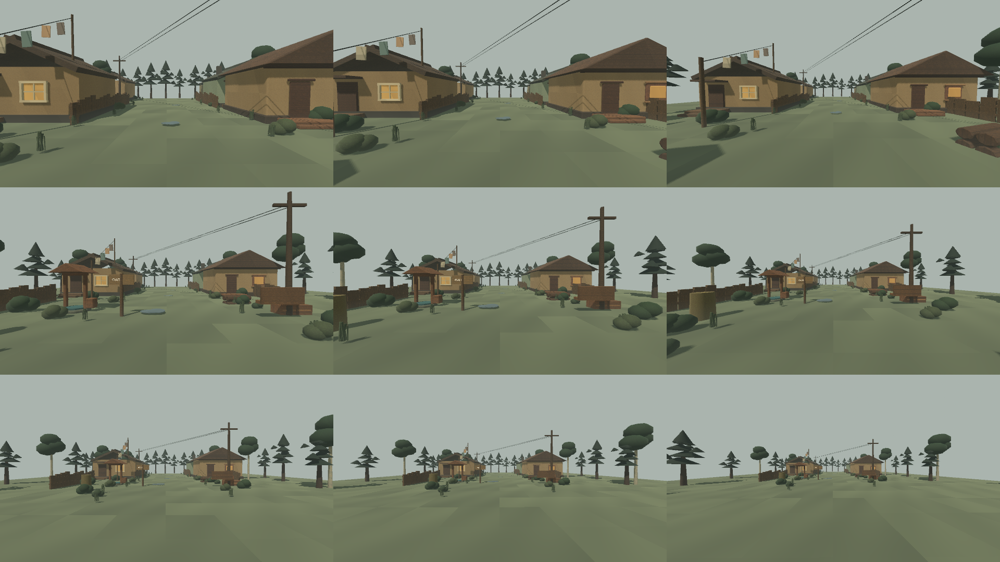
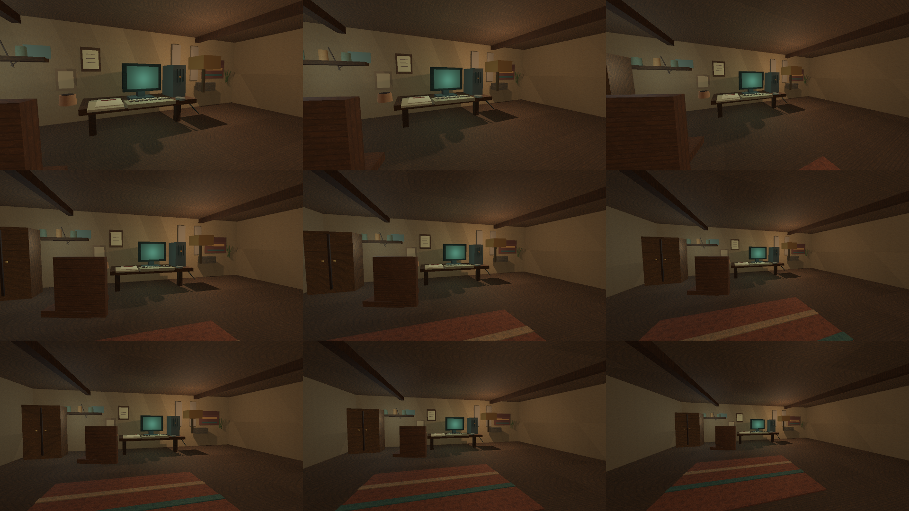
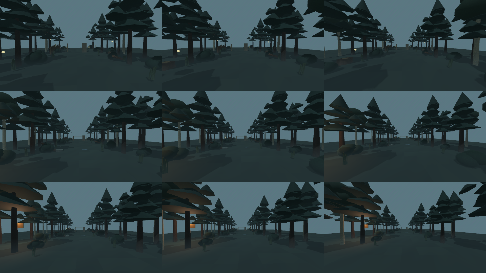

# Godot style camera-sweep evidence

Capture date: 2026-08-14 regression rerun after bounded puddle-origin correction  
Engine: Godot 4.7.1 .NET, Forward+, Metal 4.0, Apple M4 Pro  
Command: `./eng/capture-style-motion-sweep.sh`  
Status: **production evidence only; art lock remains OPEN**

This test-only pass renders each mandatory style benchmark at nine camera
states: three rows (`near`, `mid`, `far`) and three columns (FOV `65°`, `75°`,
`90°`). Each cell is a real 640 × 360 SubViewport readback; the contact sheets
are 1 920 × 1 080 RGBA PNGs. The capture is a spatial readability sweep, not a
temporal movement or head-bob test. The exact camera positions and targets are
recorded in `style_motion_sweep_manifest.json`.

## Contact sheets

| Scene | Preview | SHA-256 |
|---|---|---|
| Day street | `godot_day_street_motion_sweep_1080p.png` | `022647535c839bb568378b5b3015d8d01af63d7bc8576435680056399cb1ca0d` |
| House / old PC | `godot_house_old_pc_motion_sweep_1080p.png` | `2ed24bc38d3168a448cae6faca05c473fbcf6221b1e89835176b515b3ce5f411` |
| Kara-Urman edge | `godot_kara_urman_edge_motion_sweep_1080p.png` | `e1aa92cd5003eb9e548350c41500bcea656bde3560b047b370060c474fccdce5` |

The manifest itself is `3540e56242c6234d85433bf04e8cd1dfdc5ad00af435e2264b8718f0135dba57`.

The 2026-08-14 regression rerun completed after the bounded puddle-origin
correction and render-only collision-owner cleanup. It produced the same
manifest and clean Metal/Forward+ logs. The contact-sheet bytes changed because
the authored road geometry was refreshed, so the hashes above are the current
receipt. This is still baseline evidence, not a claim of texture activation or
art-lock acceptance.

## Reading the grid

- Columns, left to right: FOV `65°`, `75°`, `90°`.
- Rows, top to bottom: `near`, `mid`, `far`.
- The middle cell is the existing 75° style-frame composition. It is a
  comparison anchor, not a new runtime camera default.
- Day and Kara rows fail closed unless their scene reports the expected
  project-original imported module (`HouseA_project_original` and
  `PineA_project_original`).

## Evidence and review

- Build completed with zero warnings and zero errors.
- All 27 cells rendered through Metal Forward+; all three sheets are 1 920 ×
  1 080, non-interlaced RGBA PNGs.
- Capture logs contain no `SCRIPT ERROR`, Godot runtime error, ObjectDB leak,
  RID leak or resource-leak diagnostic.
- Day street now shows a continuous authored crown/rut relief and near/mid
  puddle silhouettes, but the road, houses, fences and trees still read as a
  provisional greybox family. The isolated wetness candidate now passes
  scene-owner contact (5/5 clusters, 15/15 patches within ±0.010 m) after
  bounded benchmark-origin corrections; its roughness/specular review and
  broad albedo response remain open.
- The house preserves the old PC as the focal object in the near and mid rows;
  the far row loses document/CRT detail. The lamp is still warmer/stronger than
  the style bible target, and the fabric/hero-PC geometry is not production
  quality.
- Kara-Urman keeps foreground/midground separation in the near and mid rows,
  while fog compresses the far row into blue-gray masses. Canopy tiers are
  readable, but the branch/crown family remains provisional and is not a final
  cultural or forest-art review.

## Gates still open

This sweep does **not** prove temporal motion comfort, head-bob comfort,
Windows/M1 performance, global v2 texture activation, production road/forest/PC
geometry, final fog/light calibration, cultural review, or art-lock acceptance.
The stone/fabric owner gate is closed only for the bounded presentation anchors;
all other items remain separate production gates. The baseline
`style_frames/README.md` remains the authoritative art-lock verdict.

## Superseding lighting/fog calibration receipt — 2026-08-14

The same 27-cell harness was rerun after the bounded `StyleBenchmarkZone`
ambient/fog/key-light calibration. It remains a presentation-only candidate;
runtime materials, shader, collision and narrative state are unchanged.

| Scene | Current contact sheet | SHA-256 |
|---|---|---|
| Day street | `godot_day_street_motion_sweep_1080p.png` | `022647535c839bb568378b5b3015d8d01af63d7bc8576435680056399cb1ca0d` |
| House / old PC | `godot_house_old_pc_motion_sweep_1080p.png` | `39d810d103d372c09404333212bb04668bd7ea6da191f036f07f13593a665767` |
| Kara-Urman edge | `godot_kara_urman_edge_motion_sweep_1080p.png` | `1276650c0bf6f2bdf9d266cbe0a62ff891727575f4c3c6cacf536579dd1f6af2` |

Manifest SHA-256: `3540e56242c6234d85433bf04e8cd1dfdc5ad00af435e2264b8718f0135dba57`.
All 27 cells are non-empty and leak-free on Metal/Forward+. The sweep still
does not close visual style acceptance, authored geometry, cultural review or
release-hardware gates.

## Semantic material-owner split rerun — 2026-08-14

After the imported wood/cloth owner calibration, the same 27-cell
near/mid/far × FOV 65°/75°/90° sweep completed on Metal/Forward+ without
errors, leaks or blank cells:

| Scene | Current contact sheet SHA-256 |
|---|---|
| Day street | `6b76871d171ac322c59fd5f6c90cd098c6cbad136ffd67e319e46fed2f528d71` |
| House / old PC | `db75b808ac74d9ca9ca268398253c36d177e06c1fef1d83131a11e1f2c82feb5` |
| Kara-Urman edge | `9fde939a23e1b81d9838813bb2b9a4727894817b777ebd2ac1abbd42823f13fb` |

Manifest SHA-256: `3540e56242c6234d85433bf04e8cd1dfdc5ad00af435e2264b8718f0135dba57`.
This is still traversal evidence, not acceptance of end-grain orientation,
20–30 m repetition, authored geometry or final art lock.

## PineA collision-isolation rerun — 2026-08-14

After the imported-physics ownership fix, the same 27-cell Metal/Forward+
capture was rerun. The adapter removes imported `CollisionObject3D` and
`CollisionShape3D` descendants before the kit enters the scene tree; the
original Pine keeps only its controlled layer-2 proxy and the two presentation
variants have no physics descendants. All 27 cells remained non-empty and the
manifest stayed byte-identical.

| Scene | Current contact sheet SHA-256 |
|---|---|
| Day street | `6b76871d171ac322c59fd5f6c90cd098c6cbad136ffd67e319e46fed2f528d71` |
| House / old PC | `db75b808ac74d9ca9ca268398253c36d177e06c1fef1d83131a11e1f2c82feb5` |
| Kara-Urman edge | `ee60b51327633c7dd627848cf49ce33412121f20f383d784b556c8489510a1b2` |

This closes only the imported layer-1 collider regression. It does not accept
the repeated PineA family, greybox geometry, fog/light balance, motion comfort,
release-hardware performance or the visual art lock.
