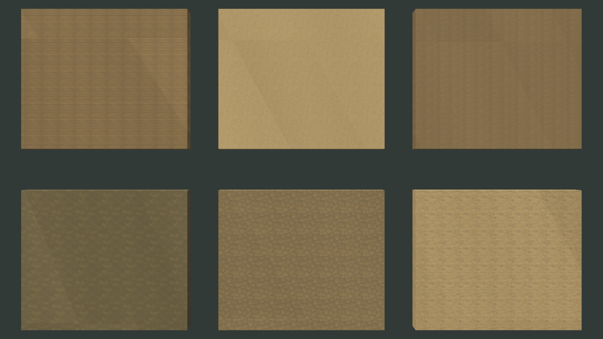
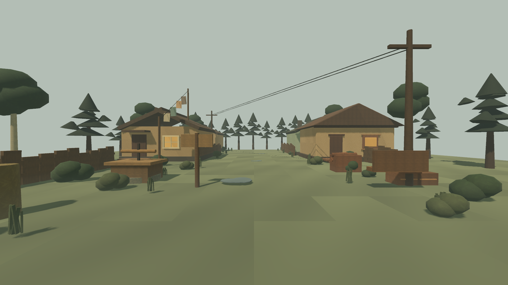
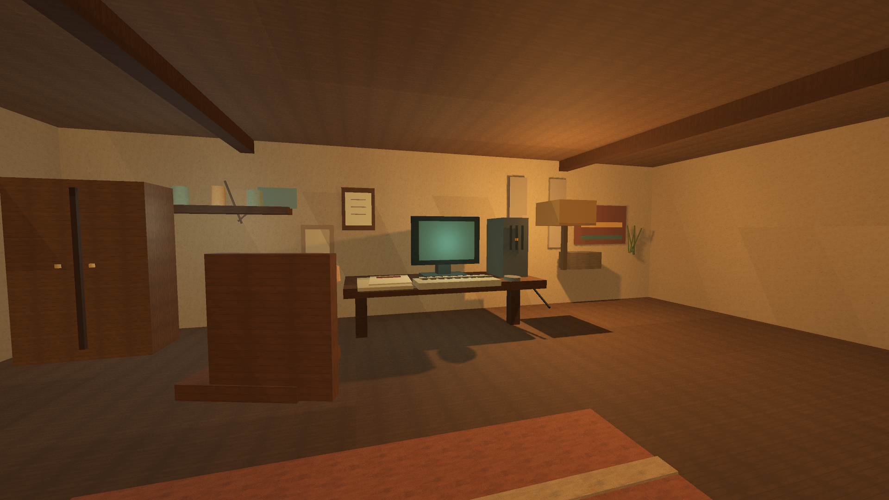
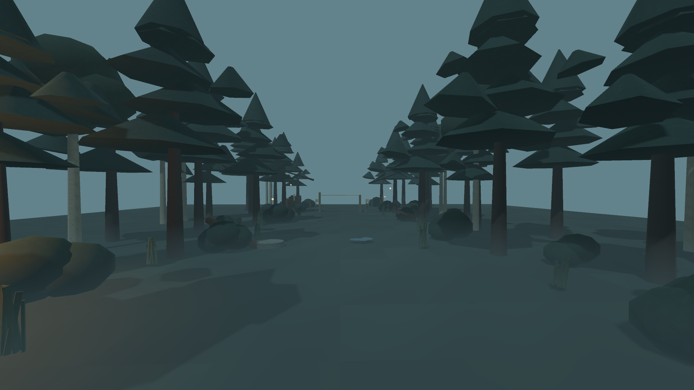

# Painterly texture candidate v3 captures

Status: production-candidate evidence only; art lock remains open.

The captures below were rendered by `eng/capture-texture-v3-frames.sh` on
Godot 4.7.1 Mono, Metal / Forward+, at 1 920 × 1 080. The helper loads each
mandatory benchmark scene into a temporary `SubViewport`, clones only
presentation `ShaderMaterial`s, and substitutes all six versioned candidates:
wood, plaster, damp earth, pine foliage, mossy stone and old fabric. Neither
the still helper nor the motion-sweep harness enters the game bootstrap,
dispatches interactions, changes production collisions, or activates a
candidate texture at runtime.

| Capture | SHA-256 | Result |
|---|---|---|
| `godot_day_street_texture_candidates_1080p.png` | `4dc4419daf0c8ee2bf8cbab0e850c93b0d626358765d5b82b7a8ce0a48b42f55` | PASS — 670 presentation replacements |
| `godot_house_old_pc_texture_candidates_1080p.png` | `cbe6bb374dad99702b8aefba1ba85cdb93635ead94b100514b114d43fbc084ec` | PASS — 29 presentation replacements |
| `godot_kara_urman_edge_texture_candidates_1080p.png` | `f0b982b83c5f74d76136054b24b564388ad49ee1a8e16e78dabfd1ae7f91d7fa` | PASS — 522 presentation replacements |
| `godot_material_swatches_texture_candidates_1080p.png` | `40028e8161db2e24ce4230e234a939a4844ffa4c88c13de20a1375c95ef3c697` | PASS — all six swatches rendered |

Scene coverage across the mandatory set is weathered wood 246, aged plaster 15,
damp earth 4, pine foliage 956, mossy stone 4 and old fabric 3 meshes. The
numeric image gate and the six-file still capture pass; the v3 spatial sweep
also substitutes all six. Near/mid/far traversal, 20–30 m repetition, geometry
relief, lighting/fog calibration and cultural review remain open.

