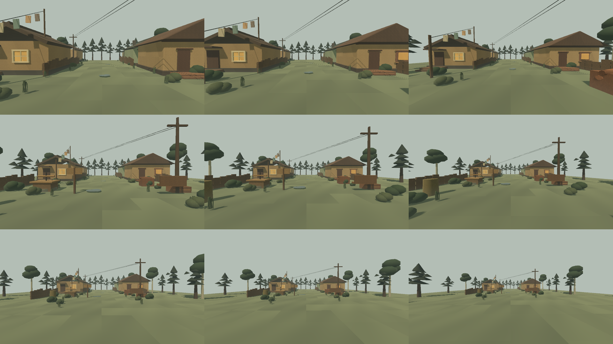
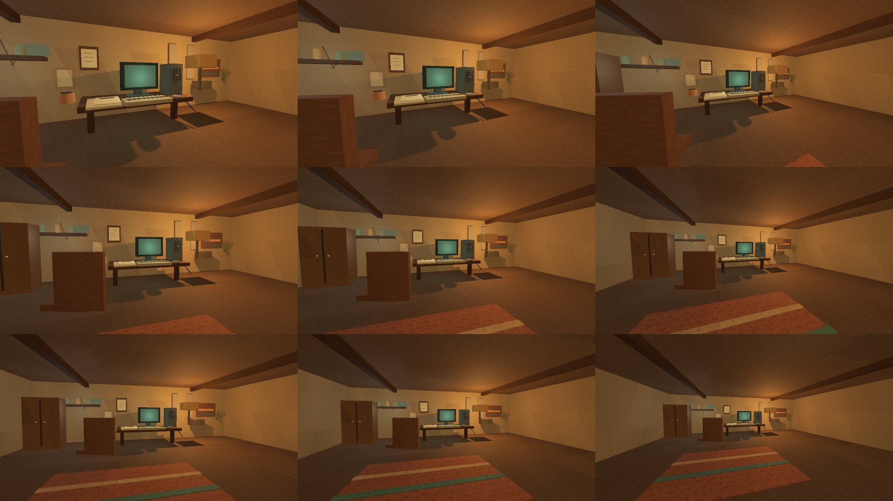
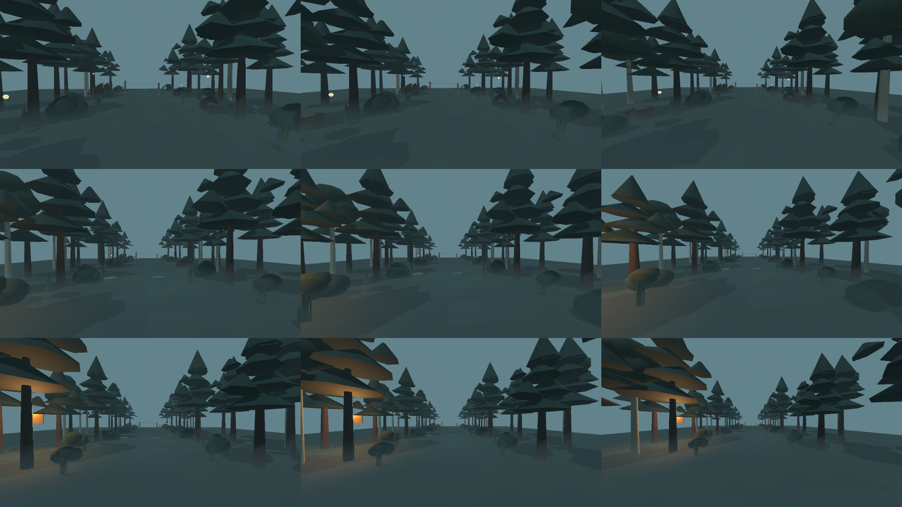

# Painterly texture candidate v5 — Godot motion sweep

Status: **technical PASS / production-art OPEN**. This is a test-only
presentation capture; it does not activate the v5 textures in the runtime and
does not change shaders, saves, narrative state, collisions or material
registry owners.

## Receipt

Command:

```sh
./eng/capture-texture-v5-motion-sweep.sh
```

Godot 4.7.1 .NET ran on a real Metal/Forward+ driver. The sweep renders the
three mandatory scenes at 27 cells each: near/mid/far camera distances × FOV
65°/75°/90°. Each sheet is 1 920 × 1 080 and contains 640 × 360 cells.

| Scene | Replacement count | Sheet SHA-256 |
| --- | ---: | --- |
| Day street | 1 512 | `b9c7587602da28d8a62563c99c4e36deeef434725de870745fb52052ae69c2ae` |
| House / old PC | 135 | `f891abeac5ded356014390bdd14ec452735a45b2348dd5e1f23c1c84bef73a5a` |
| Kara-Urman edge | 603 | `ea56366bcc7ff2bb3013e2ecb9bf66b4d3c72f7eb89802429edc1543dff92f5f` |

Manifest SHA-256: `003c0be712333fa0aaee5b1a596b119768a09cd0e2cd83b8b3376d014fea4053`.

The capture log has no Godot, ObjectDB, RID or resource-leak diagnostics. The
PNG sheets are spatial evidence only: this run does not measure temporal
head-bob comfort, Windows/M1 performance, or final material acceptance.

## Preview sheets







## Open production gates

- Earth must be compared against authored road relief with wetness disabled and
  enabled; the v5 broad marks may duplicate mesh ruts or puddle patches.
- Wood needs neutral daylight and warm-house crops on facade, fence, furniture
  and end-grain; the shared runtime owner can still expose bands, repetition or
  incorrect triplanar orientation.
- Near/mid/far temporal review, 20–30 m repetition, geometry/canopy/hero-prop
  replacement, lighting/fog calibration, cultural review and M1/Windows
  hardware checks remain open.

Until these gates pass, v5 files remain production candidates only and this
receipt must not be interpreted as an art-lock or runtime-activation decision.
