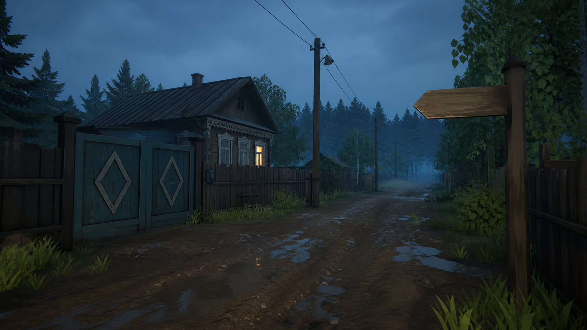
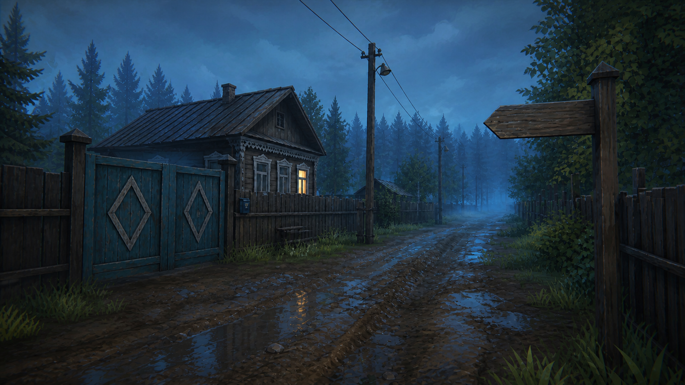

# Design Style

## Прямое уточнение автора — 2026-10-02

Нынешний визуальный стиль не принят и может быть существенно пересмотрен. Лес должен
вызывать ужас, панику и выраженный дискомфорт уже от одного взгляда, в том числе днём
и из деревни. Угроза исходит от самого облика леса до любого монстра, скримера или
сюжетного события; одной красивой загадочности недостаточно. Кара-Урман остаётся
обжитой и уютной, ближайший путь — читаемым. Это художественная цель, ещё не принятый
результат. Разбор референсов и предлагаемое направление —
[художественные находки](../production/URMAN_VISUAL_REFERENCES_FINDINGS_RU.md);
действующий контракт — ТЗ05 A01.1.

## Уточнение по авторскому плейтесту — 2026-09-28

Текущий контракт — [ТЗ05](../tasktracker/review_2026-09-28/05_art_characters_assets.md) и
[ТЗ06](../tasktracker/review_2026-09-28/06_ui_audio_mechanics_performance.md). Художественный lock ещё не выполнен.
Последний выбор автора: не заказывать красивые ImageGen-концепты, которые нельзя воспроизвести. Производить только посильные
3D-модели, настоящие UV, материалы, свет и фактуры для конкретных потребителей. ImageGen не запрещён для реальных текстур.
Сначала одна игровая единица с обычной ходьбой, поворотом камеры, High/Low и бюджетом кадра; после отзыва автора — следующая
единица и поэтапное тиражирование. Один still, render или prompt не принимает стиль. «12+» — цель впечатления автора, не
формальный балл, сертификат или замена игрового просмотра.
Persona ниже — история, не обязательный UI: сравнить простой жёлто-чёрный вариант с альтернативами, автор выбирает.
Нормальная походка/idle всего каста; uncanny допускается намеренно по редкой сцене, а не как дефект всех людей.
**Позднее дополнение автора 28.09:** многочисленные глазоподобные детали объектов создают
ощущение «за мной наблюдают»; окружающий высокий густой лес значительно более жуткий,
с угрожающими силуэтами, тёмной многослойной глубиной и неоднозначными «взглядами».
Это парейдолия формы/материала, не буквальные глазные яблоки, одинаковые наклейки или новый
монстр на каждом дереве. Контракт и приёмка — ТЗ05 A01.1, ACT1-ART-DIRECTION/ACT1-ATMOSPHERE.

Обычная Кара-Урман — уютная, приятная и населённая деревня. Острые страшные события редки; фоновый мотив наблюдения и зловещий лес постоянны. Уход и локальный
износ вместо тотальной грязи, стерильного новостроя или непрерывного страха.
Советское наследие смешано с современным бытом при канонической зиме 2026. Положительные ассетные образцы не сносить.
Татарская конкретность читается в быте, языке, постройках и людях сдержанно, без сказочной декоративности.
Фактура — семантическая библиотека+UV+локальные маски; ImageGen производит нужный материал, не процентный KPI.
Записная книжка — простая физическая рукописная вещь, без умного графа. Переносимые вещи имеют видимый хват, не висят в воздухе.
Сценарный шторм после приезда, короткий путь/обрушение моста и утренняя новость — ограниченная сцена и зависимость от
нарративного/мирового владельца, а не требование полной погодной системы.

## Status

Accepted direction, 2026-08-10: **Painterly Low-Poly 3D — полноценный ходибельный 3D-мир с камерой от первого лица**.

Исторически стиль объединял производственную геометрию stylized low-poly с живописными материалами, светом и туманом.
Действующий тест проверяет воспроизводимую **реальную игровую единицу** в движении и её бюджет; референс не обязывает
исполнителя к эффектам или детализации, которых он не может изготовить.

Цель — не примитивная PS1-графика и не фотореализм. Нужен воспроизводимый для маленькой команды 3D-язык: выразительные силуэты, умеренная геометрия, ручная фактура, сдержанная палитра, красивый свет и немного более детальные сюжетные объекты.

Принятое в 2026-05-16 направление ink-wash storybook больше не задаёт плоский формат локаций. Его линия, акварель и бумага
остаются историческими референсами; переносить их в конкретный материал/UI только если это работает в обычном 3D-проходе.

Reference pitch board:

Вариант A на борде остаётся референсом палитры и атмосферы, но не референсом способа рендеринга или детализации 3D-сцены.

Accepted 3D concept targets:

Это исторические concept targets, а не обязательные выходные файлы или критерий art lock. Оценивать форму, материал и свет
только на посильном игровом меше в Godot при повороте камеры и перемещении.

## Уточнение приёмки — 2026-09-11

По прямому указанию пользователя красивый стиль BOTW/TOTK — обязательный
ориентир композиции, силуэтов, живописных материалов, света и цветовых масс.
Это исторический ориентир качества обычных игровых кадров при сохранении зимнего Кара-Урмана
и татарского характера мира. Правильный импорт и дополнительные эффекты
не заменяют художественную приёмку. Уточнение 2026-09-28 выше снимает обещание повторить чужой уровень детализации:
принимается только изготовленный и работающий здесь игровой результат.

## Core Formula

**Обычность сначала, неправильность потом.**

Игрок должен хотеть побыть в обычной, ухоженной и обжитой татарской деревне: старый, но поддерживаемый дом, спокойные люди,
бумажные документы, старый ПК, лес у края кадра. В отдельных сюжетных эпизодах тревога может появиться через малый сбой:

- ветки складываются в почти-человеческий силуэт;
- окно светится чуть не в том месте;
- портрет кажется обычным, но взгляд трудно удержать;
- тень от предмета не совпадает с источником света;
- лес слишком неподвижен;
- документ выглядит бытовым, но его формулировки ведут к старому правилу.

Эти примеры — выборочные приёмы, не список эффектов для каждого дома или обязательный уровень тревоги. Если бытовой ассет
выглядит страшным уже с первого взгляда, он, скорее всего, не соответствует обычной сцене.

## Visual Language

### Line

- Неровная тушевая линия — исторический референс для бумаги и отдельных UI-деталей, если они реально произведены.
- В 3D важны читаемый силуэт, естественный стык мешей и материал; не рисовать контур ради замены геометрии.
- Важные интерактивные предметы читаются формой и ситуацией; переносимые вещи имеют видимый хват рукой.
- Лица и руки должны быть узнаваемы при обычной камере, без обещания иллюстративной детализации.
- Запрещено: гладкий гиперреализм, 3D-рендерная полировка, комиксная супергеройская анатомия.

### Color

Палитра приглушённая, как старая бумага и влажная деревня:

- бумага: тёплый серый, охра, выцветший кремовый;
- дерево: серо-коричневый, старый лак, тёмная доска;
- природа: болотный зелёный, хвойный тёмный, сухая трава;
- вечер / лес: холодный сине-зелёный, чёрно-зелёный;
- тепло дома: слабый янтарный свет, не яркий оранжевый;
- UI старого ПК: выцветший серо-бирюзовый / Win98-like, но без кислотной пародии.

Избегать доминирующих фиолетовых градиентов, неона, хоррор-красного, «готического» синего, чистого чёрно-белого noir, если это не отдельная сцена высокого давления.

### Texture

- Бумажная зернистость и акварельные пятна — базовая фактура.
- Дерево, ткань, металл и грязь должны быть узнаваемы через 2–3 характерные детали, а не через фотореалистичный шум.
- Документы выглядят как сканы / копии / тетради, но текст должен рендериться отдельно в UI, чтобы оставаться читаемым.

## Asset Concepts

### Character Presentation

В действующем runtime тело и ноги Айдара уже видны при взгляде вниз. Их форма, материал и движение входят в игровой
результат наравне с NPC; невидимого главного героя этот исторический тезис больше не предписывает.

MVP direction:

- 3D-модели только для персонажей, физически присутствующих в vertical slice;
- выразительный силуэт и лицо важнее сложной одежды и большого числа костей;
- естественные idle / walk / talk / turn, достаточные для реально видимого поведения, без зомби-качания;
- 2D-портреты можно сохранить для диалогов, если тест подтвердит, что они не ломают присутствие от первого лица;
- узнаваемость через силуэт, одежду, осанку и один цветовой акцент.

Айдар: обычный городской парень, худи / куртка / простые брюки, без «геройского» силуэта.  
Мансур бабай: сжатая, тяжёлая осанка; тюбетейка допустима, но не как карнавальный маркер.  
Гөлсинә: домашняя собранность, мягкость без «сказочной бабушки».  
Алсу: современная местная девушка, практичная одежда, не «мистическая незнакомка».

### Portraits

Портреты важнее спрайтов. Они несут эмоции, недоговорённость и культурную конкретность.

MVP direction:

- bust portraits, тушь + wash;
- 6–8 основных портретов;
- для ключевых NPC: neutral / tension / partial reveal;
- uncanny допустим только как редкий мотивированный эпизод, а не качество всего каста;
- глаза, морщины, усталость, пауза важнее «страшного лица».

Не делать NPC уродливыми или одержимыми. В обычных сценах жители должны быть живыми, приятными и узнаваемыми людьми;
молчание может стать тревожным лишь там, где его подготовил сюжет.

### Walkable 3D Locations

Локации — основной дорогой ассет MVP, поэтому каждая должна собираться из повторяемого модульного набора и поддерживать реальное перемещение.

MVP format:

- ходибельные 3D-места с понятными границами и камерой от первого лица; масштаб действующего Акта I задан планом деревни;
- модульные дома, заборы, дороги, растительность и бытовые props;
- обычный жилой свет/ambience и редкие мотивированные изменения для конкретных сцен;
- интерактивные предметы читаются силуэтом, композицией, светом или локальным цветом, а не светящейся обводкой по умолчанию;
- ветер, занавеска, свет в окне, дым, пыль, лес и CRT оживляют сцену выборочно.

Приоритетные style frames:

- дом бабая и әби: тепло и обжитость; тревожный акцент лишь в подготовленном эпизоде;
- старый ПК: бытовой интерфейс, который постепенно становится архивом системы;
- главная улица: приятная жилая среда, дела и встречи людей;
- кладбище: тихо, сухо, без дешёвого кладбищенского хоррора;
- кромка Кара-Урмана: конкретная граница, где может появиться редкая тревога.

### Historical Village Route Screens — Superseded

Решение 2026-05-16 о нарисованных route segments заменено ходибельным 3D от первого лица 2026-08-10.

Старые route screens можно использовать как раскадровки композиции, ориентиров, света и давления. Они не задают финальное перемещение, камеру или формат ассетов.

Detailed draw list: `village_route_art_spec.md`.

Visual requirements:

- walking-height view of a muddy village road, fences, old houses, utility poles, distant mosque silhouette or forest edge;
- one clear forward direction and, where relevant, one or two 90-degree turns;
- diegetic signs and landmarks instead of floating quest markers;
- subtle ink UI affordances only where the world itself is not enough;
- incomplete route sketch in the journal as support, not as the primary world view.

Повороты и ходьба теперь происходят в реальной 3D-сцене. Ink-smear и бумажное затемнение допустимы только как редкая сюжетная постобработка, а не как маскировка перехода между плоскими кадрами.

Route screen creepiness:

- Level 0–1: обычная улица, но слишком тихая;
- Level 2: окна и заборы создают ощущение наблюдения, без лиц и монстров;
- Level 3: кромка Кара-Урмана, ветки почти складываются в силуэт, но существо не показано.

### Documents And UI Assets

Документальные ассеты должны выглядеть так, будто их делали обычные люди, а не художник horror UI.

- медсправки, карты, тетради, старые распечатки, фото и «Татарвики» держат расследование;
- визуальная стилизация не должна мешать чтению;
- реальные татарские буквы должны поддерживаться: ә, ө, ү, җ, ң, һ;
- документ может быть красивым как объект, но его смысл должен жить в data-driven тексте.

Old PC UI:

- CRT / Win98-like оболочка допустима, но не как мем;
- серый пластик, выцветшая бирюза, маленькие системные окна;
- glitch / scanline эффекты только дозировано и без потери читаемости;
- папки, метаданные и поиск должны выглядеть бытово, почти скучно, пока игрок не понимает системность.

### Mythological Presence

Существа не рисуются как «монстры для боя» в MVP.

Их признаки:

- силуэт между стволами;
- тень, которая появляется раньше тела;
- ветка / корень, похожие на руку;
- лицо, которое невозможно точно вспомнить;
- вода или лес ведут себя не как фон, а как наблюдатель.

Шурале в MVP лучше не показывать полностью. Если нужен образ для внутреннего арт-пула, он должен быть ближе к лесному народу / старой силе места, чем к демону с рогами.

## Winter — Act I season lock (2026-09-10, user decision)

Акт I — зима. Это не «зимняя открытка» и не белый шум: снег работает как
материал со своей ценой и цветом, а не как заливка.

### Палитра и свет

- Снег: не чистый белый. Albedo ~0.78–0.86 с холодным голубым подтоном в
  тени; на солнце — тёплый тёпло-белый (`f4f1ea`), в тени — синеватый
  (`b9c8d6`-семейство). Пересвет в чистый белый запрещён: белое — самое
  светлое, но с деталью.
- Тени: длинные, низкое солнце (−28…−34°), тень холодная и голубая; снег
  под тенью не «серый», а сине-фиолетовый.
- Свет: холодный низкий ключ + яркая холодная заливка от снежного
  отражения (снег подсвечивает низ домов и потолки сеней).
- Небо: бледное морозное, низкий диск солнца, мягкая облачность, слабый
  галообразный ореол; никакой «полярной» синевы.
- Туман: морозная дымка, холодный серо-голубой, ниже к земле; дальние
  дома и лес растворяются в холод, а не в серость.

### Зимние формы

- Лиственные деревья — голые ветви со снегом на ветках; берёзы — самый
  светлый вертикальный элемент улицы.
- Хвойные — только у Кара-Урмана и узкой полосой на переходе к лесу;
  ветви под снегом, тёмный силуэт на фоне снега (единственное место, где
  тёмная зелень — норма).
- Снег лежит на всех верхних поверхностях: крыши, коньки, наличники,
  заборы, поленницы, колодец, столбы. Никаких «летних» верхних плоскостей.

### Снег под ногами

- Снег пушистый: игрок продавливает его. Следы и раскатанная тропа
  темнее и ниже фонового снега, блеск в следе пропадает.
- Снег не должен выглядеть пластиком: шероховатость высокая, блик
  слабый и узкий (морозный), без крупного глянца.
- Уточнение автора 2026-10-03: постоянная ветреная метель и сокращённая видимость на всей улице.
  На улице некомфортно; тёмный лес давит сквозь снежную завесу, ближайший путь читается.
  Дом — тёплое тихое убежище. Это представление погоды без новой механики холода или выживания.
  Первая сюжетная ночь усиливает уже действующую непогоду; сцена обрушения и утренняя новость сохраняются.
  Прежнее ограничение «шторм только в сюжетной сцене» отменено этим поручением.

### Do Not (зима)

- Никакого пересвета в чистый белый и потери теней/SSAO под снегом.
- Никаких «дешёвых» эффектов: искрящихся частиц по всему экрану,
  ледяных бликов-радуг, зимней вигнетки, снежинок поверх UI.
- Не убирать ценовую структуру: снег светлый, дома/деревья/проёмы —
  средние и тёмные; кадр не должен превращаться в белое поле.
- Не возвращать хвойные в деревенские зоны (см. decision_log 2026-09-10).

## Creepiness Scale

Использовать шкалу, чтобы ассеты не становились одинаково страшными:

| Level | Use | Visual rule |
|---|---|---|
| 0 | Дом, быт, первые разговоры | обычная деревня, мягкая бумажная фактура |
| 1 | Лёгкая тревога | чуть неверный свет, пауза, пустое пространство |
| 2 | Расследование давит | глубокие тени, взгляды, документы с опасными формулировками |
| 3 | Граница леса / опасный ключ | лес почти складывается в фигуру, звук и силуэт важнее деталей |
| 4 | Post-MVP сильное проявление | использовать редко; не для обычных сцен |

Обычная деревня находится на уровне 0; уровни 1–3 используют лишь в отдельных сюжетных местах. Таблица — словарь
режиссуры, не распределение процентов или обязательный набор эффектов для каждой локации.

## Production Rules

- Ассет сначала имеет реального игрового потребителя, форму, размер, UV, материал и доступный производственный путь;
  текстовый prompt нужен только для конкретной генерируемой фактуры.
- Для серийных ассетов сначала сделать один работающий 3D-образец и пройти его в движке; затем тиражировать.
- Не смешивать стили в одном типе ассетов: портреты, локации, документы и UI должны выглядеть как части одной книги / архива.
- Полезная детализация важнее общей сложности: 3 точные бытовые детали сильнее, чем 30 случайных узоров.
- Татарский культурный код держится через место, предметы, речь, быт и формы отношений, а не через навешивание орнамента на всё подряд.

### 3D production budgets, уточнение 2026-09-28

- Исторические числа для environment modules (500–5 000 треугольников), hero props (5 000–20 000), NPC (25 000–40 000)
  и текстур (512–2 048 px) — стартовые ориентиры, а не требование изготовить геометрию такой сложности. Размер/LOD выбирать
  по читаемости реального объекта и профилю целевого кадра.
- Albedo и roughness несут основную рисованную фактуру; normal maps используются выборочно, а не имитируют фотореалистичную микродеталь.
- Свет строится доступными действующему проекту средствами; дополнительный shadow caster, probes или туман только после
  проверки пользы и бюджета в обычном проходе.
- Post-processing: мягкий color grade и едва заметное зерно. Постоянные VHS, pixelation, тяжёлый outline, chromatic aberration и aggressive motion blur запрещены.
- Первая единица принимается в обычном Godot-проходе с поворотом камеры, High/Low и измеренным frame time. Статичный кадр,
  ImageGen-концепт и Blender-рендер не заменяют результат. Дальше — поэтапный rollout проверенного приёма.

## Do Not

- Не делать гиперреалистичные портреты и локации.
- Не делать всё «криповым» с первого кадра.
- Не превращать татарский фольклор в generic monster bestiary.
- Не использовать кровь, skull props, glowing eyes, Halloween-эстетику и скримерную композицию как базовый язык.
- Не делать исламскую рамку визуально враждебной или «проклятой».
- Не перегружать ассеты национальным орнаментом там, где достаточно бытовой конкретики.

## Historical MVP Asset Floor In This Style (superseded by Act I scope)

Это архивный объём вертикального среза, не текущий лимит готового Акта I и не команда массово производить ассеты:

- 6–8 портретов: Айдар, Мансур, Гөлсинә, Алсу, Тимур хәзрәт, Ринат, Наиля или Разиля, след Марата.
- 3–4 компактных ходибельных 3D-зоны для vertical slice: дом / двор, участок главной улицы, кладбище или медпункт, кромка Кара-Урмана.
- 1 модульный village environment kit: стены домов, крыши, заборы, калитки, дорога, столбы, знаки, растительность и повторяемые бытовые props.
- 10–15 документальных ассетов / templates: справка, могильная запись, дневник, чат, архивная карточка, «Татарвики».
- UI: journal, clue key picker, vocabulary card, document viewer, old PC shell.
- Audio-linked visual states: normal / pressure overlays для 2–3 ключевых локаций.

## Next Art Tests — current feasible route

1. Взять один существующий игровой участок — двор и дом бабая с подходом; назвать конкретные меши, материалы и владельцев.
2. Сделать только те изменения 3D/UV/фактуры/света, которые исполнитель может собрать и воспроизвести; ImageGen — только для
   нужной карты реального материала с проверенными правами.
3. Пройти участок обычным управлением в обе стороны, повернуть камеру к дому, вещам и человеку, проверить хват переносимой
   вещи, геометрию, High/Low и frame time. Использовать защищённый запуск на свежей сборке.
4. Показать автору игровой результат, записать конкретный вердикт. Только после этого переносить приём на следующий участок;
   общая художественная готовность и оценка «12+» не выводятся из одного пилота.

### Current in-engine gate — 2026-08-10

Первый воспроизводимый набор 1 920 × 1 080 снят из Godot/Forward+/Metal и хранится в `art/style_frames/`. Кадры подтверждают рабочий capture pipeline и интеграцию painterly albedo, но **отклонены как финальный art lock**. Причины и следующие исправления перечислены в `art/style_frames/README.md`. До устранения пустоты улицы, слабой бытовой детализации дома, конусных крон леса и отсутствующей frame-time проверки статус остаётся `art-lock-pending`.

### 2026-09-11 — направленный зимний свет

Дневной профиль существующего `TuneConnectedAct1Atmosphere`: слабее нейтральная заливка, холоднее bounce, теплее низкое солнце, более читаемые длинные тени и меньше облачной вуали. Не добавлены постфильтр, glow или новый lighting owner. Реальные Metal кадры `exterior_light_candidate` показывают лучший объём снега/фасадов и сохраняют детали светлых поверхностей; лица остаются читаемыми. Это промежуточная художественная правка: одинаковость домов, грубые формы NPC и общая BOTW/TOTK-inspired красота ещё не приняты. Профили зирата и ночи не менялись.

### 2026-09-11 — второй проход силуэтов NPC

В существующем Blender generator уточнены талия, плечи, расстояние между ногами, подбородок/борода, головные уборы и мелкие черты лица; Hat и Boot больше не получают общий цвет. Источники и GLB пересобраны, registry hashes обновлены. Character verifier: 9 prefixes, 313+313 LOD meshes, Idle/Tension, no physics; affected game build и четыре Metal 1080p кадра `character_round2_frames` проходят. Художественная приёмка остаётся открытой: в крупных планах всё ещё видны сегментированные кукольные лица и одежда. Одного увеличения числа граней недостаточно; следующий проход должен исправить форму и shading, а не объявить текущую модель финальной.

### 2026-09-11 — форма лица и зимней одежды

Устранена причина прямоугольных глаз: вертикальные prism показывали камере боковую грань; существующий generator теперь строит мелкие черты лица как неглубокие округлые объёмы. Радужка привязана к поверхности собственного белка, а не независимо к асимметричной щеке. Сглажены нормали изогнутых частей персонажей, куртка закрывает бёдра, уменьшены массивные наплечники/манжеты; на живых NPC больше нет слоя снега для мебели. Существующий material/rig/LOD owner сохранён. 9 персонажей, 313+313 mesh objects; фактические LOD0 2612–2828 triangles на персонажа, registry budget 3000. Четыре Metal 1080p кадра `character_round3b_frames` показывают обе радужки, округлённые лица и цельную одежду; финальная регенерация после них меняет только metadata/comment. Narrow build, Blender character verifier, registry проходят. Это улучшение модели, но выразительные лица, индивидуальность костюмов и общий art lock остаются OPEN.

2026-09-11: дорожная скамья перед зиратом получила отдельные доски, светлую ремонтную вставку и крепёж; снег смахивается действием. Расположение проверено двумя Metal 1080p кадрами, после исправления остаточной белой полоски — отдельным `rest_bench_final_frames` кадром. Польза — бытовое наблюдение и точка отдыха вне могил; это не art lock всей локации.

2026-09-11: наружные находки проверяются непосредственно в Metal до и после действия. Устранены крупные зарубки со снегом, закрывающий надпись столб указателя, погружённые в грунт санки и ящик внутри фасада. Ящик двигается от дверного проёма; варежки используют округлые native meshes. Синий ремонт санок остаётся видимым после снятия снега. Evidence: `arrival_fixed_frames`, `yard_fixed_frames`, `yard_final_frames` во внешнем каталоге Finish_20260911. Презентация ФАП-петли ещё требует исправления столба; общий художественный уровень BOTW/TOTK-inspired OPEN.

2026-09-11: ближние детали новых находок проверены actual Metal 1080p. Чашка ФАПа — полый native CylinderMesh с ободком/ручкой TorusMesh; варежки округлые, салфетка помещается под чашкой. Рисунок на стекле находится в одной створке, не поверх импоста. Ставня, полка и обмотка имеют разные видимые состояния. Это локальная предметная доводка; общая выразительность зимнего света, фасадов и персонажей всё ещё требует художественной приёмки BOTW/TOTK-ориентира.

2026-09-11: уточнены холодный свет неба/тёплый солнечный свет и оттенки
четырёх видимых фасадов; проверены actual Metal 1080p `yard_daylight_frames`.
Character round5b различает ширину плеч, длину одежды и детали лица;
конус причёски Алсу заменён округлой существующей формой после просмотра
неудачного первого варианта. Blender export/verifier, Godot import и
четыре игровых ракурса round5 + два исправленных round5b проверены.
Модели всё ещё выглядят слишком схематично: выразительность лиц и цельный
BOTW/TOTK-inspired art lock не приняты. Нативный лесной обход показал
грубые камни и палки, исправление этих конкретных форм продолжается.

### 2026-09-12 — дальняя дымка леса и акценты въезда

В текущем владельце атмосферы Кара-Урмана светлый холодный fog (`90a8b8`, aerial perspective 0.35) отделяет дальние деревья; влияние на небо снижено до 0.08, чтобы сохранить тёмное вечернее небо. Выбран V3 после native-сравнения с исходником и двумя промежуточными вариантами. Просмотрены глубина подхода, тёплое окно и ракурс ветвей. Плотность тумана, освещение, геометрия и остальные зоны не менялись.

Два существующих фасада на въезде получили приглушённые сине-зелёные наличники и доски фронтона через действующую таблицу parcelTints; штукатурка и тёплые окна сохранены. Три native-ракурса въезда просмотрены. Evidence: `URMAN_ActI_Finish_20260911/kara_atmosphere_v3_frames` и `arrival_cool_trim_v1_frames`. C# build — 0 ошибок/предупреждений. Source-window Metal M4 Pro, 1080p Medium .90/MSAA2, 12s+60s: 144.93 FPS, p95 7.697 ms, p99 8.973 ms, max 11.455 ms — PASS; прогрев max 207.954 ms отдельно. Это неподвижный замер исходника, не новый packaged pass и не доказательство отсутствия редких зависаний. Общая красота, повторяемость форм деревьев/домов и интерес исследования остаются открытыми.

### 2026-09-12 — чередование хвойных планов

Пять существующих деревьев у Кара-Урмана используют уже принятый WinterPine: SlopeStand3/7, WatershedStand2/3 и MixedMassWestMid. Сохраняются положение, высота, дорожный фильтр и общий foliage LOD/material owner. Четыре native-кадра `kara_five_pines_v1_frames` просмотрены основным агентом и Luna: различие ближних и средних силуэтов улучшилось, проход и тёплое окно открыты. Повторяющиеся ярусы и грубые стволы остальных деревьев всё ещё заметны; это локальный art-проход, общая художественная приёмка остаётся открытой. Замер текущего пакета после изменения ещё нужен.

### 2026-09-12 — силуэты одежды, фасад и тонкие облака

Пальто Алсу и Рината удлинены примерно на 7 см в существующем генераторе, без изменения ног и роста. Восточный фасад на въезде использует готовый вариант штукатурного дома с пристройкой; прежний якорь и размер сохранены. Native-ракурсы `coat_gesture_trial/frames` просмотрены: одежда лучше закрывает бёдра, соседние дома различаются силуэтами. Это локальные улучшения; уровень персонажей и архитектуры целиком не принят.

Существующий SkyCover получил более частый рисунок по широте и вертикали, дневная непрозрачность усилена с .30 до .68. После отклонённого варианта с вертикальными полосами выбран V2 с тонкими вытянутыми облаками; просмотрены въезд и Кара-Урман из `day_cloud_trial/v2_frames`. Новых фильтров и постэффектов нет. Финальный замер пакета после этой правки ещё нужен.

Исправлен существующий CoreWorldCapture: наружные камеры с прежней условной высотой .05 теперь явно опираются на CollisionGround. Уже заданные абсолютные высоты, интерьерные и генерируемые reference-позы сохранены; общего повторного смещения нет. Старые фиксированные наружные кадры могли снимать выше реального взгляда игрока; они остаются историческим evidence, но не доказывают вид с физической высоты.

### 2026-09-12 — окончание дороги у леса

Серый прямоугольник перед игроком в финале оказался торцом Road_KaraPath. Два ранних probe не доказывали владельца: один снимал с другой высоты, другой смешивал размер render texture и логические координаты камеры. Matched probe воспроизвёл дефект с физического положения игрока и показал сначала дорожный mesh на 2.279 м, затем Terrain_Main на 2.315 м.

Последние 3 м существующей ленты дороги плавно сужаются до 5% ширины, а её выпуклый профиль снижается до 18% высоты; collision heightfield и ось маршрута не менялись. Native A/B `kara_final_scope_probe_matched/frames/kara_warm_window.png` → `kara_road_end_trial/frames/kara_warm_window.png` просмотрен: широкая прямая кромка заменена узким окончанием тропы. Число mesh-узлов и треугольников kit не изменилось. Это ограниченное исправление дорожной геометрии; повторяемость лесных крон и общий art-lock остаются открытыми.

Текущий native R9v3 сценарный ролик прошёл 403,43 м, домашнюю сцену, три сравнения JournalUi, финальные captions, карточку и меню (7 966 кадров / 30 FPS записи). Это запись с фиксированным шагом, не FPS производительности. Отдельный source-run `motion_timing_r9` без фильма и fixed FPS, M4 Pro Metal / 1920×1080 / Medium .90 / MSAA2 / VSync off после 12 с прогрева измерил 131,04 с движения и UI: avg 15,909 мс, p95 48,530 мс, p99 52,655 мс, max 71,433 мс, доля >33,3 мс 0,17555. Проверка плавности движения не пройдена; причина периодических задержек исследуется. Неподвижный R8 packaged PASS не закрывает этот результат.

## Кисти рук персонажей — сужение к концу рукавицы (2026-09-14)

На дистанции разговора кисть читалась как плоская лопатка: у кисти был большой
палец, но конец оставался тупым и широким. В существующий генератор добавлено
пятое кольцо сужения для всех четырёх вариантов кисти (Гөлсинә, Мансур, Алсу,
общий), форма осталась рукавицей — что уместно для зимней деревни и совпадает с
репликой про рукавицы. Регенерация набора, обновление реестра и `eng/verify-assets.sh`
проходят; LOD0 всех девяти персонажей ≤ 2650 из бюджета 3000. Кадры «до/после» и
обновлённый лист состава — `docs/production/urman_visual_review_pack/13_…png` и `11_…png`.
Раздельные пальцы не добавляются по решению `decision_log.md` 2026-09-14: рукавица
с большим пальцем и сужением — правильная форма для зимней сцены.

## Наличники на фасадах деревни (2026-09-14)

Аудит кадра главной улицы показал главную слабость деревенских фасадов: окна были
обрамлены тёмным «выветренным деревом» (`URMAN_Wood_Weathered` в наборе
`urman_village_exterior_kit`), поэтому дом читался как коробка с дырами. В татарской
деревне именно крашеный наличник опознаёт фасад.

Правка сделана презентационно, без изменения ассетов и коллизий: новый проход
`DressPaintedWindowSurrounds` в `Act1ConnectedWorld` окрашивает вертикальные
наличники (`*_Jamb1/_Jamb-1`) и обвязку (`*_Rail1/_Rail-1`) оконных мешей авторских
фасадов в светлый крашеный тон `ded3c2`. Проход запускается отложенным вызовом
(`CallDeferred`), потому что фасады прикрепляются в несколько шагов сборки: вызов
внутри `BuildAct1AuthoredExteriorKit` находил 0 мешей, а отложенный — 4779 мешей и
покрасил 1120 окладных элементов по всей деревне. Коллизии, маршруты, интеракции и
состояние не затронуты; на каждом меше стоит метка `presentationOwnership`.

Сравнение «до/после» на кадре главной улицы:
`docs/production/urman_visual_review_pack/15_window_surrounds_before_after.png`.
Читается как крашеный оклад, а не как тёмная щель; светлые наличники видны и на
дальних домах.

## Калибр зимних деревьев и тонкие сучья (2026-09-14)

Аудит ближних кадров деревьев показал вторую после наличников слабость улицы:
зимнее дерево читалось как «рогатая палка». Замер генератора
(`assets/source/blender/agent_b_act1/agent_b_foliage.py`) подтвердил причину
числами: радиус ствола задавался как 3,9 % высоты, то есть у 6-метровой берёзы
выходило около 0,5 м в диаметре, а первичные ветви — до 0,16 м; последнее
сечение ветви обрывалось с 36 % радиуса до 12 %, поэтому ветвь превращалась в
гладкий рог с одной острой точкой. Тонкие сучья существовали только в
ближнем LOD: на 24–64 м дерево показывало ствол с двумя ветвями, а дальше —
пять голых палок.

Правка в генераторе, а не в сцене:

- калибр ствола и первичных ветвей стал долей высоты **по породе**
  (`Birch 0,90`, `Linden 1,30`, `Maple 1,20`, `Rowan 0,85`,
  `BirdCherry 0,95`, `Willow 1,05`): берёза — самый тонкий ствол на улице,
  липа и клён — заметно тяжелее;
- сужение стало непрерывным (`1,0 → 0,80 → 0,62 → 0,44 → 0,28` у ветви),
  без обрыва в иглу;
- детализация по LOD перераспределена: ближний — 3 вторичные ветви и 3–5
  сучьев на каждую, средний — 2 вторичные и 2 сучка (раньше сучьев не было
  вовсе), дальний — одна вторичная ветвь вместо голой развилки. Многоствольная
  черёмуха остаётся на меньшем числе сучьев: её бюджет уходит в стволы.

Треугольники набора выросли с 74 878 до 81 070 (ближний вариант 2088–2928,
средний 1244–1292, дальний 312–322); бюджеты всех трёх ярусов в ассертах
генератора соблюдены. Проверено: `verify-assets` PASS, kit-contract smoke PASS,
проход 403,43 м без изменений, dev-замер 100,70 FPS (avg 9,931 мс,
p95 11,709 мс) — порог 30 перекрыт с запасом.

Сравнение «до/после» по трём породам:
`docs/production/urman_visual_review_pack/16_winter_trees_before_after.png`.
Правило впредь: калибр ветви — малая доля высоты, сучья присутствуют во всех
LOD, обрыв радиуса в иглу недопустим.

## Хвойные: тонкие ветви и провис (2026-09-14)

Следом за лиственными проверены ели: у Кара-Урмана крона читалась как стопка
плоских блюдец. Причина снова оказалась в калибре: радиус ветви задавался
полосой `0,19 + 0,28·sin(πt)` от длины, то есть на середине ветви доходил до
47 % длины, и двенадцать ярусов таких широких лопастей складывались в
выраженные «тарелки»; провис был небольшим (0,40 длины), поэтому ярусы почти
не перекрывались.

Правка в `agent_b_foliage.py`: полоса радиуса сужена до
`0,13 + 0,21·sin(πt)`, срез конца усилен до `1 − 0,90·t`, провис увеличен до
`0,52·t`, и в ближнем LOD добавлена одна короткая ветвь-брызга (`0,62` длины,
под углом +1,94 рад) — она ломает радиальную симметрию яруса. Средний и дальний
LOD не менялись по числу ветвей, только по калибру.

Треугольники набора выросли с 81 070 до 83 626 (ель ближнего LOD 3744 → 5300 из
потолка 6000, ассерт генератора соблюдён; средний 1136 и дальний 388 без
изменений). Проверено: `verify-assets` PASS, kit-contract smoke PASS, коридор PASS,
dev-замер 144,93 FPS (avg 6,900 мс, p95 7,196 мс).

Сравнение «до/после»:
`docs/production/urman_visual_review_pack/17_spruce_boughs_before_after.png`.
Крона стала воздушнее и сквозь неё видно дальние стволы; «слоёный конус» ушёл.
Общая художественная приёмка леса и разнообразие пород остаются человеческим
гейтом.

## Пол ФАПа: текстурная институциональная поверхность (2026-09-14)

Аудит 1080p-интерьеров показал, что в обязательной локации (ФАП) пол был привязан
к материалу с **пустым семантическим видом**: `ForColor("797d77", string.Empty)`.
Плоскость пола занимает около трети кадра, поэтому комната читалась как пустой
бокс, хотя потолок до этого уже получил рёбра и второй диффузор.

Правка следует тому же правилу, что и остальные интерьеры: пол получил
семантического владельца `floor_institution` — альбедо `aged_plaster_v3` при
крупном тайлинге `2.6×2.6` (не новый файл, а переиспользование семейства с другой
плотностью, как уже сделано для фасадов/заборов/мебели), `brush_scale 0.30` и
слегка иной отклик (`Roughness 0.87`, `Specular 0.15`, `WetGrade 0.05`) — лёгкий
износ линолеума, а не влажный уличный блеск. Потолок и стены не тронуты, коллизии,
маршруты и состояние не затронуты.

Одно наблюдение закрыто как артефакт ракурса: в кадре `fap_interior_left` у левого
края виден тёмный массив, похожий на необработанную геометрию. Проверка показала,
что это скамья, снятая штатной аудиторской позой с высоты 0,05 м (у всех кадров
`interior-360` камера стоит почти на полу, чтобы показать пол и потолок). Игрок
смотрит с высоты около 1,7 м, и по этому кадру менять сцену нельзя — иначе правка
делалась бы по артефакту харнесса.

Проверено: полный канонический гейт 80 кадров PASS (80 уникальных SHA), проход
403,43 м без изменений, scene-smoke и UI-читаемость PASS. Сравнение «до/после» —
`docs/production/urman_visual_review_pack/18_fap_floor_before_after.png`.

## Динамика вместо статичных кадров: измеримый проезд камеры (2026-09-14)

Требование «красивы в движении» до этого подтверждалось только наборами статичных
кадров. В харнессе уже был ключ сдвига кадра (`URMAN_CAPTURE_SHIFT_X`), который
смещает камеру и её цель на одну и ту же величину по X, то есть даёт чистый
поперечный проезд без изменения композиции. Новых фикстур не потребовалось:
`main_street_forward` снят 16 раз с шагом 0,22 м.

Диапазон пришлось ограничить по замеру, а не на глаз: левая четверть кадра
постепенно темнела (167 → 49 средней яркости), то есть к концу проезда в кадр
входила стена дома. Для клипа оставлены кадры 0–7 (0 … −1,54 м), где композиция
чистая.

Движение проверено контролем, чтобы не выдать шум за анимацию: два запуска с
**неподвижной** камерой различаются на 0,30 % пикселей, а шаг камеры 0,22 м — на
45,6 %. Значит различие даёт камера, а мир воспроизводим между запусками. Артефакт
и его границы — `docs/production/urman_visual_review_pack/22_main_street_dolly.webp`
и `..._strip.png`: это склейка сдвинутых кадров харнесса, а не прохождение и не
игра человека.

## Живое событие деревни как кинодоказательство (2026-09-14)

Кроме проезда камеры в харнессе уже был режим `URMAN_CAPTURE_VILLAGE_LIFE=1`: он
ждёт событие VillageLife, наводит камеру на него и пишет кадры подряд с
фиксированным шагом 1/30 с, не форсируя ни событие, ни позу, ни RNG. Прогон дал
`village-life: PASS observed=3 simulated_seconds=240,29 cat_video_frames=180` — все
три окружающих события замечены за 240 с симуляции, и 180 последовательных кадров
(6 с) записаны для первого из них, прохода кота через двор.

Это лучший из имеющихся артефактов движения, потому что показывает **анимацию
содержимого**, а не только перемещение камеры: соседние кадры различаются ровно на
0,12–0,22 % пикселей, то есть движение плавное и без скачков, а кот за шесть секунд
смещается слева направо через двор. Артефакты —
`docs/production/urman_visual_review_pack/23_village_life_cat_walk.webp` и
`..._strip.png`.

Границы: камеру наводит харнесс и знает событие заранее, поэтому это не прохождение
и не игра человека; четыре видео обычного прохождения по-прежнему отсутствуют.

## Убрана «призрачная» интеракция у вывески (2026-09-14)

Проверка достижимости и покрытия интеракций нашла дефект промпта: у легаси-вывески
легаси-зоны в связанном мире скрыты доска, столб, стрелка и текст (композиция
связанного мира даёт свою читаемую вывеску `DiscoveryMainStreetSign` с находкой
«Юл» на обороте), но сама интеракция `village-sign` оставалась живой на слое 1 и
стояла в **2,6 м** от видимой вывески (интеракция на z = 3,2, видимая вывеска на
z = 5,8). Эффектов у неё нет вообще (`labelTextId text/inspect`, `effects: []`),
поэтому игрок мог навести прицел на пустой снег, увидеть «Осмотреть» и не получить
ничего.

Правка потребовала трёх шагов, и первые два не сработали — это записано, чтобы не
повторять:

1. Добавить имя узла в существующий список скрытия рядом с `VillageSignPost` и
   другими — **не помогло**: интеракции создаются скриптом зоны в `_Ready`, то есть
   после этого прохода, и `ApplyInteractionRouting` возвращал слой из снятой копии.
2. Погасить узел по идентификатору в одноразовом проходе подавлений — **тоже не
   помогло**: флаг `_logicalZonePresentationSuppressionsReapplied` делает проход
   одноразовым, а маршрутизация интеракций всё равно восстанавливала слой при каждой
   смене сцены.
3. Рабочее решение: отложенный проход `SuppressLegacySignInteraction` (рядом с
   покраской наличников) ставит метку `legacySignSuppression` и гасит узел, **а
   проход маршрутизации уважает эту метку** и больше не включает цель. Наблюдаемость:
   строка `act1-legacy-sign: suppressed=1` в логе сборки мира.

Проверено: corridor-тест теперь требует, чтобы у узла легаси-вывески слой был 0, а у
читаемой вывески с находкой — ненулевой (проверка идёт по видимому свойству узла:
`IsInteractionAvailable` считает только условия контента и для этой цели бесполезен).
Все 34 smoke-сцены: 33 зелёные плюс прежний известный красный вне охвата Акта II.

### Проверка класса «призрачных» интеракций (2026-09-14)

После починки вывески проверено, нет ли других таких же случаев: живая интеракция, у
которой под прицелом нет видимой геометрии. Проверка встроена в corridor-тест и
включается переменной `URMAN_GHOST_AUDIT=1`: она собирает AABB видимых мешей, берёт
все живые цели интеракций (слой не ноль) и печатает те, чья позиция не попадает ни в
один AABB с допуском 0,35 м.

Результат на текущей сборке: `live_targets=22 without_visible_geometry=0` — то есть
призрачная вывеска была **единственной** в этом классе, и других промптов над пустым
снегом нет. Проверку стоит повторить, если появятся новые посылки, дома или
интеракции: именно так этот класс и возникает.

Тем же прогоном проверена вторая ось того же класса — двусмысленный прицел: две
живые цели ближе шага заставляли бы подсказку перескакивать между ними. Замер:
`prompt-audit: live=22 closer_than_1.5m=0`. То есть пересекающихся или наложенных
друг на друга промптов нет. Обе проверки живут в corridor-тесте под
`URMAN_GHOST_AUDIT=1` и печатают числа, а не только «ок».

## Что именно отключает reduced motion (2026-09-14)

Проверка честности утверждений об доступности: в технических заметках было сказано
только про head bob, поэтому сверено по коду и записано полностью, чтобы рецензент не
принял намеренное поведение за дефект.

Отключает:

- **head bob** — `FirstPersonController.HeadBobEnabled` требует `!_accessibility.ReducedMotion`;
- **лёгкое покачивание растительности** — `PainterlyMaterialLibrary.SetWindMotion(!ReducedMotion)`;
- **события жизни деревни целиком** — планировщик в `Act1ConnectedWorld` не запускает
  событие, если `_lifePlayer.ReducedMotion` (то есть кот не идёт через двор, вороны не
  летят, житель не отряхивает снег);
- **твин дворового волчка** — `Act1ConnectedWorld.YardDiscoveries` выходит до создания
  твина, поэтому находка подтверждается без вращения;
- **переход между зонами** — вместо фейда мгновенная смена (`Act1ReducedMotionSmokeTest`).

Не отключает:

- авторское покачивание NPC (клипы `Idle`/`Tension`, амплитуда порядка градуса) —
  оно остаётся, и это осознанно: величина на порядок ниже любых порогов укачивания, а
  остановка клипов потребовала бы отдельного владельца анимации;
- снег и дым: это частицы окружения, они не гейтятся.

Границы проверки: тестом наблюдаются только распространение настройки на игрока и
мгновенный переход между зонами (`act1_reduced_motion_smoke_test`); остальные пункты
сверены чтением кода с указанием мест. Человеческая проверка доступности (укачивание,
читаемость, корректность текстовых описаний) остаётся внешним гейтом.

## Сырость дороги в поставке: авторский kit, а не прокси-лужа (2026-09-14)

Выяснено измерением, а не выбором: низкополигональная цилиндрическая лужа в
поставку не попадает. `PainterlyEnvironmentDetails.AddPuddleCluster` вызывается
только из `StyleBenchmarkZone` (шесть кластеров, мета `puddleGeometry =
low-poly-overlap-proxy`), и `Act1ConnectedWorld.ApplyLogicalZonePresentationSuppressions`
скрывает все узлы с этой метой в `village_day`, `zirat_road` и `kara_urman_night`.
Маркер `OPEN-roughness-review` относится к скрытой геометрии.

Сырость в Акте I несёт авторский `urman_wet_village_road_kit.glb` — 15
именованных компонентов (`RoadRuts_PuddleNear/Far`, `RoadsideDitch_L/R`,
`RoadCrown_SunkenWet`, `MuddyShoulder_L/R`, `CulvertStoneCrossing`,
`GrassSedgeMass_*`, `FernShrubBreak_*`, `RoadFenceBreak_Low`,
`RoadCrown_BranchWet`, `RoadCrown_ApproachWorn`), смонтированных на Arrival,
MainStreet, ConnectiveStreetReturn и ZiratMemoryField. Отклики заданы явно
(`RebindWetVillageRoadMaterials` + `surfaceGrade`):

| Семейство | Отклик | Roughness | Specular | Wet grade |
|---|---|---|---|---|
| вода в колее и канаве | `water` | 0.38 | 0.45 | 0.98 |
| влажная обочина, дно канавы | `wet_ground` | 0.56 | 0.32 | 0.94 |
| корона, колейность, worn-участки | `earth` | 0.78 | 0.16 | 0.70 |

Поверх того же коридора зимой лежит `snow_road` / `snow_ground`
(roughness 0.68 / 0.90, wet grade 0), поэтому видимая сырость — это тёмный блик в
колее, влажный излом обочины и линия канавы, а не блестящее зеркало. Опорные
кадры: `art/style_frames/godot_day_street_1080p.png` и кадры маршрута
(`main_street_forward`). Оценка «убедительно ли это на высоте игрока и в
движении» — человеческая; вопрос выбора mesh'а лужи закрыт.

# Дополнение автора: пролог и общественный центр — 30 сентября 2026

## Требования (до реализации)
- Бабай будит Айдара по имени. Убрать «сынок/улым» из пробуждения, согласовать субтитры, исходник TTS и новые WAV. Автор прямо разрешил генератор голоса; синтетическая озвучка остаётся preview, не заменяет внешний гейт живых записей.
- Исчезновение сознания: неизвестное, тревожное, хаотичное присутствие; тёмный силуэт/тень на периферии и неоднозначный жест. Без предъявления названного монстра, боевой смерти, падения как ragdoll, громкого удара/скримера в лицо. Ориентир автора Metro 2033/Last Light — ощущение, а не копирование ассетов.
- Перестроить пространственную композицию всей деревни вокруг общественного центра: школа, ДК, контора и почта лицом к главной площади; связные улицы обеих жилых частей, проходимые дворы, непрерывный маршрут Нивы. Стабильные игровые ID/архив/сохранения сохраняются.
- Решение исполнения: зимний сквер с низкой круглой площадкой для праздников, лавками и проходами к входам; без работающего зимой фонтана. Проверить обходы и маршрут транспорта.
- Все вывески, плакаты, рукописные надписи, детские рисунки и декоративные экспонаты школы/ДК: подробные отдельные ImageGen паспорта с точным текстом, UV, потребителем, масштабом, возрастом поверхности и проверкой. Свежие и бережно состаренные экземпляры, без дат и фальшивых сюжетных улик.
- Полы школы и ДК, фойе, классы, верхний этаж и сцена: качественный деревянный паркет ёлочкой, настоящий метрический масштаб ламелей, спокойный лак, материальная шероховатость. Сдержанный скрип под реальными шагами; не постоянно и не поверх каждого шага.
- Проверить кадры в настоящем движке и физические маршруты. Регулярные коммиты/push законченных проверенных этапов разрешены ранее.

## Открытые проверки
- Художественная приёмка и прослушивание автором не заменяются автоматическими тестами.
- Незаконченный северный автомобильный маршрут из предыдущего этапа имеет реальные коллизии; исправить прежде чем отмечать транзит готовым.
