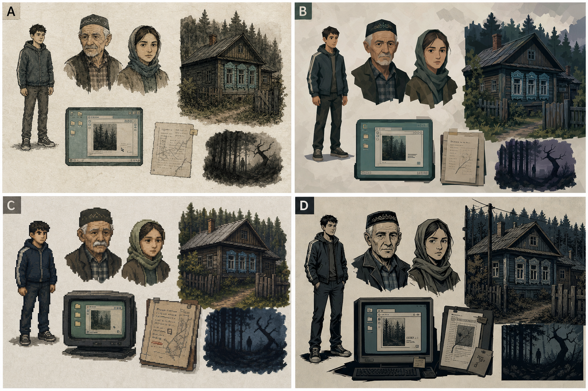

# Design Style

## Status

Accepted direction, 2026-05-16: **ink-wash storybook / тушь + приглушённая акварель**.

Этот стиль выбран как общий визуальный язык УРМАНА. Он должен быть воспроизводимым для маленькой команды и будущей генерации ассетов: не гиперреализм, не AAA concept art, не pixel art и не декоративная фольклорная открытка.

Reference pitch board:

Вариант A на борде — принятый. Варианты B–D остаются только как rejected alternatives / источник отдельных идей, но не как базовый стиль.

## Core Formula

**Обычность сначала, неправильность потом.**

Игрок должен сначала верить, что видит обычную татарскую деревню: старый деревянный дом, изношенные вещи, спокойных людей, бумажные документы, старый ПК, лес у края кадра. Крипота появляется не через «страшный дизайн», а через малые сбои:

- ветки складываются в почти-человеческий силуэт;
- окно светится чуть не в том месте;
- портрет кажется обычным, но взгляд трудно удержать;
- тень от предмета не совпадает с источником света;
- лес слишком неподвижен;
- документ выглядит бытовым, но его формулировки ведут к старому правилу.

Стиль должен помогать slow-burn horror. Если ассет выглядит страшным уже с первого взгляда, он, скорее всего, слишком прямой.

## Visual Language

### Line

- Неровная тушевая линия, ручная, живая, слегка дрожащая.
- Контуры читаемые, но не стерильно векторные.
- Важные интерактивные предметы получают чуть более уверенную линию.
- Лица и руки прорисовываются сильнее, чем одежда и фон.
- Запрещено: гладкий гиперреализм, 3D-рендерная полировка, комиксная супергеройская анатомия.

### Color

Палитра приглушённая, как старая бумага и влажная деревня:

- бумага: тёплый серый, охра, выцветший кремовый;
- дерево: серо-коричневый, старый лак, тёмная доска;
- природа: болотный зелёный, хвойный тёмный, сухая трава;
- вечер / лес: холодный сине-зелёный, чёрно-зелёный;
- тепло дома: слабый янтарный свет, не яркий оранжевый;
- UI старого ПК: выцветший серо-бирюзовый / Win98-like, но без кислотной пародии.

Избегать доминирующих фиолетовых градиентов, неона, хоррор-красного, «готического» синего, чистого чёрно-белого noir, если это не отдельная сцена высокого давления.

### Texture

- Бумажная зернистость и акварельные пятна — базовая фактура.
- Дерево, ткань, металл и грязь должны быть узнаваемы через 2–3 характерные детали, а не через фотореалистичный шум.
- Документы выглядят как сканы / копии / тетради, но текст должен рендериться отдельно в UI, чтобы оставаться читаемым.

## Asset Concepts

### Character Sprites

Спрайты персонажей — **упрощённые игровые силуэты**, а не полноценные детальные модели.

MVP direction:

- маленький 2D cutout / ink sprite для карты или узла;
- 1 idle pose для каждого видимого персонажа;
- 2–4 простых состояния только для Айдара, если прототипу нужно движение;
- без full sprite sheet для всех NPC в MVP;
- узнаваемость через силуэт, одежду, осанку и один цветовой акцент.

Айдар: обычный городской парень, худи / куртка / простые брюки, без «геройского» силуэта.  
Мансур бабай: сжатая, тяжёлая осанка; тюбетейка допустима, но не как карнавальный маркер.  
Гөлсинә: домашняя собранность, мягкость без «сказочной бабушки».  
Алсу: современная местная девушка, практичная одежда, не «мистическая незнакомка».

### Portraits

Портреты важнее спрайтов. Они несут эмоции, недоговорённость и культурную конкретность.

MVP direction:

- bust portraits, тушь + wash;
- 6–8 основных портретов;
- для ключевых NPC: neutral / tension / partial reveal;
- uncanny — не постоянный фильтр, а редкое состояние давления;
- глаза, морщины, усталость, пауза важнее «страшного лица».

Не делать NPC уродливыми или одержимыми. В УРМАНЕ люди тревожат тем, что они слишком долго молчат, а не тем, что они выглядят монстрами.

### Static Location Nodes

Локации — основной дорогой ассет MVP, поэтому каждая должна работать как сцена-узел.

MVP format:

- 16:9 static frame;
- слои: background, midground, interactable props, foreground occlusion, light / ambience overlay;
- 1–2 state variants: normal / pressure или day / evening;
- интерактивные предметы читаются контрастом линии, света или локального цвета;
- лёгкая анимация допустима только как слой: свет в окне, движение занавески, шум леса, мерцание CRT.

Приоритетные style frames:

- дом бабая и әби: тепло, но с тревожной щелью;
- старый ПК: бытовой интерфейс, который постепенно становится архивом системы;
- главная улица: люди видят Айдара раньше, чем он их;
- кладбище: тихо, сухо, без дешёвого кладбищенского хоррора;
- кромка Кара-Урмана: почти безопасная граница, где звук страшнее картинки.

### Village Route Screens

Accepted map direction, 2026-05-16: **variant A — in-world route segment navigation**.

Деревня не показывается целиком сверху. Игрок перемещается по нарисованным участкам дороги: шаг вперёд, поворот на 90 градусов, осмотр. Экран должен выглядеть как место, где Айдар стоит ногами, а не как UI-карта.

Detailed draw list: `village_route_art_spec.md`.

Visual requirements:

- walking-height view of a muddy village road, fences, old houses, utility poles, distant mosque silhouette or forest edge;
- one clear forward direction and, where relevant, one or two 90-degree turns;
- diegetic signs and landmarks instead of floating quest markers;
- subtle ink UI affordances only where the world itself is not enough;
- incomplete route sketch in the journal as support, not as the primary world view.

Плавные повороты не делать как fake 3D rotation of a flat painting. Production-safe solution: короткий 250–450 ms transition между заранее нарисованными facing views, with foreground parallax, ink-smear edge darkening and sound. Forward movement uses a 500–800 ms step transition: footsteps, slight bob, foreground occlusion, then a clean snap into the next discrete segment.

Route screen creepiness:

- Level 0–1: обычная улица, но слишком тихая;
- Level 2: окна и заборы создают ощущение наблюдения, без лиц и монстров;
- Level 3: кромка Кара-Урмана, ветки почти складываются в силуэт, но существо не показано.

### Documents And UI Assets

Документальные ассеты должны выглядеть так, будто их делали обычные люди, а не художник horror UI.

- медсправки, карты, тетради, старые распечатки, фото и «Татарвики» держат расследование;
- визуальная стилизация не должна мешать чтению;
- реальные татарские буквы должны поддерживаться: ә, ө, ү, җ, ң, һ;
- документ может быть красивым как объект, но его смысл должен жить в data-driven тексте.

Old PC UI:

- CRT / Win98-like оболочка допустима, но не как мем;
- серый пластик, выцветшая бирюза, маленькие системные окна;
- glitch / scanline эффекты только дозировано и без потери читаемости;
- папки, метаданные и поиск должны выглядеть бытово, почти скучно, пока игрок не понимает системность.

### Mythological Presence

Существа не рисуются как «монстры для боя» в MVP.

Их признаки:

- силуэт между стволами;
- тень, которая появляется раньше тела;
- ветка / корень, похожие на руку;
- лицо, которое невозможно точно вспомнить;
- вода или лес ведут себя не как фон, а как наблюдатель.

Шурале в MVP лучше не показывать полностью. Если нужен образ для внутреннего арт-пула, он должен быть ближе к лесному народу / старой силе места, чем к демону с рогами.

## Creepiness Scale

Использовать шкалу, чтобы ассеты не становились одинаково страшными:

| Level | Use | Visual rule |
|---|---|---|
| 0 | Дом, быт, первые разговоры | обычная деревня, мягкая бумажная фактура |
| 1 | Лёгкая тревога | чуть неверный свет, пауза, пустое пространство |
| 2 | Расследование давит | глубокие тени, взгляды, документы с опасными формулировками |
| 3 | Граница леса / опасный ключ | лес почти складывается в фигуру, звук и силуэт важнее деталей |
| 4 | Post-MVP сильное проявление | использовать редко; не для обычных сцен |

MVP в основном живёт на уровнях 0–3.

## Production Rules

- Один ассет должен быть легко описуемым промптом: subject, line, palette, texture, creepiness level, cultural constraints.
- Для серийных ассетов сначала делать style frame и только потом набор.
- Не смешивать стили в одном типе ассетов: портреты, локации, документы и UI должны выглядеть как части одной книги / архива.
- Полезная детализация важнее общей сложности: 3 точные бытовые детали сильнее, чем 30 случайных узоров.
- Татарский культурный код держится через место, предметы, речь, быт и формы отношений, а не через навешивание орнамента на всё подряд.

## Do Not

- Не делать гиперреалистичные портреты и локации.
- Не делать всё «криповым» с первого кадра.
- Не превращать татарский фольклор в generic monster bestiary.
- Не использовать кровь, skull props, glowing eyes, Halloween-эстетику и скримерную композицию как базовый язык.
- Не делать исламскую рамку визуально враждебной или «проклятой».
- Не перегружать ассеты национальным орнаментом там, где достаточно бытовой конкретики.

## MVP Asset Floor In This Style

Минимальный визуальный пакет для первого убедительного среза:

- 6–8 портретов: Айдар, Мансур, Гөлсинә, Алсу, Тимур хәзрәт, Ринат, Наиля или Разиля, след Марата.
- 5–7 статичных сцен-узлов: дом / кухня, двор, улица, старый ПК, кладбище, медпункт или сельмаг, кромка Кара-Урмана.
- 1 route navigation kit for the village: 6–10 in-world road segments, 90-degree turn affordances, diegetic signs, incomplete journal sketch.
- 10–15 документальных ассетов / templates: справка, могильная запись, дневник, чат, архивная карточка, «Татарвики».
- UI: journal, clue key picker, vocabulary card, document viewer, old PC shell.
- Audio-linked visual states: normal / pressure overlays для 2–3 ключевых локаций.

## Next Art Tests

1. Сделать один polished style frame дома бабая и әби.
2. Сделать портретный набор Айдар / Мансур / Алсу в одной линии.
3. Сделать старый ПК как UI frame в том же ink-wash языке.
4. Сделать кромку Кара-Урмана на creepiness level 3 без полного показа существа.
5. Сделать route navigation style frame: главная улица с 90-degree turn, указателем и неполным journal sketch.
